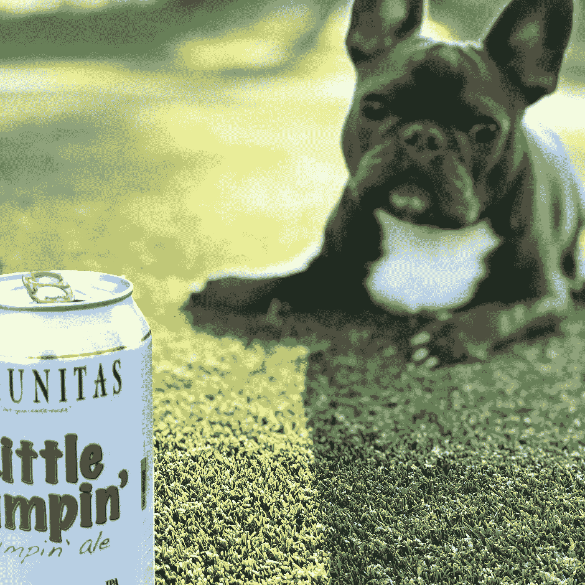
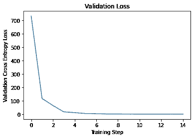
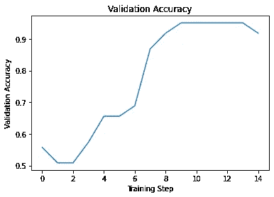

# 用 ResNet50 — Lucy(法国牛头犬)分类器进行迁移学习

> 原文：<https://medium.com/nerd-for-tech/transfer-learning-with-resnet50-lucy-french-bulldog-classifier-146029c8f112?source=collection_archive---------5----------------------->

*免责声明:这篇文章不会吐出如何微调现有神经网络的代码和步骤——已经有大量这样的文章，你可以在 GitHub* *上找到这个项目的* [*代码。相反，这是关于我的项目背后的思考过程和我从中学到的东西。*](https://github.com/jvgalvin)

露西。图片作者。

# **项目动机**

认识我的人都知道我有多爱法国斗牛犬。即使那些不认识我的人也能从我的网站上看出来。我对计算机视觉越来越感兴趣，并想做一个个人项目，但不想把另一个 MNIST 数字、时尚或虹膜分类器扔进互联网。

由于计算机视觉任务的难度各不相同，图像分类处于“简单”端，而完整的对象检测(需要对图像中的对象进行分类和定位)则处于“困难”端，因此我认为最好从分类开始，一步一步来。请注意，我使用术语“难度”的方式与计算机视觉任务本身无关，而是建立这样一个分类器或检测器的实际过程。

# **数据和型号选择**

我决定，如果我要做一个真正独特的图像分类器，我需要一个自定义数据集。很自然，我对我的法国朋友露西的形象了如指掌。尽管有很多，但我肯定没有足够的钱从头开始训练自己的神经网络。

迁移学习非常适合这种情况。对于那些不熟悉的人来说，迁移学习是冻结预训练神经网络的权重并训练自定义分类头的过程。现有的神经网络 ResNet50 对来自 ImageNet 数据库的超过一百万张图像进行了训练，包括法国斗牛犬。

我想让网络做的不仅仅是对一张法国斗牛犬的图片进行分类(它已经可以做到了)。更具体地说，我想让它区别露西和其他任何随机的法国人。除了给我自己的露西图片贴上标签，我还从斯坦福狗数据集中随机获取了法国牛头犬的图片。我的数据集由两个班级的训练、验证和测试图像组成——露西和“其他法国人”

# **分类头**

在我的最终模型上找到现有的分类标题需要相当多的实验。为了听从奥卡姆剃刀的建议，我从最简洁的头部开始——一个由 64 个神经元组成的密集层，用于防止过度拟合的丢弃层和正常化层，以及最终的分类层。

我希望最终的验证精度大于 0.9。无论我如何处理超参数，如果不增加更密集的层，我就是无法达到这个指标。正如你所看到的(如果你看 Jupyter 的笔记本)，我最后添加了三个更密集的层，并在每个层之后添加了相应的下降和正常化层。

是的，我知道我本可以使用交叉验证，但我想亲自试验一下网络的行为。

# **结果**

经过十五个时期的训练后，我的模型达到了 0.95 的训练精度、0.92 的验证精度和 0.96 的测试精度(与训练和验证集相比，较大的测试精度可能是较小的测试数据集的结果)。

损耗随着每个历元稳步下降，精度逐渐增加，如下图 1 和图 2 所示。

图一。验证损失随着每个历元而减少。

图二。验证集的准确度增加到峰值 0.95 和最终值 0.92。

# **学习**

以下是我从一个我认为相对简单的项目中学到的东西:

1.  *数据处理可能比实际的模型训练和调整花费更多的时间*。在正确的文件夹结构中(至少对于 ImageDataGenerators，正如我在本例中使用的那样)查找、标记、分割、重新缩放和调整图像的大小可能是耗时且具有挑战性的。展望未来，我永远不会低估这会给项目带来的复杂性。
2.  *训练和验证数据集需要相对相似。我在项目开始之前就知道这一点，但当我开始用从 Unsplash(在我使用斯坦福数据集之前)收集的图像进行训练时，我亲身经历了这一点。该网络的验证和训练精度高得令人难以置信。经过仔细检查，Unsplash 的照片质量非常高，每张照片中的法国人都在前面和中间，光线条件非常一致。这并不代表我对露西的印象。*
3.  *图像分类(通常还有机器学习任务)理解起来比实现起来容易。*深入了解像 ResNet50 这样的神经网络如何对图像进行分类是一回事，但实际上构建分类器需要完全附加的技能。做这件事需要的不仅仅是知道它是如何工作的——这就是我做这个项目的原因。我想我已经准备好下一个了(物体检测)。

敬请关注。