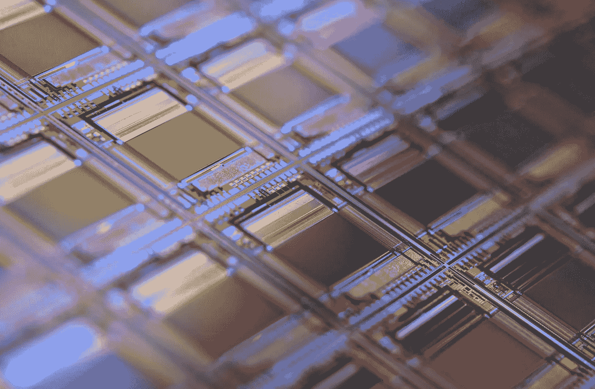

# 转换电子学

> 原文：<https://medium.com/nerd-for-tech/transformational-electronics-e6e1785ff508?source=collection_archive---------18----------------------->

# 我们所说的转型电子产品是什么意思？

有些人可能会对术语*转换电子*的含义感到困惑，它是否表示可以从无限时间转换的电子，但它与人们认为的完全相反。

照片由[翁贝托](https://unsplash.com/@umby?utm_source=unsplash&utm_medium=referral&utm_content=creditCopyText)在 [Unsplash](https://unsplash.com/s/photos/pcb-board?utm_source=unsplash&utm_medium=referral&utm_content=creditCopyText) 拍摄

转换电子学可以被认为主要是一个三维预定义空间，为更多维度的学科提供了空间。其存在的主轴可以列为**确定的电子学**(即像晶体管等的唯物主义电子学。)、**明确互连工具**、
、**不明确互连程序**。转换电子学的上述方面交织在一起，形成了转换电子学领域中物体的存在空间。在对电子主题认知的简短了解中，我们将更具体地处理转换电子的未探索维度，即**不确定互连程序**。

# **对转换电子设备的需求**

从心理学上来说，这是对这种说法的夸大宣传——二十一世纪(T21)被称为科技时代(Jk:)。从技术上来说，它是当前社会和技术情景的许多因素的总和和产物，即获得更高的社会地位，利用现有的物质技术实现更多的目标/可交付成果，简化我们周围一切的需要，使任何技术比以往任何时候都更接近人类手指的需要，等等。是影响现有电子设备发展的一些因素。

劳拉·奥克尔在 [Unsplash](https://unsplash.com/s/photos/electronic?utm_source=unsplash&utm_medium=referral&utm_content=creditCopyText) 上的照片

# **不定互联程序**

做出改变的无限链接程序可以分成许多子空间，最引人注目的是 **IoT(物联网)**，它涉及的讨论超出了本文的范围，是一个单独的感兴趣的主题。有一个相对年轻和未探索的无限互联程序的子空间，即量子电子学，这激起了读者思考**量子理论**如何与不断增长的将不同网络和应用与现有电子学互连的需求显著相关。顾名思义，它可以同时处理数据的缺失和存在，从而为数据存储能力提供无限的
潜力，为网络与电力枢纽的无限链接开辟道路。在接下来的段落中可以进一步理解。

# 量子电子学

对于设备的不确定互连，这是一个相对新的探索领域，它间接地实现了设备的不确定互连。我们都知道不同种类的电子学，即导体、绝缘体和半导体。那么， ***什么是量子电子学？这可以在随后的段落中找到答案。***

[HalGatewood.com](https://unsplash.com/@halacious?utm_source=unsplash&utm_medium=referral&utm_content=creditCopyText)在 [Unsplash](https://unsplash.com/collections/69933564/quantum?utm_source=unsplash&utm_medium=referral&utm_content=creditCopyText) 上的照片

绝缘体通过能量极限/能带的概念绝缘，能量极限/能带是电子位移必须克服的障碍。在导体中，这个能带为零，与绝缘体相比，这使得电子更容易移动。固体量子理论的基础是在大约 90 年前建立的。绝缘体有不同的种类，其特征是使用拓扑的数学原理。非零能带/极限的存在促进了一种形式的理论炼金术。

特别是，被称为拓扑绝缘体的绝缘体不能流畅地转换成常规绝缘体，同时保持非零能带/极限。在这个过程中的某个地方，带/限制必须消失，在那个点上，材料是一个电导体。传统绝缘体和拓扑绝缘体被描绘成物质的电子形式，在许多方面与水相一样重要。

当拓扑绝缘体与传统绝缘体相互作用时，它们之间的界面不可避免地会导电，这一一般思想在研究电子时遇到过，这些电子在强磁场中被迫在两个半导体板之间的二维平面中横向移动。这种实验的模拟导致了一种被称为量子化的**霍尔效应**的现象，其中内部二维截面充当拓扑绝缘体，其一维边缘不可避免地是导体。

对拓扑电子材料的兴趣高涨是通过发现各种这样的现象来推动的，在这些现象中，拓扑材料的绝缘状态可以将导电路径分成两半，从而产生类似于单向边缘导体的不可思议的边界导体。这可能发生在没有磁体的二维系统中，该系统表现出不同种类的一维边缘导体。它也可能出现在完全三维的材料中，这些材料的导电表面只有普通二维导体的一半，这开启了凝聚态物理的一个丰富的子领域。

[约翰·多伊尔](https://unsplash.com/@hyw1?utm_source=unsplash&utm_medium=referral&utm_content=creditCopyText)在 [Unsplash](https://unsplash.com/collections/2557420/quantum-computer?utm_source=unsplash&utm_medium=referral&utm_content=creditCopyText) 上拍照

拓扑绝缘体的不可能导电态具有类似于单向边缘导体的新颖性质，这为其可能的功能应用提供了依据。一个建议是利用界面导电状态下的电子流比普通导体中的电子流更受控制这一事实。将大量逻辑门装入越来越小的计算机芯片的一个根本问题是引导电荷的流动和热辐射。第二个更具推测性也更有野心的提议是使用拓扑绝缘体和相关材料来构建一台*量子计算机*。这种讨论比我们现在正在处理的更具争议性和描述性。

Joshua Sortino 在 [Unsplash](https://unsplash.com/s/photos/tech?utm_source=unsplash&utm_medium=referral&utm_content=creditCopyText) 上拍摄的照片

因此，这种对量子电子空间的洞察可能已经通过基本上创建所谓的**无限存储能力**给了读者它与电子设备的无限互联的直观关联。

# 从中可以得出什么结论？

这些例子提出了两个目标来推动拓扑电子材料的进一步发展。在实现这些目标的过程中，许多好的科学问题需要解决，而新的想法和新的应用通常会从这些研究中产生。事实上，我们从数字化时代的转换电子领域学到的一个教训是 ***期待意想不到的*** 。