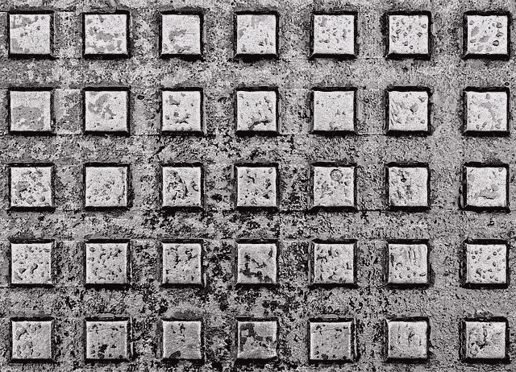

# 从 JavaScript 到 Python 的翻译:02_Array 相关方法

> 原文：<https://medium.com/nerd-for-tech/translations-from-javascript-to-python-02-array-related-methods-781e629bd8e5?source=collection_archive---------10----------------------->

我们很多人都知道 JavaScript 有一些非常方便的数组相关函数，比如`map`、`filter`、`reduce`。它们是以其他函数为自变量的*高阶函数*(这里可以看到*高阶函数* [的简短例子)。希望你能在 Python 中使用它们？好消息是:有 Python 的方法来实现它们！在 JavaScript-Python 比较系列的第二篇文章中，我想展示如何将这些 JavaScript 函数翻译成 Python。](https://www.codecademy.com/learn/game-dev-learn-javascript-higher-order-functions-and-iterators/modules/game-dev-learn-javascript-iterators/cheatsheet)

# `map()`

***JavaScript***

如您所见，您采用了一个未命名的箭头函数，它将`array`的每个值加倍。最后，它返回一个新数组，该数组中的元素数量与函数转换的元素数量相同。

***Python***

与 JavaScript `map`不同，Python `map`有两个参数:第一个用于未命名的 *lambda 函数*，另一个用于目标*列表*(注意 Python `map`没有在列表后面加一个点；而是将列表作为第二个参数)。并且，因为 Python `map`返回`map object`，所以需要使用`list()`函数将其转换成一个列表。

# `filter()`

**JavaScript**

JavaScript 中`filter`方法的回调函数返回一个布尔值:`true`或`false`。如果一个元素返回`true`，该元素将包含在新创建的数组中。

***Python***

像 Python `map`函数一样，Python `filter`也有两个参数:第一个用于未命名的 *lambda 函数*，另一个用于目标*列表*。像 JavaScript `filter`函数一样，Python `filter`方法的第一个函数参数返回一个布尔值:`True`或`False`。如果一个元素返回`True`，那么这个元素将包含在一个新创建的 Python `filter object`中。这个对象也应该变成一个列表。

# `reduce()`

***JavaScript***

JavaScript `reduce`函数接受两个必需的参数(回调函数&一个像 array: line 2 这样不可删除的对象)和一个可选的参数(一个初始值，它将是数组元素和回调函数即将进行的处理的基础:line 3)。`reduce`方法对数组的每一个元素执行回调函数，将结果累加成一个值并返回(这个函数还有更彻底复杂的例子；自己去看，请参考[此链接](https://developer.mozilla.org/en-US/docs/Web/JavaScript/Reference/Global_Objects/Array/Reduce)。

***Python***

没有`import` ing，Python 无法使用`reduce`方法。你需要的模块是`functools`。有 2 种方式可以`import`:1 号线或者 5 号线(我会推荐第一种~)。就像`map`和`filter`的例子一样，Python `reduce`将一个未命名的 *lambda* 函数作为它的第一个参数，列表作为它的第二个参数。与 JavaScript `reduce`的情况一样，它也将一个可选的最后一个参数作为其初始化器(流程的第一个值)。在上面的例子中，没有初始化器，第 9 行将只返回给定列表中所有项目的总和，即 15。然而，对于初始化器，第 10 行将返回列表中所有条目的总和加上初始化器的值，即 25。作为提示，您可以简单地使用`sum()`方法对给定列表的所有项目值求和(参见第 15 行)。

有时还有其他一些与数组/列表相关的方法会很有用。我可能会在我的下一篇文章中提到它们(也许像`slice` / `reverse` / `sort`)。在那之前，快乐的 coding~^^