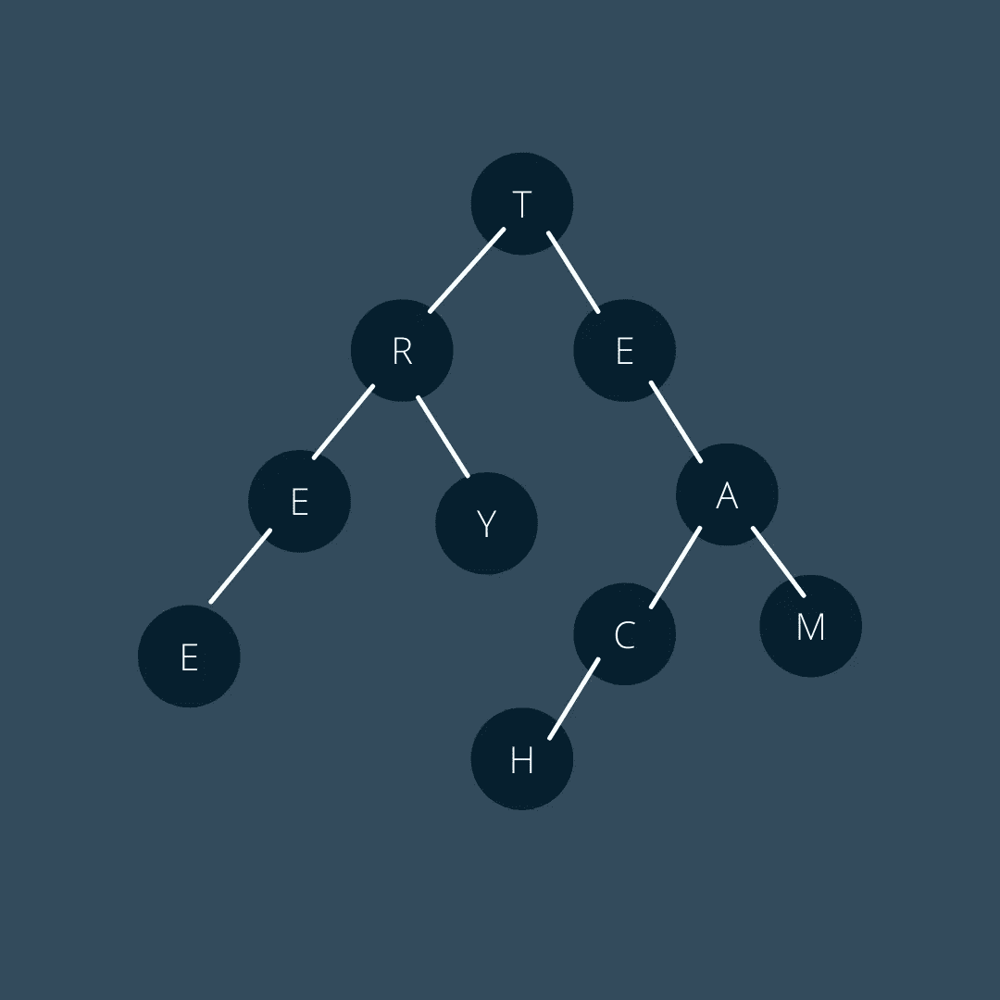
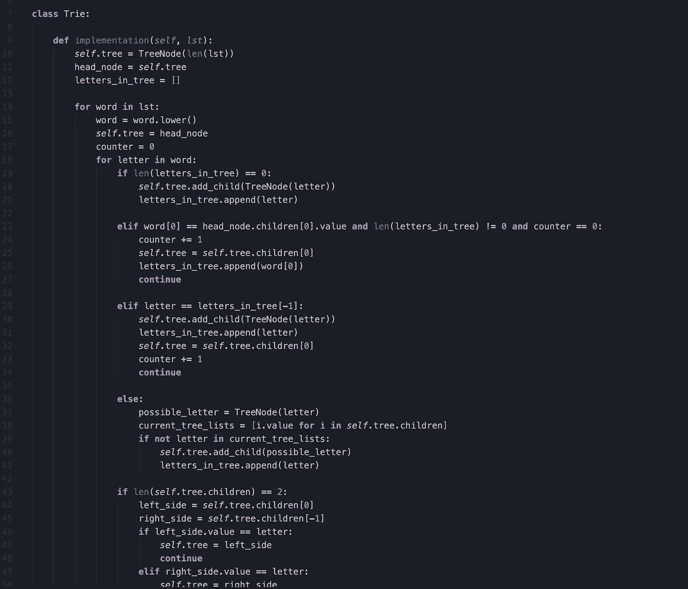
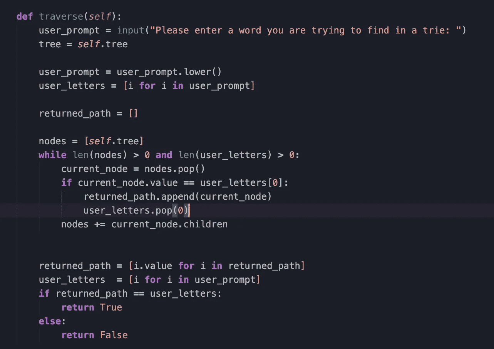

# 特里:谷歌如何预测你要搜索什么的秘密。

> 原文：<https://medium.com/nerd-for-tech/trie-the-secret-to-how-google-can-predict-what-you-are-going-to-search-776df5bb4c2d?source=collection_archive---------6----------------------->

作为程序员，我们经常面对数据结构；相反，它可能是复杂的、线性的，或者两者兼有。数据结构非常重要，因为它们有助于非常有效地组织数据，可以非常有效地使用数据结构，例如，使用算法来自动化某些任务。我们今天使用的最流行的数据结构是链表、栈、队列、散列表、树、堆和图，它们构成了我们在程序中经常使用的大多数主要和常见的算法。

数据结构很酷的一点是，它们不必按照最初教授的方式使用。例如，如果我们知道树只能有整数值作为节点值，我们不一定要在树的节点中有整数值，我们可以混合起来，添加字典、列表、链表等等。这就是编程如此动态和抽象的原因；你可以做任何你想做的事情，改变任何你想改变的事情！

在过去的几天里，我一直在研究可能的项目，我遇到了一个非常有趣的数据结构，叫做 trie。trie 本质上是一棵树，但是它没有包含实际字符串值或整数值的节点，而是只有一个字母。当你用单个字母将这些节点组合成一棵树时，就会有路径产生多个单词。根据我刚刚给出的基本定义，您可能已经知道 trie 最常用于存储单词和字符，或者更具体地说，是字符串。

数据结构图示例

虽然尝试是一种不常见的数据结构，因为没有多少计算机科学学生或科学家像其他人一样经常遇到这种数据结构，但尝试在许多情况下非常有用(包括面试！).tries 的常见应用包括存储文本或自动完成词典、实现近似匹配算法(拼写检查、断字等)。)、文本搜索、前缀匹配等等！trie 实现的一个最好的例子是 Google 搜索引擎。

我们都知道谷歌的搜索引擎是我们人类所见过的最天才的东西之一。当我们只输入一个字母时，它会在不到一秒的时间内输出大约 10 个搜索主题！更令人难以置信的是，有时我们键入两个字母，而谷歌已经输出了我们想要搜索的主题或问题。尝试使得搜索元素子集变得非常容易，因为它非常类似于二叉树。每当我们遍历一棵树的一个分支时，我们就减少了额外节点的数量。这就是谷歌搜索引擎的工作原理！虽然更复杂，但它们使用多次尝试，这将基于流行度和附加逻辑返回某些或可能的元素，以确定与它们的 trie 结构中的某些术语相关联的权重。这就是为什么当你在搜索引擎中输入两个字母时，在不到一秒钟的时间里，你就已经从谷歌中输出了 10 个可能的主题。

换句话说，由于谷歌希望用户获得最好和最相关的信息，他们不仅尝试返回与用户提示相同字母的可能搜索主题，而且还尝试根据访问网站的用户数量和他们流行的 Pagerank 算法的输出返回最相关的信息(如果你想了解更多关于谷歌如何始终根据搜索主题返回最佳网站的信息，请查看我关于 [PageRank](/nerd-for-tech/googles-prestigious-pagerank-algorithm-that-revolutionalized-web-surfing-f48c4e2b21) 的文章)。这就是尝试的力量！

就自己实现 trie 数据结构而言，有许多方法可以实现。为了让我自己更容易，我用两个函数制作了数据结构，`.implementation()`和`.traverse()`，它们复制了一个 trie 的两个主要函数；添加一个节点并遍历。此外，本例中的 trie 使用数组作为底层数据结构来引用 trie 的顺序和某个单词中字母的顺序(通常，大多数程序员会使用添加了数组的键、值对作为它们的底层数据结构来在恒定时间引用它们的字母)。

。implementation()函数将字母作为节点添加到 Trie 中

我做的第一个函数是`.implementation()`，用于向 trie 添加某些节点。该函数将获取单词列表，并逐个字母地遍历每个单词，如果符合四种情况之一，就将其添加到 trie 中。
*1)如果该字母是不在数组
中的新字母 2)如果该字母与数组
中的最后一个字母相同 3)如果该字母是 trie 中的第一个字母
*注意，我们示例中的底层数组称为* `*letters_in_tree*` *。**

请注意这三种情况是如何引用到 trie 的基本定义的。如果一个字母不满足这些情况中的任何一个，或者不满足情况 2，并且是与当前节点值相同的字母，则该字母将不被添加到 trie，并且将被接受为与当前节点相同的字母，这将被跳过。这个过程一直运行，直到程序完全遍历了整个单词列表。

下一个函数是`.traverse()`函数，根据它的名字，你可能已经知道这个函数是什么了。是的，这是一个基本的遍历算法，接受用户输入，遍历树并跟踪它遍历的路径，直到它到达一个叶节点。当它到达一个叶子节点后，它会将路径的节点与用户提示的单词的字母进行比较，如果完全匹配，程序将返回`True` else，否则返回`False`。

。Trie 的 traverse()函数

为了确保用户输入单词的方式没有错误，我已经确保程序在将单词添加到 trie 和进行比较时，所有单词都是小写的。这样，程序可以非常顺利地比较和添加新字母。在比较方面，这个算法比较节点的方式和线性搜索非常相似。如果当前节点的值等于我们当前所在的字母，我们将把它添加到返回的路径中，然后我们将继续下一个字母和节点。如果它们不匹配，我们不采取任何行动，除了继续前进。但是，如果一个父节点有两个子节点，我们将比较当前字母和两个子节点。如果第一个孩子是一样的，我们将走左边的路，否则，我们将走右边的路。

此外，当谈到这两个函数的复杂性时，它们都有一个时间复杂度`O(an)`，因为 trie 的函数依赖于我们正在添加或比较的单词`a`的长度(在我们的例子中)，以及列表中单词的数量`n`。显然，列表越短，搜索变得越容易越快，因为它接近常数时间，而列表越大，算法必须通过的单词越多，因此增加了时间。

如果你想检查我的 Trie 数据结构的实现，这里是我的 Github 的链接:[https://github.com/GEEGABYTE1/Trie](https://github.com/GEEGABYTE1/Trie)

我的 trie 版本只有两个函数，但是您可以添加多个函数，比如删除某个字母或单词、根据元音的数量对单词进行排序等等。尝试有很多种玩法！

尝试在日常问题中可能不那么有用，因为它们的目的非常明确；正在检索元素。然而，当使用字符串时，例如在技术面试中，当他们要求在句子中搜索某个单词或在通讯录中检索某人的联系人时，使用 trie 将是一个很好的工具，因为与其他算法(如二分搜索法、朴素模式搜索等)相比，他们能够在恒定的时间内搜索元素！