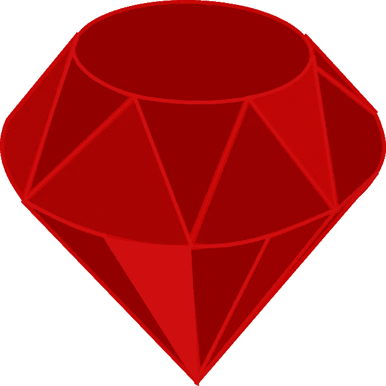

# 第一次再次尝试 Ruby

> 原文：<https://medium.com/nerd-for-tech/trying-ruby-again-for-the-first-time-6ec95ab1261b?source=collection_archive---------23----------------------->

**从谷物广告中得到启示**


由[斯登冲锋枪·里特菲尔德](https://unsplash.com/@stenslens?utm_source=unsplash&utm_medium=referral&utm_content=creditCopyText)在 [Unsplash](https://unsplash.com/s/photos/corn-flakes?utm_source=unsplash&utm_medium=referral&utm_content=creditCopyText) 上拍摄的照片

在 20 世纪 80 年代末和 90 年代初，凯洛格为玉米片做了一系列[广告](https://adage.com/videos/kelloggs-corn-flakes-taste-corn-flakes/1090#:~:text=Corn%20Flakes%20were%20so%20familiar,again%20for%20the%20first%20time.%22)，鼓励观众“第一次再次品尝”这些广告当然是为了提高一种众所周知但非常普通的产品的吸引力，这种产品面临着许多竞争对手，从像碎小麦这样的健康食品到含糖的幸运符。在每个广告中，一个人看着一碗麦片，对这些看似无聊的麦片表示怀疑，如果不是彻底的鄙视。然而，吃了几口之后，以前的怀疑者改变了主意，宣称玉米片实际上有多好。

在开始[熨斗学校的](https://flatironschool.com/)在线软件工程项目之前，我从未学习过 Ruby 编程语言。HTML？检查。CSS？检查。JavaScript？检查。我甚至参加了 Python 和 PHP 的课程。然后我注册了 Flatiron，并被介绍给 Ruby，他是[松本幸宏](https://en.wikipedia.org/wiki/Yukihiro_Matsumoto)(又名“Matz”)的创意。事实上，该程序的前三分之一几乎完全专注于 Ruby，后面的项目要求我们使用 Ruby on Rails 作为后端。

我对 Ruby 最初的感觉？顶多算温和。当时，我实际上更愿意回去学习 Python 或者仅仅专注于 JavaScript。然而，在完成 Flatiron 的项目后的几个月里，我的想法发生了变化。我开始欣赏 Ruby 的简单和优雅，我也发现我更喜欢用 Rails 做项目，而不是用 React(一个 JavaScript 框架)做项目。所以套用玉米片广告的话，我第一次再次尝试 Ruby，我邀请你和我一起尝试。



来自 [Pixabay](https://pixabay.com/) 的 [OpenClipart-Vectors](https://pixabay.com/users/openclipart-vectors-30363/?utm_source=link-attribution&amp;utm_medium=referral&amp;utm_campaign=image&amp;utm_content=160778) 图片

我计划开始定期写关于 Ruby 的帖子，这既是为了我自己的利益，也是(希望如此！)他人的利益。我并不自命为红宝石专家。更确切地说，我是一个学习者——或者说我自己是一个再学习者可能更准确。我的目的是在向其他人介绍这种编程语言的同时，加强我自己对这种语言的理解。

是时候去开采红宝石了！

**关于红宝石的事实**

构思于 1993 年，发布于 1995 年，Ruby 是…

*   高级的
*   多用途的
*   源代码开放的
*   解释
*   动态类型化
*   面向对象的

然后还有 Ruby 的特性，我相信你会最喜欢的:它……(鼓声)……绝对*免费*！

像所有仍在使用的编程语言一样，Ruby 也在不断发展。在撰写本文时，它的最新版本是 3.0.1。所以请记住，它会定期更新。如果你是编程新手，给你一个建议:不要试图记住 Ruby(或任何编程语言，就此而言)的所有方面。除非你有惊人的记忆力，否则你的大脑中有太多的东西需要消化。取而代之的是，专注于学习这门语言的核心原则，同时知道必要时可以求助于什么参考资料，比如 ruby-lang.org。

**《Hello World》配红宝石**

要用 Ruby 编程，你首先需要在你的电脑上安装[Ruby。为了跟进我在这里分享的任何练习，你可以使用](https://www.ruby-lang.org/en/documentation/installation/)[交互式 Ruby](https://www.digitalocean.com/community/tutorials/how-to-use-irb-to-explore-ruby) (IRB)或在线集成开发环境(IDE)，如[replit.com](https://replit.com/)，这是我更喜欢用来做简单的 Ruby 练习的。

按照创建一个返回“Hello World”的简单程序的传统，让我们从用 Ruby 做这件事开始。在 IRB 或 IDE 中，键入以下内容:

```
puts “Hello World”
```

然后按“enter”键(如果您使用 IRB)或者按钮将运行您的代码(如果您使用 IDE)。你会得到程序员非常熟悉的两个字的信息。

如果你对 Ruby 完全陌生，你可能想知道*放*意味着什么。命令*put*，是“out**put**string”的简称，使数据显示在控制台上。在 Ruby 中，您会经常使用这个命令。

您也可以使用*打印*命令执行相同的操作。

```
print “Hello World”
```

*印*和*放*有什么区别？让我们看看运行以下命令时会发生什么:

```
puts “Hello World”
puts “Goodbye World”print “Hello World”
print “Goodbye World”
```

当我们使用 *puts* 时，我们看到“Hello World”和“Goodbye World”显示在不同的行上。然而，当我们使用 *print* 时，我们看到我们的文本被揉成“Hello WorldGoodbye World”换句话说， *puts* 创建了一个新的换行符，而 *print* 没有。

恭喜你，你已经写了你的第一个 Ruby 程序。

**Ruby 数据类型**

在上面的活动中，我们显示了一些数据位，在本例中是*字符串*。Ruby 有六种数据类型:

*   用线串
*   数字
*   布尔代数学体系的
*   数组
*   混杂
*   标志

**琴弦**

简单来说，字符串就是文本。它们要么用双引号(" ")括起来，就像我们在“Hello World”示例中看到的那样，要么用单引号(' ')括起来。

**数字**

我确信我不需要告诉你什么是数字。目前，只需要知道 Ruby 识别整数(整数)和浮点数(或者浮点数，意思是带小数点的数字，比如 3.5)。

**布尔**

有两个布尔值:*真*和*假*。条件语句需要布尔值，我们将在后面介绍。

顺便说一下，在学习 Ruby 时，您肯定会遇到术语“truthy”和“falsey”(也拼写为“falsy”)。Flatiron 课程中的一门 Ruby 课程是这样解释这些术语的:

形容词“真”和“假”是描述真状态和假状态的编程约定。

这个例子意味着:我们希望能够在布尔上下文中使用非布尔值(如字符串或整数);我们希望能够说，“如果某个语句评估为真(或者是“真”)，那么执行这些特定的代码行。”

有趣的是，Ruby 只有两个 false 值: *false* 和 *nil* 。尝试运行以下代码:

```
if nil
  puts “True!”
else
  puts "False!"
end
```

展示的是什么？我们得到“错误！”这是为什么呢？你在上面看到的是一个 if-else 语句——如果你还没有完全理解它，不要担心。我们将在另一个时间讨论条件逻辑。基本上，它是在说，“如果 *nil* 的计算结果为真，那么显示‘真！’如果评估结果为*假*，则显示‘假！’“嗯，我们得到了后者，所以这告诉我们 *nil* 是假的。

**阵列**

数组是用方括号([])括起来的元素列表。它可以包含任意数量的元素，用逗号分隔，并且可以是任意数据类型。示例:

```
[17, “Hello World”, true, nil, 77, :occupation, “Goodbye World”, { “name” => “Bill Smith” }]
```

**哈希**

哈希由一组用大括号括起来的键值对组成。与数组中的元素一样，散列中的键值对用逗号分隔。示例:

```
{
  “name” => “Bill Smith”,
  “age” => 37,
  “occupation” => “web developer”
}
```

除了使用字符串作为键，还可以使用符号(我们将在下一节讨论)。

```
{
  :name => “Bill Smith”,
  :age => 37,
  :occupation => “web developer”
}
```

一个散列可以写在一行中，但是如果你的散列有多个键值对，我建议写在多行中以获得更好的可读性。

**符号**

正如您在上面的第二个哈希示例中看到的，符号由一个冒号后跟一个或多个字母组成(这些字母不一定要组成一个实际的单词，您可以自行决定如何命名符号)。根据 codecademy.com[的说法，“符号是不可变的名字，主要用作散列键或者引用方法名。”rubylearning.com](https://www.codecademy.com/learn/learn-ruby/modules/learn-ruby-hashes-and-symbols-u#:~:text=In%20Ruby%2C%20symbols%20are%20immutable,or%20for%20referencing%20method%20names.&text=Recall%20that%20hashes%20are%20collections,a%20unique%20key%20is%20associate%E2%80%A6&text=We%20can%20also%20iterate%20over,each%20method.)[解释说“在整个 Ruby 程序中，一个给定的符号名指的是同一个对象。符号比字符串更有效。具有相同内容的两个字符串是两个不同的对象，但是对于任何给定的名称，只有一个符号对象。](http://rubylearning.com/satishtalim/ruby_symbols.html)

**都是关于物体的**

Ruby 最重要的特点之一就是它是一种纯面向对象的语言。Ruby 不仅坚持了[面向对象编程](https://www.youtube.com/watch?v=m_MQYyJpIjg) (OOP)的原则，而且*里面的一切*都是对象。这意味着与 Java 等一些语言不同，Ruby 没有原始数据类型。根据[W3Schools.com](https://www.w3schools.com/java/java_data_types.asp)的说法，“原始数据类型指定变量值的大小和类型，它没有额外的方法。”然而，Ruby 中的所有数据类型都有属性和方法，从而使它们成为对象。

例如，假设我们想要模拟滚动四个六面骰子。我们将采用整数 4，它当然属于数字数据类型，并对它使用一个方法来执行这个操作。

```
4.times do
  puts rand(1..6)
end
```

我们的代码说，“好，我要你显示从 1 到 6 的四个随机数。”为了演示 Ruby 的语法与其他语言相比有多简单，下面是执行相同任务的 JavaScript 代码:

```
for (let i = 0; i < 4; i++) {
  console.log(Math.floor(Math.random() * 6))
}
```

如您所见，JavaScript 代码有点复杂，必须利用一个循环来迭代 4 次，并向下舍入每个乘以 6 的随机数。我们不能像使用 Ruby 那样，只调用一个整数上的方法来设置我们希望任务完成的次数。另外，Ruby 代码更简洁，更容易理解。

这是我们第一次品尝红宝石。本系列的目标是帮助 Ruby 学习者创建简单易懂的课程，并结合足够的复习和实践来掌握这门语言的核心内容。我所经历的熨斗课程的一个缺点是(以我的拙见)它倾向于过快地理解概念，而没有给足够的时间去吸收和练习它们。我很高兴地欢迎任何建设性的反馈。