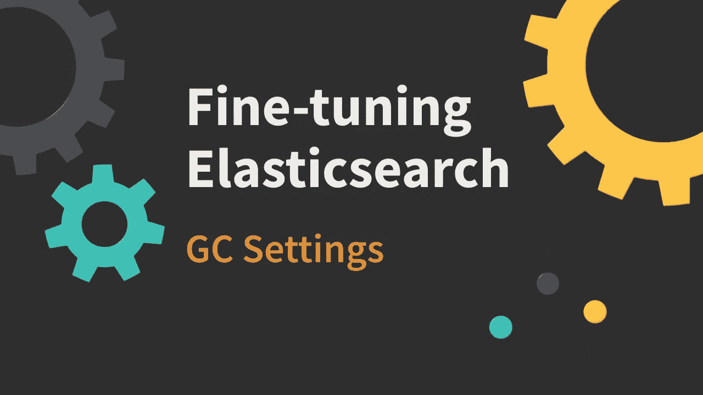
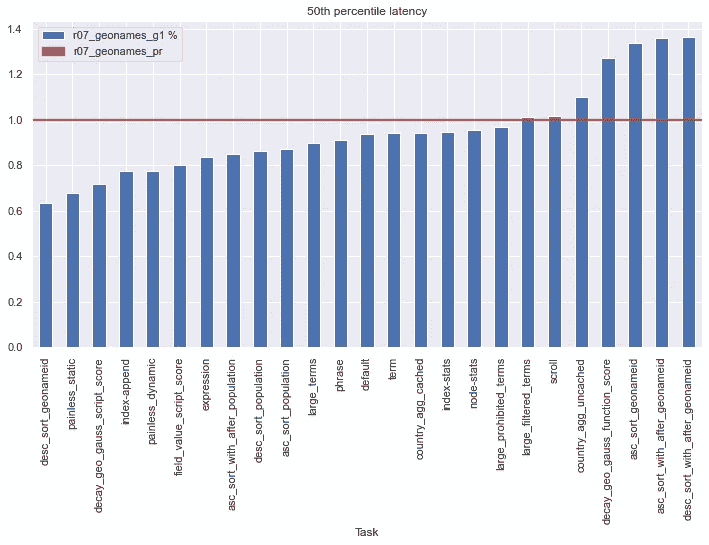

# 调优弹性搜索:垃圾收集算法

> 原文：<https://medium.com/nerd-for-tech/tuning-elasticsearch-garbage-collection-algorithms-e37b19f7dacd?source=collection_archive---------18----------------------->

## 我们的专家已经着手寻找哪种 JVM GC 算法最适合 Elasticsearch。应该使用 G1 GC 还是并行 GC？所有工作负载的建议都一样吗？

*本文是* [*调音弹力搜索*](https://blog.bigdataboutique.com/series/tuning%20elasticsearch) *系列的一部分。如果你有兴趣，请订阅我们的* [*简讯*](http://bigdataboutique.hubspotpagebuilder.com/subscribe) *保持联系。*

在这一系列文章中，我们将探讨用于调整弹性搜索集群的杠杆和开关，并讨论如何找到最佳值。在本文中，我们将讨论垃圾收集算法，以及使用哪种算法。

在[之前的文章](https://blog.bigdataboutique.com/2021/07/tuning-elasticsearch-the-ideal-java-heap-size-2toq2j)中，我们讨论了大小合适的堆大小如何对 Elasticsearch 的整体查询性能产生巨大影响。

**垃圾收集频率更加细致入微。一方面，较小的堆会导致更频繁的垃圾收集。如果响应单个查询需要 Elasticsearch 多次运行垃圾收集器，这会严重降低集群的性能。另一方面，更大的堆意味着每次垃圾收集需要更长的时间，这些更长的暂停也会导致性能下降。**

大小合适的缓存会对整体查询性能以及弹性搜索集群的稳定性产生巨大影响。

# 垃圾收集算法

多年来，Java 已经试验了几种不同的垃圾收集算法，在现代版本中，有两种算法与 Elasticsearch 相关:并行和垃圾优先(G1)。

如果你已经熟悉 Java 垃圾收集，你可能听说过并发标记和清除(CMS ),但是在 Java 14 [中它已经被移除](https://openjdk.java.net/jeps/363),取而代之的是 G1 垃圾收集。

有许多很棒的文章详细介绍了这些垃圾收集算法是如何工作的，详细介绍超出了本文的范围。我们今天要看的是为什么你会选择一种算法而不是另一种。最重要的是:您应该对您的实际工作负载进行基准测试，因为这两种方法可以有非常不同的性能特征，而工作负载只有微小的变化。

# 我们的基准

我们已经开始寻找哪种 GC 最适合 Elasticseach。与我们之前所做的类似，我们运行了一个包括一些不同工作负载的基准测试。

对于这个基准测试，我们将再次使用从带有 EBS 驱动器的 c5.large 机器构建的单节点集群。该机器具有 2 个 vCPUs 和 4 GB 内存，并且驱动器是具有 5000 IOPS 的 100 GB io2 驱动器。该软件是 Elasticsearch 7.8.0，所有配置都设置为默认值，除了堆大小(设置为 500 MB)和垃圾收集算法。我们将再次对 geonames 轨道进行基准测试。

下面是每个挑战执行情况的概述(1.0 是并行 GC，G1 GC 以百分比的形式与其进行比较)。

正如我们所见，G1 GC 通常比并行 GC 快，最多比并行 GC 快 40%，但在某些情况下会差 30%以上。让我们详细研究一下其中的一些案例。

对于名称中带有 sort 的所有挑战，挑战选择了索引中的所有文档，并对它们进行了不同的排序。这些结果在不同的 GC 算法之间差异很大，这突出了在您的特定工作负载上比较这些算法的重要性。特别注意 asc _ 排序 _ 地理名称和 asc _ 排序 _ 地理名称挑战，它们一起代表了最好的改进和几乎最坏的损失，仅仅是通过改变排序的顺序。

还要注意无痛 _*、*_script_score 和表达式挑战。这些都使用 Elasticsearch script_score 对结果进行排名，并且都在 G1 GC 下表现更好。与 decay_gauss_function_score 相比，decay _ gauss _ function _ score 使用本地 gauss 函数进行评分，在并行 GC 下执行速度更快。这当然与在每种类型的操作中在堆上创建的对象数量及其大小有关。每个用例都有自己的行为和模式，所以使用的 GC 算法应该与集群的行为模式相匹配。

Elasticsearch 中的一些操作(比如聚合查询)比其他操作(比如脚本查询)需要更少的堆中对象。集群运行的基于堆的操作越多，用不同的 GC 算法测试哪种性能更好就越重要。

# 关闭

从我们的基准测试中得出的主要结论是，G1 GC 通常是一个不错的选择，但是在某些工作负载中，它的性能实际上比并行 GC 差。

像以前一样，这里显示的基准只是为了说明一点。显然，对于任何实际的工作负载，您都将使用更大的机器来存储数据节点。

另一件要注意的事情是机器拥有的总内存、使用的堆大小和选择的 GC 算法之间的紧密关联。改变一个会影响其他的，所以您应该用几个排列来运行基准测试，找出理想的组合。

我们的团队专门对您的生产工作负载进行详细测量，并为您的环境创建专门定制的基准。我们之前已经做了很多次，对于每个客户，我们都运行了这个基准测试，因为不同的用例、使用模式以及数据形状和大小，我们找到了不同的最佳点。

为您的环境运行类似的基准测试，提前支付一点费用，这将为您节省成本，并在以后的道路上解决问题。

*原载于 2021 年 8 月 9 日*[*【https://blog.bigdataboutique.com】*](https://blog.bigdataboutique.com/2021/08/tuning-elasticsearch-garbage-collection-algorithms-1toq2j)*。*