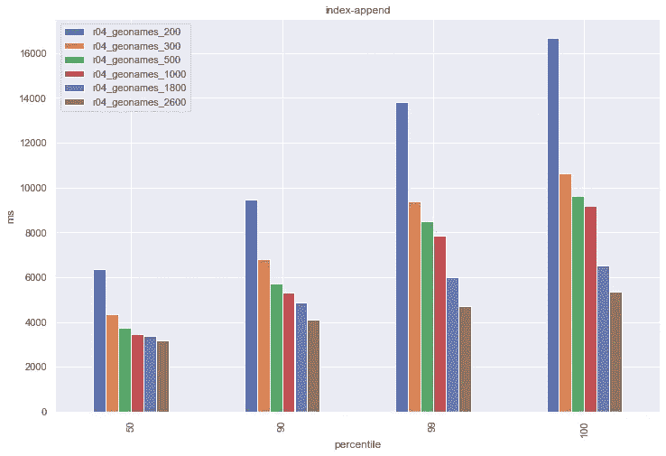
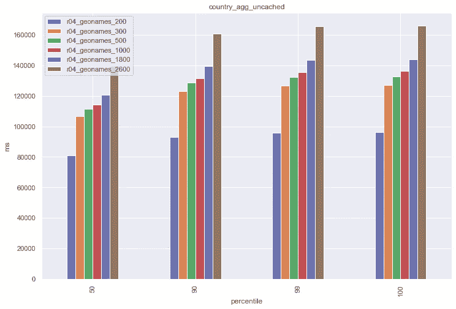
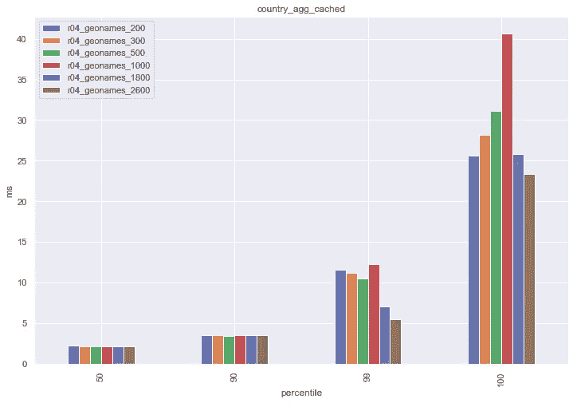
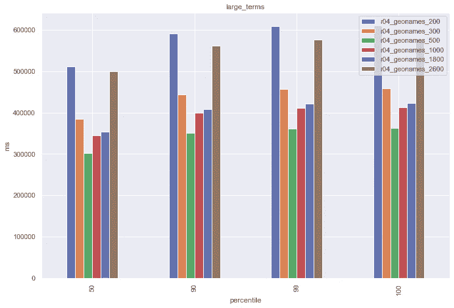

# 调优 Elasticsearch:理想的 Java 堆大小

> 原文：<https://medium.com/nerd-for-tech/tuning-elasticsearch-the-ideal-java-heap-size-743d598c3ec1?source=collection_archive---------5----------------------->

## 在追求最高性能和最低成本的过程中，Elasticsearch Java 堆大小起着重要的作用。ES_HEAP_SIZE 的正确值是多少？有没有一个正确的数字可以一直使用？在本文中，我们忽略了所有的虚假信息，并使用基准测试来获得最佳答案。

*本文是* [*调音弹力搜索*](https://blog.bigdataboutique.com/series/tuning%20elasticsearch) *系列的一部分。如果你有兴趣，请订阅我们的* [*简讯*](http://bigdataboutique.hubspotpagebuilder.com/subscribe) *保持联系。*

Elasticsearch 是一个复杂的分布式系统，随着数据集和查询量的增长，运行集群的成本也会增长。为了帮助降低运营成本，Elasticsearch 为您提供了许多不同的工具来调整每个集群的性能。

这是关于调整 Elasticsearch 集群的系列文章的第一篇。在本文中，我们开始讨论调优集群中单个节点的两个最常用手段之一:堆大小和垃圾收集算法。这些人也是网上论坛上最混乱甚至是散布虚假信息的人。

**自从 11 年前发布 Elasticsearch 0.11 以来，我们就各种用例、集群大小和硬件规格咨询了世界各地的许多客户** **多年，本系列就是在此之后撰写的。** [**我们帮助了许多项目取得成功**](https://bigdataboutique.com/customers) **虽然每个项目都需要关注不同的细节，但最终基础都是一样的，我们总是从同一个点开始。**

在后续文章中，我们将研究更适用于特定弹性搜索用例的杠杆，以及调整整个集群的性能。正如我们通常在与客户的合作中所做的那样，我们将使用工具和科学方法，而不仅仅是猜测。

# Java 堆空间

首先快速了解一下背景:堆是用来做什么的？在所有的计算机程序中，“堆”是内存的一部分，在那里存储所有比单个函数调用寿命更长的数据。在 Java 和其他垃圾收集语言中，应用程序可以自由地从堆中请求内存，并在不再需要时简单地忘记它。这使得应用程序编程更加简单，但它需要一个单独的步骤来“收集垃圾”，即找到被丢弃的数据，并使该空间可供程序再次使用。

与所有 Java 应用程序一样，Elasticsearch 允许我们指定将多少内存专用于堆。使用更大的堆大小有两个好处:缓存可以更大，垃圾收集可以更少。对于缓存，Elasticsearch 根据可用的堆大小动态调整其内部缓存的大小。大小合适的缓存会对整体查询性能产生巨大影响。

垃圾收集频率更加细致入微。一方面，较小的堆会导致更频繁的垃圾收集。如果响应单个查询需要 Elasticsearch 多次运行垃圾收集器，这会严重降低集群的性能。另一方面，更大的堆意味着每次垃圾收集需要更长的时间，这些更长的暂停也会导致性能下降。

[官方文档](https://www.elastic.co/guide/en/elasticsearch/reference/current/advanced-configuration.html#set-jvm-heap-size)规定应将可用系统内存的 50%设置为 Elasticsearch 的堆大小(也称为 ES_HEAP_SIZE 环境变量)。由于指针压缩，它还建议不要将其设置为超过 26–30GB。网上论坛充满了矛盾的建议，不幸的是，这些建议比官方文件更容易看到。那么，有没有一个我们可以推荐使用的堆大小的实际数字呢？

# 运行基准

让我们用一些基准来具体看看这些。我们将使用弹性搜索的官方基准工具[拉力赛](https://esrally.readthedocs.io/en/stable/)，我们将使用 [geonames 赛道](https://github.com/elastic/rally-tracks/tree/master/geonames)。该路线面临各种挑战，对磁盘、内存和 CPU 造成不同的压力，因此它是一个很好的基准测试候选。数据集总大小为 3.3 GB。

对于我们的第一个基准测试，我们将使用从带有 EBS 驱动器的 c5.large 机器构建的单节点集群。该机器具有 2 个 vCPUs 和 4 GB 内存，并且驱动器是具有 5000 IOPS 的 100 GB io2 驱动器。软件是 Elasticsearch 7.8.0，除了堆大小之外，配置都是默认的。我们将测试 6 种不同的堆大小，从 200 到 2600 MB。

在对每组进行跟踪后，我们将查看“索引附加”挑战的百分比延迟指标(越低越好)。这一挑战是基准框架填充索引的地方，因此它是 100%写和 0%读。

这里我们可以看到一个很直白的答案，堆越多越好，对吧？好吧，如果你的用例使用 Elasticsearch 作为一个仅附加的日志，这可能是真的，但是一旦我们开始执行读取，我们可以看到一个非常不同的故事。我们来考察一下 country_agg_uncached 挑战。在此挑战中，Elasticsearch 请求缓存被手动禁用。在生产中，这类似于用很少的重复查询来服务非常多样化的查询模式，因此查询缓存不是很有效。

这里我们看到较小的堆大小具有最佳的性能。发生了什么事？这里的关键见解是“空闲内存”并不意味着“浪费内存”。操作系统实际上使用它所有的空闲内存作为文件系统的缓存。通过使用较小的堆大小，更多的底层数据可以放入该缓存，因此响应速度更快。

在大多数情况下，找到合适的堆大小是一种平衡行为。让我们看一下 country_agg_cached 挑战，它与上一个挑战相同，但是启用了查询缓存。

在这里，我们可以看到 200 MB 和 2600 MB 的性能相当。这是因为在较大的堆大小时，Elasticsearch 的缓存足够容纳基准测试的查询集，因此 Elasticsearch 不需要访问文件系统来服务这些请求。请注意，1000 MB 组的性能最差:Elasticsearch 缓存不够大，无法完全服务于所有查询，而且大堆占用了文件系统缓存的空间。

为了真正证明我的观点，即适当的堆大小调整是一种平衡行为，让我们来看看大项挑战:

这个挑战实际上在中等堆大小上具有最佳性能。当您为您的集群研究合适的堆大小时，重要的是要确保您测试的工作负载与您的生产工作负载相当。这些例子应该证明一种堆大小并不是每个集群的最佳答案。

# 关键要点

这些基准测试强调了对配置的微小更改会根据工作负载产生非常不同的影响，以及每个工作负载如何有自己的最佳点。优化 Elasticsearch 集群以获得最佳性能和尽可能低的成本是一件需要在许多杠杆和开关之间进行微妙平衡的事情。使用的 Java 堆大小只是许多堆大小中的一个。

虽然官方建议将可用系统内存的 50%设置为堆大小，并且由于指针压缩的原因，不要将其设置为超过 26–30GB，但在最近的版本中，Elasticsearch 试图自动设置实际的堆大小。现在很清楚基准测试如何帮助找到正确的值来使用，最佳值在很大程度上取决于所需的工作负载，而不仅仅取决于节点角色。

我们 BigData Boutique 专门对您的生产工作负载进行详细测量，并为您的环境量身定制基准。我们将根据我们的发现提出详细的建议，并为将我们的建议部署到生产中提供支持。如果您想为您的集群获得专业建议，[请联系我们，开始行动吧](https://bigdataboutique.com/services/elasticsearch/capacity-planning)！

*原载于 2021 年 7 月 25 日*[*【https://blog.bigdataboutique.com】*](https://blog.bigdataboutique.com/2021/07/tuning-elasticsearch-the-ideal-java-heap-size-2toq2j)*。*