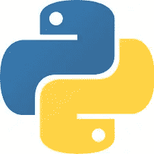

# 双城调度——leet code 问题

> 原文：<https://medium.com/nerd-for-tech/two-city-scheduling-56835a0d99ff?source=collection_archive---------0----------------------->



**问题** [链接](https://leetcode.com/explore/challenge/card/june-leetcoding-challenge/539/week-1-june-1st-june-7th/3349/)

**问题**:某公司计划面试 2N 人。第`i`个人飞往 A 城市的费用是`costs[i][0]`，第`i`个人飞往 B 城市的费用是`costs[i][1]`。

返回每个人飞往一个城市的最小费用，这样正好有`N`人到达每个城市。

```
**Input:** [[10,20],[30,200],[400,50],[30,20]]
**Output:** 110
**Explanation:** 
The first person goes to city A for a cost of 10.
The second person goes to city A for a cost of 30.
The third person goes to city B for a cost of 50.
The fourth person goes to city B for a cost of 20.

The total minimum cost is 10 + 30 + 50 + 20 = 110 to have half the people interviewing in each city.
```

**注:**

1.  `1 <= costs.length <= 100`
2.  保证`costs.length`是偶数。
3.  `1 <= costs[i][0], costs[i][1] <= 1000`

# **解决方案:**

可以使用贪婪算法来解决这个问题。

## **我们的任务:**

1 .利润最大化。

2.确保正好有 N 个人到达每个城市。

## **方法:**

对于第一个任务，我们需要找出去城市 A 和城市 b 的旅行成本之间的绝对差异。

> *这可以通过为每个出差人员使用* **abs(成本[A]-成本[B]** ) *来完成。*

对于第二个任务，我们需要为每个城市保留一个计数器变量，以跟踪到达每个城市的人数。

> *声明计数器变量* **ca 和 cb** *和* **将其初始化为 0** *。*

现在，我们需要根据每个人的 abs(cost[A]-cost[B])对数组进行排序。我们按照升序对数组进行排序，最高的绝对差对位于数组的末尾。

我们使用*排序函数配合***key = lambda cost:ABS(cost[A]-cost[B])****

> **声明* **totalCost** *变量来存储旅程的最小成本，并* **用 0** *初始化。**

*我们开始从右到左遍历排序后的数组。这允许首先评估具有较大利润差异的对。因此，总成本被最小化。*

*对于示例输入:*

```
*[[10,20],[30,200],[400,50],[30,20]]**1.After sorting the array becomes:** [[10,20],[30,20],[30,200],[400,50]]**2.We start traversing from right to left:*****1st Case~***  [400,50]It would be profitable to travel to city B with minimum cost 50.
Therefore,add 50 to totalCost and update count of cb by 1.totalCost:0+50=50
cb:0+1=1
ca:0***2nd Case~*** [30,200]It would be profitable to travel to city A with minimum cost 30.
Therefore,add 30 to totalCost and update count of ca by 1.totalCost:50+30=80
cb:1
ca:0+1=1***3rd Case~*** [30,20]It would be profitable to travel to city B with minimum cost 20.
Therefore,add 20 to totalCost and update count of cb by 1.totalCost:80+20=100
cb:1+1=2
ca:1***4th Case~*** [10,20]It would be profitable to travel to city A with minimum cost 10.
Therefore,add 10 to totalCost and update count of ca by 1.totalCost:50+30+20+10=110
cb:1+1=2
ca:1+1=2*
```

## *所以，每个城市有两个人，坐飞机的最低成本等于 **110** 。*

***Python 代码:***

```
*class Solution:def twoCitySchedCost(self, costs: List[List[int]]) -> int: n=len(costs) #print(n) costs.sort(key=lambda x:abs(x[0]-x[1])) #print(costs) ca,cb,totalCost,l=0,0,0,n//2 for i in range(n-1,-1,-1): if (costs[i][0]<=costs[i][1] and ca<l) or cb==l: totalCost += costs[i][0] ca += 1 else: totalCost += costs[i][1] cb += 1 return totalCost* 
```

*您可以在我的 GitHub 上找到许多其他编程挑战问题的解决方案。*

*Github 简介~*

*[](https://github.com/Sristi27) [## srist 27-概述

### 特雷尔 https://sristi2705.medium.com/-斯里斯蒂 27 SDE 实习生

github.com](https://github.com/Sristi27) 

重要编码问题仓库~

[](https://github.com/Sristi27/DSA-Important-Problems) [## GitHub-srist 27/DSA-Important-Problems:包含基于各种数据的重要问题…

### 包含基于各种数据结构和算法的重要问题。- GitHub …

github.com](https://github.com/Sristi27/DSA-Important-Problems) [](https://github.com/Sristi27/Coding-Challenges) [## GitHub-srist 27/Coding-Challenges:leet code 的解决方案，黑客地球挑战

### Leetcode 解决方案，黑客地球挑战。通过创建一个……

github.com](https://github.com/Sristi27/Coding-Challenges) 

## 感谢阅读！*