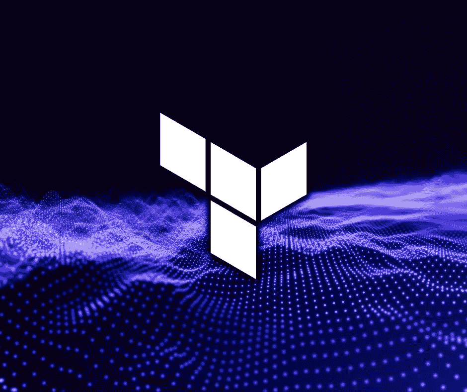
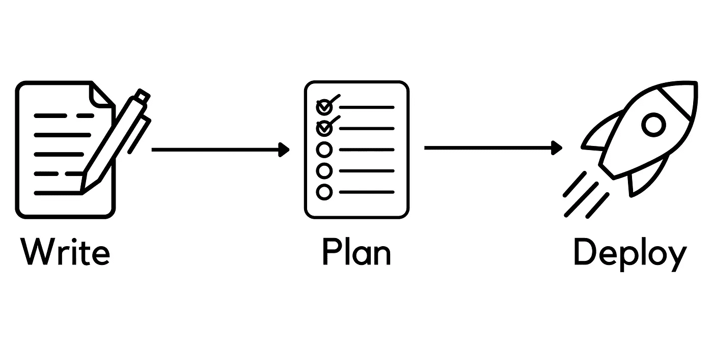
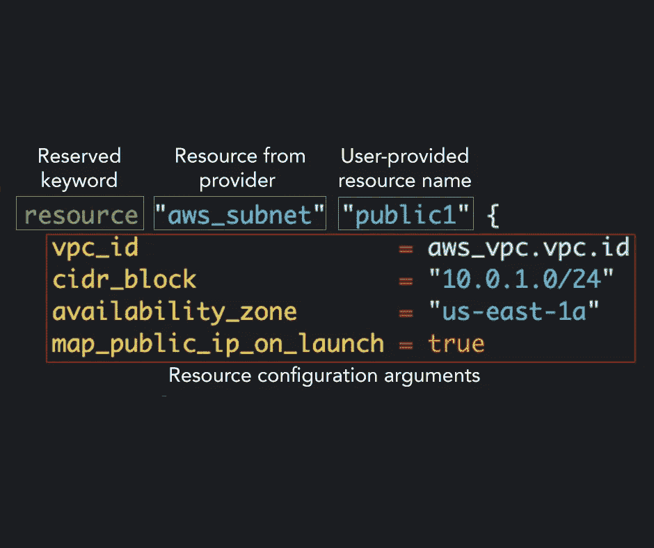
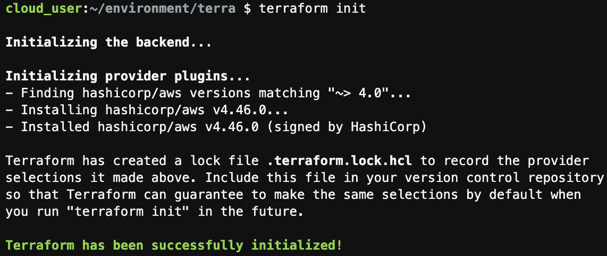

# 使用 Terraform 部署 AWS 双层架构

> 原文：<https://medium.com/nerd-for-tech/two-tier-architecture-deployment-with-terraform-14252c938736?source=collection_archive---------0----------------------->



Terraform 是由 HashiCorp 开发的工具，用于创建、管理和更新您的基础设施。它有助于跨多个云提供商(如 AWS、Azure 和 Google 云平台)管理资源，比以往任何时候都更容易。使用 Terraform，您可以创建一个单一的配置文件，以人类可读和机器可读的格式描述您的所有基础设施。让我们仔细看看什么是 Terraform，它是如何工作的。

## 【Terraform 是做什么的？

在其核心，Terraform 是一个基础设施代码(IaC)工具。这意味着它允许您使用代码定义运行应用程序所需的整个基础结构，而不是手动配置每个资源。这包括虚拟机(VM)、网络、存储帐户和数据库。例如，如果出于测试目的，您需要在 Azure 环境中启动十个虚拟机，您可以使用 Terraform 创建这些虚拟机，只需一个命令，而不必单独手动配置每个虚拟机。

除了简化基础设施设置和管理任务，Terraform 还有助于确保您的基础设施与许多流行的版本控制系统(包括 GitHub、GitLab、Atlassian BitBucket 和 Azure DevOps)保持一致。这意味着可以在版本控制系统中跟踪对基础设施所做的任何更改，因此您可以很容易地看到更改了什么以及何时更改的。如果出现问题或者有人意外删除了他们不想删除的资源，这使得回滚更改变得很容易。

## **地形是如何工作的？**

Terraform 的工作原理是获取一组用 HashiCorp 配置语言(HCL)编写的配置文件，并将其转换为调用，这些调用被发送到云提供商的 API，以在他们的平台上供应资源。例如，如果您想使用 Terraform 在 AWS 上创建一个 EC2 实例，您可以使用 HCL 编写配置文件，然后通过 Terraform 传递它，terra form 会将它转换为一个 API 调用，然后发送到 AWS 的 API。然后，Terraform 使用 API 调用的响应来确定资源是否成功创建。如果在此过程中出现任何错误，它们将被记录下来，以便在继续安装过程的其余部分之前，可以很容易地识别和修复这些错误。



Terraform 工作流程

为了进一步理解 Terraform 的功能，我将演示如何使用它从 AWS Cloud9 IDE 部署一个双层架构。对于许多组织来说，AWS 上的两层架构对于可伸缩性和灵活性来说是理想的云结构。这种双层架构将满足以下目标:

1.  带有 CIDR 10.0.0.0/16 的 VPC，带有两个带有 CIDR 10.0.1.0/24 和 10.0.2.0/24 的公共子网。为了实现高可用性，每个公共子网应该位于不同的 AZ 中。
2.  CIDR 为“10.0.3.0/24”和“10.0.4.0/24”的两个专用子网，其中一个子网中有一个 RDS MySQL 实例(微型)。每个专用子网应该位于不同的 AZ 中。请注意，您不希望 RDS 的规模太大，否则将需要额外的时间来部署。
3.  将流量导向公共子网的负载平衡器。
4.  每个公共子网中有一个 EC2 t2.micro 实例。

对于这个例子，我将所有的代码放在一个 main.tf 文件中。虽然将所有代码存储在一个 main.tf 文件中，或者称为 monolith，可以提供简单明了的外观，但在完全进入这种设置之前，一定要谨慎。Monoliths 冒着失去重用性和可读性的风险，同时使开发变得困难——随着基础设施复杂性的增加，您需要编写大量的硬编码数据，而不是利用可重用的模块和变量。此外，如果没有组织策略，很难确定 Terraform 应该以什么顺序运行这些配置。因此，虽然有时这对于较小的项目或不需要长期维护的项目来说是可以接受的，但通常这种替代方法(将配置分解成文件并将数据外部化)有利于更好的长期管理实践。

**先决条件**

*   使用 IAM 用户访问权限登录 AWS(避免使用 root 用户访问权限以实现更高的帐户安全性)。
*   安装在 IDE 上的 Terraform(我将使用 AWS Cloud9 IDE)。

## **步骤 1 —启动工作目录和提供商配置**

这个样本项目中构建基础设施的代码是参考 [Terraform Registry](https://registry.terraform.io/) 构建的。对语法逻辑的进一步支持可以在[这里](https://registry.terraform.io/providers/hashicorp/aws/latest/docs)找到。

这个示例项目被分解成几个要点，这是理解整个概念的关键。它提供了一种更简单的方式来理解 Terraform 的更大图景，同时避免被整个项目的细节或复杂性所淹没。此外，我的代码库的完整视图可以在下面查看:

[](https://github.com/tannerjclegg/terraform-two-tier-architecture) [## GitHub-tannerjclegg/terraform-two-tier-architecture:部署在 AWS 上的示例双层架构…

### 此时您不能执行该操作。您已使用另一个标签页或窗口登录。您已在另一个选项卡中注销，或者…

github.com](https://github.com/tannerjclegg/terraform-two-tier-architecture) 

在 IDE 中，创建一个新的工作目录，并使用以下语法切换到该目录:

```
mkdir <directory name>
cd <directory name>
```

在新的工作目录中，创建一个 main.tf 文件，开始编写我们的云基础设施:

```
touch main.tf
```

main.tf 文件是 Terraform 中使用的基本配置文件，它定义了创建云基础架构所需的大多数基础架构元素和设置。该文件包含基本配置，如提供程序、网络设置、存储要求、安全规定和其他与需要创建的资源相关的重要参数。与从头开始手动设置每个元素相比，它使部署过程更加高效、可靠和安全。

选择 main.tf 文件，我们可以插入 HCL 来部署我们的基础设施。在文件中配置提供者是在 AWS 上准确构建和管理双层架构的第一步。这是通过以下代码完成的:

提供者是 Terraform 配置语法的重要组成部分。这些定制插件使用户能够与后端基础架构(如公共云、私有数据中心或软件即服务解决方案)进行连接和通信。本质上，提供商负责理解 API 交互和管理构成云环境的资源，而无需手动登录云接口。此外，Terraform 用户还可以开发他们自己的定制提供程序来安装在 Terraform 系统中，这使他们能够更好地控制他们可以在其选择的用户环境中访问和使用的资源。

## **步骤 2 —申报 VPC 和互联网网关资源**

使用 HCL 语法的资源寻址旨在便于人们阅读和书写。我们将在 main.tf 文件中为我们的资源代码遵循类似的结构模式，如下所示:



在前面的步骤中配置好提供者后，让我们为基础设施声明 VPC 和连接的 Internet 网关:

作为快速复习，AWS 上的 VPC 是专用于您的帐户的虚拟网络，可帮助您提高数据流量的安全性。它可以跨越一个或多个可用性区域，允许您将 EC2 实例之类的资源放在单独的子网中以进行网络保护。internet 网关是 VPC 的一个组成部分，它允许专用网络访问更大的外部网络(如 Internet)并与之交换信息。通过网关，VPC 中的子网可以相互直接连接，也可以直接连接自己网络之外的外部设备地址。这为用户提供了更高的带宽，通过更快的延迟率和更高的整体安全性提供了更好的性能。

## **步骤 3 —启用公共和私有子网**

让我们使用以下语法声明基础架构中的公共和私有子网:

在 AWS 中利用公共和私有子网是提高系统安全性的一种非常有效的方法。通过为每种类型的流量设置单独的子网，它允许您隔离和控制对特定资源的访问。公共子网通常用于可公开访问的资源，如 web 服务器，而私有子网通常用于数据库和其他不应直接暴露在互联网上的敏感信息。也可以在两者之间设置防火墙，确保只有特定类型的流量才能到达特定类型的资源。

## 步骤 4-设置路由表和子网关联

路由表是控制云中不同可用性区域、网络和子网之间流量的重要工具。路由表通过只允许授权连接相互通信来过滤网络流量。它们使您能够安全地将内部管理网络和公共服务连接到它们自己的子网，从而保证整个 AWS 基础设施的安全。

以下语法将声明基础架构的路由表及其子网关联:

## 步骤 5 —配置安全组

安全组通过允许用户为其资源创建数字屏障，提供了额外的一层保护。这允许在决定谁有权访问基础架构时进行更多的控制，从而有可能将恶意用户锁定在您的订阅的某些区域之外。使用 EC2 安全组，您可以毫不费力地添加和删除控制入站和出站 internet 流量的规则。它们提供了一种简单的方法来限制对应用程序或系统的访问，同时提供了一个安全的基础架构来托管它们。简而言之，在使用 AWS 服务时，它们是保证数据安全的重要工具。

以下要点提供了正确声明这些基础架构关键部分的 HCL 语法:

第一个代码块定义了公共安全组规则，允许 HTTP 和 SSH 访问公共子网。第二个代码块定义了私有安全组规则，它允许第一层 SSH 和 MySQL 的默认端口访问私有子网。最后，第三个代码块为应用程序负载平衡器(将在下一步中创建)定义了安全组。

## 步骤 6 —配置应用程序负载平衡器

以下语法将介绍在体系结构中正确构建应用程序负载平衡器所需的资源和参数:

应用程序负载平衡器可以轻松确保您的 web 应用程序以最佳速度启动和运行。这个强大的工具自动将传入的应用程序流量分布在多个目标上，比如 Amazon EC2 实例、容器、IP 地址和 Lambda 函数，以提高应用程序的性能和可用性。它还支持高级路由规则，您可以使用这些规则根据 URL 和 HTTP 头中的路径等条件将请求路由到不同的目标。

## **步骤 7——使用引导设置 EC2 实例**

引导是一个自动化的过程，允许用户使用预配置的包快速启动 EC2 实例。这使得用户不必在启动后手动配置每个实例，从而节省了时间。相反，启动后，引导会在每个实例上自动安装和配置必要的包和应用程序。这使得用户可以更快地启动和运行，只需更少的手动步骤。

为了启用引导，EC2 实例用户数据字段中都包含了一个脚本，用于自动安装 Apache 服务器，以便在实例启动时显示定制文本。这可以通过下面的 HCL 语法来解决:

将 EC2 实例部署到两个公共子网后，我们的客户机/web 层配置就完成了。

## **步骤 8 —在私有子网中配置 RDS**

我们将使用以下语法最终确定我们的数据层:

Amazon 关系数据库服务(RDS)是云中最强大、使用最广泛的数据库服务之一。RDS 通过自动备份、修补和其他维护任务为您的数据库提供了一个托管环境。它减少了管理数据库功能所花费的时间，因此您可以专注于开发应用程序。RDS 支持广泛的数据库，从 MySQL 到 PostgreSQL 和 Oracle。您还可以使用 RDS 托管 NoSQL 数据库，如 MongoDB 或亚马逊自己的 DynamoDB。该服务允许安全和易于管理的可扩展性和备份，使其成为任何 AWS 支持的项目的重要组成部分。

## 步骤 9 —创建 Outputs.tf 文件

outputs.tf 文件是基础设施即代码开发过程中非常重要的一部分。它包含 Terraform 运行后需要导出的值，如 IP 地址和其他相关信息。通过有一个中心位置来保存任何导出的值，开发人员可以通过特定的配置轻松地访问它。这不仅大大简化了存储过程，而且由于减少了手动操作，还节省了时间和资源。包含 outputs.tf 文件使团队能够通过各种模块和数据源以一致的方式管理输出，这些模块和数据源比传统方法更易于使用和管理。

使用以下语法开始创建 outputs.tf 文件:

```
touch outputs.tf
```

我们可以使用以下语法返回 EC2 公共 IPv4 地址、RDS 实例地址和负载平衡器的 DNS:

## 步骤 10—初始化 Terraform

用我们的。为了管理我们的基础设施和输出，我们需要使用以下命令初始化 Terraform:

```
terraform init
```

成功输入将返回类似的输出:



我们可以使用以下命令进一步组织和清理 Terraform 源代码文件:

```
terraform fmt
```

这种语法可以修复配置中可能出现的任何错误或不一致，确保只有高质量的代码才能进入生产环境。通过使用这个强大的工具，团队在将基础设施写成代码时，不再需要担心笨拙的实现或草率的语法错误。

## 第 11 步—计划和应用

正确格式化我们的代码后，我们可以执行工作流的计划和应用阶段:

```
terraform plan
```

“terraform plan”命令是一个非常重要的工具，可以确保在云中成功设置基础设施。它为我们提供了将要部署的资源的全面概述，并突出了我们代码中的特定错误。


验证了适当的部署计划后，我们将插入以下命令来应用和构建基础架构:

```
terraform apply
```

我们将返回将要部署的资源的另一个概述，以及执行基础架构构建的最终提示:


输入“yes”后，资源将开始部署。成功部署后，我们将返回一个成功的输出—包括 outputs.tf 文件中编码的指定值:


我们还可以通过在 AWS 控制台中查看资源来验证资源的创建:


## 步骤 12 —摧毁基础设施

Terraform 还允许用户完全删除使用 Terraform 创建的整个基础架构，包括其所有托管服务和组件。这是快速恢复构建过程中所做的任何更改的强大方法，消除了任何延迟的配置并释放了宝贵的资源。然而，这一工具必须小心使用，因为它是不可逆转的，并将对被破坏的环境产生永久影响。尽管如此，使用一个命令在几秒钟内完全删除基础设施的能力使其成为 Terraform 软件中最重要的功能之一。

要启动双层架构的删除，请插入以下命令:

```
terraform destroy
```

成功删除资源后，我们将返回以下输出:


如本例所示，使用 Terraform 进行基础设施部署比手动方法有许多优势。这些包括改进的可伸缩性和对随时间变化的可见性。凭借其简单的语法和强大的自动化功能，Terraform 为团队提供了一种高效的方式来快速启动新环境，而无需大量的手动干预或脚本知识。如果您正在寻找一种快速、安全地部署云基础架构的自动化解决方案，那么 Terraform 是不二之选！