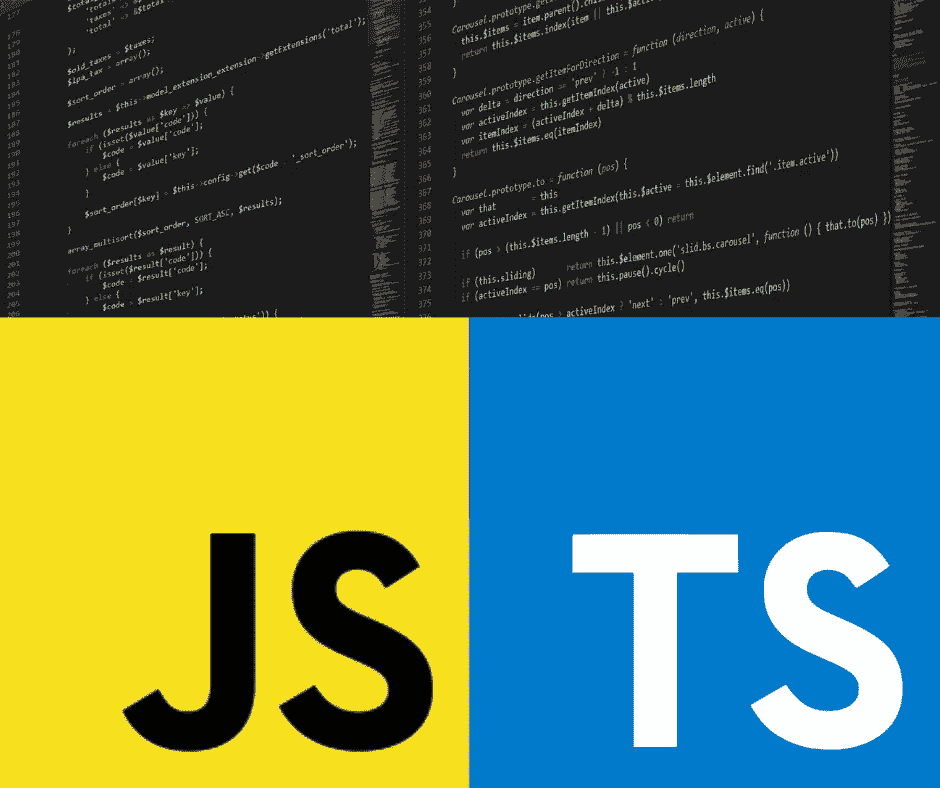

# 打字稿 101

> 原文：<https://medium.com/nerd-for-tech/typescript-101-23095bdd6887?source=collection_archive---------5----------------------->

针对那些熟悉编程语言的人，本文旨在教你快速打字。

TypeScript 是 JavaScript 的超集

# 什么是 TypeScript？

TypeScript 是一种编程语言，是 JavaScript 的超集。因此，用 JavsScript 编写的现有程序也适用于 TypeScript 语法。它主要用于开发 JavaScript 应用程序和 web 应用程序，以及其他工具，如 Google 的 Angular framework 或 Node.js。

与现在使用的编程语言不同，JavaScript 更具动态性。例如，JavaScript 是一种脚本语言，因此不像 C++或 Python 那样支持对象和类之类的结构。此外，JavaScript 不支持大多数最新编程语言支持的静态类型或模块特性。正是因为 JavaScript 的这些问题，才开发了 TypeScript。尽管它仍然是用 JavaScript 编写的，但 TypeScript 是面向对象的，支持静态类型和模块化。

# 如何设置

为了安装 TypeScript，首先需要安装 NodeJS，这是一个 JavaScript 运行环境。然后，转到 yout CLI 并键入以下命令；

> npm install -g 类型脚本

只需在 Windows 上使用这个命令，就可以下载 typescript 了。不过，如果你在 Mac 上，记得把 sudo 放在 npm 之前。

要检查 TypeScript 是否正确下载并查看您下载的版本，请使用下面的命令；

> tsc —版本

# 你的第一个打字稿代码

为了开始编写您的第一个 TypeScript 代码，您需要创建一个名为 *main.ts* 的文件。ts 扩展名代表 TypeScript 文件。您可以通过 CLI 或简单地使用桌面来创建此文件。然后，转到您首选的 IDE 并打开该文件。我们将该文件命名为“main ”,因为与任何编程语言一样，主文件将首先运行，如果没有主文件，项目将不会运行。

现在，您可以在这个文件中键入任何 JavaScript 或 Typescript 代码。完成后，保存项目。为了运行这个项目，您需要首先将代码翻译成 JavaScript，因为如果您是用 TypeScript 编写的，浏览器将无法读取它，即使您是用 JavaScript 编写的，文件扩展名也是。ts 所以没有翻译它不会运行。要翻译，去你的终端做；

> tsc 主网站

其中 tsc 代表 TypeScript 编译器。之后，进入该文件夹或使用 CLI 列出目录中的内容，您会看到除了 main.ts 之外，还有一个 main.js 文件。如果你看看里面，你会看到里面的代码已经被翻译成 JavaScript。

现在，虽然您可以使用 tsc 手动翻译 TypeScript 代码，但大多数工具和框架会自动完成这项工作。例如，Angular 将在运行时执行这种转换。当您在项目中使用 ng serve 命令时，由于 Angular 结构通过本地主机端口通过您的计算机为您的项目提供服务，CLI 将自动调用 TypeScript 编译器。

**注意:**所有的 JavaScript 代码都是有效的类型脚本代码，但是，任何类型脚本代码都需要被翻译成 JavaScript，以便作为。

要运行其中一个文件，只需转到包含这些文件的文件夹下，并使用；

> 节点 main.ts/main.js

# 打字稿基础

*   **变量声明**

您可以在 JavaScript 和 TypeScript 中使用 var 和 let 标记来声明变量。

> var number1 = 1
> 
> 设数字 2 = 2；

在一个函数中工作时，let 和 var 之间的区别是显而易见的。下面我们来研究一下代码；

> 函数 doSomething (){
> 
> for(var I = 0；我<5; i++) {
> 
> console.log(i);}
> 
> console.log(‘Finally: ‘+i);}
> 
> doSomething();

With the usage of var, the i value will be searched for within the nearest function hence this code will work. However, with the usage of let instead, the i value will be searched for within the nearest scope. Hence, the the code above won’t work.

The old method of declaring a variable, var, is not healthy as for we’d like to use the scope logic when working with a complex program.

**注意:**即使你有编译错误，TypeScript 编译器仍然会创建一个. js 版本的编译。ts 文件。

*   **变量类型**

假设我们已经创建了一个变量，分配了一种类型的数据，然后将值更改为另一种类型的数据，如下所示；

> let name = ' Alice
> 
> name = 5；

上面的结构将在 JavaScript 上很好地工作，因为它允许你动态地改变变量的类型。然而，当处理复杂的程序时，这会导致许多问题。这就是为什么在 TypeScript 中，这是不允许的，因此上面的代码不能工作。

如果您想要一个可以在程序中更改数据类型的变量，您仍然可以使用 TypeScript 来实现。你所要做的就是在声明的时候不要给它赋值，之后，类型会根据你赋给它的值而改变，在程序中一次或多次。

如果您不想在使用 TypeScript 时给变量赋值，但仍让它具有某种数据类型，请使用下面的语法；

> 设 a:数；
> 
> 设 b:字符串；

在 TypeScript 中可以使用 6 种不同的变量类型:数字、字符串、布尔、any(适用于所有数据类型)、数组和枚举。下面，你可以找到所有的语法。

> 设 a:数；
> 
> 设 b:字符串；
> 
> 设 c:布尔型；
> 
> 让 d:any；
> 
> 设 e: number []= [1，2，3]；//用于数字数组。键入您喜欢的任何数据类型，而不是数字。
> 
> 设 f: any[]=[1，'爱丽丝'，34，'你好'，真]；
> 
> 枚举颜色{红色=0，黄色=1，紫色=2}。//用于给数字命名某个名称

*   **类型断言**

在某些情况下，我们可能需要明确地告诉 TypeScript 编译器某个变量的类型。下面我们来研究一下代码；

> 让消息；//创建 ANY 类型的变量
> 
> message = ' abc//将字符串赋给变量，但类型仍然是 ANY
> 
> let func t1 = message . ends with(' c ')；// endsWith 是一个函数，用于检查字符串是否以键入的字母结尾，在本例中是“c”
> 
> let funct2=( <string>消息)。endsWith(' c ')；//进行了类型断言</string>
> 
> 假设 funct3=(消息为字符串)。endsWith(' c ')；//进行了类型断言

在上面的例子中，func1 不起作用，因为 endsWith 方法只处理字符串。即使我们给消息变量赋了一个字符串值，它的类型仍然是 ANY。所以在这种情况下，我们需要明确地告诉编译器变量的类型，我们用类型断言来做，如上所示。

*   **箭头功能**

假设我们试图创建一个单行函数，并给它命名。在 JavaScript 中，我们会这样做；

> 设 x =函数(消息){
> 
> console.log(消息)；}

然而，TypeScript 允许一种叫做箭头函数的东西来使事情变得更容易。有了 Arrow 函数，就可以简单的写出上面和这个一样的方法；

> 设 x =(message)= > console . log(message)；

我们没有通过输入 function 并加上花括号来声明有一个函数，而是简单地使用了一个箭头。

*   **接口**

假设我们正在编写一个名为 driveCar 的函数。一辆车有许多属性:汽油水平、发动机状况、踏板动力等。现在，您可以将所有这些属性创建为变量，以便在函数中使用，但是将所有这些属性一个接一个地输入为参数不仅看起来不好而且很难做到，还会使您的代码难以阅读。因此，我们只需创建一个包含所有参数的对象，并将下面的对象属性声明为:

> let drive car =(attribute object)= > {//…}
> 
> driveCar ({
> 
> 速度:100；
> 
> 气:200；
> 
> pedal power:50；})

然而，上面的结构不起作用，因为我们还没有确切地声明对象将拥有什么属性以及所述属性的数据类型是什么。因为一个对象是从一个类中派生出来的，我们需要一个至少类似于类的东西，对吗？这里我们使用接口。基本上是蓝图，或者简化的类。他们的目的是确保拼图的两端能够真正的拼在一起。接口可以是:

> 界面蓝图{
> 
> 速度:数字；
> 
> 气:数；
> 
> pedalPower:数字；}

请记住，因为每个对象都必须有类名作为数据类型，所以我们不像上面那样编写原始函数，而是像这样；

> let drive car =(attribute object:blue print)= > {//…}

*   **类**

在面向对象编程中，我们有一种叫做内聚的东西:简而言之，它是这样一种思想:相关的事物应该都是一个单一单元的一部分。现在，我们在上面使用的接口方法基本上是可用的，但是如果你正在构建一个驱动汽车的函数，你可能需要更多类似于获取汽油数据或计算速度的函数。所有这些相关的函数和属性会使你的代码难以阅读和编辑。所以我们用类来代替。

在 TypeScript 中构建一个类并从一个类中派生对象的思想与在任何其他面向对象的编程语言中完全相同。

**注意:**写类结构的时候，每次在同一个类的函数中使用类内变量的时候，一定要使用*这个*关键字。该关键字将确保程序使用为从该类派生的每个对象确定的变量值，并且不会将其与该类的其他对象中的相同变量值相混淆。

**提示:**当通过 CLI 对多个文件运行相同的命令时，您可以简单地使用双&符号，如下图所示；

> 命令文件 1 名称和文件 2 名称

**提示:**当使用 TypeScript 从一个类创建一个新对象时，确保使用下面的结构。

> let objName = new class name()；

**提示:**您可以在原始类中创建一个构造函数，将属性作为参数，并在每个对象的创建过程中声明它们的值，而不是逐个为所述对象的每个属性键入值。见下面的结构；

> 类别{//…
> 
> 构造函数(x:数字，y:数字){
> 
> this.x = x
> 
> this.y = y//… }
> 
> 设 objName = new className(100，200)；

然而，如果你这样做，你将不能创建一个没有任何参数的对象，因为类要工作，构造函数必须工作，而构造函数在那里工作*必须*是参数。因此，为了解决这个问题，我们可以通过使用问号来使参数可选，如下所示；

> 类别{//…
> 
> 构造函数(x？:数字，y？:数字){
> 
> this.x = x
> 
> this.y = y//… }
> 
> 设 objName = new className(100，200)；

**注意:**当您使用问号使参数成为可选参数时，该参数右侧的任何其他参数也必须是可选的。

**提示:**如果您想让参数只声明一次，并且在对象的生命周期中不能更改，只需转到类结构并将每个参数标签的第一个声明更改为 private。访问修饰符(如 public、private 和 protected 标记)可以在 TypeScript 中使用，如下所示:

> 私 x:号；
> 
> y:数字；//这个不是由访问修饰符指定的，因此将被假定为公共的。

您也可以在构造函数中第一次声明属性，并且仍然将访问修饰符作为前缀分配给它们，如下所示；

> 构造函数(private x？:号，二等兵 y？:数字){ }

如果您使用这种类型的初始化，在函数内分配访问修饰符，修饰符将在函数内创建一个作用域(即使修饰符被设置为 public ),并且只在函数内工作，因此，您不必使用 *this* 关键字。

*   **模块**

typescript 中的每个文件都称为一个模块。为了能够在另一个模块中使用一个模块中的函数或结构，只需将 *export* 关键字作为前缀。

> 导出类 exampleClass{ //… }

之后，转到想要访问导出函数的模块，在文件开头导入素材以备后用，作为；

> 从“”导入{exampleClass}。/example module '；

请记住，您只需输入从代码中导入的模块的名称，而不是文件类型扩展名。

如果您想要导入多个内容，请用逗号分隔它们；

> 从'导入{exampleClass1，exampleClass2，exampleFunction1}。/example module '；

如果您想导入一个库，请使用；

> 从“@libraryPath”导入{ example class }；