# Typescript:对象类型👻

> 原文：<https://medium.com/nerd-for-tech/typescript-object-types-61c956564f87?source=collection_archive---------5----------------------->

在 TypeScript 中，我们分组和传递数据的基本方式是通过**对象类型**。

它们可以是匿名的:

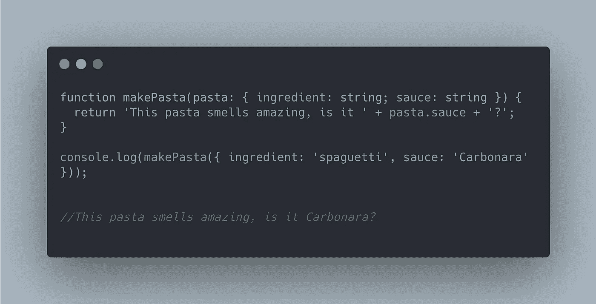

或者可以命名。你可以使用一个*接口*或者*类型的别名。*

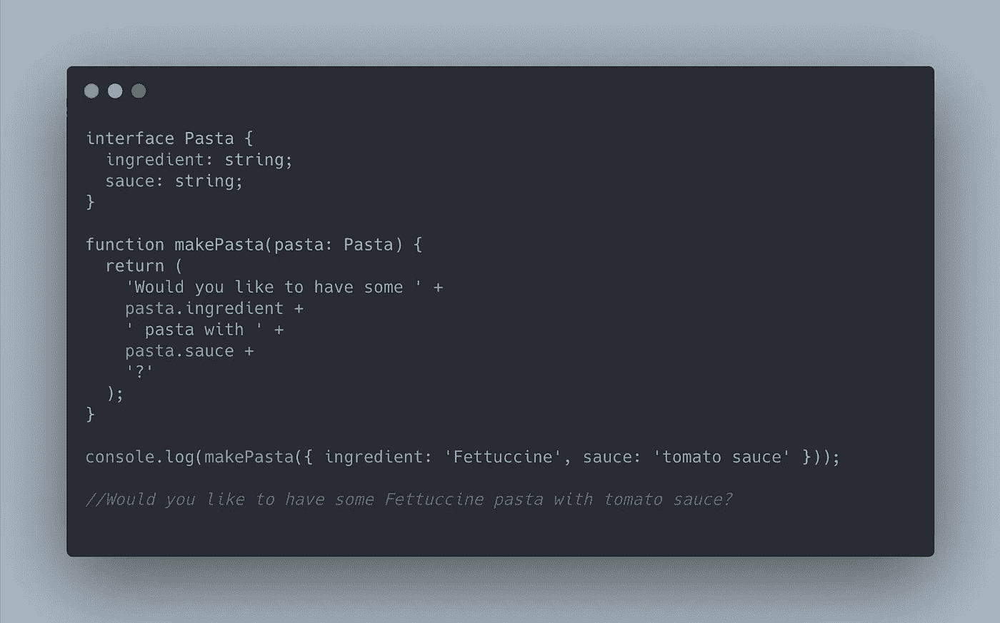

带有类型别名:

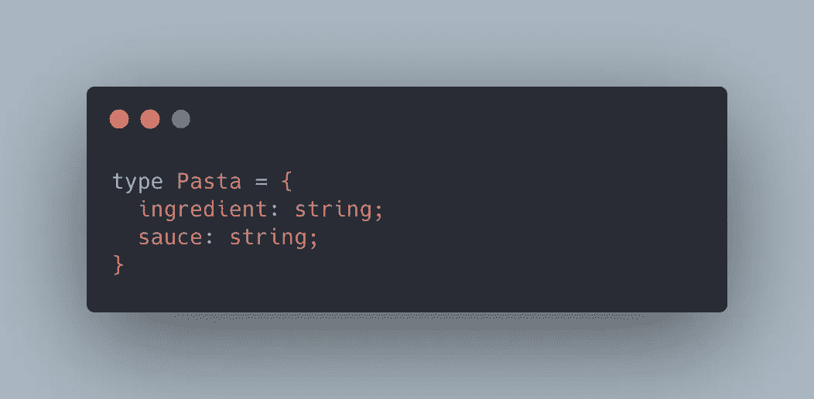

实现看起来就像是一个接口。

*对象类型*中的每个属性可以指定 3 件事:

1.  类型。
2.  属性是可选的，添加一个“？”在他们名字的末尾。我们可以选择提供其中任何一个。
3.  属性可以写入，也可以不写入。(readonly 关键字)。

接口是在应用程序中定义契约的结构。在 Typescript 中，如果两种类型的内部结构兼容，则这两种类型是兼容的，换句话说，TypeScript 使用它们的形状来检查它们是否兼容。(这也称为“鸭子分型”或“结构子分型”)。

用关键字 ***接口定义一个接口。***

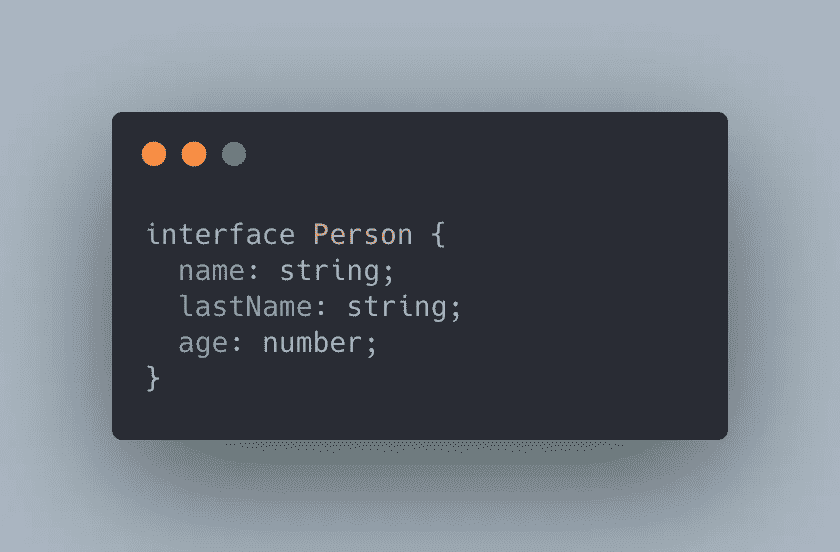

现在让我们描述一个用户使用界面并创建用户对象，这个对象必须与用户界面形状相匹配。

默认情况下，接口的属性是强制的，您可以通过添加“？”使一个属性成为可选的最后。

在本例中，“email”是可选的，typescript 不会警告我们不要将它添加到用户对象中:

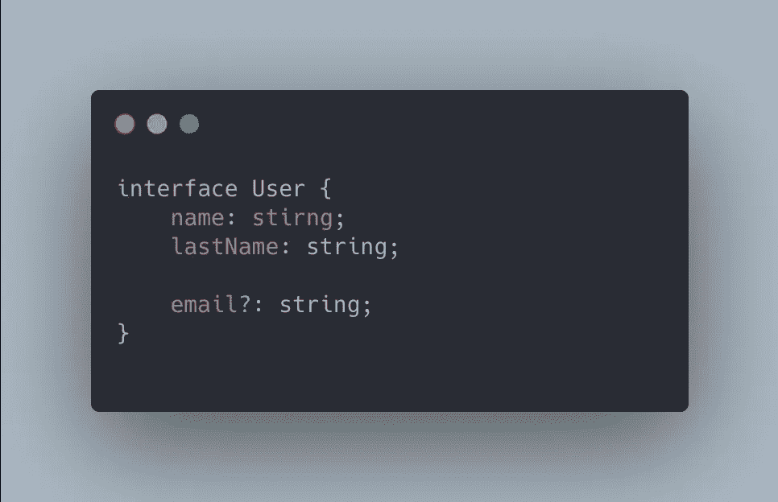

如果需要，我们还可以修改用户属性，如下所示:

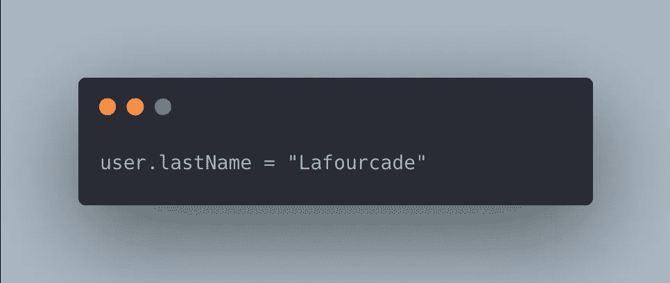

如果你想禁止开发者修改对象，那么你应该使用“readonly”关键字。这个关键字放在您不想修改的属性前面。

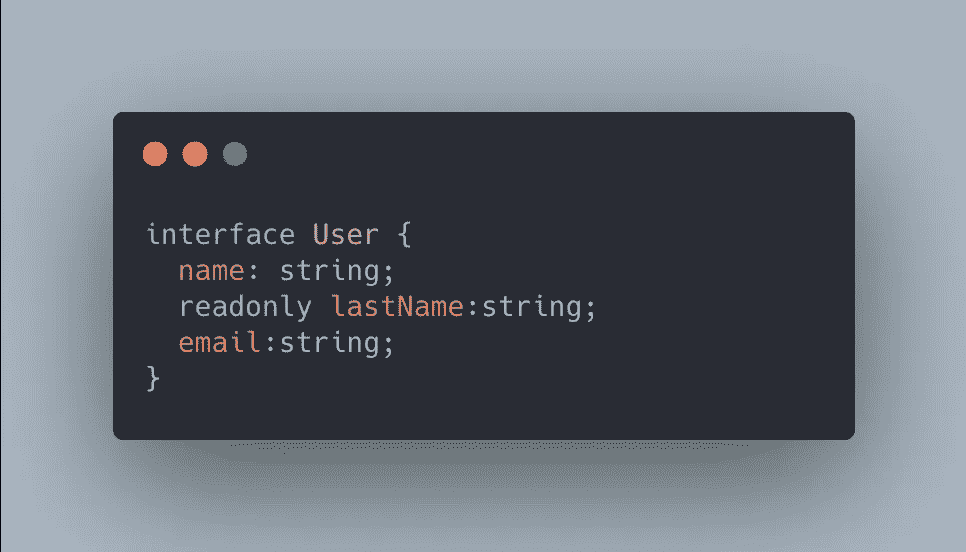

***指标签名***

在 Javascript 中，创建一个对象并在以后需要时添加属性是很常见的，为了在 Typescript 中做到这一点，我们可以使用*索引签名。有时你不知道一个类型属性的所有名字，但是你知道值的形状。*指数签名*允许我们描述动态属性。*

注意:您可以将索引签名*设为只读。*

在方括号中，我们可以指定*键*的类型:它可以是*字符串*或*数字*，然后定义值的类型。

例如:

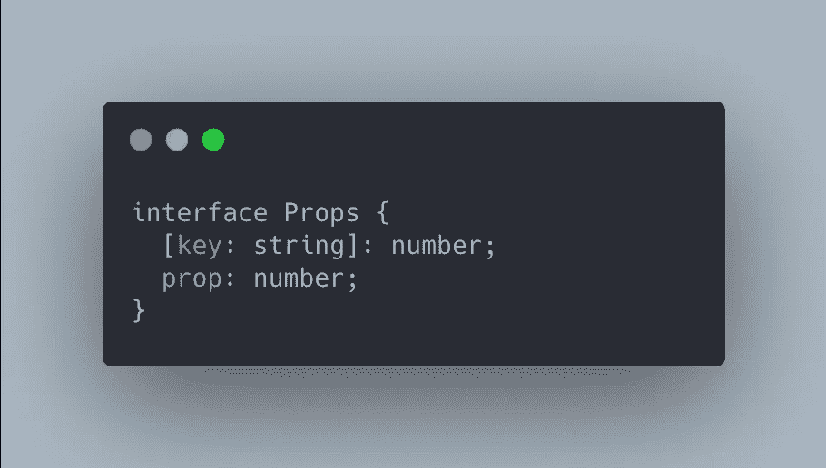

您可以使用联合类型告诉索引签名接受数字或字符串:

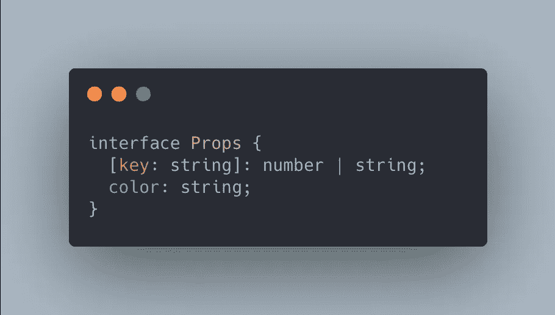

***扩展类型***

我们也可以扩展接口。常见的情况是，有些类型可能是其他类型的更具体版本。

例如，我们有一个父接口:

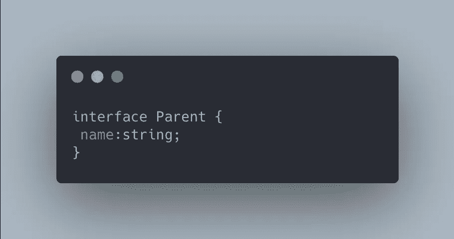

我们使用*扩展*关键字来扩展一个接口。现在我们描述子接口:

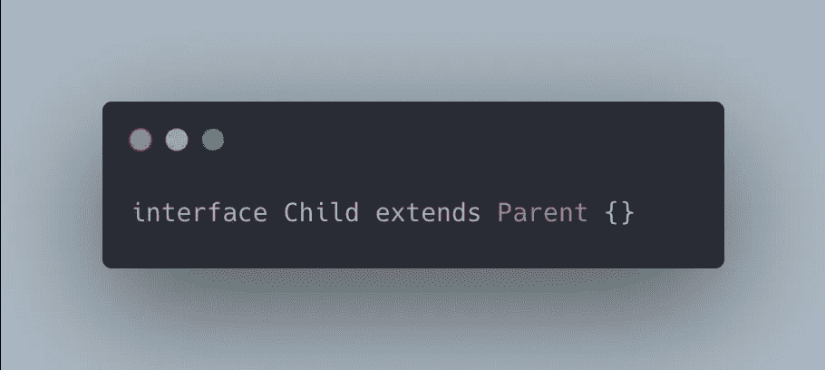

现在子接口从父接口继承属性*名称*。您可以使用“**、**”扩展多个接口。

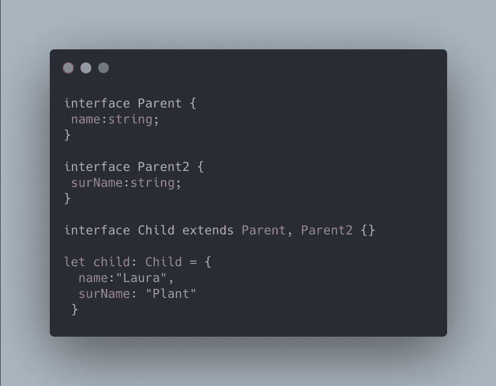

您可以添加**子**接口独有的新字段。

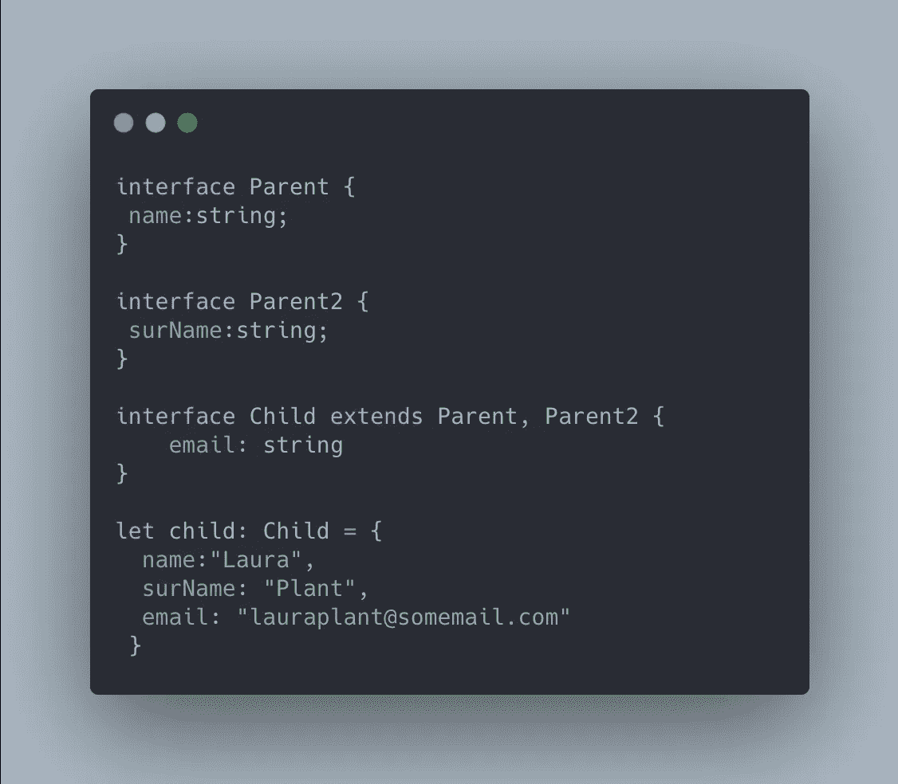

**T2 交叉口类型**

TypeScript 提供了另一种称为*交集类型*的构造，主要用于组合现有的对象类型。使用`**&**`运算符定义相交类型。

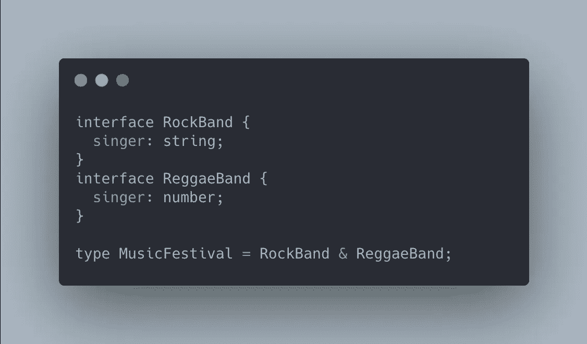

*音乐节类型:*这种新类型拥有摇滚和雷鬼乐队的所有成员。

***泛型对象类型***

我们可以做一个*泛型* **礼品**类型，声明一个*类型参数*。 *Type* 是将被其他类型替换的占位符。

*型*礼物是其内容具有*型*的东西。

之后，当您提到礼物时，您必须给出一个*类型的参数*:

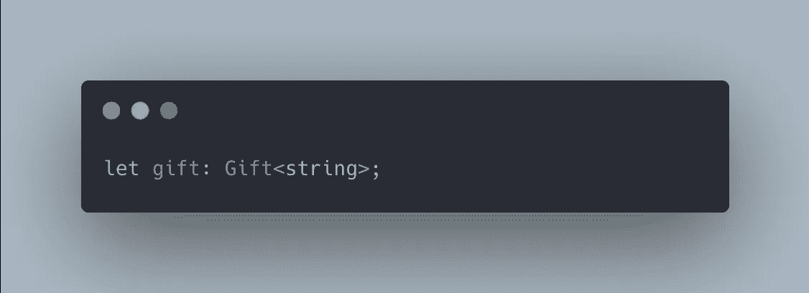

礼品是可以重复使用的，并且该类型可以被任何东西替换，这意味着当我们再次需要它时，我们不需要声明新的*礼品*类型。

类型别名也可以是泛型的，我们也可以使用它们来编写其他类型的泛型帮助器类型:

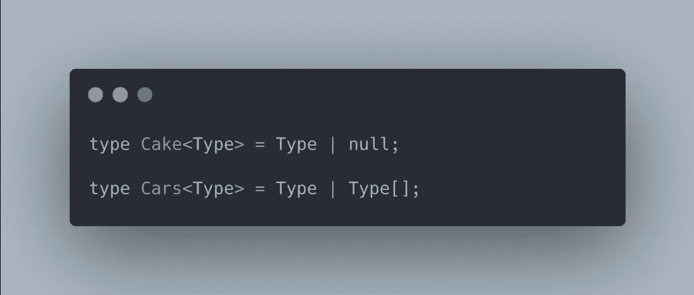

***阵列式***

是像 *number[]* 或 *string[]* 这样的类型，那实际上只是 Array < number >和 Array < string >的简写。

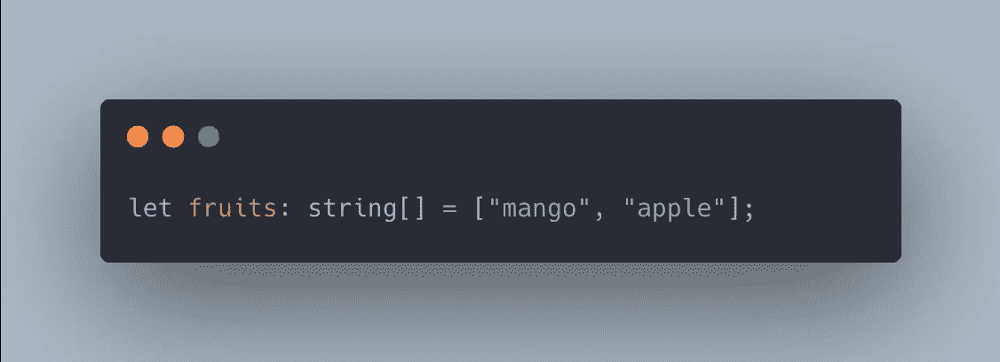

数组本身是一种泛型类型:

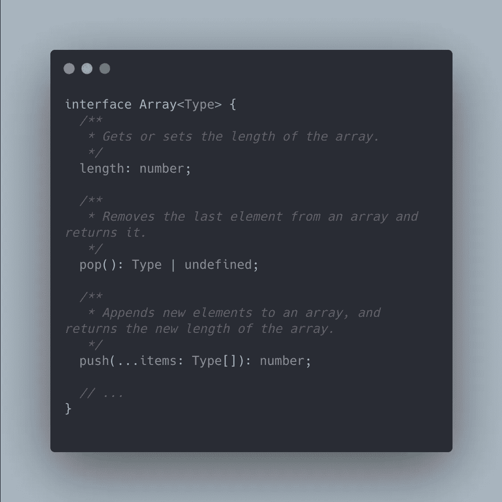

其他通用数据结构:

*   地图
*   设置
*   承诺

***元组类型***

*元组类型*是另一种数组类型，它可以包括多种数据类型。

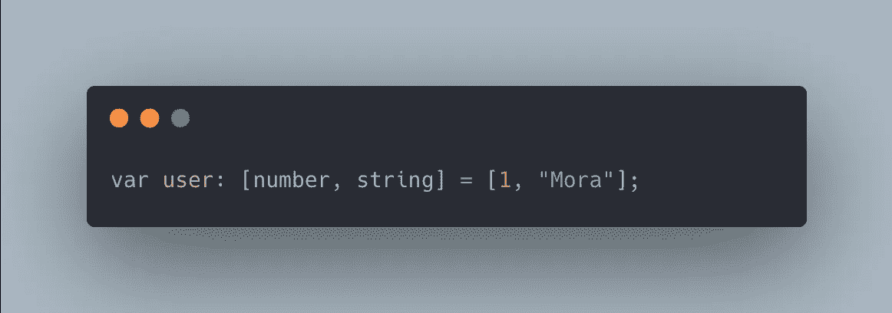

我们可以使用索引访问元组元素，就像访问数组一样(索引从零开始)。

元组可以通过写出问号来拥有可选的属性，也可以有 rest 元素，这些元素必须是数组/元组类型。

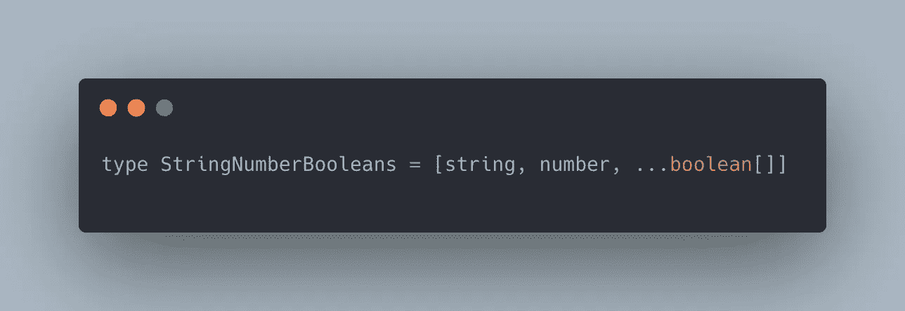

StringNumberBooleans 描述了一个元组，它的前两个元素是字符串和数字，但是后面可以有任何数量的布尔值。

我希望你已经发现它有用。

有了爱，

劳拉·♥️