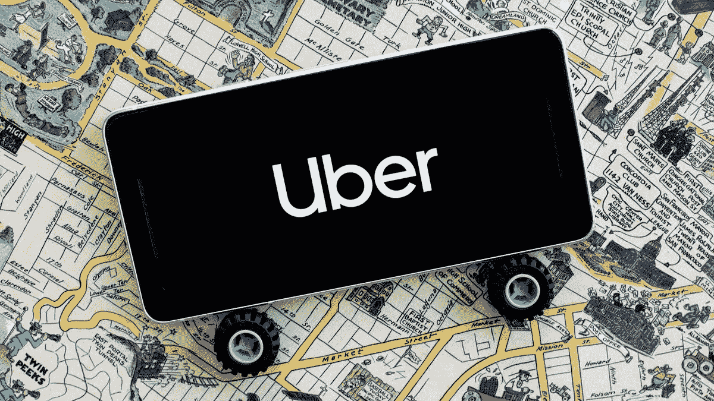
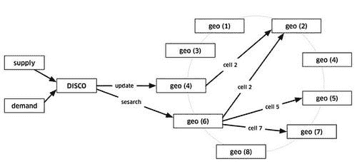
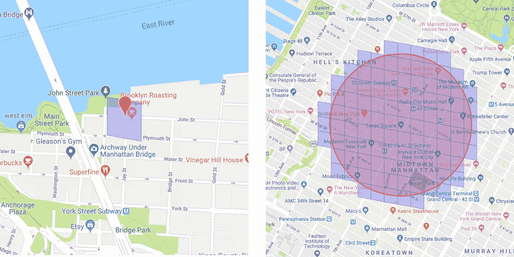
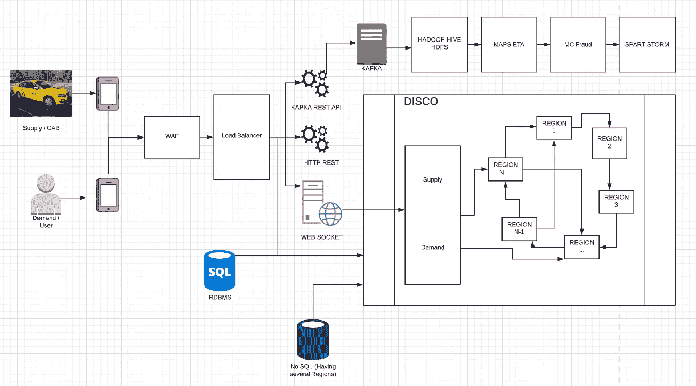
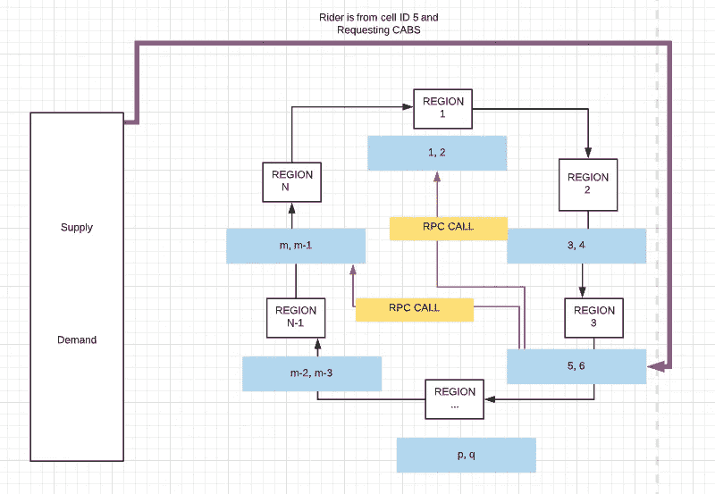
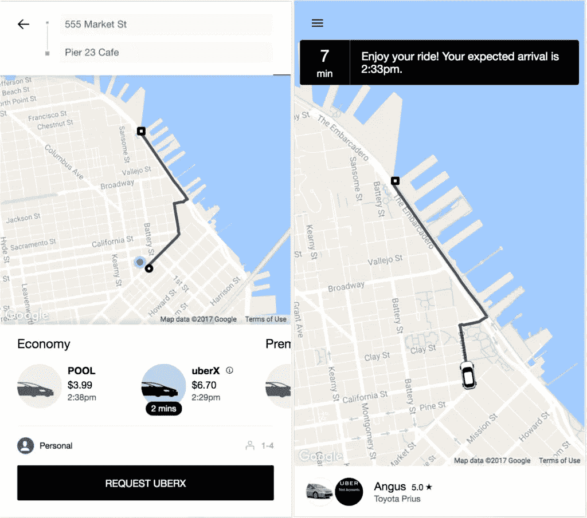
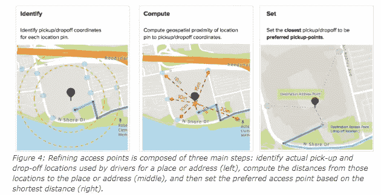

# 优步建筑和系统设计

> 原文：<https://medium.com/nerd-for-tech/uber-architecture-and-system-design-e8ac26690dfc?source=collection_archive---------0----------------------->

在本文中，我们将了解像优步这样的打车应用服务的架构和系统设计。在优步应用程序中，当乘客(想要出租车的人)在应用程序上请求司机时，司机会去那个地方挑选用户。在幕后，有 1000 台服务器支持这一旅程，数万亿字节的数据被用于这一旅程。当优步公司成立之初，他们有简单的 T2 单体建筑 T3。他们有后端服务、前端服务和数据库。最初，他们将 **python** 用于应用服务器。他们使用基于 Python 的框架来完成异步任务。

【2014 年之后，现在优步的架构已经发展成为一种叫做**面向服务的架构**。现在，优步不仅拥有食品和货物，还拥有出租车。一切都已融入一个系统。现在，优步或任何打车相关平台面临的挑战是满足需求的供应或需求对供应的供应。优步后台的主要任务是服务移动流量。因为没有手机，很难运行这些服务。因为一切都是靠 **GPS** 工作的。接下来，优步系统就像一个实时市场，将乘客与出租车匹配起来。这意味着我们在架构中需要两种不同的服务，

*   **供应服务**
*   **需求服务**

## DISCO(调度优化)

先说一下这个调度系统是怎么运作的。调度系统完全在地图和位置数据上工作。这意味着我们必须正确地对我们的位置数据和地图建模。使用纬度和经度数据很难概括和估计位置。为了解决这个问题，优步使用了谷歌 S2 图书馆。

**什么是谷歌 S2 几何库？**

S2 图书馆的一个独特之处在于，与将数据表示为平面二维投影(类似于地图集)的传统地理信息系统不同，S2 图书馆将所有数据表示在三维球体(类似于地球仪)上。这使得有可能使用单个坐标系建立一个没有接缝或奇点的世界范围的地理数据库，并且与地球的真实形状相比，在任何地方都具有较低的失真。虽然地球不完全是球形的，但它更接近于球形，而不是扁平的！

**S2 特色**

该图书馆的显著特点包括:

*   灵活支持空间索引，包括将任意区域近似为离散 S2 单元集合的能力。这个特性使得构建大型分布式空间索引变得很容易。
*   点、折线和多边形集合的快速内存空间索引。
*   健壮的构造操作(如交集、并集和简化)和布尔谓词(如包含测试)。
*   用于查找附近物体、测量距离、计算质心等的高效查询操作。
*   捕捉舍入的灵活而鲁棒的实现(一种几何技术，允许在使用小而快的坐标表示的同时 100%鲁棒地实现操作)。
*   一组有效而精确的数学谓词，用于测试几何图元之间的关系。
*   对谷歌大量地理数据的广泛测试。
*   灵活的 Apache 2.0 许可证。

 [## 概观

### S2 是一个球面几何库，旨在拥有与非常…

S2 几何. io](https://s2geometry.io/about/overview) 

该库获取球形地图数据，并将这些数据划分为小单元(**例如:1 公里 x 1 公里单元**)。一旦我们把这些细胞连接起来，我们就能得到完整的地图。每个单元格都有一个唯一的 ID。这是以分布式方式存储数据的最简单的方法。你只需要小区的 ID 就可以从服务器获取位置数据(**我们可以使用一致散列法来存储数据**)。

此外，S2 图书馆给你任何给定细胞的覆盖范围。比方说，我们希望在地图上画一个圆，并想找出圆内所有可用的供应商。我们需要做的是使用 S2 图书馆，并给它一个半径。所以它会自动过滤掉所有对那个特定圆有贡献的细胞。这样我们就知道所有的手机号了。因此，现在我们可以轻松地过滤我们需要的数据以及属于该单元格的数据。这样，我们就有了所有单元中可用供应的列表，并且我们可以计算 ETA。

**我们什么时候想让车手和车手匹配？**

从骑手的位置画一个半径为 2-3 公里的圆。列出所有可以使用 S2 库的驱动程序。现在我们需要检查 **ETA** 。这里我们可以用最短距离( [**欧氏距离**](https://en.wikipedia.org/wiki/Euclidean_distance) )。但这不会准确地告诉你预计到达时间。你不能直接从 A 到 B 画一条线。路径可能比我们预期的要长。你不得不走相连的道路。

现在我们知道了所有被过滤的驾驶员的最大距离。同时我们可以给司机发一个通知。如果司机同意的话，我们可以给司机配一个骑手。

## 系统设计

图表 1

上图中，CAB 是**供给**即 CABs，User 是**需求**用户请求司机。**每 4 秒**一次，出租车就会向 [**KAFKA REST API**](https://cloud.ibm.com/docs/EventStreams?topic=EventStreams-rest_using_classic#:~:text=The%20Kafka%20REST%20API%20provides,and%20responses%20in%20Event%20Streams.) 发送位置数据。每个呼叫都通过**防火墙**发生。然后，它到达负载平衡器，并到达 **KAFKA** 并到达不同的服务器。并且还将位置数据的副本发送到**数据库，并且还调度优化** n 以保持驾驶室的最新位置。

**网络应用防火墙(WAF)** —用于安全目的。在这里，我们可以阻止来自被阻止的 IP、僵尸程序和优步不支持的区域的请求。

**负载平衡器** —这里我们可以使用不同层的负载平衡器，如第 3 层、第 4 层和第 7 层。第 3 层基于基于 IP 的负载平衡器工作(流量的所有 IP 转到第 3 层负载平衡器。在第 4 层中，我们可以使用基于 DNS 的负载平衡。第 7 层基于应用层负载平衡工作)

**KAFKA REST API** —这将提供一个端点来使用每辆出租车的所有位置数据。例如:我们有 1000 辆出租车开往一个城市，每 4 秒钟我们发送一个位置，这意味着每 4 秒钟我们有 1000 个位置被发送给 KAFKA REST API。这些位置将被发送到迪斯科，以保持国家的活力。

web 套接字(WEB SOCKET)——除非普通的 HTTP 请求，否则 WEB 套接字对这类应用程序真的很有帮助。因为我们需要在任何给定的时间点同步发送客户端到服务器和服务器到客户端的消息。我们应该在 Cab 应用程序到服务器或用户到服务器之间建立一个连接。Web Socket 为所有优步应用程序保持连接打开，并且基于 DISCO 或服务器中任何组件发生的变化，数据将在应用程序和服务器之间交换。主要用 NodeJS 写(**异步化和事件驱动框架**)。

## 迪斯科分量

调度系统主要写在 **NodeJS** 中。这样服务器就可以随时向应用程序发送/推送消息。

我们如何扩展这些 DISCO 服务器？

为了衡量这一点，优步使用了一种叫做 [**的东西。它有两个功能。**](https://eng.uber.com/ringpop-open-source-nodejs-library/)

*   **——在服务器之间分配工作**
*   **[**RPC 调用**](https://searchapparchitecture.techtarget.com/definition/Remote-Procedure-Call-RPC) —从一台服务器调用另一台服务器**

**它还使用一个 [**SWIM 协议/Gossip 协议**](https://www.serf.io/docs/internals/gossip.html) ，帮助服务器了解其他服务器的职责。使用这个协议 w 可以很容易地在环中添加或删除一个服务器。当我们添加一个服务器时，职责被分配给新添加的服务器，如果我们删除职责，则添加其他服务器。**

## **当用户请求一个驱动时它是如何工作的？**

**当用户请求搭车时，该请求会到达 Web 套接字。Web Socket 将请求交给请求服务。然后需求服务知道出租车或顺风车的需求。然后，需求服务请求提供带有乘坐信息的服务(乘坐类型、需要多少次乘坐、位置)。供应服务现在知道用户(骑手)的位置(小区 ID ),并请求服务器环上的一个服务器。在一致散列法中，我们平均分配了责任。像这样，所有的位置数据平均分布在服务器之间，如下图所示(蓝色)。供应服务现在正试图通过计算 ETA 值从服务器中找出离乘客最近的出租车。并且在计算 ETA 值之后，供应服务器通过网络套接字通知出租车，比如“这个乘客想要去这个地方，你能接受吗？”。如果驾驶员接受分配给该特定骑手和驾驶员的请求行程。**

****

**假设有 N 个服务器，所有 m 个位置单元分布在这些服务器中(这里我们假设每个服务器有 2 个位置数据)。骑手正在请求定位单元“5”。然后，服务器区域 3 寻找可用的出租车，并获得可用出租车的 ETA 值，并将这些数据传递给供应服务器。如果没有可用的出租车，供应服务器通过画一个特定半径的圆来获得下一个离乘客最近的位置数据。假设我们得到的位置小区 id 是“2”和“m”。然后，服务器区域 3 调用区域 1 和 RPC 调用)来检查可用的出租车。计算 ETA 值后，所有数据发送到供应服务器。**

**这些是优步为使优步请求成功而遵循的步骤。**

*   **需求服务器通过位置 ID 询问供应服务器**
*   **供应服务器找到出租车**
*   **通过订单向 cabs 发出的请求**
*   **在一定的超时之后，它尝试下一辆出租车**
*   **在通知匹配用户后**

## **DISCO 如何处理更多的流量？**

**假设优步向系统中添加了一个新城市，现在我们如何处理新添加的城市的流量呢？我们需要给 **DISCO ring pop** 添加新的服务器。现在新增加的服务器职责不明。 **MAPS ETA** 组件(图 1)知道所有新添加的服务器出售 id，并基于这些新添加的单元在新添加的服务器之间进行分配。**

## **当我们从 DISCO 中移除服务器时会发生什么？**

**当我们从环中移除一个服务器时，它会重新排列所有的单元 id，并将它们分配给现有的服务器。**

## **什么是优步地理空间设计？**

****

**如你所知，优步如何使用**谷歌 S2 库**将谷歌地图分解成特定的单元，并用于识别离乘客位置最近的出租车位置。**

**用户使用**谷歌地图**显示地图。由于谷歌的定价策略，谷歌更早使用地图框。但是现在优步又回到了谷歌 API 和地图。现在，他们使用谷歌地图框架在应用程序上显示地图，他们使用它来计算两点之间的 ETA，还使用它来建立路径，并获得出租车和乘客的速度实时位置。**

**如你所知，当你在一个大的建筑里，或者是优步现在允许进入的地方。优步显示了**首选接入点**，如入口和出口点。它反复地学习司机们停在入口和出口门附近的出租车。由此，它自动向顾客显示他们只能从入口和出口点取货。优步使用几种算法和机器学习来计算出首选的接入点。**

****

## **ETA(预计到达时间)是如何计算的？**

**在旅行开始之前，你的应用程序会提供你的司机应该在什么时候到达你的上车地点的预计到达时间。**

**旅行开始后，你的应用程序会提供到达目的地的预计时间。**

**请注意，预计到达时间是估计值，不能保证。交通拥挤或道路施工等各种外部因素都会影响出行时间。**

**在您请求搭车之前，您的应用程序会在黑色的集合地点栏中显示时间。这个时间估计附近的司机到达你的取车地点需要多长时间。**

**使用屏幕底部的滑块，您可以查看您所在城市的各种车辆的预计到达时间。**

**旅行开始后，你的应用程序将不断更新你的目的地的预计到达时间。**

**阅读更多信息:**

** [## 网络

### https://marketplace.uber.com/matching 匹配车手和车手是优步如此成功的核心因素…

blogs.cornell.edu](https://blogs.cornell.edu/info2040/2019/10/23/uber-ride-sharing-a-matching-market/) 

## 优步过去使用什么数据库？

早些时候，他们已经使用 RDBMS 来保存与配置文件相关的数据和 GPS 点以及一切。但他们发现，当他们拥有越来越多的用户和城市时，他们无法扩大规模。然后他们转移到建立在 MYSQL 之上的 NoSQL 数据库，这被称为无模式。他们考虑了一下

*   水平可伸缩性—您可以在不同的区域添加多个节点，共同充当一个数据库
*   写入和读取可用性-每 4 秒钟一次的 cab 会将 GPS 位置发送到数据库。因此系统会发生大量的读写操作。
*   无停机时间——系统将始终可用，无论优步在系统中添加或删除什么，或者当他们对系统进行一些维护时，系统都应正常运行，不应有停机时间。
*   最近的数据中心—当他们向系统中添加新的城市时，他们会尝试添加新的数据中心，或者将数据存储在离新添加的城市最近的数据中心，以提供无缝服务。

更多详情:

 [## 为什么优步工程公司从 Postgres 转向 MySQL

### 优步的早期架构包括一个用 Python 编写的单片后端应用程序，用于数据…

eng.uber.com](https://eng.uber.com/postgres-to-mysql-migration/) 

## 分析学

分析就是理解我们拥有的数据。优步需要了解出租车司机的顾客和行为。这是优化优步系统和运营成本并提高客户满意度的方法。优步使用不同的工具和框架进行分析。所有司机的位置数据和来自骑手的数据都存储在一个 **NoSQL** 或**关系数据库**或 **HDFS** 中。对于一些数据分析，您可能需要来自实时的数据。你可以从**卡夫卡**中获取数据。HADOOP 平台由许多与分析相关的工具组成，我们可以使用这些工具进行分析。我们可以使用 **HDFS 从 NoSQL 数据库中获得哑数据。我们可以使用像 HIVE 这样的查询工具从 HDFS 获取数据。**

你可以从数据库中获取历史数据，并将其与从 KAFKA 获得的实时数据进行比较，我们可以构建新的地图，以改善我们现有的地图数据。同样从实时数据中，我们可以识别新的交通状况和司机的速度，以及很多东西。这将有助于更准确地确定 ETA 值。

对于**机器学习和欺诈检测**，优步处理多种类型的欺诈，如**支付欺诈、滥用激励和泄露账户。**欺诈对优步以及平台上的用户体验有直接影响。为了打击不良行为者，优步有一个由反欺诈分析师、数据科学家和 UX 专家组成的专门团队，他们在这个问题上协同工作。作为这项工作的一部分，我们建立了内部服务，帮助我们持续监控和应对不断变化的欺诈形势。

这些服务寻找错误的行为，合法用户不会采取的行动。例如，使用我们的反欺诈技术，我们可以区分实际旅行和 GPS 欺骗造成的旅行，或者分析我们的应用程序如何被用来揭露欺诈者。

**支付欺诈**

当坏人使用偷来的信用卡支付优步旅行费用时，支付欺诈就发生了。通常情况下，当信用卡所有者发现他们的账户上有未经授权的交易时，他们会打电话给银行或信用卡公司提出质疑，优步会退还这笔费用。为了从被盗信用卡中获取最大利润，欺诈者自己不会进行这些旅行。相反，作为一种代理服务，他们在网站和聊天论坛上向其他人宣传打折的旅行服务。

**激励滥用**

优步经常为注册或推荐朋友的新用户提供积分，并为在给定时间内完成一定数量行程的司机提供奖金。欺诈者试图利用这些激励措施，通过创建虚假账户来赚取新用户和推荐积分，或模拟虚假旅行来赚取司机奖金。

**泄密账户**

欺诈者还使用[网络钓鱼技术](https://en.wikipedia.org/wiki/Phishing)访问乘客和司机的账户。有了骑手账户，欺诈者可以提供代理服务，向其他人出售骑手。对司机账户的访问可能会让诈骗者取钱。网络钓鱼技术通常包括电子邮件、短信或电话，以欺骗用户放弃他们的密码和双因素认证码。

**更多详情**:

 [## 优步公司检测和防止欺诈的先进技术

### 我们重点介绍了第二届年度优步技术日期间的一些演示。在本文中，工程…

eng.uber.com](https://eng.uber.com/advanced-technologies-detecting-preventing-fraud-uber/) 

## 如何处理全部数据中心故障？

**数据中心故障**并不经常发生，但优步仍然维护着一个备份数据中心，以顺利运行旅程。该数据中心包括所有组件，但优步从不将现有数据复制到备份数据中心。

*那么优步如何处理* ***数据中心故障*** *？？*

它实际上使用**司机手机**作为出行数据的来源来解决数据中心故障的问题。
当司机手机 app 与**调度系统**通信或两者之间发生 API 调用时，调度系统将加密的**状态摘要**(用于跟踪最新信息/数据)发送到司机手机 app。每次这个状态摘要都会被司机的手机 app 收到。在数据中心故障的情况下，备份数据中心(备份 **DISCO** )不知道关于旅程的任何事情，因此它将从驾驶员的电话应用程序请求状态摘要，并且它将利用驾驶员的电话应用程序接收的状态摘要信息来更新自身。

我想你已经学会了**优步架构和系统设计**中的所有组件。下节课再见。

谢谢大家！**