# Unity 和 C#简化了用户界面

> 原文：<https://medium.com/nerd-for-tech/ui-made-easy-with-unity-and-c-814d3caf403e?source=collection_archive---------12----------------------->

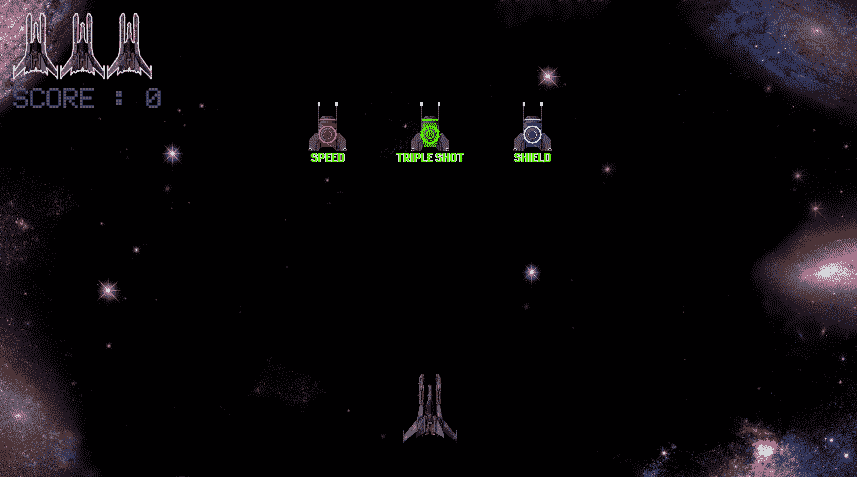

向玩家显示信息的简单用户界面

有了 Unity，就可以很容易地创建漂亮的用户界面，向玩家显示有用的信息。然而，电脑有点笨，它们不知道许多人认为理所当然的游戏元素。

我们需要告诉我们的游戏，承受伤害、失去生命甚至得分意味着什么。谢天谢地，这也很容易实现。什么是人生或分数？对我们开发人员来说，它们只是变量…

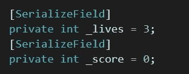

声明变量

有了这些加入到我们的玩家脚本中，我们现在有了可以随心所欲操纵的生命和分数。

增加分数变量

将这个方法添加到我们的玩家中，允许我们在需要时调用它来更新分数——例如，当敌人被消灭时。

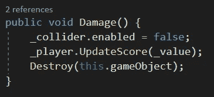

从敌方脚本调用 UpdateScore 方法

别忘了，在从播放器调用方法之前，你需要得到一个对播放器的引用——和 null check！

至于生命—

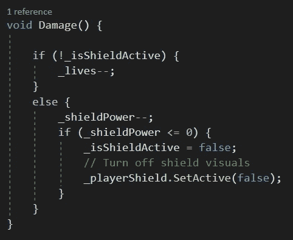

如果我们没有盾牌，对不起，但失去一条生命！

我们需要一个伤害方法在我们的玩家脚本中，这样如果我们受到伤害，我们就可以从我们的生活中扣除。由于我们的敌人还没有任何武器，那将只是当我们与敌人相撞…

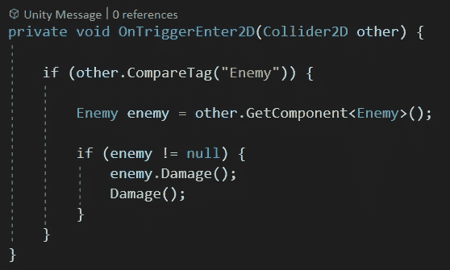

撞击速度！！!'

碰撞时对玩家和敌人造成伤害——因为我们有敌人更新分数的伤害方法，所以不需要添加任何东西。

现在我们的游戏知道什么是生命和分数，我们可以把它们展示给我们的玩家。首先，我们的用户界面需要一个画布—

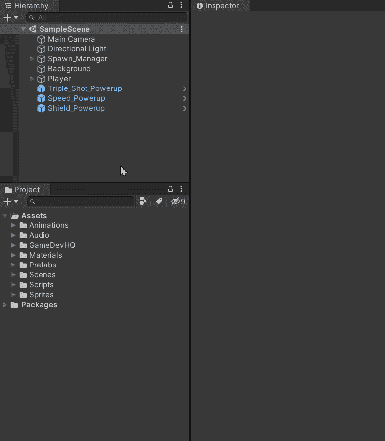

在场景中创建一个 UI 管理器“画布”游戏对象

通常创建 UI 所需的画布，然后将其重命名为 UI_Manager，这使得代码中的引用更容易阅读。

这也将自动添加一个“事件系统”游戏对象到场景中。可以把它想象成 UI 输入管理器——它允许我们与 UI 进行交互(关于 UI 交互的更多信息，请参见另一篇文章)。一个场景中只能有一个事件系统。

为了确保 UI 不会因所使用的屏幕大小而表现奇怪，请更改 Canvas Scaler 的 UI 缩放模式，以便它随所使用的屏幕大小而缩放。

我们可以从 UI 上下文菜单中向 UI 添加各种不同的元素—

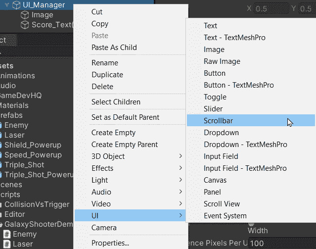

可用的 UI 元素

我们的生活显示将是一些精灵图像，所以我们需要添加一个图像游戏对象。我们的分数将只是一些我们可以编辑的文本，我们可以只使用一个简单的“文本”框来显示我们的分数，但我将使用“文本—文本网格”选项来代替。这给了你更多的定制选项，让文本看起来更好。

*注意:当你第一次将 TextMeshPro 添加到你的项目中时，你会得到一个类似这样的弹出窗口—*

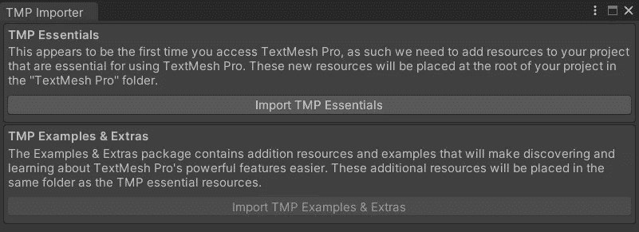

*TMP 进口*

*要让 TMP 发挥作用，你只需要添加“必需品”。一旦导入，另一个选项将变得可用，这包括用法的例子以及一些更多的字体。*

对于场景中的文本和图像游戏对象，我们需要一个新的 UIManager 脚本附加到我们的 UI_Manager。

在我们的新脚本中，我们首先需要在顶部添加一些名称空间—

UI 名称空间

这些名称空间允许我们访问标准 Unity UI 的 C#代码库(在我们的例子中是文本和图像)以及 TMP 库(用于 TMP 文本)

在脚本中创建一些对我们的 UI 元素的引用—

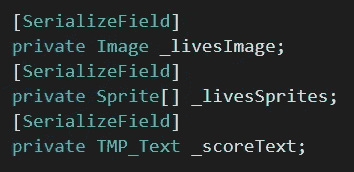

可变引用

因为我们将使用精灵来展示我们的生活，我们需要一个精灵数组来从中选择——在检查器中分配适当的游戏对象和图像——

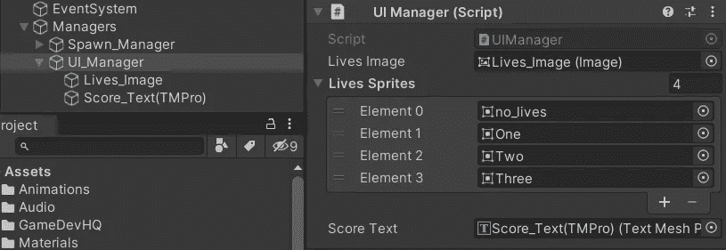

在检查器中分配变量

完成这些后，我们回到 UIManager 脚本，用几个方法来更新我们的分数和生活——

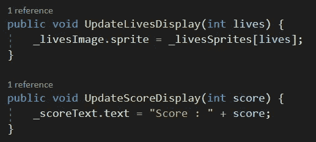

这些都是公共方法，所以我们可以从玩家那里访问它们，因为玩家正在控制分数和生活的变化。

我们现在需要做的就是回到我们的剧本上来

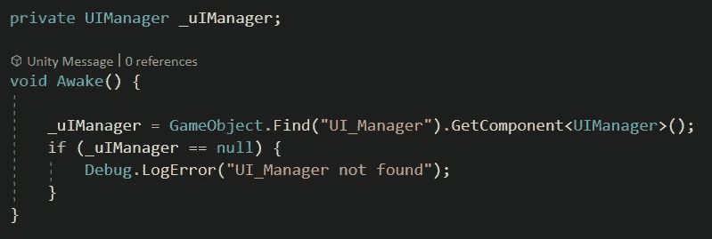

获取对我们新 UIManager 脚本的引用

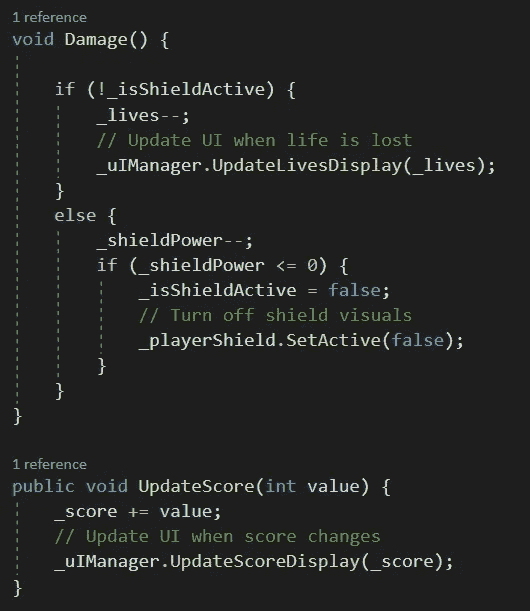

在玩家更新我们的生命显示和分数显示后，添加更新它们的调用。

确保传递每个方法所需的信息，以便它们适当地更新。

在如何为你的游戏创建用户界面方面有很大的灵活性，我们将在下一篇文章中研究如何在屏幕上创建游戏。