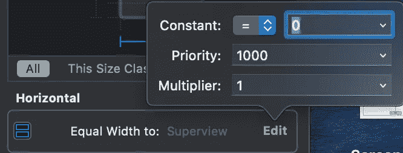

# UIKit —深入研究自动布局中的优先级

> 原文：<https://medium.com/nerd-for-tech/uikit-dive-deeply-into-priorities-in-autolayout-875c622fd588?source=collection_archive---------4----------------------->

在技巧方面，我们可以看到，我们越深入细节，我们经常忽略的有趣的隐藏部分就越多。今天，我将通过在 UIKit 中使用自动布局时没有多少人注意到的一个方面来演示这一点，这是优先级。这篇笔记引用自[Essential Developer Academy](https://www.essentialdeveloper.com/)的 iOS 课程。

# 什么是优先级？

**自动布局**是根据所需的 ***约束*** 动态计算视图大小和位置的机制。它们可以是前导、尾随、顶部、底部或宽度/高度约束，等等。每个约束都有几个选项。其中之一就是优先权。



图片来源:Duy Bui

这是什么？我们什么时候需要它？给你个提示，你在 Xcode 控制台日志里看到过这个错误吗？我很确定你至少有过一次。

```
[LayoutConstraints] 
  Unable to simultaneously satisfy constraints.     
    Probably at least one of the constraints in the following list is one you don't want.      
  Try this:          
  (1) look at each constraint and try to figure out which you don't expect;          
  (2) find the code that added the unwanted constraint or constraints and fix it...
```

我为什么问这个问题？因为我们通常不会得到那种 ***编译器警告*** (即使是在界面构建器上)。我们可以在控制台日志中得到这些 ***运行时警告*** 。当要求的约束不能同时满足时，就会发生这种情况。但是什么时候？

# 使用优先级来修复运行时警告

但是等等？这说不通。这是怎么发生的？是的，我知道，在我第一次学习这个的时候，我也有同样的想法，直到我遇到 ***重用自调整大小的单元格*** 。好吧，让我们来看看好东西。

## 问题是

假设，我有一个自调整大小的单元格，它的内容包括:
-一个堆栈视图(top: 10，bottom: 10，leading and trailing: 0)。在这个栈里面:
+一个视图下面有动态内容的标签。最多 4 行—一行的高度= 10。
+视图下有动态内容的标签。最多 4 行—一行的高度= 10。

->因此在这一点上，单元格高度取决于要显示多少内容。该单元格的高度可以计算如下:*视图(100) +标签(行*10)*

它(似乎)看起来很好。但是在复用细胞的时候会有一个问题。例如，第一个单元格在标签中有两行。高度将为:100 + 2 * 10 = 120。 ***该单元格将被下一个*** 重新使用。这就是问题所在。如果下一个单元格包含 3 行内容。高度会是:100 + 3*10 = 130。当前高度(120)不足以满足必要的最小高度。所以，Xcode 会在控制台抛出上面的警告。

请注意:如果下一个单元格中的标签行有两个或更少(足以满足)，则什么也不会发生。在这种情况下，一切都会好的。

## 具有优先级的解决方案

这个警告被低估了，部分原因是自动布局会在单元格实际呈现在屏幕上之前重新计算单元格高度(选择其中之一)。但是也挺烦的吧？

想法是使垂直约束不那么严格。你还记得栈视图的顶部和底部约束吗？我们将降低他们的优先级。通过将 ***设置为 999，低于所需的优先级 1000*** ，自动布局仍将尽可能满足垂直约束。但是当它不能喜欢这个案例的时候，就会忽略它。

还有另一种方法——有点棘手。那就是我们知道最大线条的时候，然后我们就能知道最大高度。因此，我们可以设置该高度来满足所有情况。

```
public override func prepareForReuse() {
   super.prepareForReuse()            
   frame.size.height = 140
}
```

但是我不喜欢这种方式，因为我必须计算很多——并不总是有足够的信息来做。并且我们需要在使用自动布局时手动计算。哈哈，够搞笑的。

# 结论

到目前为止，这种情况(重用自调整大小的单元格)是我所知道的唯一一个在自动布局中解决问题的优先级。你还知道其他案例吗？随时让我知道。
我希望你喜欢这篇文章，并与你的朋友分享。我总是公开讨论任何与 iOS 相关的问题。下一篇文章再见。