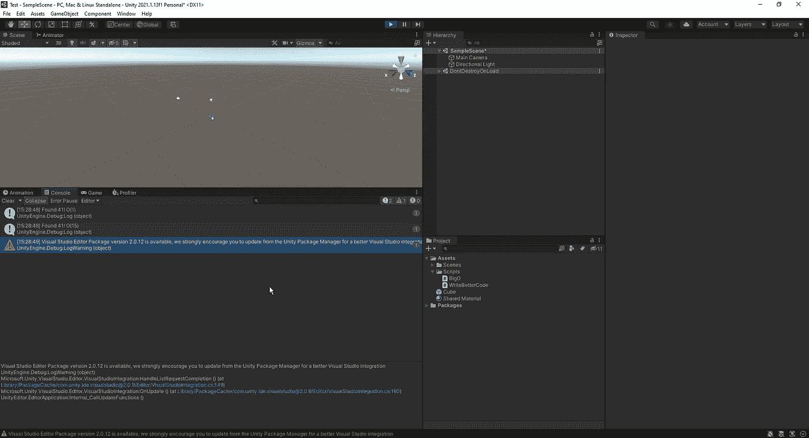
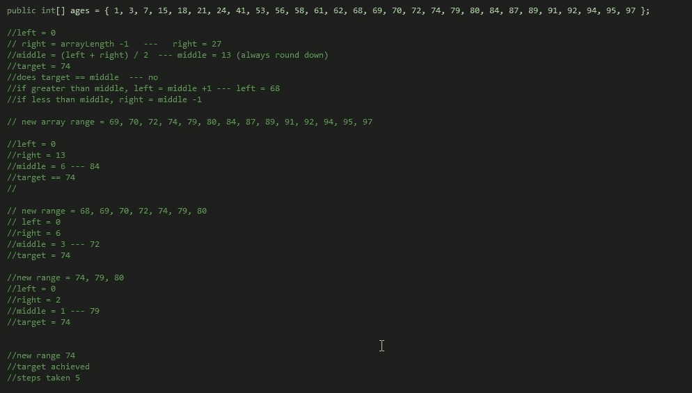
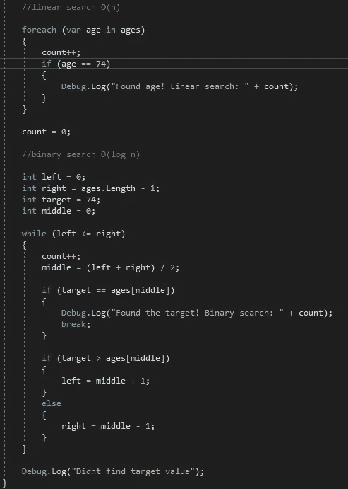
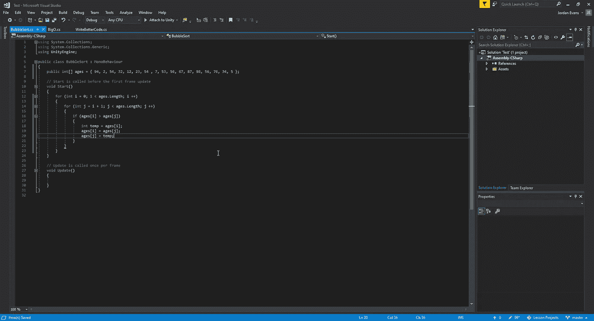

# 理解大 O

> 原文：<https://medium.com/nerd-for-tech/understanding-big-o-69c02aa59bd2?source=collection_archive---------2----------------------->

现在，让我们深入了解大 O 符号。大 O 是用来谈论运行一个算法需要多长时间，或者一个算法使用了多少内存的语言。大 O 可以表示一个算法的最好、最坏和平均情况运行时间。今天我们将学习 4 种主要的大 O 符号:

1.  0(1)-常量时间→这些将总是花费相同的时间来执行，时间的长短与输入的大小无关。
2.  0(n)-线性时间复杂度→这些算法执行时间与输入大小成正比。一个例子是在一堆卡片中寻找某一张。
3.  o(log n)-对数时间复杂度→这是一种与 n 的输入大小成比例的算法。一个简单的例子是从一副牌中取出 8 张牌。为了找到这 8 张卡中你想要的那一张，你要把它分成 2 组，直到你只剩下那一张。
4.  o(n)-二次时间复杂度→对于这个算法，完成它的步骤数就是 n 的平方的值。例如，如果通常需要 16 个步骤来完成一项任务，那么使用这种符号，您将需要 256 个步骤来完成它。

现在，让我们来看看不同的例子，我们可以用它们来展示彼此之间的不同之处。

让我们来看看前两种情况。在本例中，我们希望在男性组和女性组之间查找年龄为 41 的数据。在男性群体中，这是一个最好的情况，或 O(1)，因为它恰好是列表中的第一个年龄。然而，对于我们的 O(N ),这并不是最佳情况，因为我们必须滚动列表几次，才能使它达到 41:

正如我们所看到的，在我们的列表中，计数达到 15 才达到 41。

现在，我们来看看 O(log n)。由于这是一个二分搜索法，我们需要对数组进行排序。它要做的是将数组中间的元素与目标值进行比较，然后确定是否已经找到值，或者是否必须在数组的上半部分或下半部分继续搜索。记住这一点，让我们来看看如果有一个更长的数字数组会是什么样子:

正如我们所看到的，我们构建了一个包含 27 个数字的数组，并对其进行了排序。如果我们决定用我们的 O(n)方法来检查它，我们将会看到 18 个不同的步骤，直到我们达到我们的目标数。然而，正如我们从这个手工算出的过程中所看到的，如果我们使用 O(log n)方法，理论上这个过程只需要 5 个步骤就可以实现。让我们来看看如何用代码编写这个，然后检查一下我们的中间值出现了多少次:

现在我们已经编写了代码，可以将我们的线性与二分搜索法进行比较，让我们看看结果:

正如我们所看到的，我们的二分搜索法只需要 5 步就可以完成，相比之下，线性搜索需要 18 步。这大约是达到我们预期目标所需步骤的三分之一。最后，让我们快速看一下 O(n ),或者嵌套循环。这可以帮助我们对列表进行排序，以便我们能够创建。
我们来看一个例子，看看如何通过创建一个按数字顺序排序的随机数来对其进行排序:

我们所做的是在我们的循环中创建了一个循环。然后，这个循环将不断重复，直到列表排序完毕。我们需要在两个循环中创建一个临时值，这样当我们需要切换号码时，我们就可以用这个临时值来存储切换号码:

正如我们所看到的，按下 play，数组中的元素从完全随机变为数字排序。

我们找到了。这是对大 O 符号过程的一个快速浏览。下一次我们将快速研究另一个方面，O(n log n ),看看这个过程如何与我们的 O(log n)相比较。