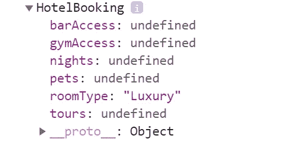
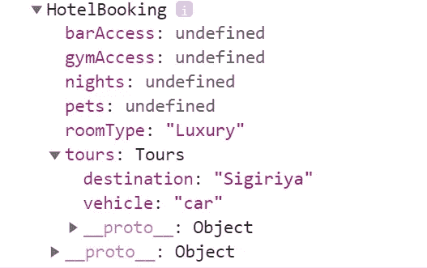
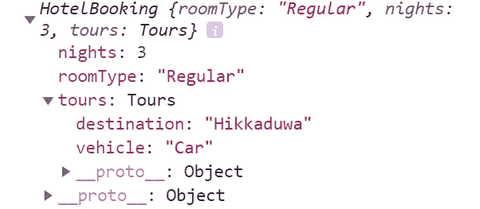
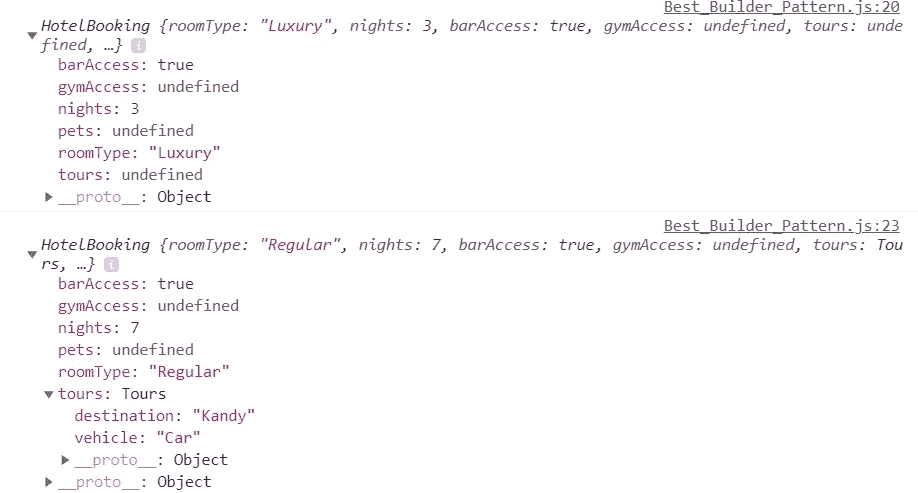

# 理解生成器设计模式

> 原文：<https://medium.com/nerd-for-tech/understanding-builder-design-pattern-ce48a29b79?source=collection_archive---------17----------------------->

Photo by [贝莉儿 DANIST](https://unsplash.com/@danist07?utm_source=medium&utm_medium=referral) on [Unsplash](https://unsplash.com?utm_source=medium&utm_medium=referral)

Builder 是一种创造性的设计模式，顾名思义，它是用来构建对象的。如果我们正在开发复杂的应用程序，通常我们必须处理复杂的对象。这些对象可能依赖于几个子对象，也可能需要精心的构造过程。这就是构建器设计模式拯救我们的地方。所以使用 Builder 模式的主要目的是将一个复杂对象的构造和它的表示分开，让同一个构造过程可以创建不同的表示。

我们举个例子，让事情更清楚。假设有一个酒店预订网站，我们可以根据自己的兴趣来搜索酒店。当我们想要预订酒店时，我们可以选择不同的选项，例如，房间类型、您要住几晚、健身房和酒吧、参加旅游(由酒店组织)等等。但问题是，每个人都不想要所有这些选项。有人可能只需要参加旅游，而他/她不想去健身房和酒吧。可能有另一个人只对健身房和酒吧感兴趣，反之亦然。然而，房间类型和住宿选择对每个人来说都是必须的，因为无论何时你预订酒店，房间类型和住宿都必须明确。

基于这种情况，如果我们使用传统的方法来开发这个应用程序，我们必须根据每种情况创建多个构造函数。因为应该有单独的构造函数来表示每种情况。因此，代码会变得更加复杂。因此，我们可以使用生成器设计模式来防止这种结果。

# 生成器设计模式的用例

在这一章中，我将通过一个使用 ***JavaScript*** 的真实例子来解释如何应用构建器设计模式。事实上，我将使用上述场景来实现这个应用程序。

## 常规实施

如上所述，有几种方法可以实现这个应用程序。不管是什么语言，总有一种传统的实现方式，JavaScript 也是如此。那么，让我们看看如何用传统的方法实现这一点，然后，我们可以用 JavaScript 来实现设计模式方法。

输出结果:

如你所见，我创建了两个类，分别名为**【酒店预订】**和**【旅游】。“HotelBooking”类负责在用户预订酒店时创建对象。此外，当用户在预订酒店时选择旅游作为选项时,“旅游”类将用于创建对象。**

所以，这是用 JavaScript 实现上述场景的常规方式。但是这个实现有什么问题呢，因为根据输出结果，它工作起来没有问题。因为如果你想选择**【tours】**作为一个选项而忽略其他选项，你仍然必须为构造函数中的每个参数传递默认值(**未定义**)。

输出结果:

正如你所看到的，你必须传递 2 个未定义的值作为选择“旅游”选项的结果。所以，这根本不是一个好的做法。因此，我们可以使用构建器模式来实现这个场景。

## 经典的构建模式方法

在构建器模式中，有两种不同的方法可以使用它。第一种方法是在 JavaScript 中实现构建器模式的经典方法，而另一种是更侧重于 JavaScript 的方法。因此，让我们看看在经典的构建器模式方法中实现是什么样子的。

输出结果:

在这种方法中，我创建了一个名为**“hotel builder”**的类，它接受了创建**“hotel booking”**对象所需的所有参数。在我们的例子中**“room type”**和**“nights”**。因此，在这种方法中，我们将使用“HotelBuilder”类而不是“HotelBooking”类来创建对象。

之后，我们需要为该类中的每个参数创建单独的方法。这些方法中的每一个都返回 **"this"** 关键字来返回构建器对象。因此，它将允许我们将这些方法链接在一起。因此，我们只需要传递我们想要的参数。

输出结果:

正如你所看到的，如果你想选择旅游，你只需要传递参数。因为 JavaScript 引擎会将**【未定义】**赋值为其他参数的默认值。因此，如果用户想要不同的选项，我们可以链接这些方法来传递必要的参数。

因此，构建器模式使这个应用程序比以前的方法更加健壮和有效。因为你只需要传递必要的参数。但是仍然有一种更高级、更简洁的方式在 JavaScript 中实现 Builder 模式。让我们看看如何在下面的例子中实现它。

## 最佳构建模式方法

正如我上面提到的，这是用 JavaScript 实现 Builder 模式的更高级、更简洁的方式。在这种情况下，我们不像前面的方法那样使用构建器类。相反，我们可以直接使用**“hotel booking”**类，并将这些可选参数作为单个 **JSON 对象传递。**

输出结果:

正如您所看到的，与以前的实现相比，新的构建器模式方法更加干净和容易实现。因此，这种方法被认为是在 JavaScript 中实现构建器模式的最佳方式。同样，在这种方法中，我们可以**为除“未定义”之外的参数分配** **自定义默认值。**

如果你有兴趣，你可以使用下面的 GitHub 链接来看看我对 Builder 设计模式的完整实现。

 [## 尼萨尔-库马拉/克里希-LP-培训

### 在 GitHub 上创建一个帐户，为 nisal-kumara/krish-lp-training 的发展做出贡献。

github.com](https://github.com/nisal-kumara/krish-lp-training/tree/master/Design%20Patterns/Builder) 

所以，这是我的文章的结尾，我希望你喜欢它。快乐编码👨‍💻。

# 参考