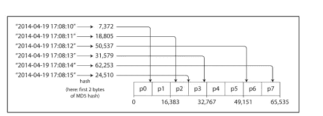

# 理解数据库设计中的数据分区(第 1 部分)

> 原文：<https://medium.com/nerd-for-tech/understanding-data-partitioning-in-database-design-part-1-8d6313831f55?source=collection_archive---------2----------------------->

在本文中，我将解释分布式计算中称为分区的术语，因此我将解释以下几点

*   分割的意义是什么？
*   我什么时候需要它？
*   解释分区的种类及其优缺点
*   二级索引及其种类
*   重新平衡以及我为什么需要重新平衡？
*   不同的再平衡策略各有利弊
*   客户端了解哪个节点包含目标分区的不同方式(请求路由)
*   参考

**什么是分区的意思？**

术语**分区**简单来说就是我们数据的每一部分(比如记录)都归一个分区所有，所以每个分区都可以被认为是一个小数据库。

**我什么时候需要？**

当我们的数据变得非常大，无法存储在单台机器上，并且在单台机器上查询大量数据变得非常困难时，可伸缩性现在变得非常重要。分区可以解决这个问题，因为不同的分区可以放在我们群集上的不同节点上，大量数据可以分布在许多磁盘上，我们的查询可以在不同的处理器上完成，因为我们可以通过在群集上添加更多机器来扩展。

**数据划分方式**

正如我们解释的那样，我们需要将数据分布在一个小单元上(**分区)**

并将数据和查询负载平均分布在节点上

所以实际上这可以用不同的方法来完成

*   **键值**

这种分区就像有一个简单的键-值数据模型，并且总是通过键获取值，所以我们可以通过主键对数据进行分区，但是在许多情况下， 这种方式效率不高，因为不均匀分配请求的分区键设计会使一些分区比其他分区拥有更多的数据或查询，这种方式称为**偏斜**，在最糟糕的情况下，所有数据和负载都集中在一个分区上，这是一些用例，用来解释这种方式何时是好是坏

*   用户 ID，其中应用程序有许多用户(**好例子**)
*   项目创建日期四舍五入到最近的时间段(例如，日、小时或分钟)(**坏情况**)
*   **按键范围**

另一方面，我们可以将从 N 到 N 个键的恒定范围分配给每个分区，并且如果我们知道这些范围之间的边界，我们可以简单地知道哪个分区包括我们的键，或者我们可以直接询问节点我们是否已经知道哪个分区分配给哪个节点。

键的范围不一定具有相同的空间，因为它取决于分区边界。例如，如果您有多个卷，其中一个卷包含以字母 A 和 B 开头的单词，另一个卷包含以 V、X、Y 和 Z 开头的单词，则最终会有一些卷比其他卷大得多，因此，如果您希望平均分配数据，分区边界需要适应数据。

边界可以手动设置，也可以由数据库引擎支持自动设置。

HBase、BigTable、RethinkDB 等都使用这种策略。

这种策略的优点是您可以对关键字进行排序，这样范围扫描就很容易，并且您可以通过将关键字作为连接索引来获取几个相关的记录，例如(年-月-日-小时-分钟-秒)。

这种策略的缺点是，特定的访问模式可能会导致热点问题，例如，如果键是时间戳，则分区对应于时间范围，每天一次，今天的所有数据最终会进入同一个分区，并且该分区可能会简单地过载。为了避免此问题，您可以依赖另一个键，或者例如在传感器数据的情况下，在时间戳前面加上机器名称。

*   **密钥哈希**

正如我们在热点和偏斜问题之前解释的那样，许多分布式数据系统使用散列函数来确定给定键的分区。

> 顺便说一下，**散列函数**是任何可以用来将任意大小的数据映射到固定大小的值的函数。

数据均匀分布，并且像哈希函数一样完美地避免了偏斜/热点。例如，如果您有一个 32 位哈希函数，每当您向它提供一个新字符串时，它都会返回一个介于 0 和 2 之间的明显随机的数字，即使这些字符串非常相似，哈希在数字范围内也是平均分布的。

现在，您可以为每个分区分配一个散列范围，每个散列在分区范围内的键都将存储在分区中。

遗憾的是，我们失去了 key-range 的一个很好的特性，我们可以进行有效的范围查询，因为键现在分散在各个分区中，所以排序顺序也丢失了，例如在 MongoDB 中，如果我们启用了基于哈希的分区模式，任何范围查询都必须发送到所有分区。

**二级指标**

正如我们在分区方案之前解释的那样，我们已经讨论了键-值，我们只能通过主键访问记录，我们可以根据这个键确定分区，因此我们可以很容易地知道记录在哪个分区中，但是例如，如果我们有关于汽车的数据，并且汽车 id 是主键，我们如何获得红色汽车，因为它们中的一些可以存储在不同的分区中。二级索引通常用于关系数据库和文档数据库，但 HBase 等 NoSQL 键值数据库避免使用它，因为它增加了实现的复杂性，但一些商店已经开始添加它，因为它对 Riak 等数据建模非常有用。实际上，二级索引的问题是它不能清晰地映射到分区，所以我们有两种二级索引分区，基于文档的和基于术语的。

**基于文档的**

假设我们有一个销售汽车的在线系统，我们使用一个主要的唯一 id，我们使用这个键对数据库进行分区，例如，在分区 0 中汽车 id 从 0 到 500，依此类推。现在，我们的客户需要过滤黑色汽车或宝马汽车，例如这里您需要一个关于颜色和品牌的辅助索引，这些将是文档数据库中的字段或关系数据库中的列。如果您已经声明了索引，那么每当将黑色汽车添加到数据库中时，数据库可以自动执行索引。数据库部分会自动将其添加到索引条目的主键 id 列表中。在这种索引类型中，每个分区都是完全独立的，因为每个分区都维护自己的辅助索引，并且不关心其他分区中存储了什么数据。您只需处理包含主键 ID 或文档 ID 的分区。因此，如果一个分区中有一些黑车，而另一个分区中有一些黑车，并且如果您想要搜索黑车，您必须将查询发送到所有分区并组合所有结果。这种方法有时被称为分散/聚集，它会使二级索引的读取查询代价很高，它广泛用于 ElasticSearch 和 cassandraDB 等。大多数数据库供应商建议您构建分类模式，以便从单个分类中提供第二索引查询，但这并不总是可能的，主要是当您使用多个第二索引(如颜色和品牌)时。

**基于期限的**

我们可以建立一个覆盖所有分区数据的全局索引，而不是每个分区都有自己的二级索引。全局索引也必须单独分区主键索引例如，如果我们让所有分区的黑色汽车出现在索引中的颜色:黑色下，但索引也分区，因此以字母 A 和 K 开头的颜色出现在分区 0 中，其他颜色出现在分区 1 中，依此类推，我们将这种类型的索引称为术语分区索引。因此，现在我们只知道与我们的术语匹配的分区，如从 A 开始的汽车颜色，等等，而不是向所有分区发出具有分散/聚集成本的请求，但是这里的瓶颈是写 aee 更慢和更复杂，因为写入单个文档现在可能会影响多个分区。

我将在文章的第二部分阐述这一点。

参考文献

*   设计数据密集型应用
*   可靠和安全的分布式编程简介