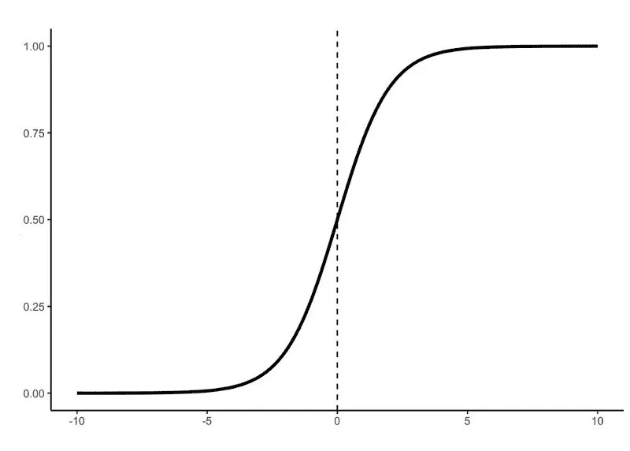
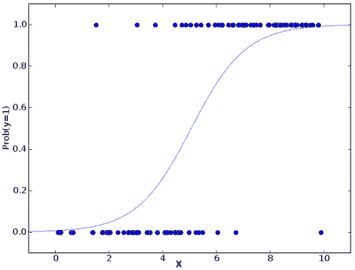
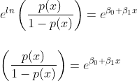
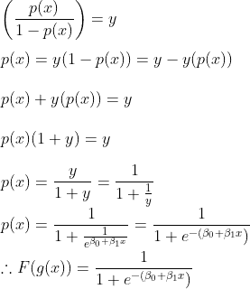
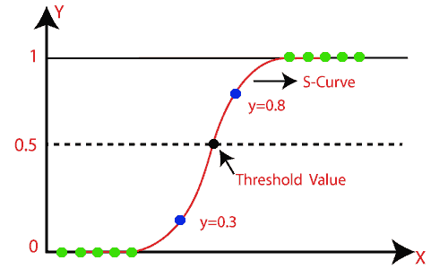
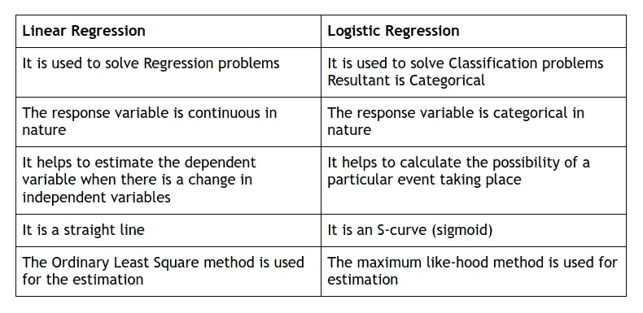

# 理解逻辑回归

> 原文：<https://medium.com/nerd-for-tech/understanding-logistic-regression-782baa868a54?source=collection_archive---------1----------------------->

到目前为止，我们要么着眼于估计连续变量的条件期望(如在回归中)。然而，在许多情况下，我们对投入产出关系感兴趣，如在回归中，但产出变量是离散的而不是连续的。

特别是，在很多情况下我们会有二元的结果(一种情况只有两种可能的结果)。除了二元结果，我们还有一些输入变量，它们可能是连续的，也可能不是连续的。

我们如何对这些数据进行建模和分析？我们可以试着想出一个从输入变量中猜测二进制输出的规则。这叫做分类，是统计学和机器学习中的一个重要课题。

分类预测离散的目标标签 y。分类是基于从带标签的训练数据构建的分类模型，将新观察值分配给它们最可能属于的类别的问题。

分类的准确性将取决于您选择的算法的有效性、您如何应用它以及您有多少有用的训练数据。

## 逻辑回归

逻辑回归是一种分类方法，其中模型输出分类目标变量 Y 属于某一类别的概率。

换句话说，逻辑回归是一种用于预测因变量的方法，给定一组自变量，使得因变量是分类的。

*   因变量(Y):响应二进制变量，包含值 0 或 1，是或否。
*   自变量(X):用于预测响应变量的预测变量。

基本上，逻辑回归的结果是明确的。因此，当结果有两个可能的值时，总是希望有一个预测 0 或 1 或 0 到 1 之间的概率得分的模型。

> 虽然逻辑回归通常用于有两个类别的二元分类，但请记住，分类可以用任何数量的类别来执行(例如，当给手写数字分配 0 到 9 之间的标签时)。但是我们只对二元分类使用逻辑回归。

我们可以应用逻辑回归的分类问题的一个很好的例子是确定贷款申请是否是欺诈性的。

最终，贷款人想知道他们是否应该给借款人贷款，他们对申请事实上是欺诈性的风险有一定的容忍度。

在这种情况下，逻辑回归的目标是计算应用程序是欺诈的概率(在 0%和 100%之间)。有了这些概率，我们就可以设定一个阈值，如果超过这个阈值，我们就愿意借钱给借款人，如果低于这个阈值，我们就拒绝他们的贷款申请，或者对申请进行进一步审查。

## **为什么不用线性回归来预测概率？**

对于分类变量，使用线性回归是不合适的，因为响应值不是在比率尺度上测量的，并且误差项不是正态分布的。

此外，线性回归模型可以将预测值生成为从负到正无穷大范围内的任何实数，而分类变量只能采用指定范围内有限数量的离散值。

简而言之，如果你对一系列 Y = 0 或 1 的例子训练一个线性回归模型，你可能最终预测出一些小于 0 或大于 1 的概率，这是没有意义的。这是因为线性回归适用于连续响应变量。

所以我们不能利用线性回归。相反，我们将使用逻辑回归模型，该模型被设计为分配 0 到 1 之间的概率，表示 Y 属于某个类。

## 逻辑回归背后的数学

> 这一部分的数学很有趣，但可能更具技术性。

逻辑回归(logit 模型)是对线性回归的一种修改，它通过应用 sigmoid 函数来确保输出介于 0 和 1 之间的概率，当绘制该函数时，它看起来就像特征 S 形曲线。

Sigmoid 函数压缩 0 和 1 之间的值，其计算公式如下

在继续之前，让我们先了解什么是几率，以及它们与概率有何不同。

*概率是某件事发生与某件事没有发生的比率。概率是某件事情发生与所有可能发生的事情的比率。*

*举个例子，我们队赢一局的几率是 3 比 5(赢局数与输局数之比)，那么你们队赢的几率是 3 比 8(赢局数与总局数之比)*

*为了根据概率计算赔率，我们有*

*哪里，*

*   *p 是事件发生的概率，在我们的案例中是获胜的概率*

*概率有一个上限，即一个事件的概率不能大于 1。但是当把概率转换成赔率时，就去掉了上限。但是概率的下限呢。取赔率的对数就去掉了下限。*

*采用对数赔率的另一个原因是，你的团队获胜的几率可以从 0 到 1。但是你的团队失败的几率可以从 1 到无穷大。由于赔率值之间的不对称，我们采用了对数。采用 log()的概率通过使一切对称来解决问题。*

*概率比的对数被称为 logit 函数，是逻辑回归的基础。*

> 如果你不熟悉线性回归，可以看看下面这篇文章 [**简单地说线性回归**](/geekculture/linear-regression-in-a-nutshell-1714d5665fd2)

回想一下简单线性回归模型的原始形式，我们现在称之为 g(x ),因为我们将在复合函数中使用它:

*哪里，*

*   *β0 是 y 轴截距*
*   *β1 是直线的斜率*
*   *x 是 x 坐标的值*
*   *y 是预测值*

现在，为了解决模型输出小于 0 或大于 1 的问题，我们将定义一个新的函数 F(g(x))，通过将线性回归的输出压缩到[0，1]范围内的值来转换 g(x)。

为此，我们将 g(x)代入上述 sigmoid 函数，得到一个输出概率在 0 和 1 之间的函数:

换句话说，我们正在计算训练示例属于某个类的概率:P(Y=1)。

**上式的推导**

*线性方程如*所示

*现在，我们预测中奖的几率*

*双方指数化*

*现在让，*

*然后，*

> 在 logit 模型中，β1 现在表示随着 X 的变化，对数优势比的变化率。换句话说，这是“对数优势的斜率”，而不是“概率的斜率”。

# 最大似然估计

最大似然估计(MLE)是一种估计逻辑回归模型参数的方法。这种估算方法是最广泛的一种 […【阅读更多】](https://arunaddagatla.medium.com/maximum-likelihood-estimation-in-logistic-regression-f86ff1627b67)

# 了解逻辑回归模型的输出

如前所述，逻辑回归只计算结果为 0 或 1。那么为什么我们会有一条从 0 到 1 的曲线呢？在 0 和 1 处应该是一条直线。这是因为逻辑回归计算概率。

考虑一个事件发生概率为 0.6 的例子，这个输出属于 0 类还是 1 类。

在这种情况下，设置一个阈值。考虑阈值为 0.5。这意味着 0 到 0.5 范围内的任何值都被分类为 0，0.5 到 1 被分类为 1。这将得到一个二进制结果，即使结果是连续的。

简而言之，预测 Y 标签——垃圾邮件/非垃圾邮件、癌症/非癌症、欺诈/非欺诈等。—你必须设置一个概率截止值或阈值。

## 线性回归与逻辑回归

## 结论

逻辑回归产生二进制格式的结果，用于预测分类因变量的结果。由于逻辑回归预测概率，而不仅仅是类别，我们可以使用可能性来拟合它。

*感谢您阅读这篇文章！如果你有任何问题，请在下面留言。请务必关注*[*@ arunadagatla*](https://arunaddagatla.medium.com/)*，获取关于最新数据科学和深度学习文章的通知。*

> *您可以在*[***LinkedIn***](https://www.linkedin.com/in/arun-addagatla/)*，*[***Github***](https://github.com/arun2728)*，*[***Kaggle***](https://www.kaggle.com/arun2729)*，或者通过访问*[***【Medium.com***](https://arunaddagatla.medium.com/)