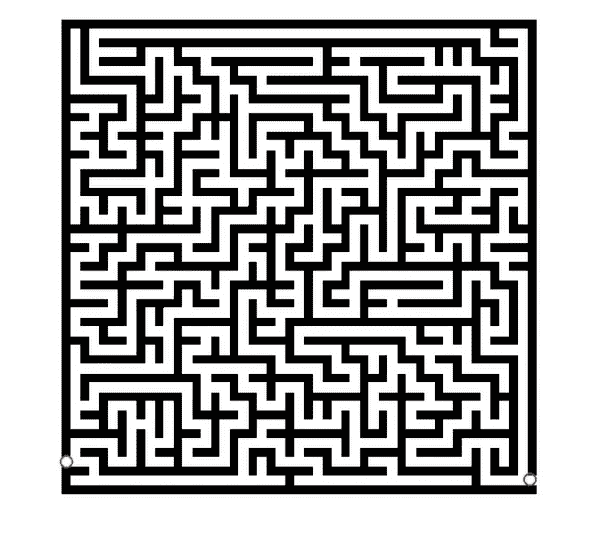
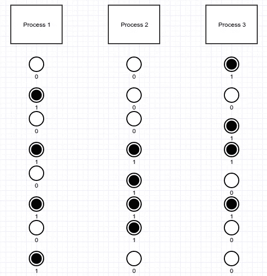

# 理解“量子”和“量子计算机”

> 原文：<https://medium.com/nerd-for-tech/understanding-quantum-and-quantum-computer-5d0b8ecf88fc?source=collection_archive---------19----------------------->

在我们谈论量子计算机甚至普通计算机之前，让我们复习一下物理学。如果你真的想理解量子计算机背后的奇妙科学，那么理解大自然母亲的某些行为是很重要的。如果你觉得你是薛定谔的猫的一个版本，你**要么拥有，要么不拥有**(同时)自然的基本量子行为的知识，那么你可以直接跳到“**什么是量子比特**”这一节。

# **量子力学简介**

在我们学校，有人告诉我们，这个世界上的一切都是由原子组成的。无论你看到周围的什么，你感觉到的空气，你喝的水，你手中的手机，你手腕上的手表，你自己的身体，这个地球，月亮，太阳——都是由原子组成的。就像房子是一砖一瓦搭建起来的，砖就成了那个房子的最小单位。同样，无论这个世界上存在什么，如果你试图把它分解成最小的单位，那就是原子。

我们能够找出所有那些独特的最小单位或原子，如氢、氧、铁、金、铀等。它们都列在“周期表”中。大约有 98 种不同的原子自然存在。

牛顿和其他科学家已经用公式表述了被称为经典力学或牛顿力学的物理定律。这些定律能够解释行星的运动，物体的运动和轨迹。基本上，那些定律被更大的物体所遵循。像苹果、石头甚至像行星、恒星甚至星系一样大的物体。但是，当这些定律被用来预测宇宙最小单位的行为，或者更好地称为原子时，这些定律悲惨地失败了。

后来，在 20 世纪的前 30-40 年，爱因斯坦、普朗克、玻尔、埃尔温·薛定谔、理查德·费曼、洛伦兹、海森堡、泡利、德布罗意、狄拉克、朗缪尔等科学家开始推导出这些最小单位的定律。他们对基于这个新理论的计算和结果感到惊讶，他们甚至不相信自己。

他们催生了物理学最有趣的领域——量子力学。量子力学研究宇宙中最小的不可分割的单位原子所遵循的定律和理论。

但是这个故事有一个转折，因为人们相信最小的单位不是原子。原子本身由更小的粒子组成，如质子(由夸克组成)、电子和中子。这些被称为亚原子粒子。有必要维持这种粒子洪流。据观察，许多亚原子粒子可以被归类到某种逻辑组中，就像元素周期表中的原子一样。

亚原子粒子被归类为标准模型。通俗地说，标准模型有点像亚原子粒子的周期表，亚原子粒子被分类，像电子、夸克、光子、中微子等。现在更公平地说，这个世界上的每样东西都是由亚原子粒子组成的。甚至支配宇宙的自然力如电磁力、强核力和弱核力也可以用标准模型来解释。

# **大自然是怪异的，不是量子力学**

# **1。量子隧道**

想象一个场景，你在打斯诺克。一个红色的球突然从它的位置消失，并突然瞬间出现在桌子上的其他地方。球没滚，你没碰球。球只是在一个地方自动消失，瞬间出现在另一个地方。这很难想象，但这是在量子层面上，在亚原子粒子层面上真正发生的事情。正如
教科书中所教导的，电子不围绕原子旋转，实际上，一个电子在其概率云或轨道中出现和消失。有时，电子也会越过能垒，出现在它没有足够能量到达的地方。但那是实验证实的现象。这叫做量子隧道。在这里阅读更多关于量子隧道的信息[https://www . quora . com/What-is-quantum-tunneling-How-is-it-use/answer/Vivek-ke shore](https://www.quora.com/What-is-quantum-tunneling-How-is-it-used/answer/Vivek-Keshore)

# **2。量子叠加:**(对量子计算机最重要)

想象一个场景，你穿着一件高科技衬衫，它的颜色随机地变成红色或蓝色。如果我看到你穿红色的衬衫，可能另一个人会看到你穿蓝色的衬衫，因为那时颜色一定已经变了。但是，假设有一个陷阱，衬衫只有在有人看的时候才会变色。于是，当我看着你的时候，你的衬衫颜色变成了红色，当另一个人看着你的时候，
你的衬衫颜色变成了蓝色。那么，没人看你的时候，你的衬衫是什么颜色的？它既不是红色也不是蓝色。我们可以说，你的衬衫处于叠加状态，当没有人看的时候，它既像红色又像蓝色，但是当有人看的时候，它不是红色就是蓝色。

你的衬衫有两个叠加态。假设我 10 次中有 7 次观察到你穿红色球衣。所以，我会说别人观察你穿红色衬衫的概率是 0.7 或者 70%。所以，你的衬衫波函数可以写成 0.7 红 0.3 蓝。但是当任何人观察你时，你的波函数会崩溃，你的衬衫不是红色就是蓝色，也就是说不再有 0.7(红色)和 0.3(蓝色)，而是满满的 1.0(红色)或 1.0(蓝色)。

在亚原子粒子方面，我们可以说电子既是波又是粒子，两者都是，除非你观察它。杨氏双缝实验证实了双重性。这是一个基本的想法。叠加可以是任何类型的，例如，一个粒子同时在两个地方。难以想象，但它确实发生了。

如果你想更好地理解叠加态的更多细节，请阅读这里-
[https://www . quora . com/Why-new-results-not-observed-in-quantum-mechanics-when-wave-function-collapse-after-the first-measurement/answer/Vivek-ke shore](https://www.quora.com/Why-new-results-are-not-observed-in-quantum-mechanics-when-the-wave-function-collapses-after-the-first-measurement/answer/Vivek-Keshore)

# 3.量子纠缠:

现在想象一下，你有一个双胞胎兄弟，你们两个都穿着同样的高科技衬衫，当有人看你时，它会变色。

但是，让我们说，有人以这样的方式连接你的衬衫，当任何人看着你，如果你的衬衫变成红色，那么你的双胞胎兄弟的衬衫立即变成蓝色(即使没有人在观察你的兄弟)。所以，你和你的兄弟同时呈现红色和蓝色，但是当你呈现红色时，你的兄弟立刻呈现蓝色，反之亦然。这就是纠结。你哥哥会是什么样子，可以通过观察你来推断。
最棒的是，即使你在宇宙的不同一端，纠缠粒子或物体的波函数坍缩也会瞬间发生。即使有光年的距离，纠缠在一起的粒子也能瞬间交流。

为了更好地理解纠缠——[https://www . quora . com/Why-was-the-Schrodingers-cat-experiment-originally-designed/answer/Vivek-ke shore](https://www.quora.com/Why-was-the-Schrodingers-cat-experiment-originally-devised/answer/Vivek-Keshore)

还有其他的量子力学原理可以迷惑任何人的头脑，但为了理解量子计算机，上述三个原理就足够了。

# 量子位

要理解为什么要创造一个量子比特，量子计算机的需求是什么，首先要理解什么是当今计算机中的正常比特，或者直接向下滚动到下面的一个迷宫图像。

# 1.量子位之前的位:

一位是数字世界中的基本信息单位。位是由二进制数字—位衍生而来的一个字。所以，比特是可以存储二进制值的基本信息单位。我们知道二进制值只有 1 和 0。

在计算机领域，你可能听说过 32 位或 64 位处理器。那是什么意思？32 位处理器意味着处理器能够同时处理 32 位二进制数。这就是为什么尽管现代计算机看起来执行基本任务非常快(浏览互联网、看电影、玩游戏)。可悲的是，它无法计算高度复杂的问题。想象一下，如果你需要模拟一个蛋白质分子在水中 1 秒钟的行为。这似乎是一个相当小的问题，但是用现代计算机和有效的算法，需要几个月才能计算出结果。我们的计算机慢了这么多。即使是拥有大量并行处理器的超级计算机，在解决更大的复杂问题时也很慢。

# 2.为什么计算机速度慢，计算复杂问题要花这么多时间？

因为每一位都参与一个过程。一旦进程完成，同样的位将为另一个进程保存信息。你看，即使你做并行编程，你会利用多个处理器，但从技术上来说，处理器中的物理位是不共享的。这些处理器中的所有位都是独立的。

# 3.为什么，什么是量子比特？

根据定义，一个量子比特就是一个量子比特(当然每个人都知道)。
一个量子位可以同时保存 1 和 0。它被称为叠加态，是量子世界的一个基本特征——叠加。

一个比特一次只能保存 0 或 1，量子比特可以同时保存 1 和 0，所以理论上一个量子比特可以一次参与数百万个过程。从而让量子计算机超快。一个量子位也可以和另一个量子位处于纠缠态。假设，如果我们将量子比特 A 与量子比特 B 的相反状态纠缠在一起，如果我们在叠加坍缩后测量量子比特 A 持有二进制 1，那么我们不用测量量子比特 B 就立刻知道
量子比特 B 持有二进制 0。我们也可以纠缠相同状态的量子位元，在叠加崩溃后，两个量子位元都会显示 1 或 0。

# 为什么超快…好吧，这里有一个例子:

比方说，有一个迷宫，只有一条或两条正确的出路，而数以百万计的其他方式将导致一个死胡同。现在，想象你自己在这个迷宫的入口角落。你不知道出路，所以你会一条一条地开始探索每一条路，经过百万次的尝试和数年的时间，你一定能找到正确的出路。(现代计算机就是这样工作的)。

**第二例**

现在再想象一下，你有数百万个克隆人和你在一起。你和你的克隆人将一起开始探索所有的方法。因为所有的克隆人都在一起探索所有可能的方法，其中一个克隆人会在第一时间找到正确的出路。因此，在第一次尝试中，你就有了自己的解决方案或出路。你会很快得到你的解决方案，不是吗？

那些你的克隆体现在并且立刻找到所有的方法，实际上是你的叠加态。你同时出现在很多地方。

现在你明白为什么需要量子位，为什么需要量子计算机了吧。理论上，问题越复杂，量子计算机解决问题的速度就越快。

**问题**

问题只是:如何获得上述模型的物理实现？尝试解决一个问题的所有可能性，对这个理论量子计算机是有好处的。第一种解决方法完成了搜索。所以，这是一种尝试所有可能性的“选择器”。值得注意的是，所有量子计算机的实际形式都是如此。但是计算机必须能够用数学方法计算。否则就是针对一个特殊问题的单一专业。

缺少的是一种数学的、可重复的和可预测的解决方法。并行计算在传统的计算机系统中也是可能的。

我们需要像布尔歇代数那样的量子逻辑。现在量子计算是量子力学和一点数学的混合物。

以上问题很普遍，在现实中是研发更好的量子计算机的研究领域。

# 解决方案

这里，考虑计算机只有 8 位，上面用实心和空心圆圈表示。这是三个不同进程中的相同位，具有不同的布尔值 0 或 1。这三个进程的物理位都是相同的，只是位所包含的布尔值不同。一个量子位可以同时保存 0 和 1。因此，计算机将只处理布尔值，就像现在一样。它会用数学方法计算。进程可以是任何独立的进程或子线程，这取决于问题。

但从理论上讲，如果是这样的话，那么它应该能够一次性解决所有的问题，不管问题的性质是什么。因为计算机需要计算的只是布尔值，而这些布尔值存储在一个量子位中，而不是普通的触发器位。

量子计算机以数学方式工作，它唯一不同的是为不同的过程保存不同的值，以便所有的过程可以同时处理(因为纠缠和叠加)。从而使其能够在不使用任何并行处理器的情况下并行处理无数进程。

在经典计算机中，如果您想要运行 8 个并行进程，那么您应该有 8 个并行处理器，因为每个处理器将为其问题处理保存不同的位值。这就是为什么量子计算机是对我们现代加密技术的威胁。量子计算机可以立即找到加密的密钥，而普通计算机需要数百万年才能破解加密。

我更多的是从硬件的角度来想象，因为叠加，我想象有限数量的量子位在所有可能的组合中保存布尔值。