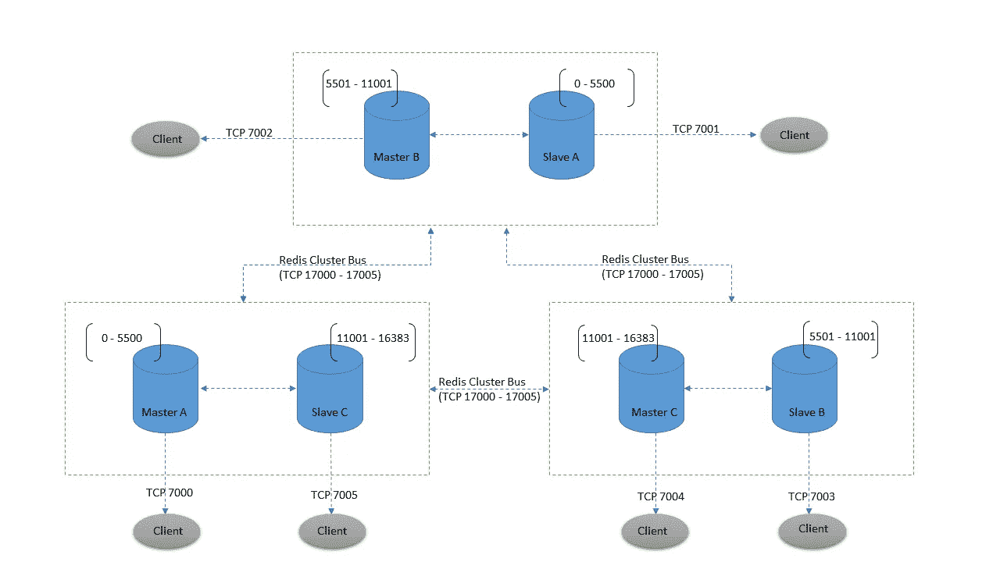
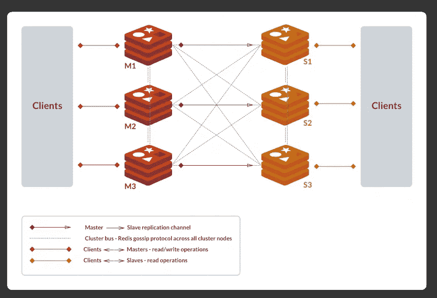

# 在系统设计中理解 Redis

> 原文：<https://medium.com/nerd-for-tech/understanding-redis-in-system-design-7a3aa8abc26a?source=collection_archive---------0----------------------->


在本文中，我将解释系统设计中的 Redis，因为我在一个遗留系统中经历了许多问题，这个遗留系统依赖 Redis 作为设计的主要部分，在阅读和理解 Redis 之后，我理解了这些问题

**什么是 Redis？**

Redis 是一个开源的内存数据结构存储，用作数据库、缓存和消息代理。Redis 提供数据结构，如字符串、散列、列表、集合、带有范围查询的排序集合、位图、超级日志、地理空间索引和流。Redis 具有内置的复制、Lua 脚本、LRU 驱逐、事务和不同级别的磁盘持久性，并通过 Redis Sentinel 和 Redis 集群的自动分区提供高可用性

因此，Redis 既可以作为传统的单片系统使用，也可以作为带有分片的节点集群的分布式系统使用。

在谈论 Redis 之前，我将解释一些概念以及为什么我们的系统中需要这些术语和技术。

**什么是内存缓存，缓存的增值是什么？**

*一个* ***缓存*** *就像是短期记忆。它通常比原始数据源快。从内存访问数据比从硬盘更快。缓存意味着将频繁访问的数据保存在内存(短期内存)中，因此缓存增加的价值是快速检索数据并减少调用原始数据源(可能是 SQL DB ),因为读取数据的复杂时间将为 o(1 ),因为像散列表一样通过内存中的键进行直接访问操作。*

> 所以 Redis 是一个系统，它为我们提供了一个在单片和分布式环境中的缓存系统。

**Redis 如何工作？**

所有 Redis 数据都驻留在服务器的主内存中，这与 PostgreSQL、SQL Server 和其他将大部分数据存储在磁盘上的数据库不同。与传统的基于磁盘的数据库(其中大多数操作需要往返磁盘)相比，内存中的数据存储(如 Redis)不会遭受同样的损失。因此，它们可以支持多一个数量级的操作和更快的响应时间。结果是—极快的性能，平均读取或写入操作不到一毫秒，支持每秒数百万次操作。

**既然 Redis 比传统的 DB 更快，我们可以认为它是真理的第一来源吗？**

答案是**否**我们不能认为 Redis 是真理的第一来源，它总是作为提高系统性能的第二支持，因为从 CAP 定理的角度来看 Redis 既不高度可用也不一致。为了理解为什么，让我们解释 Redis 如何将数据从内存同步到磁盘，因为磁盘可以考虑一致性。

正如我们之前解释的，Redis 数据存储在内存中，这使得读写速度非常快，但在服务器崩溃的情况下，您会丢失内存中的所有数据，对于一些应用程序，在崩溃的情况下丢失这些数据是可以的，但对于其他应用程序，重要的是能够在服务器重启后重新加载 Redis 数据。

因此 Redis 提供了一系列不同的持久性选项:

*   **RDB** (Redis 数据库):RDB 持久性以指定的时间间隔执行数据集的时间点快照。
*   **AOF** (仅附加文件):AOF 持久性记录服务器收到的每个写操作，在服务器启动时将再次播放，重建原始数据集。使用与 Redis 协议本身相同的格式，以仅附加的方式记录命令。当日志变得太大时，Redis 能够在后台重写日志。
*   **无持久性**:如果你愿意，你可以完全禁用持久性，如果你想让你的数据只要服务器运行就存在。
*   RDB+AOF:AOF 和 RDB 有可能同时出现。注意，在这种情况下，当 Redis 重新启动时，AOF 文件将用于重建原始数据集，因为它保证是最完整的。

因此，最重要的部分是理解 RDB 和 AOF 持久性之间的权衡，因为**没有持久性**非常清楚，没有一致性水平，甚至没有强一致性或差一致性。

**RDB 优势:**

*   RDB 是 Redis 数据的非常紧凑的单文件时间点表示。RDB 文件非常适合备份。例如，您可能希望在最近 24 小时内每小时归档一次 RDB 文件，并在 30 天内每天保存一次 RDB 快照。这使您可以在发生灾难时轻松恢复数据集的不同版本。
*   RDB 非常适合灾难恢复，是一个可以传输到远处数据中心的单一压缩文件。
*   与 AOF 相比，RDB 允许更快地重启大数据集

**RDB 的缺点:**

*   如果您需要在 Redis 停止工作(例如断电后)的情况下将数据丢失的可能性降至最低，那么 RDB 并不好。您可以配置产生 RDB 的不同*保存点*(例如，在至少五分钟后对数据集进行 100 次写入，但您可以有多个保存点)。但是，您通常会每五分钟或更长时间创建一个 RDB 快照，因此，如果 Redis 由于任何原因停止工作而没有正确关闭，您应该准备好丢失最近几分钟的数据。

**AOF 优势:**

*   使用 AOF Redis 要持久得多:你可以有不同的 fsync 策略:根本没有 fsync，每秒 fsync，每次查询都有 fsync。使用默认的 fsync 策略，每秒写入性能仍然很高(fsync 是使用后台线程执行的，当没有 fsync 正在进行时，主线程将尽力执行写入。)但是您只能丢失一秒钟的写入。
*   AOF 日志是一个仅附加的日志，因此不会出现寻道，也不会在断电时出现损坏问题。即使日志由于某种原因(磁盘已满或其他原因)以一个写了一半的命令结束，Redis-check-of 工具也能够很容易地修复它。
*   当 AOF 变得太大时，Redis 能够在后台自动重写它。重写是完全安全的，因为当 Redis 继续向旧文件追加内容时，会用创建当前数据集所需的最少操作生成一个全新的文件，一旦第二个文件准备就绪，Redis 就会切换这两个文件并开始向新文件追加内容。
*   AOF 以易于理解和解析的格式包含所有操作的日志。你甚至可以轻松导出 AOF 文件。例如，即使您意外地使用 FLUSHALL 命令刷新了所有内容，只要在此期间没有重写日志，您仍然可以通过停止服务器、删除最新的命令并重新启动 Redis 来保存数据集。

**AOF 劣势:**

*   对于相同的数据集，AOF 文件通常比等效的 RDB 文件大。
*   AOF 可能比 RDB 慢，这取决于具体的 fsync 政策。
*   最后，AOF 可以提高数据的一致性，但不能保证你可能会丢失数据，但比 RDB 模式考虑到 RDB 更快。

**应该用什么？**

这通常取决于任何系统设计，但一般来说，如果您希望获得与 PostgreSQL 相当的数据安全性，那么应该使用这两种持久性方法。如果您非常关心您的数据，但仍然可以忍受灾难发生时几分钟的数据丢失，您可以简单地单独使用 RDB。

在我们解释了 Redis 中的数据存储机制之后，让我们来解释两个重要的持久模型。

**快照:**

默认情况下，Redis 将数据集的快照保存在磁盘上一个名为`dump.rdb`的二进制文件中。如果数据集中至少有 M 个更改，您可以配置 Redis 让它每 N 秒保存一次数据集，或者您可以手动调用 [SAVE](https://redis.io/commands/save) 或 [BGSAVE](https://redis.io/commands/bgsave) 命令。

**工作原理:**

*   Redis [叉子](http://linux.die.net/man/2/fork)。我们现在有一个子进程和一个父进程。
*   子进程开始将数据集写入临时 RDB 文件。
*   当孩子写完新的 RDB 文件时，它将替换旧的文件。

因此，在以下情况下，Redis 会将数据的快照存储到磁盘的 dump.rdb 文件中:

1.  每分钟如果换 1000 把钥匙
2.  如果更换了 10 把钥匙，每 5 分钟一次
3.  如果更换了 1 把钥匙，则每 15 分钟

因此，如果您正在做繁重的工作并更改大量的键，那么将为您生成每分钟一次的快照，以防您的更改不多，则每 5 分钟一次快照，如果真的不多，则每 15 分钟一次快照。

**仅附加文件:**

快照不太耐用。如果你运行 Redis 的计算机停止了，你的电源线出了故障，或者你不小心`kill -9`了你的实例，Redis 上最新写的数据就会丢失。虽然这对于某些应用程序来说可能没什么大不了的，但是存在完全持久性的用例，在这些情况下，Redis 不是一个可行的选项。*仅附加文件*是 Redis 的另一种完全持久的策略。它在版本 1.1 中可用。您可以在配置文件中打开 AOF:

```
appendonly yes
```

**仅附加文件有多耐用？**

正如我们在 AOF 章节中所解释的，我们有以下耐久性级别选项

*   `appendfsync always` : `fsync`每次新的命令都会追加到 AOF 上。非常非常慢，非常安全。请注意，在来自多个客户端或管道的一批命令被执行之后，这些命令被附加到 AOF，因此这意味着单次写入和单次 fsync(在发送回复之前)。
*   `appendfsync everysec` : `fsync`每秒钟。足够快(在 2.4 中可能与快照一样快)，如果发生灾难，您可能会丢失 1 秒钟的数据。
*   `appendfsync no`:绝不`fsync`，只要把你的数据交到操作系统手里就行。更快更不安全的方法。通常 Linux 会在这种配置下每 30 秒刷新一次数据，但是这取决于内核的精确调整。

**工作原理:**

*   Redis [分叉](http://linux.die.net/man/2/fork)，所以现在我们有一个子进程和一个父进程。
*   孩子开始在一个临时文件中写新的 AOF。
*   父进程在内存缓冲区中累积所有新的更改(但同时它在旧的仅追加文件中写入新的更改，因此如果重写失败，我们是安全的)。
*   当子进程完成文件重写时，父进程会收到一个信号，并在子进程生成的文件末尾追加内存缓冲区。
*   利润！现在 Redis 自动将旧文件重命名为新文件，并开始将新数据追加到新文件中。

因此，我们可以理解，Redis 无法保证任何模式下的一致性，因为写入磁盘的操作总是由引擎异步完成，如果崩溃发生在数据同步之前，您可能会丢失数据，您可以减少这种情况，但无法防止。

可用性怎么样？

显而易见，单片 Redis 不能保证任何级别的可用性，因为单个实例意味着单点故障，所以让我们解释一下 Redis 的其他模型。

Redis 集群提供了一种运行 Redis 安装的方式，在这种方式下，数据会在多个 Redis 节点上自动分片。



Redis 集群还在分区期间为**提供一定程度的可用性，实际上就是在一些节点出现故障或无法通信时继续运营的能力。但是，如果出现更大的故障，群集将停止运行(例如，当大多数主节点不可用时)。**

那么实际上，Redis 集群能带来什么呢？

*   在多个节点之间自动分割数据集的能力。
*   当一部分节点出现故障或无法与群集的其余部分通信时，能够继续运行。

**Redis 集群的分布式存储？**

Redis 集群不使用一致散列，而是一种不同形式的分片，其中每个键在概念上都是我们所谓的**散列槽**的一部分。Redis 集群中有 16384 个哈希槽，要计算给定键的哈希槽是什么，我们只需取模 16384 的键的 CRC16。Redis 集群中的每个节点负责散列片段的一个子集，例如，您可能有一个包含 3 个节点的集群，其中:

*   节点 A 包含从 0 到 5500 的散列槽。
*   节点 B 包含从 5501 到 11000 的散列槽。
*   节点 C 包含从 11001 到 16383 的哈希槽。

*这允许在集群中轻松添加和删除节点(扩展),并且不需要任何停机时间。*

**Redis 集群主从模式(Redis Fail-over)？**

为了在主节点的子集出现故障或无法与大多数节点通信时保持可用，Redis 集群使用主从模型，其中每个哈希槽都有 1 个(主节点本身)到 N 个副本(N-1 个额外的从节点)。在具有节点 A、B、C 的示例集群中，如果节点 B 出现故障，集群将无法继续运行，因为我们无法再提供 5501–11000 范围内的哈希槽。但是，在创建集群时(或稍后),我们会向每个主节点添加一个从节点，因此最终的集群由 A、B、C(主节点)和 A1、B1、C1(从节点)组成。这样，如果节点 B 出现故障，系统能够继续运行。



**Redis 集群一致性保证？**

一致性总是非常重要，但是正如我们解释的，Redis 不能保证一致性，Redis 群集也不能保证**强一致性**。实际上，这意味着在某些情况下，Redis 集群可能会丢失系统向客户端确认的写入。

Redis 集群可能丢失写入的第一个原因是它使用异步复制。这意味着在写入期间会发生以下情况:

*   你的客户写信给主人 b。
*   主人 B 回复你的客户 OK。
*   主设备 B 将写操作传播到其从设备 B1、B2 和 B3。

如您所见，B 在回复客户端之前不会等待来自 B3 B2 的 B1 的确认，因为这对 Redis 来说是一个令人望而却步的延迟惩罚，因此，如果您的客户端写入了某些内容，B 会确认该写入，但在能够将该写入发送到其从设备之前崩溃，其中一个从设备(未接收到该写入)可能会被提升为主设备，从而永远丢失该写入。

**我们如何提高 Redis 的一致性水平？**

Redis 企业软件(RS)能够将数据复制到另一个从属服务器以实现高可用性，并将内存中的数据永久保存在磁盘上以提高耐用性。使用 WAIT 命令，您可以控制 RS 中复制和持久化数据库的一致性和持久性保证。


使用 WAIT 命令，应用程序可以要求仅在从属服务器上确认复制或持久性之后才等待确认。使用 WAIT 命令的写操作流程如下所示:

1.  应用程序发出写操作，
2.  代理与系统中包含给定密钥的正确主“碎片”通信，
3.  复制将更新传递给从碎片。
4.  从服务器将更新保存到磁盘(假设选择了“每次写入时 AOF”设置)。
5.  通过步骤 5 到 8，确认从从属服务器一直发送回代理服务器。

**但是**注意，等待并不能使 Redis 成为一个强一致的存储:虽然同步复制是复制状态机的一部分，但它不是唯一需要的东西。然而，在 Sentinel 或 Redis 集群故障转移的上下文中，WAIT 提高了真实世界的数据安全性。具体来说，如果给定的写入被转移到一个或多个副本，更有可能(但不保证)的是，如果主服务器出现故障，我们将能够在故障转移期间提升接收写入的副本:Sentinel 和 Redis 集群都将尽最大努力提升可用副本集中的最佳副本。但是，这只是一种尽最大努力的尝试，因此同步复制到多个副本的写入仍有可能丢失。

**说到可伸缩性，我会解释一下分区术语**

分区是将数据分割成多个 Redis 实例的过程，这样每个实例将只包含键的子集。本文的第一部分将向您介绍分区的概念，第二部分将向您展示 Redis 分区的替代方案。

分区有什么好处？

Redis 中的分区有两个主要目标:

*   它允许更大的数据库，使用许多计算机的内存总和。如果没有分区，您会受到单台计算机可以支持的内存量的限制。
*   它允许将计算能力扩展到多个内核和多台计算机，将网络带宽扩展到多台计算机和网络适配器。

**分区的不同实现:**

分区可以是软件栈不同部分的职责。

*   **客户端分区**意味着客户端直接选择正确的节点来读写给定的键。许多 Redis 客户端实现客户端分区。
*   **代理辅助分区**意味着我们的客户端向能够使用 Redis 协议的代理发送请求，而不是直接向正确的 Redis 实例发送请求。代理将确保根据配置的分区模式将我们的请求转发到正确的 Redis 实例，并将回复发送回客户端。Redis 和 Memcached 代理 [Twemproxy](https://github.com/twitter/twemproxy) 实现代理辅助分区。
*   **查询路由**意味着您可以将您的查询发送到一个随机的实例，该实例将确保将您的查询转发到正确的节点。Redis 集群在客户机的帮助下实现了一种混合形式的查询路由(请求不是直接从 Redis 实例转发到另一个实例，而是客户机将*重定向*到正确的节点)。

**分区的缺点:**

*   通常不支持涉及多个键的操作。
*   分区粒度是关键，所以不可能像一个非常大的排序集那样，用一个巨大的键共享一个数据集。
*   使用分区时，数据处理会更加复杂，例如，您必须处理多个 RDB / AOF 文件，并且为了备份您的数据，您需要聚合来自多个实例和主机的持久性文件。
*   添加和删除容量可能很复杂。例如，Redis 集群主要支持透明的数据再平衡，能够在运行时添加和删除节点，但是其他系统如客户端分区和代理不支持这个特性。然而，一种叫做*预分片*的技术在这方面有所帮助。

**集群集插槽:**

正如我们之前解释的那样，Redis 集群基于片段分发数据。

集群集 LOT 负责以不同的方式改变接收节点中散列槽的状态。根据使用的子命令，它可以:

1.  `MIGRATING`子命令:在*迁移*状态下设置哈希槽。
2.  `IMPORTING`子命令:在*导入*状态下设置哈希槽。
3.  `STABLE`子命令:从哈希槽中清除任何导入/迁移状态。
4.  `NODE`子命令:将哈希槽绑定到不同的节点。

**迁移:**

该子命令将插槽设置为*迁移*状态。为了在这种状态下设置槽，接收命令的节点必须是散列槽的所有者，否则将返回错误。当插槽设置为迁移状态时，节点会以下列方式更改行为:

1.  如果接收到关于现有密钥的命令，则照常处理该命令。
2.  如果接收到关于不存在的键的命令，节点发出`ASK`重定向，要求客户端仅重试对`destination-node`的特定查询。在这种情况下，客户端不应更新其哈希槽到节点的映射。
3.  如果命令包含多个密钥，如果不存在，则行为与点 2 相同，如果全部存在，则与点 1 相同，但是，如果只有部分密钥存在，则命令发出`TRYAGAIN`错误，以便感兴趣的密钥完成向目标节点的迁移，从而可以执行多密钥命令。

**进口:**

这个子命令与`MIGRATING`相反，准备目标节点从指定的源节点导入密钥。仅当节点还不是指定哈希槽的所有者时，该命令才有效。

当插槽设置为导入状态时，节点以下列方式更改行为:

1.  关于这个散列槽的命令被拒绝，并且照常生成一个`MOVED`重定向，但是在这种情况下，该命令跟随一个`ASKING`命令，在这种情况下，该命令被执行。

这样当一个处于迁移状态的节点产生`ASK`重定向时，客户端联系目标节点发送，并在之后立即发送命令。这样，关于旧节点中不存在的密钥或已经迁移到目标节点的密钥的命令在目标节点中执行，从而:

1.  新键总是在目标节点中创建。在哈希槽迁移过程中，我们只需要移动旧的键，而不是新的键。
2.  关于已经迁移的键的命令在作为迁移目标的节点(新的散列槽所有者)的上下文中被正确处理，以便保证一致性。
3.  没有`ASKING`时，行为与平时相同。这保证了具有损坏的散列片段映射的客户端不会在目标节点中写入错误，从而创建尚未迁移的密钥的新版本。

**稳定:**

这个子命令只是从插槽中清除迁移/导入状态

**节点:**

`NODE`子命令是语义最复杂的一个。它将哈希插槽与指定的节点相关联，但是，该命令仅在特定情况下有效，并且根据插槽状态有不同的副作用。以下是该命令的一组先决条件和副作用:

1.  如果当前散列槽所有者是接收该命令的节点，但是为了该命令的效果，该槽将被分配给不同的节点，如果在接收该命令的节点中仍有该散列槽的键，则该命令将返回错误。
2.  如果插槽处于*迁移*状态，当插槽被分配给另一个节点时，该状态被清除。
3.  如果该槽在接收命令的节点中处于*导入*状态，并且该命令将该槽分配给该节点(这发生在从一个节点到另一个节点的散列槽的重散列结束时的目标节点中)，则该命令具有以下副作用:A)清除*导入*状态。b)如果节点配置时期还不是集群中最大的，则它生成一个新的节点配置时期，并将该新的配置时期分配给它自己。这样，其新的散列片段所有权将战胜由之前的故障切换或片段迁移创建的任何过去的配置。

**Redis 集群和容错:**

系统在面临故障时继续运行的能力称为容错能力。失败可能是以下情况之一

*   节点故障
*   网络故障
*   特定于应用程序的故障

在本文中，我还解释了关于这些行为的更多细节

[](/nerd-for-tech/distributed-system-models-966ff15fe84d) [## 分布式系统模型

### 在分布式系统世界中，没有什么是 100 %可靠的，所以我们总是考虑故障，所以在设计分布式系统时…

medium.com](/nerd-for-tech/distributed-system-models-966ff15fe84d) 

Redis 中的容错依赖于集群故障转移的能力。因此，并不是所有的 Redis 设置都能保证容错

具有节点主节点的 1- Redis 集群

考虑一下 Redis Master 和 Sentinel 的设置。较大的方框是一个节点。较小的盒子可以被认为是一个集装箱。如果主进程死亡，sentinel 将检测到该进程死亡。它将知道主服务器已关闭。但是，它将无法恢复服务。所以这种设置是不容错的。

2-设置由两个实例组成，一个主实例和一个从实例。如果主进程死亡，那么哨兵可以检测到它并提升从进程。这种设置可以容忍主进程失败。但是，如果运行主节点的节点死亡，那么 M1 和 S1 都会死亡。在这种情况下，剩余的哨兵将不能执行故障转移，因为它需要哨兵总数的大多数同意新的主哨兵。这种设置不会容忍主节点故障 ***。***

3-设置由三个实例组成，一个主实例和两个从实例。每个实例运行在不同的节点上。如果主进程死亡，或者如果主节点死亡，可以进行多数表决，并且可以将其中一个从进程提升为新的主进程。这种设置可以容忍主进程故障和主节点故障，但是在一个主节点和一个从节点关闭的情况下，这种设置不能保证容错。

最后，我们得到以下结果:

1- Redis 在任何条件和配置下都不一致。

2- Redis 不是一个传统的数据库，如果一致性很重要的话，我们不能认为它是第一个真实的来源

3- Redis 在某些配置下可以提供良好的一致性，但会降低性能/可用性，而且一致性不会与 SQL DB 提供的一致，因此如果您想要事务一致性，Redis 将不是正确的选择

4- Redis 通过带有故障检测的集群模式提供自动故障转移

5-并非所有 Redis 模型都能保证容错

考虑到数据丢失和复杂性，只有当您希望保证高可用性时才需要 6- Redis 集群和分片，如果您的数据不大于一个节点的内存，则不需要这样做。

7-在使用技术和技巧之前，要经常阅读它们的缺点。

8-系统设计需要权衡取舍，因此您应该深思熟虑，因为从系统中移除某些组件可能会非常昂贵

**参考文献:**

[](https://redis.io/documentation) [## 雷迪斯

### 注意:Redis 文档也可以在 redis-doc github 存储库中以 raw(计算机友好)格式获得…

redis.io](https://redis.io/documentation) [](https://redis.io/topics/cluster-tutorial) [## Redis 集群教程- Redis

### 这份文件是一个温和的介绍 Redis 集群，这并没有使用难以理解的概念…

redis.io](https://redis.io/topics/cluster-tutorial) [](https://www.packtpub.com/product/mastering-redis/9781783988181) [## 掌握 Redis | Packt

### Redis 丰富的数据类型集允许对基于数据的算法和方法进行简单快速的实验…

www.packtpub.com](https://www.packtpub.com/product/mastering-redis/9781783988181)