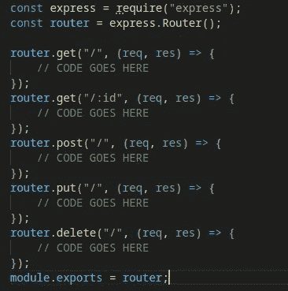
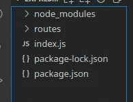

# 尽可能简单地理解 Express.js 中的路由

> 原文：<https://medium.com/nerd-for-tech/understanding-routing-in-express-js-as-simple-as-possible-45b4a852c4a0?source=collection_archive---------0----------------------->

让我们学习如何在 Express 中以一种功能性和高效的方式组织路线，这样我们就可以扩展我们的后端而不会失去理智


众所周知，使用 Express.js 的目的是构建一个可以响应即将到来的请求的 api，所以我们有了*端点* AKA 路由，我们需要拿出逻辑来处理即将到来的对它们的请求

但是我们如何以优雅有序的方式组织我们的文件和文件夹，以便更容易调试和维护呢？

路由对于一个 web 应用程序来说是极其重要的，实际上是最重要的部分，因为如果我们不能构建一个适当的 api 来管理请求，并且能够真正了解这个难题的各个部分，我们最终会得到一个没有开发人员愿意看到的残暴的代码库

想象一个博客

为了便于演示，我们将为一个博客 web 应用程序构建一个虚拟 REST API，因此我们将有以下路径:

1.  用户:通过 id 获取所有用户、添加用户、更新和删除用户的路由
2.  文章:路线做上述，但文章

数据将只是数组中的对象，所以没有什么特别的，这只是为了演示，并试图模拟现实生活中路由可能会变得非常复杂的情况

**快速路由器**

首先让我们探索另一个强大的 express 工具`express.router()`,它是做什么的，它与处理路线的传统 Express 应用程序有什么不同？

路由器帮助我们为我们的应用程序的“部分”编写路由处理程序，所以为用户考虑一个路由器，为文章考虑另一个路由器，也许我们有一个处理支付的路由器？也许是为了团体等

一旦你写好了你的路线，你就可以把它们“导入”到你的条目文件中，也就是 index.js 或者任何你命名的文件

这里有一个路由器外观的快速示例



这样，我们可以分别为后端的每个部分安排我们的路线，我们将看到如何在我们的主文件中使用这些路线，这样我们的主文件将看起来更简单，更有组织

**实施路线**

现在让我们为用户和文章创建路由，也就是为用户和文章创建路由器

创建一个新的文件夹，用命令`mkdir routes`命名为`routes`，然后导航到`cd routes`，这样你的文件结构应该是这样的



首先让我们从用户路由器开始，这是一个非常简单的 CRUD API，文章路由器将非常相似

如果你读过我在 express 上的前一篇文章，代码非常简单，但是让我们简单地分解一下

我们从导入我们需要的包开始，这只是`express`，然后我们初始化我们的`router`

我们创建一个对象数组来表示我们应该存储在虚拟数据库中的数据🤪

然后我们为用户实现基本的路径，也就是数组元素，最后我们使用`module.exports`来导出我们的`router`，这样我们就可以导入并在任何其他文件中使用它

现在让我们实现一些文章路径，以便我们接下来学习如何在我们的主文件中实际使用这些路径

**将我们的路线导入索引。JS**

既然我们已经为我们的用户和文章端点构建了路由，我们需要在我们的服务器中实际使用它们，或者我可以说“注册”这些路由，这非常简单

要在我们的`index.js`中使用这些路由，我们只需导入路由器，并为它们分配如下端点前缀

```
const users = require("./routes/Users");
const articles = require("./routes/Articles");
app.use("/users", users);
app.use("/articles", articles);
```

这意味着每个以`/users`或`/articles`开头的端点请求都将被定向到各自的路由器

例如`http://localhost:3000/users/`、`[http://localhost:3000/users/2](http://localhost:3000/users/2)`、`[http://localhost:3000/articles/1](http://localhost:3000/articles/1)`

因此，如果我们有一个商店，我们完成了一个很好的路由器，我们可以使用`app.use("/shop", shop);`，这样我们的服务器就知道，如果它看到一个以`/shop`开头的请求，它会把它发送到商店路由器

**结论**

`express.router()`是一个非常有用的工具，可以帮助我们在`exoress`应用程序中组织我们的路线，以帮助我们在项目扩展时能够维护项目，在各自的目录中组织路线和中间件文件也是至关重要的，因此我们尽可能地分离关注点，并维护一个有组织的代码库，对于我们和项目负责人来说都很容易使用

我感谢你的时间和兴趣在我的博客，一如既往♥️and 有一个美好的白天/夜晚😊

关注我了解更多编程内容