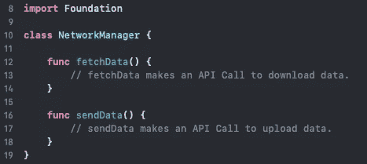
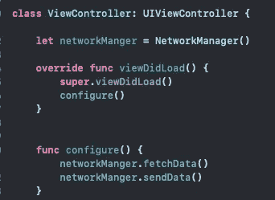
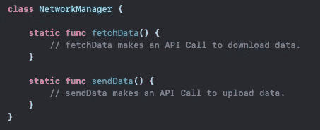
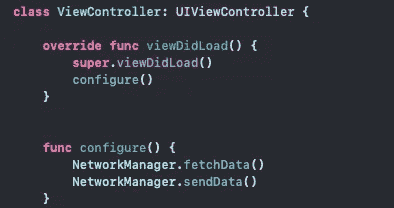
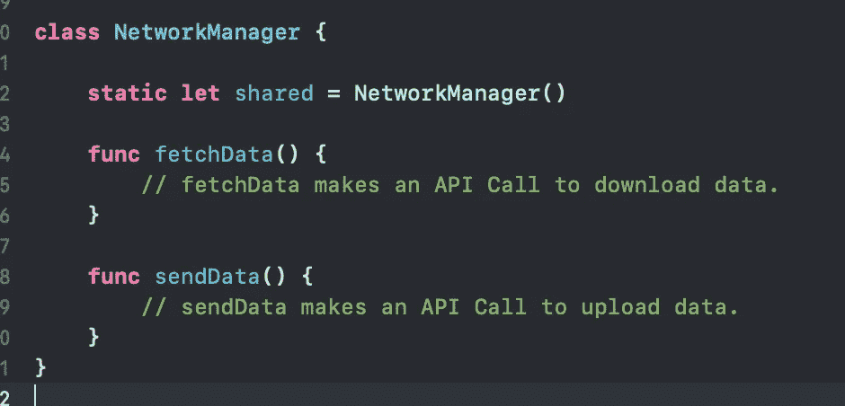
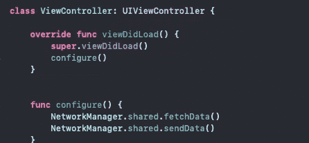

# 理解 Swift 中的静态关键字

> 原文：<https://medium.com/nerd-for-tech/understanding-the-static-keyword-in-swift-ad503f19082d?source=collection_archive---------3----------------------->

萨法尔·萨法罗夫在 [Unsplash](https://unsplash.com/s/photos/coding?utm_source=unsplash&utm_medium=referral&utm_content=creditCopyText) 上拍摄的照片

像 Swift 这样的面向对象编程语言给了我们建模代码来解决问题的能力和灵活性。通过将属性和方法组合在一起，我们能够将代码模块化到定制对象中，以满足任何需求。当构建这些蓝图时，属性和方法被组合在一起以解决特定的任务。

通常，当我们配置一个对象时，它的属性是在实例初始化时设置的。这些属性及其值被设置并与该特定实例相关联。对象的副本可以具有相同的属性或不同的值。只有在内存中创建对象的实例时，才能调用与该对象关联的方法；这在很大程度上满足了大多数情况。

想象一下，我们正在为一个项目制作一个网络层；我们的自定义类将包含从互联网下载一些数据的方法，以及管理进入我们应用程序的数据的其他方法/属性。(在这个例子中，我们将关注网络管理器的配置，而不是任何实际的实现。)

我们的网络管理器有两种下载和发送数据的方法。像任何其他类一样，如果不首先创建一个 NetworkManager 实例，然后调用任何方法，我们就不能简单地调用这些方法。

试图在没有实例的情况下直接调用 NetworkManager 的任何方法会引发错误，指出: ***实例成员“fetchData”不能用于类型“network manager”；您是否打算改用这种类型的值？***

Xcode 在告诉我们什么？嗯，像 fetchData()和 sendData()这样的方法只能在它们是“网络管理器”类型的**值时被调用，换句话说，它们是网络管理器的**实例**的常量或变量。**

我们的网络管理器的方法**仅在我们创建网络管理器的实例时分配到内存中，**创建实例准备我们的对象以供使用。

虽然这肯定很好，但还有更好的方法。想象一下你的设备上最喜欢的应用程序使用互联网连接，在整个代码中，网络调用很可能是在多个地方进行的:通过不同的屏幕、事件等。以这种方式联网会创建多行相同的代码以及内存中要管理的对象。有一个简单的关键词可以解决这个问题。

通过将 **Static** 关键字添加到对象的属性和方法中，我们可以使用它们，而不需要首先创建一个实例。(注意，变量和常量也可以是静态的。)

既然我们的方法已经有了适当的前缀，我们就可以在不创建 NetworkManager 实例的情况下使用它们了。要使用它们，只需在类型上调用并使用点标记来指定方法。

这到底是怎么回事？为什么 Xcode 抛出的错误不是引用值类型？通过将属性和方法声明为静态，Swift **将它们直接分配到对象的内存中，**使其无需实例即可使用。

Static 关键字还允许使用 **Singleton** 模式:Singleton 是引用自身实例的**对象，**通过这样做消除了在整个应用程序中管理多个对象的需要，以及由于不正确的对象引用导致内存泄漏而导致的内存泄漏风险。

我们的 NetworkManger 可以通过添加一个包含 NetworkManger 实例的属性来配置为一个 Singleton。我们将这个属性命名为 shared，这是单例实例命名的惯例。

重要的是要注意，当使用单例模式时，没有必要直接创建任何实例。既然我们的 Singleton 已经设置好了，我们可以从 fetchData()和 sendData()中删除静态关键字了。

现在，为了使用我们的新单例，我们简单地使用点符号来指定我们想要使用网络管理器的共享实例来调用方法

Static 关键字使利用对象属性或方法变得更加容易，而不需要管理实例。在 Singleton 模式中使用 Static 关键字可以通过错误管理类的实例来减少内存泄漏。