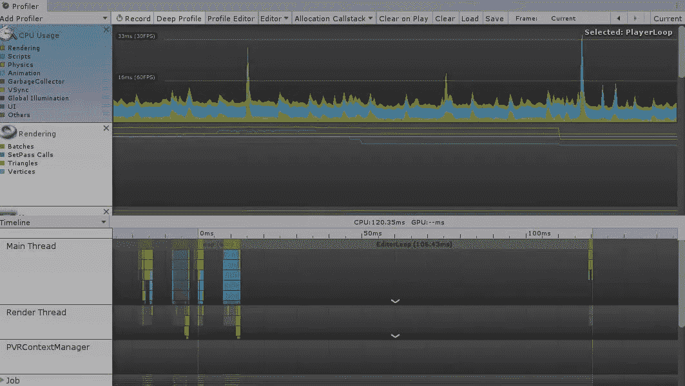
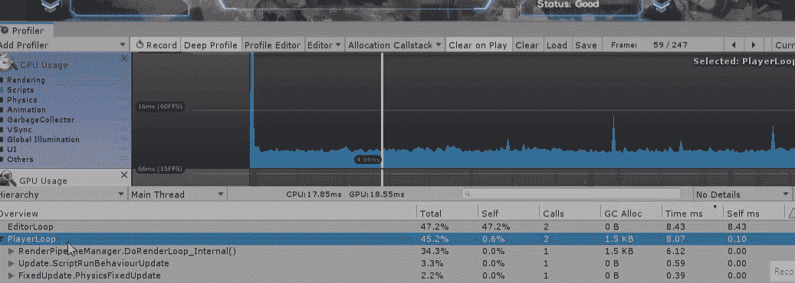

# Unity Profiler 101

> 原文：<https://medium.com/nerd-for-tech/unity-profiler-101-fcfa4ea7ee2?source=collection_archive---------12----------------------->

任何项目的一个非常重要的部分是性能。无论你是完成你的原型还是润色你的游戏，你都需要一种方法来分析它的性能并找出任何性能问题背后的脚本或资产。这就是 Unity Profiler 发挥作用的地方。

> 概观

Unity profiler 是一个获取应用程序性能信息的工具。您可以在编辑器或内部版本中运行该工具，以便在预期的最终设备上测试它。

该分析器收集并显示有关您的脚本，CPU，内存，渲染器，广告音频的信息。它可以帮助您查明代码处理方式、资源渲染方式甚至场景设置等方面的性能问题。

要打开它，进入**窗口** > **分析** > **分析器**

仿形铣床

如果你正在使用编辑器，建议将它停靠在你的游戏视图下，以便在你玩游戏时一帧一帧地查看性能。还建议启用“深度配置文件”和“播放时清除”。这两个选项将允许您从代码深处读取信息，因为此方法会从问题的根源追溯到代码中可能导致问题的方法。此外，如果您在编辑器中，那么建议您禁用“其他”图表，因为它主要用于编辑器。

最后一个建议是将“时间线”改为“层次结构”,以便于阅读信息。

> 如何使用它

在运行时运行应用程序时，分析器将开始收集信息。假设您注意到一个尖峰，点击它，这将暂停您的应用程序并显示信息。

在上面的例子中，播放器循环使用了几乎 45%的 CPU，并且发生了一些垃圾收集。我们深入挖掘循环，发现这是因为 Unity 的渲染器，所以这里没什么好担心的。

就像这样，你可以检查尖峰和 FPS 下降，深入收集的信息，看看问题出在哪里。

在接下来的文章中，我们将介绍一些关于如何提高性能和避免分析器峰值的技巧。