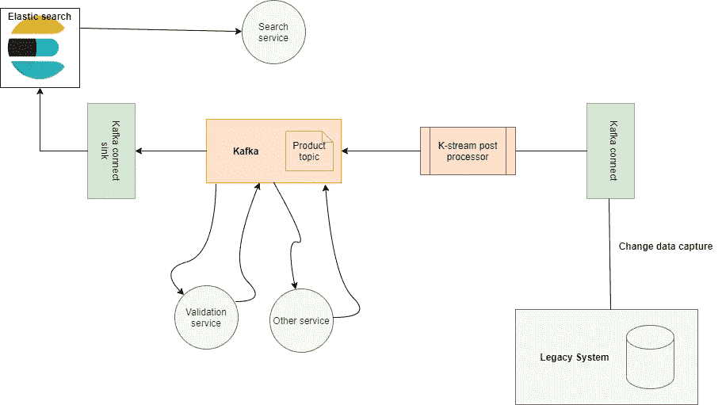

# 利用 CDC 解锁传统系统(Kafka 使用案例)

> 原文：<https://medium.com/nerd-for-tech/unlock-legacy-systems-with-cdc-kafka-use-case-4706c390f17f?source=collection_archive---------5----------------------->

事实上，大多数项目都有一些遗留和新系统的元素，遗留是我们作为软件工程师生活的一部分，可能很难重构或重建这个遗留来与软件中的现代部分集成。遗留下来的问题是，通常有一个很好的理由来摆脱它，最常见的是很难改变。遗留系统中的大多数业务逻辑将包含在它们的数据库中，这意味着无论遗留代码有多糟糕，大多数业务工作流都是在数据库中处理的，因此我们可以从何处以及如何提取事件，以便我们可以允许遗留系统参与到我们的事件驱动架构中。

首先，我将解释软件设计中的 CDC 术语。

正如我们所解释的，关系数据库中捕获的业务事务对于理解业务运营的状态至关重要。由于数据的价值会随着时间的推移而迅速下降，组织需要一种方法来分析生成的数据。为了避免运营数据库中断，公司通常会将数据复制到数据仓库进行分析。传统上，企业使用基于批处理的方法每天移动数据一次或多次。但是，批量移动会带来延迟，并降低组织的运营价值。变更数据捕获(CDC)已经成为将数据从关系数据库(如 SQL Server 或 Postgres)近乎实时地移动到数据仓库、数据湖或其他数据库的理想解决方案。

变更数据捕获是一个软件过程，用于识别和跟踪数据库中数据的变更。CDC 通过在新的数据库事件发生时连续移动和处理数据，提供实时或接近实时的数据移动。

因此，我们的遗留系统的一部分可能允许管理员管理产品目录，我们可以通过将数据集从遗留系统的数据库导入 Kafka 来维护这一功能。然后，产品目录可以用于现代服务，如图表中的验证服务。但我们可能会面临一个问题，即传统系统中的数据并不总是以良好的方式形成，因此要解决这个问题，我们必须添加一个后处理器阶段。我们可以使用 k-stream 来完成这项工作，但一旦转换不复杂，我们就可以使用 Kafka connect 调整并添加数据转换规则，但 K-stream 可以处理简单和复杂的转换。