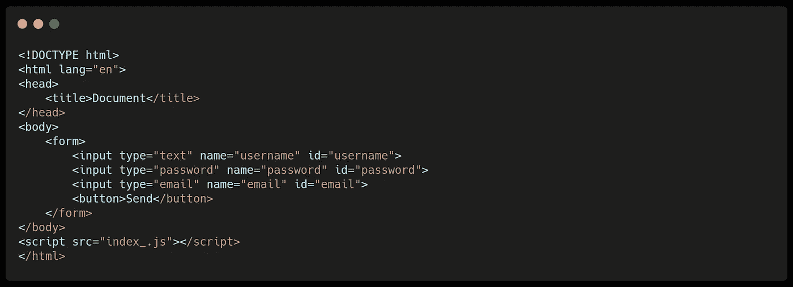
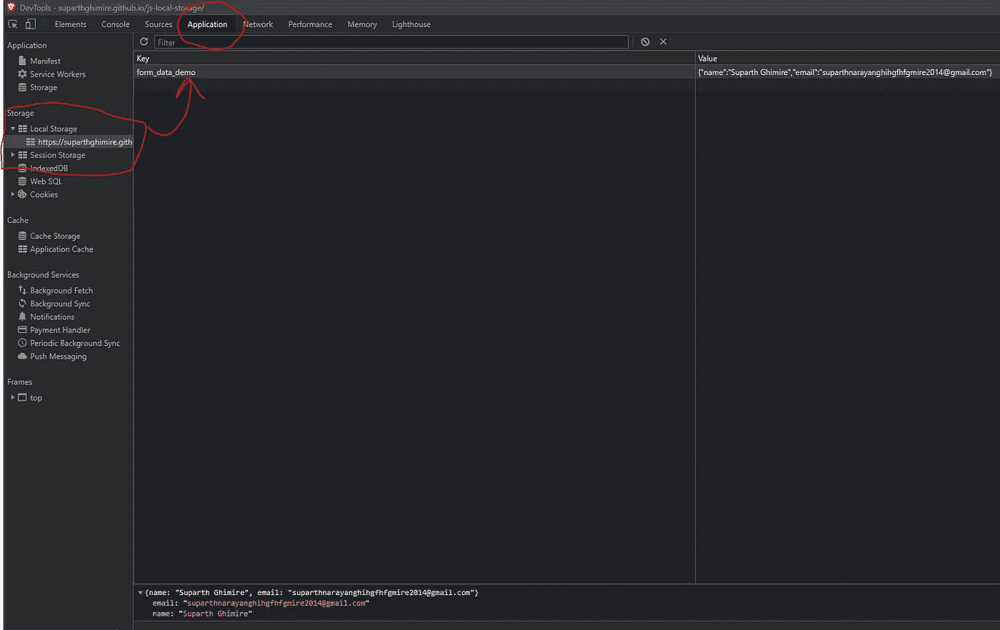

# 使用本地存储而不是数据库。

> 原文：<https://medium.com/nerd-for-tech/use-local-storages-instead-of-databases-96ef48991c68?source=collection_archive---------3----------------------->

是的，这个标题非常令人讨厌，而且可能看起来有误导性，因为本地存储不能取代数据库。然而，在某些情况下，使用本地存储在简化您的工作流程、降低应用程序的复杂性方面对您有很大好处，并且可能是比使用传统数据库更好的选择。

# 但是什么是本地存储呢？

本地存储是由应用程序分配的存储空间，用于在系统本身中存储数据。不一定非得是网络浏览器，但是“本地存储”这个词在网络社区很流行，因为大部分时间你的数据都存储在系统外的云中。

这也可以称为 web 应用程序的缓存机制，以便更快地加载数据。

> 不用担心，默认情况下，本地存储在系统中可以占用的最大空间是 5 MB。

浏览器在本地存储中存储数据的方式有很多种。例如，Google Chrome(任何使用 Chromium 构建的浏览器)将数据存储在子目录中的 SQlite 文件中，这可能会根据您的安装目录和操作系统而有所不同。

# 它们用在哪里？

但是，我听到你问，什么应用程序使用它们？为什么呢？我的意思是，如果它们存储在你的电脑里，它与我不能与他人分享的本地文件有什么不同？

嗯，本地仓库也是出于同样的原因而建造的。它们并不意味着与他人共享(在许多情况下)。让我们看看使用本地存储的领域:

1.  **保存表单数据** 您可能遇到过许多这样的情况，即使页面重新加载，您保存在表单中的数据仍然保留在那里。这是通过将数据存储在 web 浏览器的本地存储中，然后在页面重新加载时再次填充来实现的。[观看演示](https://suparthghimire.github.io/js-local-storage/)
2.  **保存购物车信息
    这是通过将产品保存为本地存储中的对象来实现的，当您返回该网站时，会将该对象缓存回来。[观看演示](https://suparthghimire.github.io/local-storage-cart/)**

还有许多其他使用情形，例如存储 web 令牌(Auth 令牌)，但是将令牌存储在本地存储中被认为是不安全的，因为本地存储可以很容易地被访问，因为它驻留在应用程序的窗口范围内。

# 让我们建造一个！

创建一个在本地存储中存储数据的小项目非常简单。
[查看演示](https://suparthghimire.github.io/js-local-storage/)(表单项目)
[查看演示](https://suparthghimire.github.io/local-storage-cart/)(购物车项目)

我们不会构建项目，而是将重点放在基础上，之后在您的任何项目中实现它们都将像小菜一碟🍰

简单表单的 HTML

在我们研究实现本地存储之前，了解本地存储如何存储数据是很重要的。所有发送到本地存储的数据都以字符串的形式存储。在应用程序编译期间，无论数据类型如何，在执行期间，整数、浮点、布尔值都被解析为“Stringified”字符串，然后存储在本地存储中。这种隐式转换适用于预定义的数据类型，如整数、浮点数或布尔值，但是如果我们打算存储对象和数组，它们应该首先被解析为 JSON 字符串，然后再被存储。
同样，从本地存储器中读取数据时，它们应该被显式地解析成所需的数据类型(例如，从字符串到整数)。对于对象和数组，使用 JSON.parse()方法。

## 将数据存储在本地存储器中。

首先让我们看看在本地存储中存储字符串。简单到只调用 localStorage 对象中的一个方法，即
*local storage . setitem(" key "，<value as string>)*

例如，要将字符串“supath”保存到键“name”，您可以说
localStorage.setItem("name "，" supath ")；

这将把“Suparth”保存到本地存储中一个名为“name”的项中。

使用 dev 工具，您实际上可以看到特定网站的键值对和存储在浏览器本地存储中的内容。
如果您转到开发工具的应用程序选项卡，侧面的子菜单有一个名为**存储**的名称，如果您展开它，您将看到本地存储作为一个选项，然后可以展开它，您将能够查看您或其他网站可能已经存储的数据。

用于查看本地存储中数据的开发工具

**将对象和数组** 存储为数组在 JavaScript 中也是对象，存储这两者的方法即使不相似也是一样的。我们调用 JSON.stringify( <变量>)方法将对象/数组转换为字符串，然后存储。
举例:

将数组和对象存储到本地存储

## **从本地存储器获取项目**

这甚至比储存物品更简单！用您的键的名称作为参数调用 localStrorage 对象上的方法 getItem，可以得到字符串形式的数据。如果存储的数据是一个字符串，这没问题，但是如果我们希望数据是一个整数，那么我们必须在获取数据后显式调用 parseInt。
示例:
*let data = parse int(local storage . getitem(" age "))；
console.log(数据)；*

**获取对象和数组** 现在，由于数组的行为类似于 JavaScript 中的对象，因此可以使用 JSON.parse()方法从 JSON 字符串中将它们解析为普通对象。

例子

## 从本地存储中删除项目

使用 local storage 方法中的“removeItem(key)”从本地存储中移除项。

示例:
local storage . remove item(" object ")；
local storage . remove item(" array ")；

**清除本地存储** 如果您希望清除本地存储，您可以使用 clear()方法，该方法将删除存储在本地存储中的所有键值对。

示例:
*local storage . clear()；*

就是这个！您已经成功地在应用程序中实现了 localStorage system！现在一个挑战，创建一个电子商务网站的产品页面和购物车页面。如果有人将物品添加到购物车中，则将该物品保存到本地存储，并在下次访问您的网站时再次获取这些物品。你可以添加额外的功能，如选择从购物车中删除项目！如果你真的做了一个，请在下面的项目链接下留言！

非常感谢您阅读文章！如果其中的任何部分让你困惑，你可以[发电子邮件](mailto:suparthnarayanghimire2014@gmail.com)给我，甚至在评论中提问！！！！

注销！！再见！✌✌