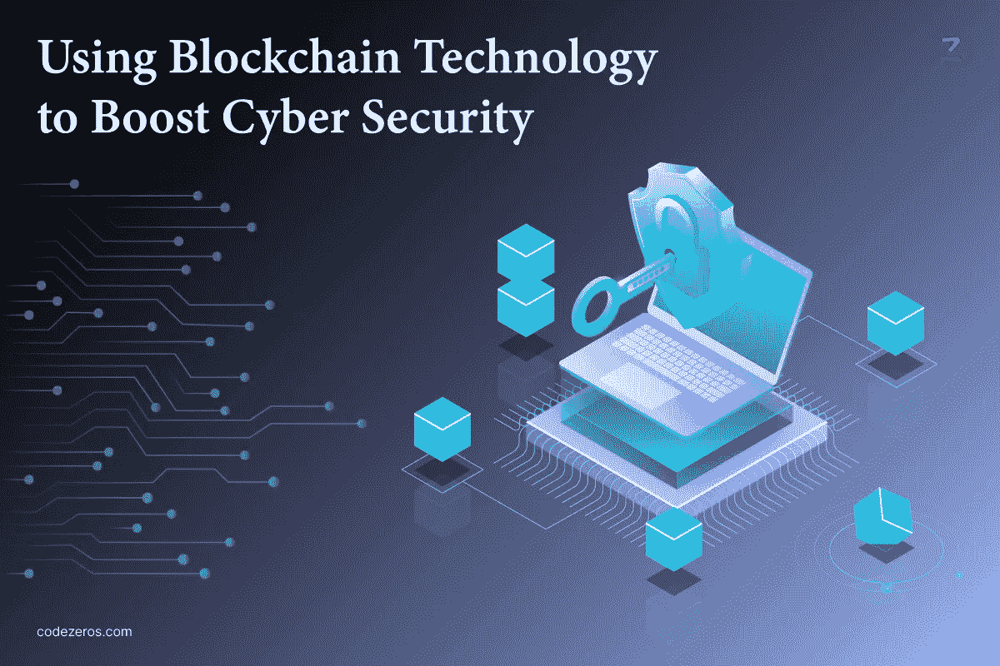

# 利用区块链技术提升网络安全

> 原文：<https://medium.com/nerd-for-tech/using-blockchain-technology-to-boost-cyber-security-6266ebbad113?source=collection_archive---------3----------------------->

在超连接时代，非线性连接定义了我们的世界。安全和隐私问题是当今世界最大的麻烦。黑客行为变得越来越老练和复杂，而安全功能通常会滞后。然而， [**区块链科技**](https://www.codezeros.com/) 凭借其密不透风的链条结构，有能力提升跨行业的网络安全。

在本文中，我们将探讨区块链技术如何帮助提高网络安全。

## **区块链的发射台**

最初，区块链旨在帮助以安全的方式发送和接收比特币。随着时间的推移，它已经对 20 多个行业的现实世界应用产生了全球性影响，从金融科技到制药和土地注册到 [**供应链管理**](https://www.codezeros.com/industry/supply-chain) 。无论在哪里使用，区块链的主要目标一直是改善安全。

## 区块链如何提高安全性？

区块链使用 [**去中心化账本系统(DLT)**](https://www.codezeros.com/services/new-dlt-creation) 在数据防篡改的公共服务器上记录和维护交易。在交易被记录在区块链上之前，网络的参与者集体验证交易。因此，区块链建立在三个支柱之上:1)权力下放，2)透明度，3)不变性。

数据点被分组为块，然后每个块被分配一个哈希值。该散列值存储在后续块中，然后下一个块具有该后续块的值。这个循环继续形成一连串本质上不变的区块。需要在每个数据块中对数据进行任何更改，这将触发网络参与者可以轻松检测到的违规行为。真正的更新可以通过添加新块来实现。因此，区块链也有助于记录保存，以前的版本可以与新版本进行比较，以了解变化和检测错误或损坏。因此，所有这三个支柱都作为附件来促进整个网络的安全。

## 共享数据访问

所有参与者都将整个区块链的数据存储在他们的计算机上，并可以实时访问。因此，每个参与者都可以看到变化，恶意或错误的交易，甚至是黑客进行的交易，都可以被识别和排除。没有中央权威，但参与者之间有共同的责任，只让真正的交易通过。

## 数据失窃

在中央服务器系统中，黑客可以控制服务器并删除文件以破坏数据。有了 DLT，这将变成一项不可能完成的任务，因为数据存储在大量参与者之间。拥有更多节点的更大的区块链遭受这种攻击的风险越来越低，拿下整个区块链是一项不可能的任务。

区块链的这种复杂结构有助于保护数据共享和存储。因此，区块链现在被许多企业用来防止欺诈和维护数据的完整性。当涉及到存储用户的个人数据，如支付细节和卡号时，这变得更加重要。

## 拒绝服务(DoS)攻击

拒绝服务或 DoS 攻击意在关闭网络，使其用户无法访问。有几种方法可以做到这一点，如增加流量超过网络的能力或发送过多的垃圾请求。这种活动会导致网络行为不当并暂时关闭。DoS 攻击已经影响了一些最大的互联网公司，如 Twitter 和 Spotify。

目前，由于域名系统(DNS)的存在，DoS 攻击变得很困难。DNS 的功能就像互联网上的电话簿，并且用机器可读的 IP 地址来映射域。但除了通常的金融科技应用，区块链技术的创新用途包括创造一个安全的互联网空间。DNS 只是部分去中心化，实现区块链技术可以完全去中心化。区块链将把内容分布在黑客无法攻击的大量节点上。

最突出的例子是一家名为 Blockstack 的公司，该公司旨在消除所有第三方对 web 服务的管理，旨在使整个万维网去中心化。Mindsafe 也有类似的理念，让网络成为一个更安全的空间。他们通过创建一个可供选择的互联网来实现这一点，在这个互联网上，用户可以在一个安全的环境中做他们通常在网上做的事情。Mindsafe 要求用户提交他们存储空间的一部分，并以 safecoin(虚拟令牌)的形式获得补偿。每个文件都被加密、分割并存储在不同的计算机中，只有文件的所有者才能访问它们。

## 最后的想法

毫无疑问，随着技术的进步和更多人加入互联网，将会有更新的方法来黑客攻击和窃取数据。因此，更重要的是，我们要让自己熟悉像区块链这样的动态技术，它不仅能解决当前的问题，还能周期性地改变以解决未来的问题。区块链可以为其安全和数据管理需求与任何业务进行整合，没有比现在更好的时机了！