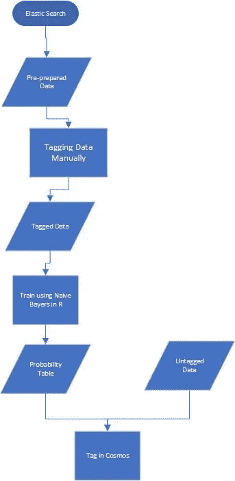

# 使用朴素贝叶斯提高客户满意度

> 原文：<https://medium.com/nerd-for-tech/using-na%C3%AFve-bayes-to-improve-customer-satisfaction-514fc9429a03?source=collection_archive---------11----------------------->

一家公司正在为数百万客户提供企业服务。然而，转向竞争对手的客户数量一直在增加，这导致每月损失超过 80，000 美元，预计一年损失约 3，000，000 美元。我们面临的问题是，没有一种简单的方法来接近这么多的客户，以了解他们转向其他服务背后的原因。

我是受影响的一项服务的开发团队经理，我决定深入调查客户转向竞争对手的原因，并找到解决方案，重新赢得客户的满意度。在彻底调查了与客户的所有沟通渠道后，我决定将重点放在支持电话上。支持呼叫中心接收需要帮助的客户的支持电话。客户为每个支持电话平均每小时支付约 500 美元。我意识到，如果客户必须每小时支付 500 美元来获得支持，那么这一定是客户最痛苦的地方。这一通话成本如此之高的原因是，问题的解决需要经历漫长的过程。首先，支持工程师将接听电话，并使用特殊工具记录每个支持案例。在这个工具中，他们用自由文本格式写笔记。如果第一级支持无法解决问题，他们会将其移交给另一个部门(第 2 级),然后由该部门与开发部门合作解决问题。然而，这个解决问题的过程需要很长时间。解决一个问题所花费的时间以平均 MTTR(解决问题的平均时间)来衡量。平均 MTTR 非常高，由于系统的复杂性，解决这个问题需要几个月的时间。虽然这些数据非常有价值，但是它没有集成到开发团队的优先级列表中，因为对于适当的团队来说，很难将它们组织和分类到 bug 中。

我从包含客户支持注释的数据库中收集了所有数据，但是数据库太大太复杂，无法手动分析，也无法通读注释来理解 bug。因此，我创建了一个机器学习模型来扫描笔记，并将它们聚类到不同组件的桶中。首先，我将数据添加到 Elasticsearch 中，以便能够查找与每项服务相关的单词和句子。数据在键/值对中进行索引，其中键是案例 ID，值是来自支持工程师的自由文本注释。我搜索了与其中一项服务相关的常见句子。之后，我手动扫描数据以确保它属于这个服务，然后用服务名标记反馈。我使用 NLP(自然语言编程)模型将数据组织成单词和句子。该模型为句子添加了权重和标签，以便使用它们来训练一个简单的机器学习模型(nave Bayes)，该模型可以将输出分类到适当的服务中。使用这个机器学习模型，我能够将支持案例分类成组，然后分配给正确的开发团队。因此，我能够使用原型找到并解决许多问题。从原型中获得成功的结果后，我和我的团队一起设计并实现了所有服务的整个流程的自动化。在新的自动化中，我们使用了更先进的机器学习模型来对问题进行分类，并将错误自动归入正确的组。

该系统的一些成果包括减少了 50%的 MTTR，每月为公司节省超过 18，000 美元的劳动力。此外，自动化减少了 20%的支持呼叫，每月为客户节省了数十万美元，这将客户升级到最新版本的比例提高了 60%，而不是转向竞争对手。最后，我能够将客户满意度提高 30%，这是通过一个名为净推广者分数(NPS)的标准分数来衡量的。

这一经历教会了我要跳出框框思考，寻找最佳解决方案来满足我们的客户。这个项目很好地展示了如何利用创新和技术来造福公司和满足客户。

**全 R 脚本**

#安装 NaiveBayes 包 e1071 并将其加载到库中

install.packages("e1071 ")

图书馆(e1071)

#安装机器学习平台包

install.packages("mlbench ")

图书馆(mlbench)

#加载 Excel 库，从 Excel 文件中读取训练数据

库(readxl)

tagedTrainingData

#查看前六个项目

主管(tagedTrainingData)

#将数据分为测试和培训

set.seed(1972) #随机种子

tagedTrainingData . split

tagedTrainingData . train

tagedTrainingData . test

视图(tagedTrainingData.test)

视图(tagedTrainingData.train)

#从 e1071 包中调用 Naieve Bayes 方法

#响应变量~预测变量

#波浪号读作“建模为的函数。”

# data:是训练数据集

#分配给名为 nb_model 的变量

# nbc_model = "Naive Bays 分类器使用反馈来预测标签

nb_model

#检查分类器

nb _ 模型

摘要(nb_model)

nb _ test _ predict

#混淆矩阵

表(pred=nb_test_predict，true = tagedtrainingdata . test $ Tag)

作者:

 [## 兰尼·埃尔豪斯尼，PhDᴬᴮᴰ -软件工程高级经理- Zulily | LinkedIn

### 𝙈𝙞𝙘𝙧𝙤𝙨𝙚𝙧𝙫𝙞𝙘𝙚𝙨解决方案架构师𝘼𝙒𝙎𝙎𝙤𝙡𝙪𝙩𝙞𝙤𝙣𝙨𝘼𝙧𝙘𝙝𝙞𝙩𝙚𝙘𝙩𝘾𝙚𝙧𝙩𝙞𝙛𝙞𝙚𝙙…

www.linkedin.com](https://www.linkedin.com/in/ranyelhousieny/)