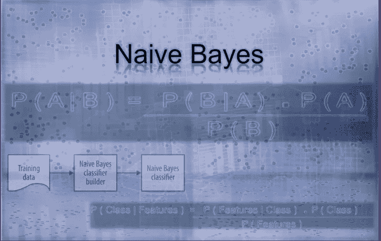

# 使用朴素贝叶斯进行机器学习

> 原文：<https://medium.com/nerd-for-tech/using-naive-bayes-for-machine-learning-9c42cb285830?source=collection_archive---------6----------------------->

图片来源:作者

在我开始之前，让我问你一个问题:什么是机器学习，为什么它会成为这样一个时髦词？机器学习的核心是“预测的艺术”都是基于过去的事实来预测未来。这是一个与数据、技术或计算能力无关的目标的行话。

简直就是人的心理问题！是啊，我们人类不是一直在思考未来吗？此外，我们生活在数字时代，精确的数据驱动预测是可能的。这就是[机器学习](https://www.cogitotech.com/)的精髓。预测的有用性由两个因素决定:准确性和多早做出预测。如果你能以 99%的准确率预测到降雨，这并不重要；如果你只能在第一次洒水之前马上做，那就没有意义了！！另一方面，如果你预测一周会下雨，但只有 10%的可能性会下雨，那也不理想！

因此，实现时间和精度的正确组合对于预测艺术来说非常重要。总的来说，获得正确的早期预测需要大量的直觉，因为它们没有“先前数据”的优势。早期的估计并不是基于数据。

考虑以下场景:您试图根据过去两年中实际“雨天”前七天的气象数据来预测未来一周是否会下雨。如果你试图用这些数据做一个预测，并且有 70%的正确率，会有什么突然的变化？毕竟，这是历史信息。你会试图找出上次出了什么问题，考虑影响天气状况的关键因素，并在下次生成更准确的预测。

如果提供了额外的信息，贝叶斯技术可以推翻先前的概率。我们将在下一节中更详细地讨论这一点。

# 概率论是一个机会与概率的游戏

知道过去发生了什么不仅至关重要；了解这种情况在未来再次发生的可能性也很重要。随机性对可能性是概率论的中心主题(我希望这有意义！).简而言之，它计算事件在随机空间中发生的概率。

如果我掷一枚硬币，期望“正面”，假设“掷硬币的行为”是公正的(一枚公平的或无偏见的硬币有相同的概率得到正面或反面)，那么我的期望有 50%或 12%的机会得到满足。这种公平的假设被归结为随机性，我的概率就是与期望相匹配的可能性。

让我们看看另一个经典的掷骰子场景。如果我掷骰子，我得到“4”的机会有多大？它被度量为(预期结果/可能性总数)，即 1/6，也就是说，在总共 6 个潜在结果中，我们预期 4 个中的一个特定结果。所有可能出现的事件都包含在样本空间中。概率总是用百分比或 0 到 1 之间的数字来表示，这取决于具体情况。离散或连续变量可以用来表示概率。

# 那么，数学是如何工作的呢？——朴素贝叶斯定理

在讨论贝叶斯定理之前，我们需要了解几个(更多！)概率的基本概念。首先，在上面的例子中，我们正在计算硬币正面朝上和骰子正面朝上的概率。这叫做联合概率。还有两种其他类型的概率。

一个是条件概率，评估骰子落在 4 点时正面的可能性。最后，使用边际概率来计算某些结果的可能性，例如只有硬币或只有骰子的概率。

这是贝叶斯定理(以托马斯·贝叶斯牧师 1702-1761 命名)的基础。让我们来看看如何:

它断言，如果我们知道给定 A 的 B 的条件概率和 B 的概率，我们就可以计算出给定 A 的 B 对于两个事件 A 和 B 的概率。

下面用一种简单的方法解释贝叶斯法则。目标是找出一个新发现的点是什么色调。

因为绿色物体的数量是红色物体的两倍，所以合乎逻辑的假设是一个新的例子(以前没有被发现)属于绿色的可能性是两倍。这种信念在贝叶斯分析中被称为先验概率。先验概率通常用于在事件发生前预测事件，并且基于经验，在本例中是绿色和红色项目的百分比。

# 不同类型的朴素贝叶斯算法

1.**高斯朴素贝叶斯:**当特征值在性质上是连续的时，假设与每一类相关联的值是按照高斯分布分散的，这种分布就是正态分布。

2.**多项朴素贝叶斯:**在多项分布数据上，多项朴素贝叶斯是首选。它通常在 NLP 中用于文本分类。一个单词在文档中的存在是由文本分类中的每个事件决定的。

3.**伯努利朴素贝叶斯:**当数据按照多元伯努利分布分布时，采用伯努利朴素贝叶斯。也就是说，存在几个特征，但每个特征都被认为具有二进制值。因此，需要二进制值特征。

# 贝叶斯主义:概率隧道尽头的一线希望！

贝叶斯定理不仅仅是一个条件概率定理。大多数贝叶斯定理的例子是基于临床检查。

让我们看一个银行欺诈/贷款违约的场景。假设你是一名银行基金经理，对某个从银行借了一大笔钱的客户感到怀疑。现在你想知道客户是否会拖欠贷款。作为初步检查，你看客户的信用评分，看看是否有违约风险(PD)。如你所见，客户的 PD 为 0.99。所以你得出结论，客户有 99%的贷款违约风险，你很惊讶！放松…这个故事还有更多…你需要一些贝叶斯观点！

现在，如果你仔细观察，你会发现在当前情况下，贷款违约的可能性与绿色标记的问题密切相关。是的，他之前违约过几次，违约率是多少？这也是在该空间中需要收集的最重要的信息。

让我们假设消费者有一个可靠的记录，但是你的银行系统把他描绘成有一个高 PD。根据客户的背景调查，他有 0.1%的贷款违约概率或 1/1000 的可能性。所以，如果你算一下，你会发现有 9%的违约风险！！哇，那还不算太寒酸！

然而，如果没有足够的证据支持的话,“贝叶斯”是有偏见的。考虑一下，如果随着收集的客户信息越来越多，绿色条的数量增加，会发生什么情况。违约风险随之上升，这难道不是自然而然的事情吗？

所以，理论上，贝叶斯“陷阱”就是这样！！并非所有闪光的东西都是金子。要获得合适的观点，问三个基本问题:

**1。你最后一次看到金色闪光是什么时候？**

**2。如果有闪光，这种金属是黄金的可能性有多大？**

**3。虽然金属是黄金，但火花不可见的可能性有多大？**

希望你已经想明白了！如果你提交更多的历史数据，预测将会改变！

# 结论

所以，我希望你已经对[朴素贝叶斯分类器](https://cogitotech.medium.com/what-is-classification-in-machine-learning-5bf729e5f748)有了坚实的理解，我强烈鼓励你利用这篇文章中提供的工具来设计自己的分类器。本文应该已经为您提供了对分类器的一个相当好的概念性理解，允许您使用新发现的知识创建分类器。