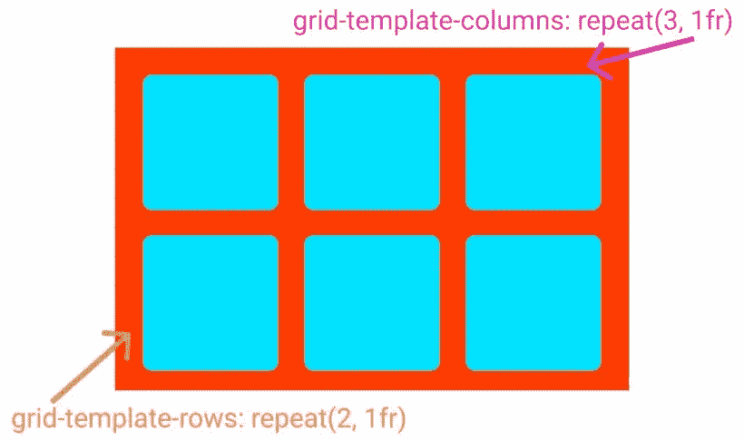
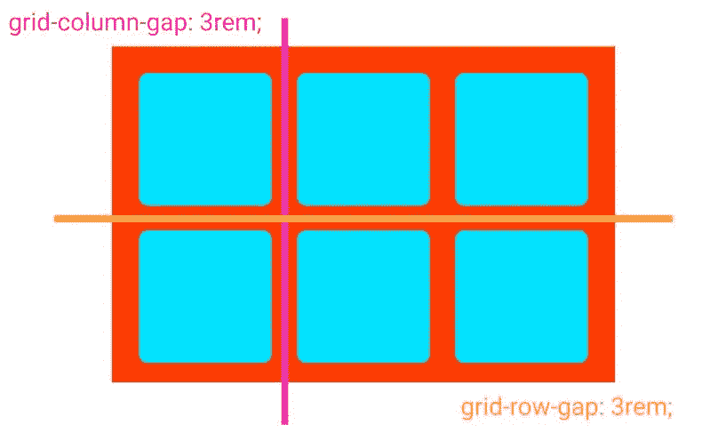
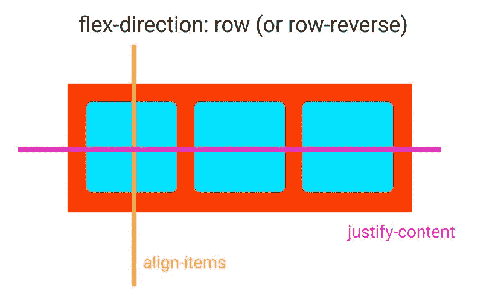
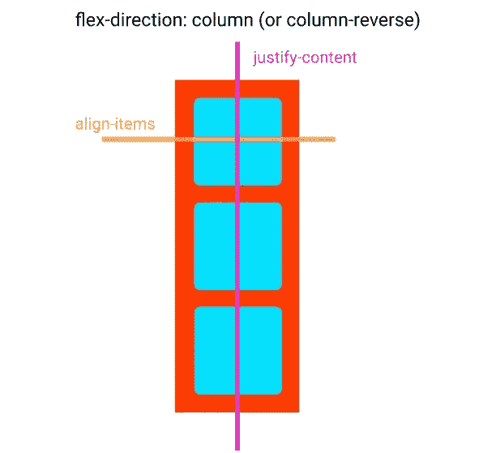
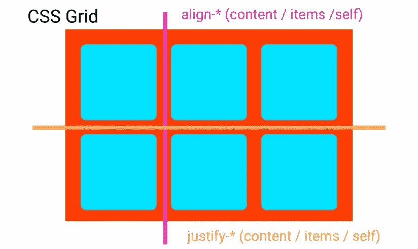
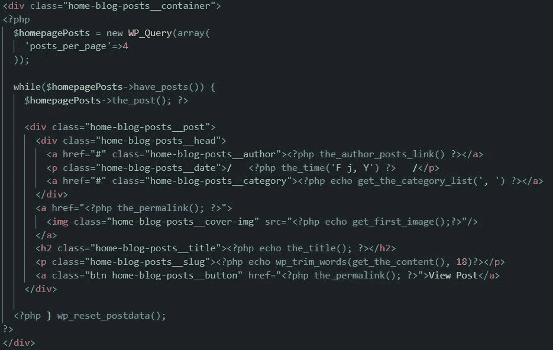
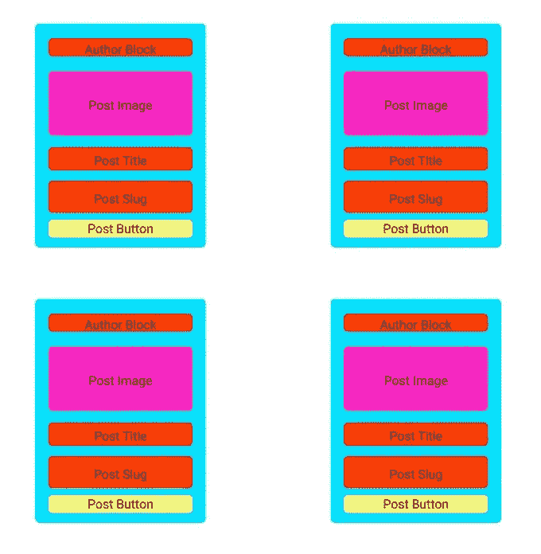
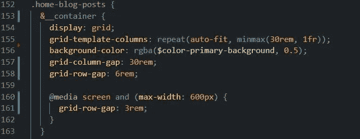
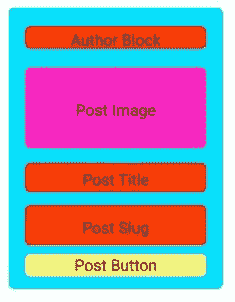
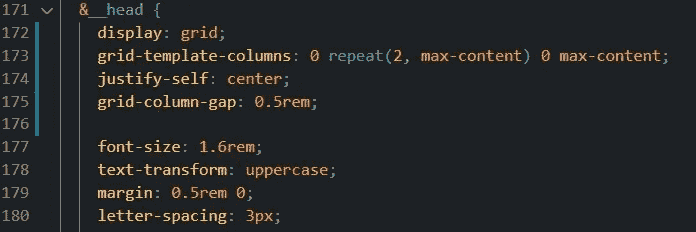

# 使用 PHP 和 CSS 网格创建一个最近文章部分

> 原文：<https://medium.com/nerd-for-tech/using-php-and-css-grid-to-create-a-recent-articles-section-2b0d45c2adfb?source=collection_archive---------3----------------------->

用 CSS 设计网站和应用程序时，我最喜欢的一个东西是 Flexbox。它是如此直观和强大，允许项目的精确定位和对齐，而不需要在绝对定位、浮动或顶部/左侧等方面花费精力。价值观。我使用 Flexbox 的唯一缺点是它是一个 1D 风格的工具。

我最近在和一个客户合作一个完整的 WordPress 主题构建。他们想建立一个博客和生活网站。在和这个客户一起回顾线框模型的时候，我们看到了一个专门展示最近文章的区域。这是一个 2 x 2 的网格，显示了她最近发布的四个项目。

我的自然反应是去找 Flexbox，用一套一维容器来存放一套物品。这对于样式来说是有效的，但是并没有使编写 PHP 循环来检索和显示文章变得容易。我必须使用不同的工具。

在这一点上，我知道我将不得不使用 2D 工具，即 CSS 网格。虽然 CSS Grid 并不是一个很难学习的样式工具，但是由于 Flexbox 在样式方面提供的覆盖范围，我一直忽略了它。在我们开始讨论我是如何为这个特性实现 CSS 网格的之前，让我们先来看看 CSS 网格的基础知识。

CSS 网格有什么好处？

这个问题的简短答案是很多。在 Flexbox 和 CSS Grid 出现之前，web 开发人员依靠 floats 和 clear-fix 等工具来控制页面布局。除了必须拼凑属性之外，这种方法还使得为不同设备设置和维护响应变得非常困难。输入 Flexbox 和 CSS 网格。

Flexbox 适合一维布局，而 CSS Grid 适合二维布局。如果你正试图决定哪一个是你的网站或应用程序的最佳工具，试试看你是否能在你的线框中画一条穿过所有元素的线。如果你能成功地用一条直线连接所有元素，那么 Flexbox 应该可以工作。如果你不得不在不同的方向画多条线，CSS Grid 可能更适合你。

虽然这是确定一项工作是面向 Flexbox 还是 CSS 网格的一个很好的经验法则，但我发现很多可以用 Flexbox 完成的工作也可以用 CSS 网格来完成。我发现用 CSS Grid 设计一组特别简单的部分是导航条和页脚。之前，我会使用:not(:last-child)选择器来分隔 navbar 或页脚中的元素，但使用 grid-column-gap，只需使用 grid-gap 就可以更简单地在元素之间插入空格！

web 开发中的任何特性都需要考虑浏览器兼容性。CSS Grid 提供了很好的浏览器覆盖率，现在几乎 95.5%的浏览器都支持它！如果你还在使用 floats，CSS Grid 是一个可以极大改善你的开发体验的工具。

**CSS 网格如何工作**

这一切都始于一个容器和“显示:网格”。就像 Flexbox 一样，CSS Grid 专注于容器和遵循容器方向的子元素的概念。在容器元素的类中，您设置了 4 个重要的属性:

1) Display: grid(这让您的浏览器知道这个元素是 CSS 网格元素)

2)网格-模板-行(这定义了网格的行布局，即有多少行和多大)

3)网格-模板-列(这定义了网格的列布局，即有多少列及其大小)

4) Grid-gap(这是一个同时设置列和行间距的简写属性)

这四个属性对于布局非常重要，因为它们让浏览器知道你正在使用 CSS Grid，并且定义你的列和行布局以及轨道之间的间距。仅用这四行代码，您的子元素就会很好地就位。但是，要使用位置和跨度进行更高级的样式设置，您需要以单个元素为目标。

图一。定义网格行和网格列

如上图所示，如果我们将橙色容器元素的 display 设置为 grid，然后将 grid-template-rows 和 grid-template-columns 设置为它们的指定值，我们将得到上面的网格，减去网格间隙。

图二。设置行和列之间的网格间距

要获得网格间距，我们可以使用网格-行-间距和网格-列间距来分别设置我们的行间距和列间距。为了更简洁，我们可以使用 grid-gap 属性同时设置两者。

对于更复杂的布局，您可以根据网格轨迹编号设置精确的元素位置，并定义元素将跨越多少列或多少行。这就是像网格行和网格列这样的东西发挥作用的地方。为了方便媒体查询和常规布局，您甚至可以在定义行和列布局时为不同的列和行设置名称。这些主题，以及隐式和显式的布局，可以跨越多篇文章，所以在结束这一节之前，我想看看如何用网格定位内容。

与 Flexbox 非常相似，CSS Grid 允许我们在网格内部对齐项目。这是通过两组属性完成的:justify 和 align。在 Flexbox 中，justify-content 用于沿主轴对齐项目，而 align-items 用于沿次轴对齐项目。

图 3。行柔性方向的柔性盒对齐

这里我们看到一个 flex-direction 设置为 row 的 Flexbox 容器。Justify-content 控制子元素在 x 轴上的显示方式，而 align-items 控制 y 轴。在下一张图中，flex-direction 被设置为 column，这就变得令人困惑了。此处轴翻转为对齐内容控制 y 轴，对齐项目控制 x 轴:

图 4。柔性盒对齐，柔性方向设置为列

Flexbox 对齐可能看起来令人困惑。幸运的是，CSS Grid 不需要用户跟踪 flex 的方向。Justify 将始终控制 x 方向，align 将始终控制 y 方向。“对齐”和“对齐”都有三个特定的子属性，用于定位整个容器、特定的一组项目或特定的项目。

图 5。CSS 网格对齐方向

Justify-content 将控制项目相对于容器元素的显示方式。Justify-items 将控制多个项目如何相对于它们自己的网格元素进行定位，justify-self 将把单个项目定位在它们的网格元素中。这有很多内容需要理解，但是如果您想更深入地学习 CSS Grid，请查看我的参考资料部分中的链接。

**使用 CSS 网格样式化 PHP 循环**

现在我们已经有了 CSS 网格的基础，让我们看看如何解决我们的现实世界的例子。我为客户设计的目标是在他们的主页上为他们最近的 4 篇文章创建一个 2 x 2 的网格显示。为此，我将使用 PHP while 循环和内置的 WordPress 查询方法来检索最后四篇文章。

PHP 看起来像这样:

图 6。用于检索和显示帖子的 PHP 循环

正如你所看到的，我们打开一个 PHP 标签，查询我们的 SQL 数据库，创建一个数组，其中包含我们之前的 4 篇文章。从那里，我们运行一个 while 循环，循环遍历我们的每篇文章，并在我们的博客文章部分创建博客文章标记。

在我们的 HTML 元素中，我们调用文章的各种属性。从封面图片和一段文字到作者页面的链接。由于返回信息的性质，我编写了几个过滤函数，允许我对返回的元素应用样式，但这超出了本文的范围。

现在我们有了 PHP 和 HMTL 标记，我们将如何设计这一部分的样式呢？我们想使用 CSS 网格。我已经做了一个我们的目标模型:

图 7。博客文章部分模型

为了得到这个布局，我们将嵌套多个网格。我们的第一个网格将是包含我们想要显示的四篇文章的网格。分配属性和值的代码块如下:

图 8。SCSS 主要员额科

我们做的第一件事是设置显示为网格。之后就变得有趣了。我们只关心设置这个部分的列，因为行将由可用的屏幕宽度隐式定义。在这里，您可以看到我们使用了一个新的 grid-template-columns 属性 repeat，它接受一个数量(或者在我们的例子中为 auto-fit)和一个维度(或者 minmax 函数),并定义了布局。

在上面的例子中，我们使用了 grid-template-columns: repeat(3，1fr ),它创建了 3 个列，每个列都是视图宽度的 1/2。因为都得到相同的空间，所以都会得到 33.333%的屏幕。这里我们不确定我们有多少列，但是希望它们能够响应，所以我们使用了 auto-fit 值。这将告诉浏览器在一行中容纳尽可能多的列。因为我们没有指定行，所以它们将被隐式地布局，它们的数量和大小完全取决于列的规格和屏幕宽度。

我们还使用了 minmax 属性。这允许我们输入列可以占用的最大大小以及最小大小。通过这样做，我们为我们的柱子宽度创建了一个范围，这使得设计更具响应性。最后，我们设置网格-列-间隙和网格-行-间隙，以便在支柱元素之间提供一点间距。

在这个 home-blog-posts _ _ 容器部分中，我们为四篇文章提供了四个嵌套的网格。这些都有自己的布局:

图 9。后网格模型

这些帖子的布局非常简单。我们定义了一个包含 4 列的 repeat，每一列的高度都是最小内容。这会将行的大小值设置为内容大小的最小部分，这将确保所有或我们的内容在每个文章部分行中都可见:

图 10。SCSS 邮报

我想展示的最后一项是作者块样式。如前所述，CSS Grid 主要是一个 2D 布局工具，而 Flexbox 非常适合 1D 布局。然而，有时 CSS Grid 是一个很好的选择，这正是我设计作者块时发生的情况:

图 11。作者布洛克·SCSS

我最初是用 Flexbox 设计的，除了最后一个值之外，每个值都设置了左边距。然而，在写这篇文章的时候，我决定用 CSS Grid 来重构它。为了替换 left-margin 属性，我使用了 grid-column-gap，效果非常好。

如果您查看 grid-template-columns，您可能会奇怪为什么有设置为 0 的列。在这一节中，我使用了 WordPress 函数来检索作者和类别的链接。这些不是字符串，而是锚标记。因此，我的作者块包含了五个而不是三个子元素。为了解决由此导致的格式问题，我将两个空的 link 元素列设置为 0，然后将另外三个列设置为 max-content，以确保它们占据屏幕的最大宽度。

本节的其他 CSS 相当普通，所以我不会深入讨论。

**CSS 网格的后续步骤**

最终的结果非常好！我添加了一些媒体查询，但 CSS Grid 的美妙之处在于，通过正确使用诸如 minmax 和 auto-fit 之类的属性，可以大大减少对媒体查询的需求。

如果你有兴趣更深入地学习 CSS 网格或 Flexbox，Jonas Schmedtmann 在 Udemy 上有一个很棒的课程，涵盖了高级 CSS、SCSS、Flexbox、CSS 网格等等。链接在下面的参考资料中。我强烈推荐它，不，这不是赞助，他的课程就是那么好。如果你已经使用或者打算在你的下一个项目中使用 CSS Grid，请在下面留下你的评论！

**资源**

https://www.udemy.com/course/advanced-css-and-sass/

【https://caniuse.com/?search=css%20grid 