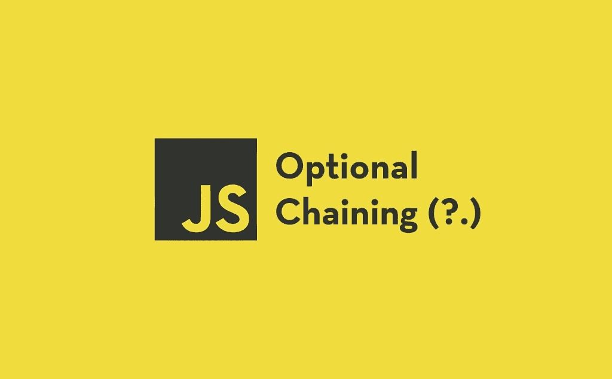

# 在 JavaScript 中使用可选的链接操作符

> 原文：<https://medium.com/nerd-for-tech/using-the-optional-chaining-operator-in-javascript-aa56d19acef7?source=collection_archive---------9----------------------->



有时，您会遇到一个极大地改变您编写方式的 JavaScript 特性。对我来说，析构、箭头函数、模块是其中的一些特征。可选链接将是我的下一个目标。

可选链接在 ES2020 提案的第 4 阶段，因此应添加到规范中。它改变了访问对象内部属性的方式，尤其是深度嵌套的属性。它也是 TypeScript 3.7+中的一项功能。

# 挑战

我很确定你在 JavaScript 中遇到过空的和未定义的属性。这种语言的动态本质使得我们不可能不碰到它们。特别是在处理嵌套对象时，下面这段代码很常见:

```
if (data && data.children && data.children[0] && data.children[0].name) {
    // I have a name!
}
```

上面这段代码是针对 API 响应的，我必须解析 JSON 以确保名称存在。但是，当对象具有可选属性或者有一些配置对象具有一些动态映射的值时，也会遇到类似的情况。

虽然这使语言变得灵活，但它增加了开发人员的头痛，并且需要检查许多边界条件。这是每个人都想避免的样板代码。

# 可选的链接运算符

可选的链接操作符使开发人员的工作变得更加容易。它为我们检查嵌套的属性，而不必显式地向下搜索。

你所要做的就是用“？”运算符放在要检查是否有空值的属性之后。你可以在一个表达式中任意多次使用这个操作符，如果任何一项未定义，它会提前返回。

对于静态属性，用法如下:

```
object?.property
```

对于动态属性，它更改为:

```
object?.[expression]
```

上面这段代码可以简化为:

```
let name = data?.children?.[0]?.name;
```

如果我们有:

```
let data;
console.log(data?.children?.[0]?.name) // undefined

data  = {children: [{name:'Saransh Kataria'}]}
console.log(data?.children?.[0]?.name) // Saransh Kataria
```

就变得这么简单！

因为操作符一有空值就短路，所以它也可以用来有条件地调用方法或应用条件逻辑。

```
const conditionalProperty;
let index = 0;

console.log(conditionalProperty?.[index++)]; // undefined
console.log(index);  // 0
```

方法也是如此:

```
object.runsOnlyIfMethodExists?.()
```

# 与无效合并一起使用

[nullish 合并](https://github.com/tc39/proposal-nullish-coalescing)提议提供了一种处理未定义或空值的方法，并为表达式提供默认值。“你会用吗？?"运算符为表达式提供默认值。

```
console.log(undefined ?? 'Wisdom Geek'); // Wisdom Geek
```

因此，如果该属性不存在，可以将 nullish 合并运算符与可选的链接运算符结合使用来提供默认值。

```
let name = data?.children?.[0]?.name ?? 'magic!'; console.log(name); // magic!
```

就是这样，伙计们！可选的链接操作符允许轻松访问嵌套属性，而无需编写大量样板代码。需要注意的是，IE 中不支持。所以，如果你需要支持那个或者更老版本的浏览器，你可能想要添加一个 [Babel 插件](https://babeljs.io/docs/en/babel-plugin-syntax-optional-chaining)。对于 Node.js，您需要升级到 Node 14 LTS 版本，因为它在 12.x 中不受支持

如果你有任何问题，欢迎在下面留言。

*原载于 2021 年 3 月 18 日*[*【https://www.wisdomgeek.com】*](https://www.wisdomgeek.com/development/web-development/javascript/using-the-optional-chaining-operator-in-javascript/)*。*