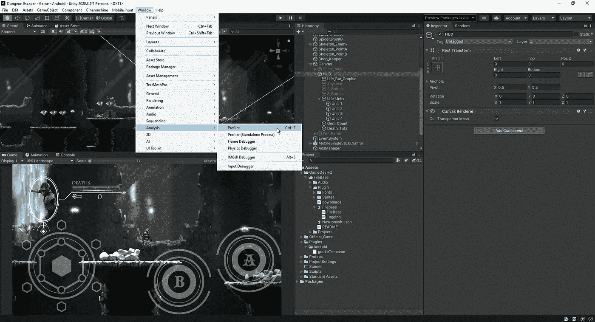
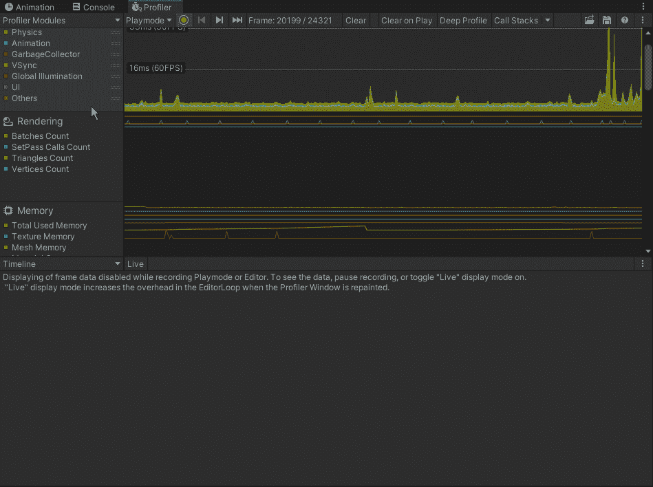
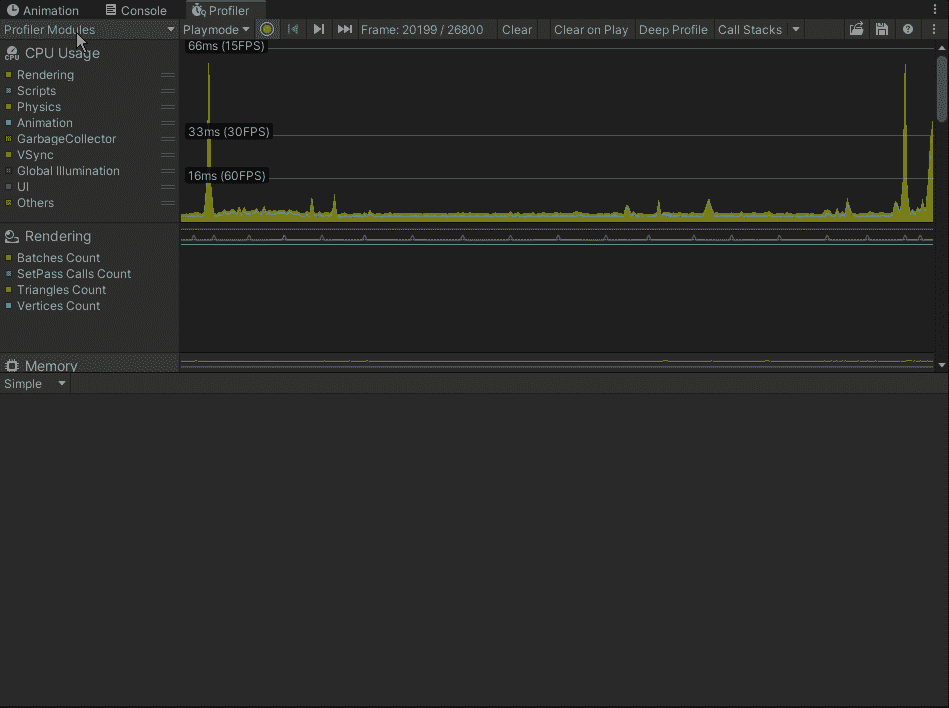
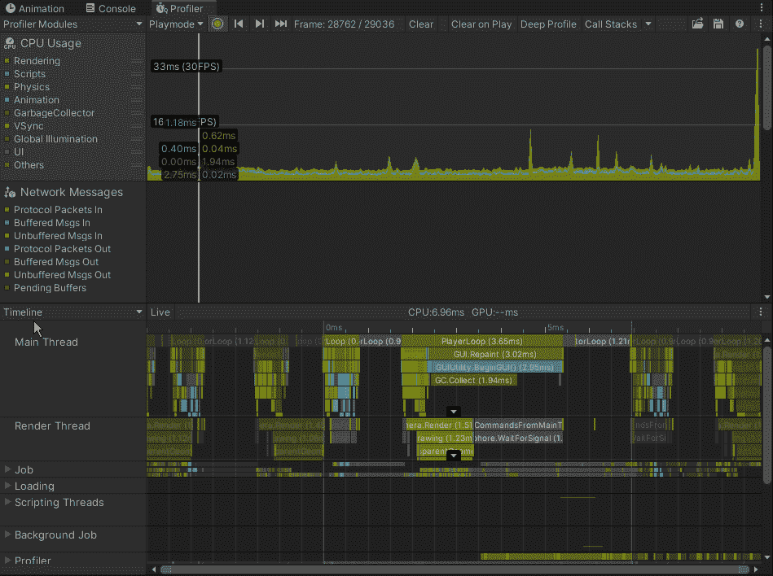
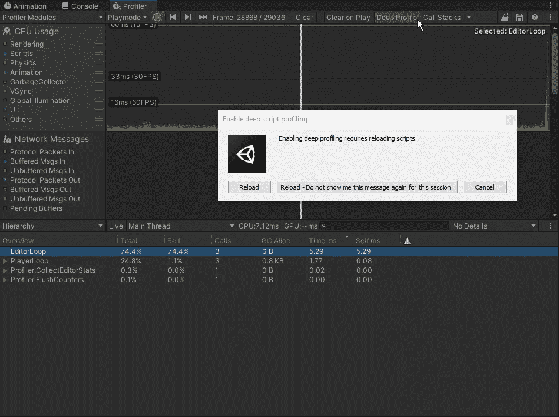
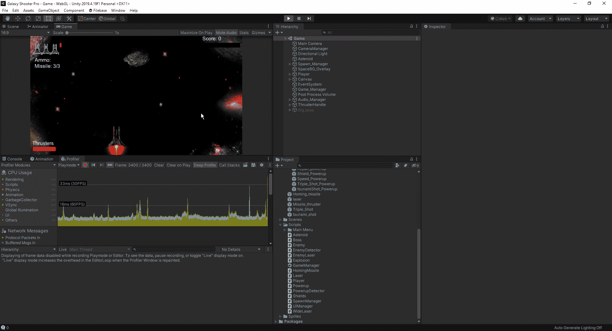
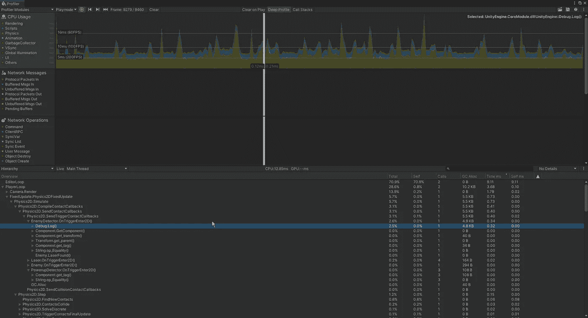

# 使用 Unity Profiler

> 原文：<https://medium.com/nerd-for-tech/using-the-unity-profiler-c9a26119acaf?source=collection_archive---------8----------------------->

现在我们已经完成了几个不同的项目，让我们看看如何使用 Unity 的 profiler。这个工具允许我们获得关于我们创建的应用程序的性能信息。为了让它运转起来，我们必须为它打开窗户:

从这里，我们可以将窗口拖动到一个舒适的工作区域，并查看我们可以在哪些模块上查看数据:

我们还能够定制我们想要查看的模块:

当我们试图查看我们的信息时，窗口底部会显示一个明细。它最初看起来不是很容易读懂，所以我们想把它从时间轴改成层次结构:

当我们在编辑器中打开游戏时，编辑器本身会占用很多时间。现在，我们将在编辑器中处理它，稍后看看我们如何在编辑器外玩游戏和使用分析器。

一个很好的特性是深度剖面:

这个特性让我们深入了解帧峰值，让我们知道导致峰值发生的具体函数调用。当我们去玩我们的游戏时，我们可以看到它开始收集数据。这不会保存在游戏会话中生成的所有数据，但只会保存大约 200 帧左右的数据:

测试时，我们可以在玩游戏的同时注意任何尖峰信号，并暂停游戏以查看这些尖峰信号的原因，同时我们还想查看尖峰信号中的其他一些类别。我们可以在层次结构中查看一些不同的数据列:

总计和自我是分配给特定类别的百分比。至于 GC Alloc，这是分配给特定帧的总的车库集合。当我们看到大约 5kb 的东西时，这并不太令人担心，因为当乘以整秒时，这并不是一个巨大的数量。然而，一旦数字开始攀升到 30kb，我们就需要开始更深入地研究它，因为超过一秒钟，就有大约 1.8mb 的垃圾数据需要处理:

正如我们在这里看到的，玩了一会儿后，我们可以看到它是如何达到大约 10.2kb 的，而空闲时它通常在 4.7 左右。至于为什么这么高的原因，我们可以看到我们为游戏运行的 debug.logs 占用了一些垃圾空间。现在，如果我们有 10 个不同的调试日志在运行，它们都在 4.8 左右，几乎是 5 个，这将导致应用程序中每秒钟堆积大量垃圾。当发布一个游戏时，我们在游戏中仍然有效的任何 debug.logs 和 prints 都占用了大量的信息。为了防止所有这些垃圾在游戏中堆积，我们只想确保我们在创建脚本时设置的用于检查特定事件的任何 debug.logs 都只是简单地注释掉或完全删除该日志，以确保它正常工作。
现在我们已经了解了 Unity 的 profiler，我们可以进一步研究我们的应用程序，尝试并找到需要解决的问题，为用户创造更流畅的体验。