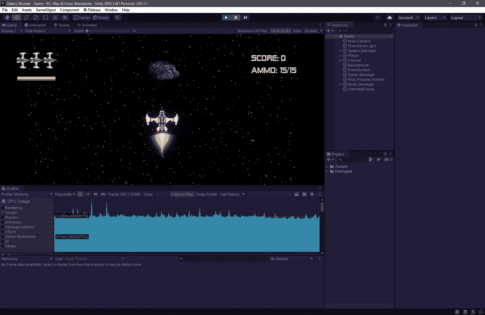
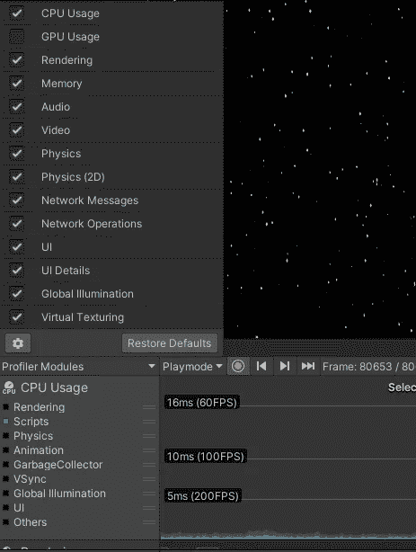
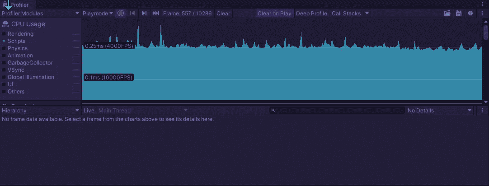
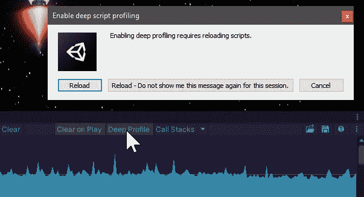
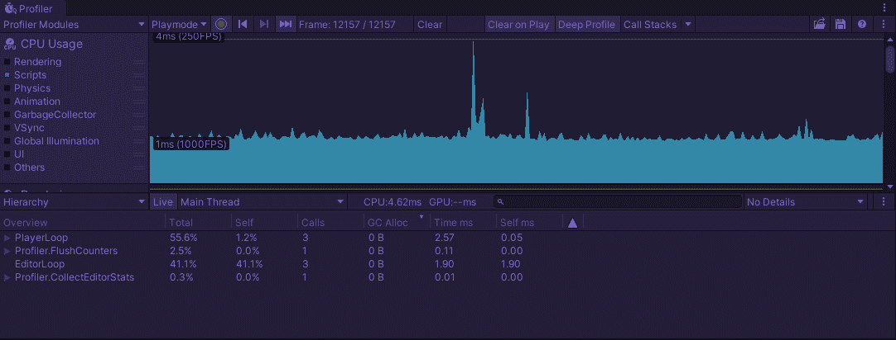
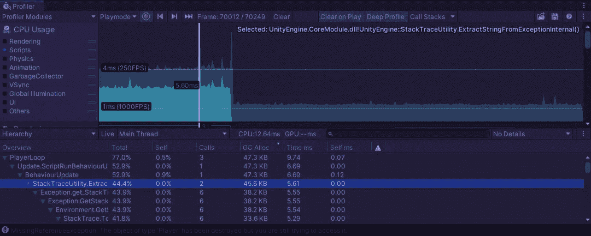
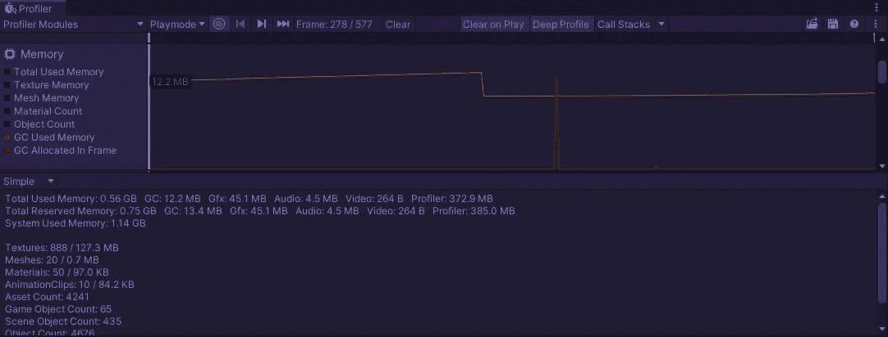
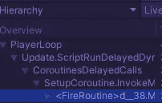
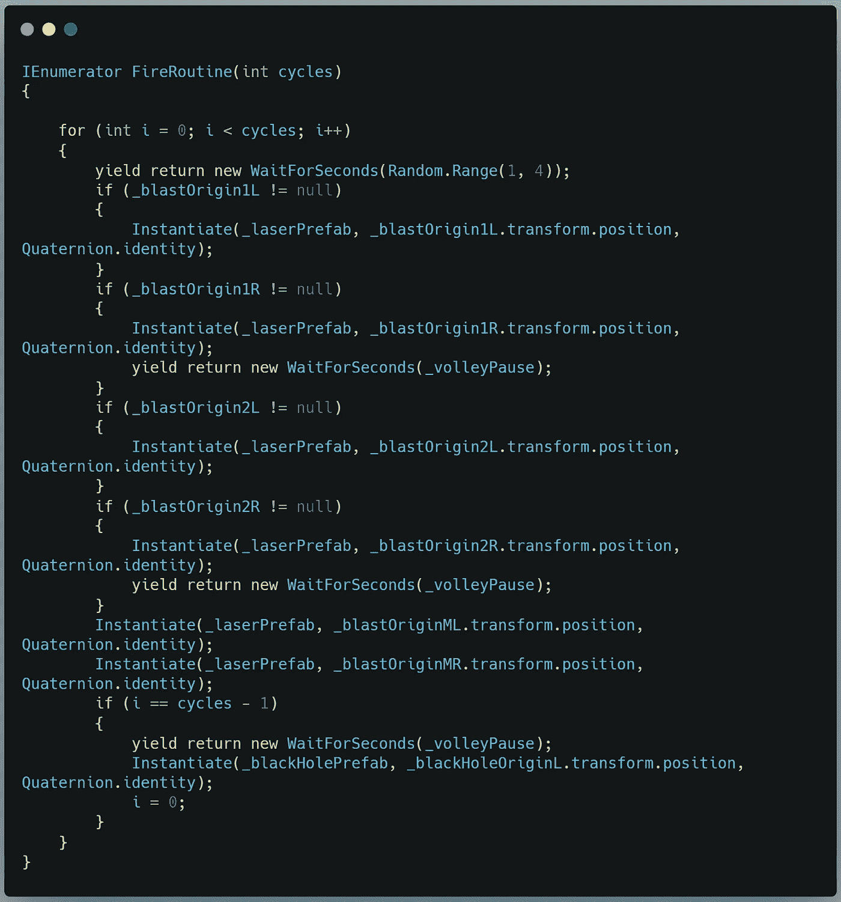
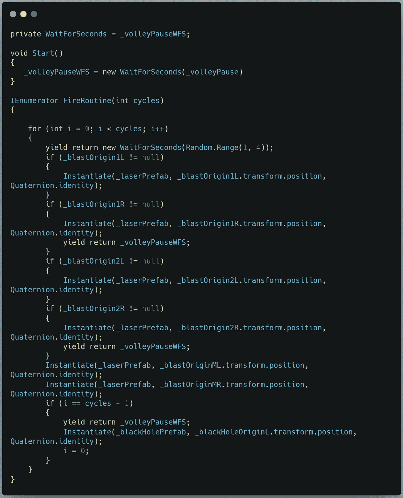

# 使用 Unity Profiler

> 原文：<https://medium.com/nerd-for-tech/using-the-unity-profiler-e282edf38142?source=collection_archive---------2----------------------->

## 充分利用游戏中的每一帧画面

今天，我们将通过 Unity Profiler 分析工具来检查我们代码的性能，并寻找优化脚本的方法。所以，让我们回到我的第一个游戏，看看从我第一次开始的时候起，我的代码中是否有任何阻力。由于游戏的规模，我将展示的示例并不是非常注重性能，但是如果我们要扩展到一个更大、更复杂的游戏，我们将会看到两个代码区域的一些影响，这些影响可能会降低帧速率。

profiler 窗口可以在**窗口>分析**下的顶部菜单中找到。这是一个好主意，这样你就可以同时看到游戏区和侧写器。在你按下 Play 键之前，profiler 不会显示任何东西，所以就这样吧。一旦一切都设置好了，你的屏幕将看起来像这样:

雄伟的紫色色调是可选的。

有几个设置需要检查。CPU 使用率可能是您将花费大部分时间进行优化的地方。以下是其他图形选项:

我已经取消选择了所有我不担心的数据。我现在只想专注于脚本性能。正如你所看到的，我们设置在一个相当舒适的 *4000* 帧每秒。

但是，这也是游戏在关卡开始时的循环。其他都不运行。如果我们玩一会儿这个游戏，我们就可以跟踪变化并锁定峰值。如果我们点击这个图表，它会给我们一个框架内发生的所有事情的数据。我们希望获得尽可能多的信息，所以点击“深度剖析”并在提示时重新加载脚本。

现在，让我们看一下图表，看看会发生什么。

在下面的概览中，我们看到编辑器现在使用了一半的资源。在游戏建成后，我们可以更清楚地了解游戏的真实操作，但现在我们将忽略编辑器。

如果我玩一会儿，以防突然的峰值，我会看到玩家死亡时性能会大幅下降。

这个稳定期是玩家在场景重新加载前死亡的时间。

您可以在分析器层次结构中看到，垃圾回收分配突然增加，这是在处理内存松散端时发生的，同时 FPS 下降(我们只剩下 *250！* lol *)* 。深入层次结构可以发现问题的根源是 StackTraceUtility。每一帧都有一个错误被发送，这(相对地)降低了我们的 FPS。

在控制台通知区域我们看到错误:我们正在寻找玩家，但是玩家已经死了。引用的代码是敌方脚本中的这一行:

我的一个敌人类型在每一帧搜索玩家，这样它就可以瞄准并攻击玩家。如果玩家死的时候这些敌人还在，那么他们就会去寻找一些不存在的东西。我可以在这条线上放一个空值，以确保如果玩家死了，这些敌人就不会再找他们了。

噗。已实现优化。

我们还可以通过查看内存图来关注 GC 中的峰值:

如果我们观察 CPU 图表上峰值，我们可以看到问题的根源:

看起来敌人的火力有点拖我们后腿了。让我们进一步调查。

是啊。这可能需要更多的重构。

可能的原因是重复使用了 **new** 关键字。每次我们使用它时，我们都在创建 WaitForSeconds 类的一个新实例。当我们用完它的时候，必须用 GC 来清理。所以，每一帧我们都在用这个方法创建和销毁一个类的四个新实例。更糟糕的是:其中三个是相同的时间单位。由于协程与其他代码段同时运行，这类事情会很快堆积起来。

我们在这里可以做的是通过创建 WaitForSeconds 调用并在开始时给它们赋值来缓存它们。然后，我们只需要引用那些现有的实例，而不是一遍又一遍地创建和销毁、创建和销毁每一帧。

那么，让我们来看看返工后会是什么样子:

由于随机等待时间，我仍然在每帧调用一个新的 WaitForSeconds()。每次随机掷骰子时，我都无法避免产生新的等待。但是其他三个调用被浓缩成一个变量。

这将消除垃圾收集中的峰值，并使其成为一个暂时现象。

希望在这两个例子之后，您可以开始了解 Unity Profiler 的强大功能。正如我上面所说的，你的项目越大，越复杂，这些小事就会越多。将 profiler 添加到您的进程中，以应对低帧速率。

在下一篇文章中，我们将深入一个新项目。到时候见。