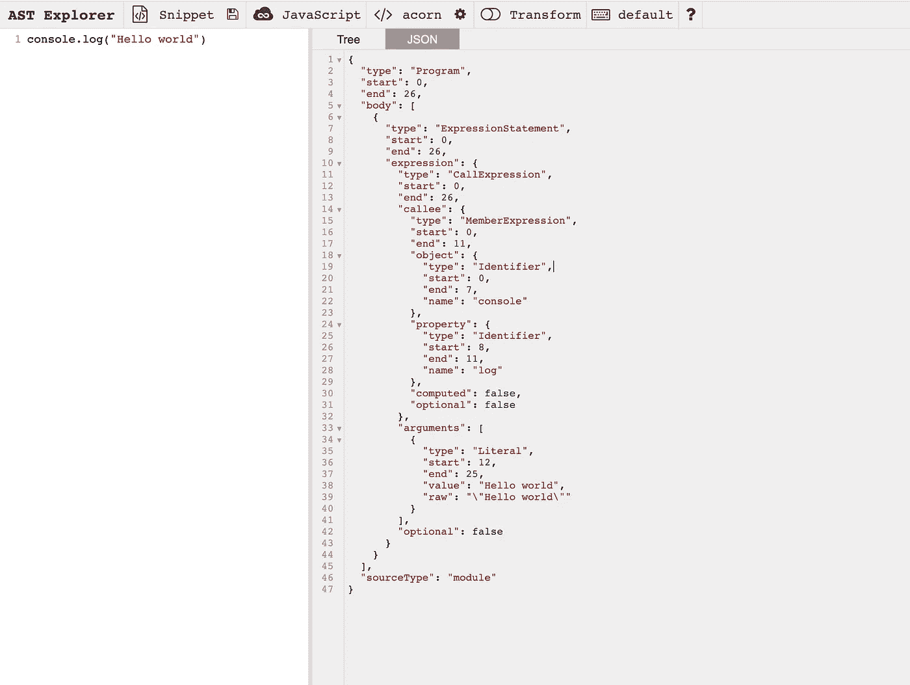
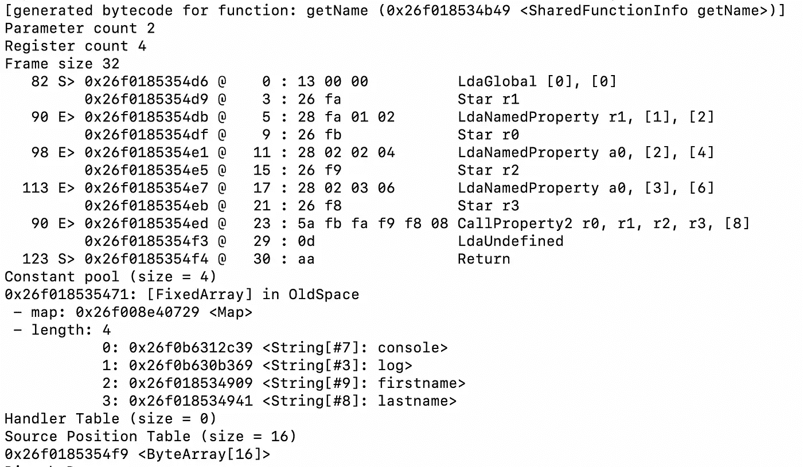
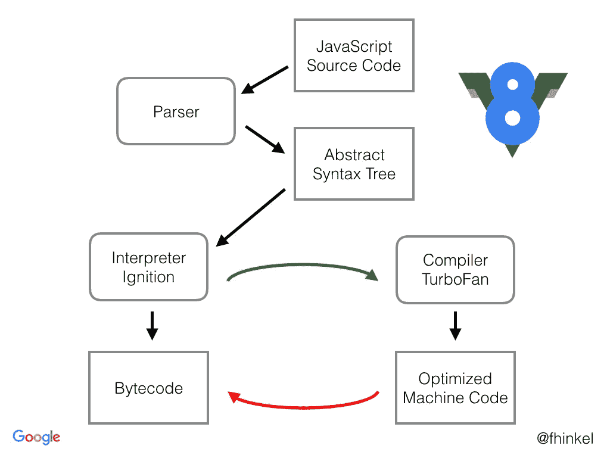

# V8 引擎解释道:真正有趣的事情发生在…

> 原文：<https://medium.com/nerd-for-tech/v8-engine-explained-where-the-actual-fun-happens-cbb1662147d?source=collection_archive---------4----------------------->

谷歌的 V8 引擎和什么使它快速的演练

javascript 引擎是一个程序，它将您的 Js 代码作为输入，并生成机器可执行代码或字节码。事实上，我们可以创建一个 Js 引擎。为此，他们需要遵守 Ecmascript 的标准，并可能选择实现 WebAssembly 和 Just in Time compilation，以便在这场 Js 引擎竞赛中胜出。有了这么多的选择，这对用户来说实际上是非常好的，因为 Js 引擎开发人员一直在努力使他们的引擎更有效，因此，你的浏览器体验会越来越好。大多数 JS 引擎都有类似的流程，不同的是它们的内部优化。

现在有很多 Js 引擎——有些像 spidermonkey 一样古老(这几乎是有史以来第一个 JS 引擎),有些像 Chakra 和 JavascriptCore，分别用于 Edge 和 Safari，有些像 JScript 一样前途未卜，还有一些像 Hermes 一样新，是脸书为 react native 开发的。这么多的 Js 引擎，但 V8 仍然是最广泛使用的 Js 引擎。一些人认为它也是性能最好的引擎。

那是真的吗？V8 发动机是当今最好的发动机吗？

我们需要了解关于 Js 引擎的一件非常重要的事情——Js 引擎只是一个程序，用某种语言编写，需要尽可能高效地完成某项任务。现在，这种效率既可以用速度来衡量，也可以用内存使用来衡量。因此，如果你正在制作自己的网络浏览器，这意味着你有充足的内存，是的，V8 将是一个很好的选择。但是假设你正在制作一个小型的可穿戴 IOT 设备，你只有很少的可用内存。你可能想使用 Duktape 或 Jerryscript，它们可能会慢一些，但更适合内存。

**那么 V8 有什么不同呢？**

很长一段时间以来，V8 的突出之处在于它不产生任何中间代码或字节码。现在情况变了。V8 的架构已经从全代码——曲轴实现方式转变为点火——涡轮风扇架构。这个想法是做全代码曲轴所做的一切，但也足以处理不断发展的 Js 生态系统。我们将在接下来的章节中详细讨论点火解释器和涡轮风扇编译器。

**在我们潜水之前，先看一下 V8 发动机…**

V8 是用 C++编写的，为了内部加速，运行了以下线程

*   有一个获取、编译和执行 JS 代码的主线程
*   另一个线程用于优化、编译，因此主线程继续执行，而前者正在优化运行的代码
*   第三个线程仅用于反馈，告诉运行时哪些方法需要进一步优化
*   一些其他线程来处理垃圾收集

堆有两个隔离区——新空间和旧空间。新闻空间是大多数动态分配发生的地方。其中一些状态被提升到旧空间，并且在整个应用程序中都是必需的。这些旧空间堆分配可以在生成的字节码中看到。

```
0x17b58eeb5549: [FixedArray] in OldSpace
 - map: 0x17b5d9c40729 <Map>
 - length: 4 0: 0x17b58eeb4909 <String[#9]: firstname>
 1: 0x17b58eeb4941 <String[#8]: lastname>
```

垃圾收集以两种方式发生——清除收集速度快，并且由于其动态特性而在新空间中运行，而标记-清除算法速度较慢，并且在旧空间中运行，在旧空间中分配预计会持续更长时间。

为什么需要字节码？

一种语言是静态类型的，或者有一堆以某种方式做事的预先规则，那么相应的编译器有很多关于编译后的代码应该是什么样的或者预期输出是什么的信息。在像 Js 这样的语言中，你的对象、变量——任何东西都是或者可以是动态类型的，没有那么多预定义的规则可供程序决定输出。因此，当代码被预先编译时(理解为 AOT——提前编译)，机器代码的执行自然会更快，因为程序知道预期的格式。

因此，为了利用编译的优势，Js 引擎会进行实时编译，以优化执行。V8 有一个称为“点火”的解释器和一个称为“涡轮风扇”的优化编译器。

**当谷歌浏览器请求一个页面时**

html 解析器在你的代码中找到一个脚本标签

```
<script src=”app.js”></script>
```

这通常会发生，要么通过实际的网络调用，要么通过你所做的任何类型的缓存，这是当它接收下载的脚本作为一个字节流的数据。这些由**字节流解码器处理成令牌。**

现在，这些标记可以被识别，好的，其中一个是关键字，另一个看起来像标识符，这可能是运算符，等等。但是这些令牌放在一起还没有任何意义。这些令牌然后由 **Js 解析器**进一步处理，它基于 Js 语法规则和它们所遵循的 Ecmascript 标准。解析器从这些标记中创建节点(是的，就像树节点一样)。这些节点在 **AST(抽象语法树)**中进一步处理。



为简单的 javascript 语句生成的 AST

AST 是我们作为一个非常小的 js 语句输入的内容的一个更加有组织和详细的表示。在构建树的时候，这是实际错误检查发生的地方，因为单独的标记可能是有效的，但是作为相关的 Js 语句，它们可能是无效的。因此，到目前为止讨论的这些步骤对所有浏览器都是通用的。

**在 V8 中俯冲**

从这里开始，代码实际上进入 V8 引擎或任何 js 引擎。在 V8 的情况下，它转到 Ignition，负责基于 AST 生成字节码。

这里需要了解的是，在**点火**中，有一组**寄存器**，分别从 r1、R2……等表示。有一个**累加器**接收初始输入并返回输出。所有这些寄存器都与操作和值相关联。它的意思是，字节码基本上告诉从 r1 获取一些值，并把它加到 r2。然后可能在 r3 选择值的基础上，对 r1 中的值进行一些操作。

```
var obj = {
 firstname: "Piyush",
 lastname: "Das"
}function getName(obj) {
 console.log(obj.firstname, obj.lastname)
}// Calling the above function with obj as param
getName(obj)
```

让我们举个例子，在上面的代码片段中，我们引用了一个具有两个属性的对象——名字和姓氏。

```
node --print-bytecode --print-bytecode-filter=getName code.js
```

要生成字节码，可以在 terminal 中运行带有 print-bytecode 标志的 js 文件。上面的命令有一个带有函数名的过滤器标志，因为通常生成的字节码很大，定位函数会更加繁琐。

因此，我们为上面的 getName 函数生成的字节码看起来类似下图。



为 getName 函数生成的字节码

上面的代码看起来很复杂。但是这和我们写的程序没有太大的不同。事实上，这更像是一个详细的指令集，说明在哪里保存某些值，以及将它们移动到哪里或在哪里检索它们。

```
LdaNamedProperty a0, [2], [4]
// Fetch a named property into accumulator from [reference]
```

正如我们之前谈到的寄存器，在上面的代码片段中我们可以看到，一个命名的属性被带入累加器 a0，并且它被索引[2]引用

```
0x26f018535471: [FixedArray] in OldSpace
 - map: 0x26f008e40729 <Map>
 - length: 4

 0: 0x26f0b6312c39 <String[#7]: console>
 1: 0x26f0b630b369 <String[#3]: log>
 2: 0x26f018534909 <String[#9]: firstname>
 3: 0x26f018534941 <String[#8]: lastname>
```

引用[2]是从字节码中提到的引用列表中检索的，如上面的代码片段所示，通过索引调用它会使它更快。在索引 2 处，您可以看到 firstname 被引用。

```
Star r2
```

在 LdaNamedProperty 之后的下一行，我们可以看到一个命令星和一个寄存器引用。这里的指令是将上述值移动到寄存器 r2，以便下一个操作/执行可以在 a0 中进行。

最后有一个返回，返回累加器中的当前值。

LdaNamedProperty 语句中还有第二个引用。用于优化我们的代码执行。

```
LdaNamedProperty a0, [2], [4]
```

我们已经将“obj”对象作为参数传递给了 getName 函数。因此，当这个被调用并且解释器实际上需要从对象中访问值时，就会为该对象创建一个引用模板，称为**隐藏类**。为了优化执行，因为可能会有重复的调用，这个模板保存了对象中可能存在的属性的引用。它期望传递参数的隐藏类保持不变。现在，即使这些对象属性的实际值在变化，但是由于引用没有变化，在字节码中，我们看到操作是通过从引用中获取值来完成的，所以可以直接使用同一个引用，执行速度会更快。这被称为**内联缓存**，它依赖于对同一方法的重复调用往往发生在同一类型的对象上的观察。

```
\\... getName defined earliervar obj2 = {
 firstname: "PD"
}getName(obj)
```

当我用 obj2 调用 getName 时，它是一个有效的 js，执行时没有错误，lastname 未定义。但是在内部，这个执行不同于前面的执行。为什么？这是因为我们传递的对象只有一个属性，因此，它被视为一个不同的隐藏类，字节码中的引用将会改变，无法利用内联缓存的优势。因此，即使当我们需要这样一个案例时，最好有如下的对象，以维护隐藏的类结构。

```
var obj2 = {
 firstname: "PD",
 lastname: undefined
}
```

总而言之，第二个参考和隐藏类和内联缓存的目的是加速 js 对象中的属性查找。在线缓存也为涡轮风扇优化器提供了有价值的反馈。



礼貌:Franziska Hinkelmann 在 V8 上的讲话

V8 有一个 **FeedbackVector** ，它将上下文相关的函数值/代码执行保存在一个准备引用的向量中，这样当一个完全相同的操作再次执行时，可以直接获取结果。

现在，如果我的 getName 函数被调用多次，这个函数将变得“热”——这实际上是一件事。 **hot functions** 的特别之处在于，涡扇发动机根据反馈信息，将生成架构特定的优化机器代码。所以下次调用这个函数时，它会跳过字节码，直接调用机器码。这就是我们的隐藏类和内联缓存再次出现的地方。因此，当我们的热函数的隐藏类保持不变时，这种类型的内联缓存被称为**单态**，这是我们希望在执行中实现的。

当隐藏类改变时，getName 函数可能有 3-4 个不同的隐藏类，这被称为多态。涡轮风扇优化仍然可以工作，尽管这个过程会变得有点长，因为每次遇到一个新的类，代码会被去优化，使用倾斜缓存创建一个新的查找，反馈向量被更新，然后涡轮风扇可以优化机器代码。当我们的参数过于动态，变化非常频繁时，称为**巨形**态。涡扇发动机将不能优化巨形状态来直接调用机器代码，因为隐藏类检查经常失败。

因此，将隐藏的类转换保持在最小是很重要的。最后，经过这一切，我们有一个优化版本的机器就绪代码准备运行…瞧！

注:我强烈推荐观看 Franziska Hinkelmann 的 JS Conf 视频讲座[在这里](https://youtu.be/p-iiEDtpy6I)。