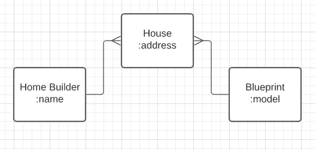
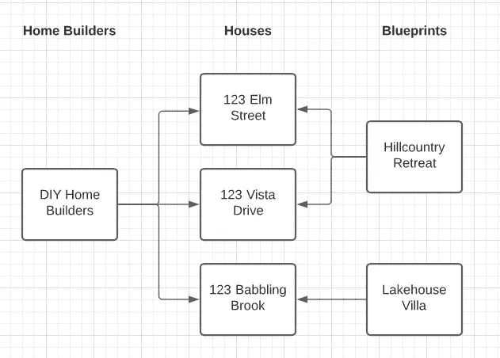

# 在 Ruby 中可视化数据关系

> 原文：<https://medium.com/nerd-for-tech/visualizing-data-relationships-in-ruby-652c5fa46a5?source=collection_archive---------5----------------------->

开始一个新的项目可能会令人望而生畏，即使对于一个只使用几个类编写简单程序的初学者来说也是如此。你应该从哪里开始？你应该直接投入并开始编码，然后看看几个小时后你会到哪里？

如果你想避免大量不必要的工作，那么这个问题的答案是响亮的不。

途经[giphy.com](https://giphy.com/gifs/laff-tv-comedy-OQndxs6MzRfP2VUJgc)

如果你曾经做过任何类型的家庭装修项目，无论大小，你可能听说过这句古老的谚语“量两次，切一次”。信不信由你，这正是你开始一个新项目的起点。

当然，当我们开发一个新项目时，我们并没有真正衡量任何东西，我当然希望你没有削减任何东西，但作为开发人员，我们正在构建一些东西，当你构建一些东西时，最好从计划开始。

这就是可视化数据关系派上用场的地方。在你敲击键盘之前，花时间画出你的项目中所有的关系将会节省你很多时间和头痛。

# 数据关系类型

在开始可视化数据关系之前，让我们花点时间回顾一下不同的关系类型。在 Ruby 中有三种关系类型:一对一、一对多和多对多。我们将把家装的例子提升到一个新的层次，看看房屋建筑商。

一对一是最简单的解释。一个家庭只有一个地址。不管怎样，那栋房子总会有同一个地址，那个地址总会把你指向那栋房子。

一对多或 Has-Many/belong-To 有点难。在我们的例子中，每个房子都是由一个建筑商建造的，而一个建筑商有很多他们建造的房子。也可以说，每个家庭都有一个用来建造房子的蓝图，每个蓝图可以用来建造多个家庭。

多对多或多对多是最难理解的。在这个例子中，我们的建造者有许多他们建造的不同房子的蓝图，每个房子代表一个房屋建造者和一个蓝图。

这可能会令人困惑，所以让我们花点时间画些图，*想象一下*我们刚刚绘制的是什么。

# 可视化数据关系

这是一个简单的图表，展示了如何绘制我们的房屋建筑商、他们的房屋以及用于建造房屋的蓝图之间的关系。

房屋建筑商关系图。

像这样绘制我们的模型向我们展示了我们的房屋建造者可以有许多房屋，我们的蓝图可以用于许多房屋，每个房屋都将连接我们的房屋建造者和蓝图。

为了更好地形象化这一点，并将其与 Ruby 联系起来，让我们把我们的 home builder、houses 和 blueprints 想象成类，并创建一些对象。我们的对象或实例现在将由一个方框表示，我们的类由类名下面的垂直列表示。

使用多个对象可视化的主页生成器关系。

正如你在上面的图表中看到的，我们的房屋建造者已经用两张蓝图建造了三座房屋。现在，我们可以自信地认为，我们已经准确地映射了该模型所需的所有关系，并最终敲击了键盘！

# 走向

程序员天生懒惰，这是好的方面，他们喜欢做最少的工作来完成他们的目标。

首先可视化这些关系允许你犯错误或尝试不同的关系，只需擦除你的绘图或图表，并重新开始，而不用花费无数的时间编码，只需要意识到你需要改变你的整个程序。