# 可视化神经网络的想法

> 原文：<https://medium.com/nerd-for-tech/visualizing-what-a-neural-network-thinks-dc30bfafec3f?source=collection_archive---------4----------------------->

好吧，神经网络并不真正“思考”，但它们肯定有自己的观点。如果你给一个卷积神经网络，比如说一个分类器，输入一幅图像，它会告诉你它“认为”是什么，但有时你可能会想知道是什么促成了这个特定的决定，试图“调试”你的网络。

例如，在设计性别分类神经网络时，我注意到网络正在关注耳朵，它学会了识别它们。原来耳朵可以用来检测性别，所以这是一个好迹象，表明我的网络正在寻找它们。

在本文的其余部分，我们将看到如何使用显著图来了解神经网络认为什么是重要的。以下内容主要摘自我在 Krishtof Korda 的帮助下为 Packt Publishing 撰写的《自动驾驶汽车的实践愿景和行为》一书。在本章的前一部分，我们训练了一个神经网络来学习如何在模拟器 Carla 中自动驾驶汽车，网络的模型存储在一个名为**模型**的变量中。

# 可视化显著图

为了理解神经网络关注的是什么，我们应该使用一个实际的例子，所以让我们选择一个图像:

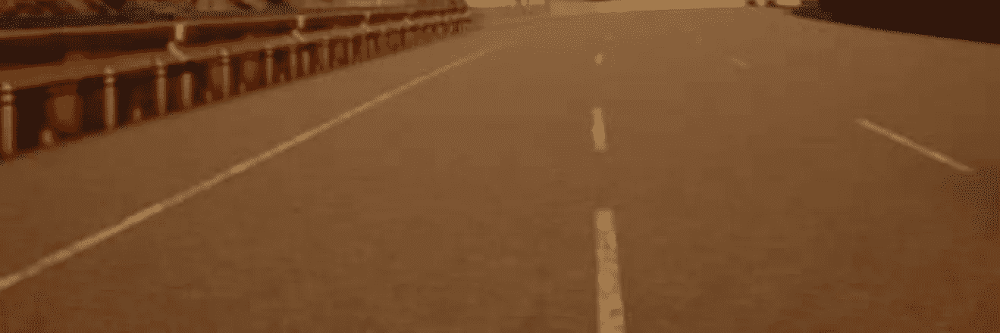

测试图像

如果我们必须在这条路上开车，作为人类，我们会注意车道和墙，尽管不可否认，墙没有之前的最后一条车道重要。
我们已经知道如何了解像 DAVE-2 这样的 **CNN** (卷积神经网络**的缩写**)正在考虑什么:由于卷积层的输出是一个图像，我们可以将其可视化如下:

第一卷积层的部分激活

这是一个很好的起点，但我们想要更多。我们希望了解哪些像素对预测贡献最大。为此，我们需要得到一个**显著图**。

Keras 不直接支持它们，但是我们可以使用 keras-vis。您可以使用 pip 安装它，如下所示:

获得显著图的第一步是创建一个模型，该模型以我们模型的输入开始，但以我们想要分析的图层结束。生成的代码与我们看到的激活非常相似，只是为了方便起见，我们还需要层的索引:

虽然在我们的情况下没有必要，但您可能希望将激活更改为线性，然后重新加载模型:

现在，只需要调用**visualize _ studentity**():

我们对最后一层(输出)的显著图感兴趣，但作为练习，我们将遍历所有卷积层，看看它们理解了什么。
让我们看看第一个卷积层的显著性图:

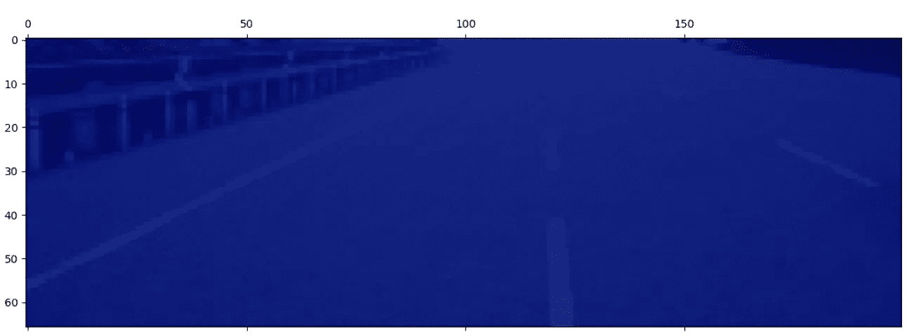

第一卷积层的显著图

印象不深，因为没有显著性，我们只能看到原始图像。
让我们看看第二层的地图是什么样的:

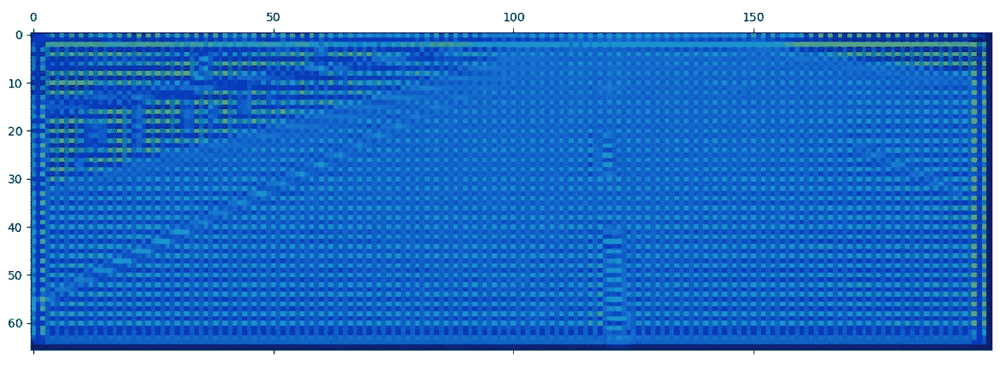

第二卷积层的显著图

这是一个进步，但即使我们在中线，在墙上和右车道后的土地上看到一些注意，也不是很清楚。让我们看看第三层:

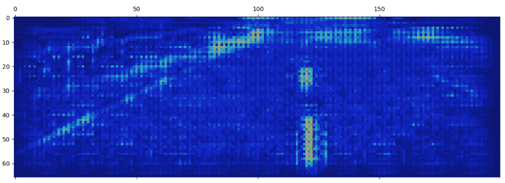

第三卷积层的显著图

现在我们正在谈话！我们可以看到对中间和左边线的极大关注，以及对墙和右边线的一些关注。电视网似乎在试图了解这条路的尽头在哪里。我们再来看第四层:

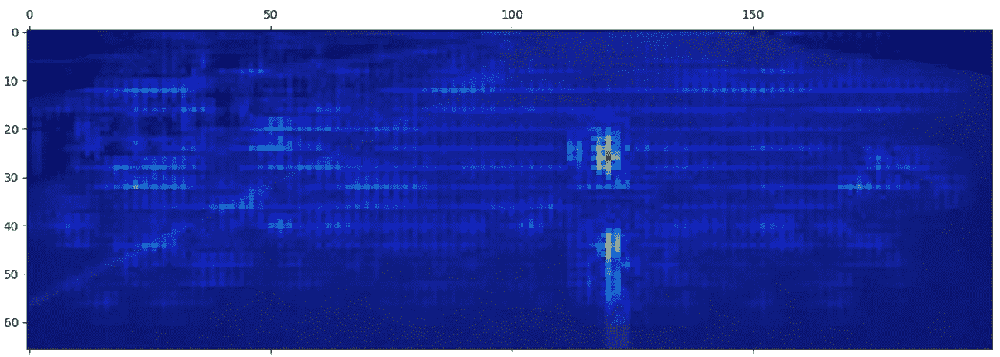

第四卷积层的显著图

在这里我们可以看到，注意力大多集中在中线，但在左线和墙上也有注意力的火花，在整条路上也有一点。
我们还可以检查第五个也是最后一个卷积层:

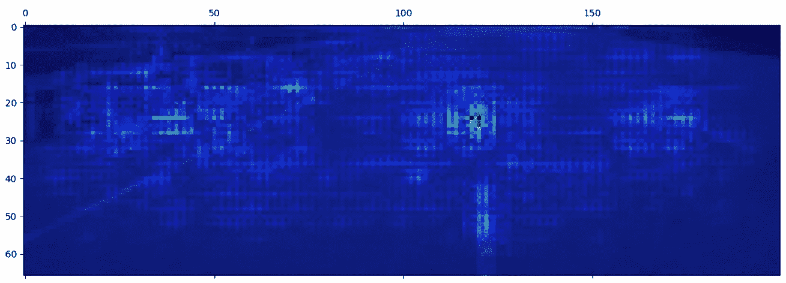

第五卷积层的显著图

第五层与第四层相似，只是在左边的线条和墙上多了一些关注。
我们也可以可视化密集层的显著图。让我们看看最后一层的结果，这是我们认为的这张图像的真正显著性图:

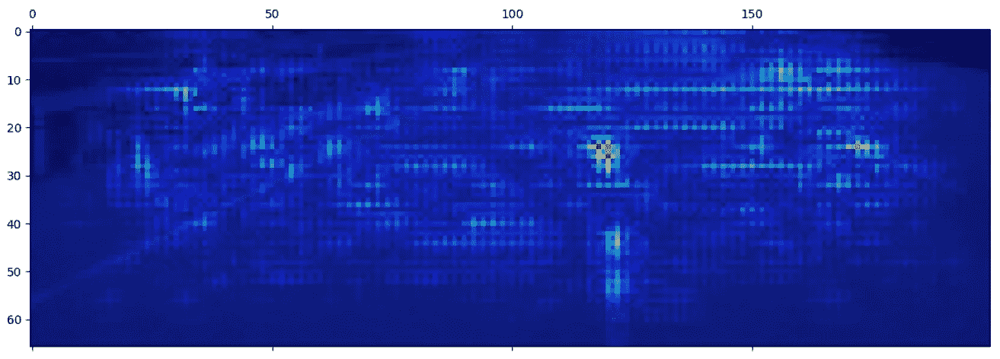

输出层的显著图

最后一个显著性图是最重要的一个，它显示了对中心线和右侧线的极大关注，加上对右上角的一些关注，这可能是试图估计与右侧车道的距离。我们还可以看到墙上和左侧车道上的一些注意。所以，总的来说，看起来很有希望。
让我们试试另一张图片:

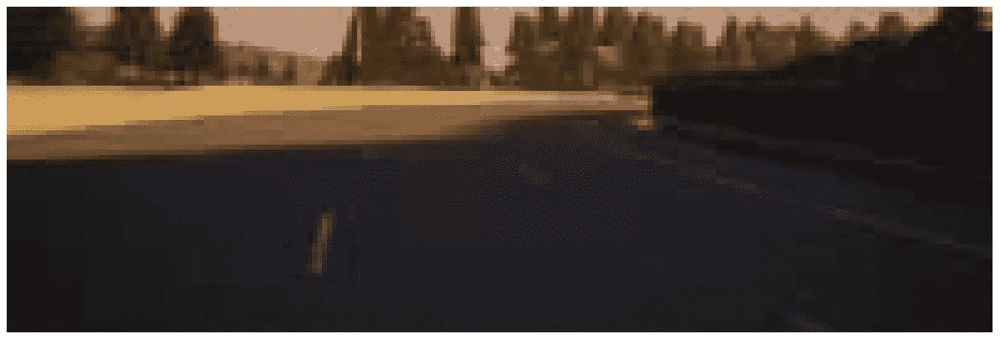

第二张测试图像

这是一个有趣的图像，因为它是从网络没有被训练的道路的一部分拍摄的，但是它仍然表现得很好。
我们来看看第三个卷积层的显著图:

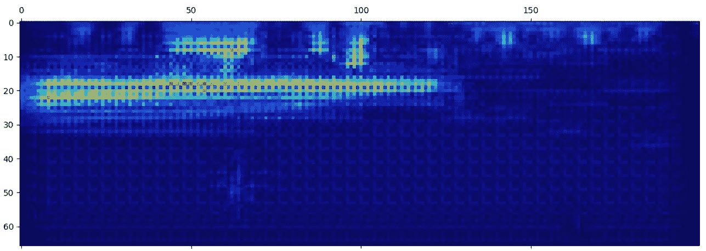

第三卷积层的显著图

神经网络似乎非常关心路的尽头，它似乎也检测到了几棵树。如果它受过刹车训练，我敢打赌它会这样做！

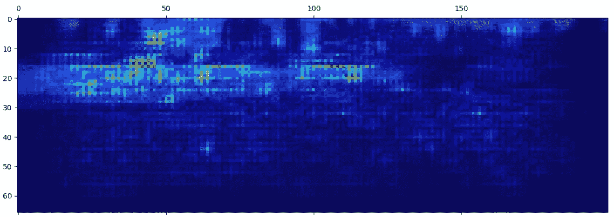

输出层的显著图

这与前一个非常相似，但是有一些对中线和右线的注意，以及一般道路上的少量注意。我觉得不错。
让我们来看最后一张图片，它来自教何时右转的培训:

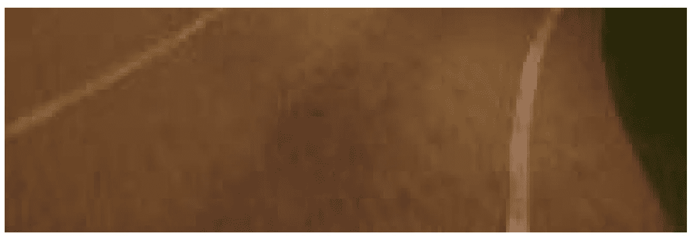

第三张测试图像

这是它的最终显著图:

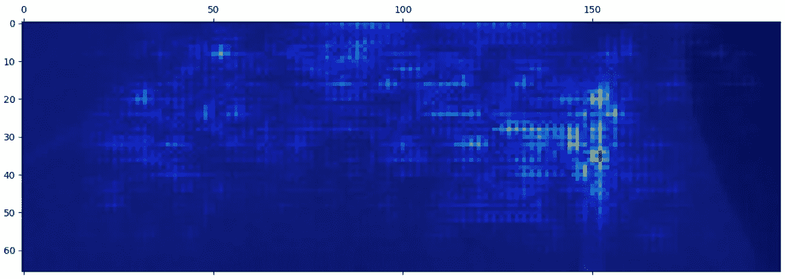

输出层的显著图

你可以看到神经网络主要关注右边的线，同时也关注整个道路，还有一些注意力集中在左边的线上。
正如你所看到的，显著图是一个有效的工具，可以更好地理解网络的行为，并对其对世界的解释进行某种健全性检查。

# 临终遗言

文章到此结束。在书中，本章的其余部分解释了如何将神经网络与模拟器 Carla 集成，这样你就可以实际体验自动驾驶汽车，尽管是在模拟器中；它还解释了如何使用生成器来支持使用更大的数据集进行训练，以及进行更高级的数据扩充。

如果你喜欢这篇文章，如果你对自动驾驶汽车使用的一些技术感到好奇，请考虑一下[自动驾驶汽车的实践愿景和行为](http://packt.live/3jimRoS)这本书。它还谈到了车道检测，神经网络，物体检测，语义分割，传感器，激光雷达，地图，控制等等。