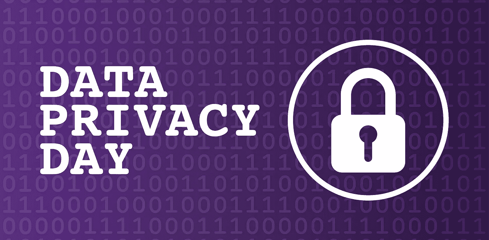

# 想要数据隐私？首先解决数据安全问题

> 原文：<https://medium.com/nerd-for-tech/want-data-privacy-work-on-data-security-first-558dd1227c26?source=collection_archive---------4----------------------->

我一直建议将 1 月 28 日的[数据隐私日](https://iapp.org/connect/data-privacy-day/)更名为“缺乏数据隐私日”，这一天的到来和结束都没有引起多大反响(在我所在的那个角落，一家主流媒体几乎没有提到它，因为那里正被即将到来的暴风雪困扰着)。

有两个原因。最明显的，也是最受关注的，是个人隐私的持续侵蚀，这方面的例子在过去几周就出现了，但人们并没有明显意识到时机的讽刺。

明星安全博主 [Brian Krebs 在 1 月中旬提醒我们](https://krebsonsecurity.com/2022/01/irs-will-soon-require-selfies-for-online-access/)，从今年夏天开始，纳税人在国税局创建在线账户的唯一方式将是通过 ID.me，“这是一种在线身份验证服务，要求申请人提交账单和身份证件的副本，以及通过移动设备实时视频他们的面部。”

没错——联邦政府打算收集我们所有人的数码照片。什么会出错？

就在数据隐私日的前一天，美国交通部长皮特·布蒂吉格发布了一项道路安全计划,推广使用“速度安全摄像头”——一种执行速度限制的自动化系统，如果他的目标成为现实，这将意味着你不能在不受政府监控的情况下开车去任何地方。当然是为了你的安全。

这可能还需要一段时间——目前，8 个州有法律禁止测速相机，尽管另有 18 个州允许。

不太明显(但同样重要)的原因是，无论存在什么法律限制数据收集、存储和使用，如果数据不安全，它就不会保持隐私。正如我们每年从数据泄露报告中看到的那样，数据安全性仍然是一个问题。

最近的几份报告发现[软件漏洞和数据泄露在 2021 年达到创纪录水平](https://armerding.medium.com/data-the-gold-mine-of-cybercrime-say-multiple-reports-ebc5f6e56680)。这些统计数据仅仅来自公开报道的数据。

事实上，尽管对什么构成侵犯个人隐私还有争论的空间，但不应该有任何异议的是，他人手中的数据，无论是在私营部门还是公共部门，都应该是安全的。然而很多时候，事实并非如此。

**从安全开始**

在我们这个互联的世界里，你的年龄、性别、你买什么或卖什么、你去哪里、你见谁、你在社交媒体上发布什么、你学习什么、你相信什么、你穿什么、你做什么样的运动、你有多健康、你的人际关系、你在哪里工作、你赚多少等等——这些都在网上。

所以想要数据隐私，就需要先说说数据安全，然后再做点什么。最早也是最著名的隐私法之一是欧盟的[通用数据保护条例](https://gdpr-info.eu/)。请注意，标题中的关键词是“保护”，而不是“隐私”。

好消息是确实有一些讨论在进行。坏消息是，许多工作仍未完成。新思软件完整性集团的安全工程师 Boris Cipot 指出，有令人鼓舞的迹象表明，人们越来越意识到需要更好的数据安全，从乔·拜登总统关于改善国家网络安全的[行政命令](https://www.whitehouse.gov/briefing-room/presidential-actions/2021/05/12/executive-order-on-improving-the-nations-cybersecurity/)，到越来越多的公司开始通过一个名为[软件材料清单](https://www.synopsys.com/blogs/software-security/software-bill-of-materials-bom/?cmp=pr-sig&utm_medium=referral) (SBOM)的全面清单来保持软件补丁和更新。

在 [Apache 开源日志库 Log4j](https://logging.apache.org/log4j/2.x/security.html) 中灾难性的 Log4Shell 漏洞被披露后，上个月甚至在白宫召开了一次网络安全“峰会”。

“然而，在真正做一些事情让事情变得更好的方面，我没有感觉到有很大的匆忙，”Cipot 说。“是的，对于必须发生的事情有一些想法，但它更像是一份清单，而不是如何实现数据隐私和保护的指南。”

“例如，命令公司创造一个 SBOM 是不够的。必须有明确的指导，说明什么是完整的 SBOM，以及需要如何处理信息。”

**数据越少，风险越小**

这并不意味着当前的隐私法没有任何安全价值。他们大多数人做的最好的事情之一是限制数据收集和存储。需要保护的数据越少越好。

Cipot 是众多专家中的一员，他们指出，如果没有限制，公司往往会不加选择地收集客户数据，并无限期地保留这些数据。“一些公司存储的一些用户数据在今天甚至没有相关的需求，因为这些数据可以追溯到几年前，”他说。

市场力量也可以为数据安全和隐私创造激励。新思网络安全研究中心(Synopsys cyber security Research Center)的首席安全策略师蒂姆·麦基(Tim Mackey)表示，由于大多数商业活动都涉及个人数据，即使只是商店里的信用卡交易，“未能妥善管理客户自愿分享的数据的企业有可能损害他们的声誉，进而破坏客户对他们的信任。”

他补充说，这种信任“比建立或重建容易得多。”

尽管如此，尽管每年都有灾难性的泄露事件危及数亿至数十亿人的个人数据，但消费者几乎没有表现出限制分享或过度分享的迹象。

Paul Ducklin 在 Sophos Naked Security 博客上写道,“我们中的许多人都非常喜欢使用在线服务——尤其是社交网络——并结交在线朋友。大致来说，我们很乐意交换自己的生活信息，以换取对他人生活的了解和参与。”

只是我们中的大多数人没有考虑到这样一个现实，即我们可能会与那些试图窃取我们的身份和金钱的人进行信息交易。

所有这些都意味着，提高数据安全性，进而提高数据隐私性，需要个人、组织和政府的“全方位”参与。幸运的是，在所有这些方面都有好的建议。

**个人**

首先，你确实可以控制你生活中有多少细节会出现在网上。请记住，网上没有什么是“你我之间”或几个朋友之间的事。这是你和数十亿人之间的事，其中许多人可能并不把你的最佳利益放在心上。你分享的越少，妥协的可能性就越小。

然后是安全基础。如果你使用密码，请使用长而复杂的密码，不要在多个网站使用同一个密码。如果多因素身份验证可用，请使用它。警惕(甚至有点偏执)网络钓鱼诈骗，不要泄露任何个人信息，也不要点击任何非你发起的邮件附件。

Ducklin 建议花时间了解和配置你使用的应用程序和在线服务中的隐私控制。

他指出，这并不总是容易的，因为它们“通常分散在许多设置页面中。”

“[但是]不要害怕挖掘所有选项——你可能会对一些可用的控件感到惊喜——不要只依赖默认设置，”他写道。尝试尽可能多地关闭数据共享选项，只有当您确定确实需要时才打开它们

**组织**

将数据收集保持在最低限度，不要存储超过必要的时间。麦基指出了显而易见的事情。“数据泄露中包含的唯一数据是可以被泄露的数据，因此有理由认为，大量的客户数据和资料增加了网络犯罪分子瞄准特定业务的兴趣，”他说。

但是保留在公司手中的数据需要严格的保护。Cipot 表示，保护应该包括适当的加密、适当的访问控制和访问监控。

“数据和存储数据的系统的分离很重要，”他说。“用户配置文件数据和密码应该保留更长时间，因此需要以不同于其他应该在一周内删除的数据的方式进行处理。”

**政府**

数据隐私显然受到世界各国政府的关注。[国家法律评论报道](https://www.natlawreview.com/article/data-privacy-day-around-world-data-privacy-day-january-28-2022)根据一项估计，“到 2023 年，65%的世界人口的个人数据将受到现代隐私法规的保护，比 2021 年的 10%有所上升。”

它还列出了包括美国和欧盟在内的 13 个国家，这些国家的隐私法将于今年生效。美国有四个州的隐私法将在未来 18 个月内生效，另有十几个州的隐私法正在审议中。

在数据安全方面，拜登行政命令中的指令之一是，在命令的 10 个月内(2021 年 5 月 12 日)，民用联邦机构必须只购买符合特定网络安全标准的产品——尽管其中有一些回旋余地，允许机构请求延期。这被称为“采购杠杆”——希望如果供应商必须遵守更严格的标准才能向政府销售，他们也会为私营部门的客户提供同样的标准。

最后，白宫管理和预算办公室上月末宣布，它打算让联邦政府在未来两年内采用“零信任”安全模式。

这一概念将里根总统的“信任但验证”座右铭提升了一个档次，即本地设备和连接永远不被信任，在获得任何访问权限的每一步都需要验证。

虽然这是一个受欢迎的发展，但联邦政府来的有点晚——约翰·金德瓦格，当时是弗雷斯特研究公司的分析师，[在 2010 年创造了这个模型](https://www.darkreading.com/perimeter/forrester-pushes-zero-trust-model-for-security)。据网络安全和基础设施安全局(cyber Security and infra structure Security Agency)称，在联邦层面实现这一目标还需要一段时间，该机构在其[“零信任成熟度模型”](https://zerotrust.cyber.gov/zero-trust-maturity-model/)的草案中表示，“通往零信任的道路是一个渐进的过程，需要数年才能实现”，而且“遗留的基础设施和系统可能不支持零信任的实现。”