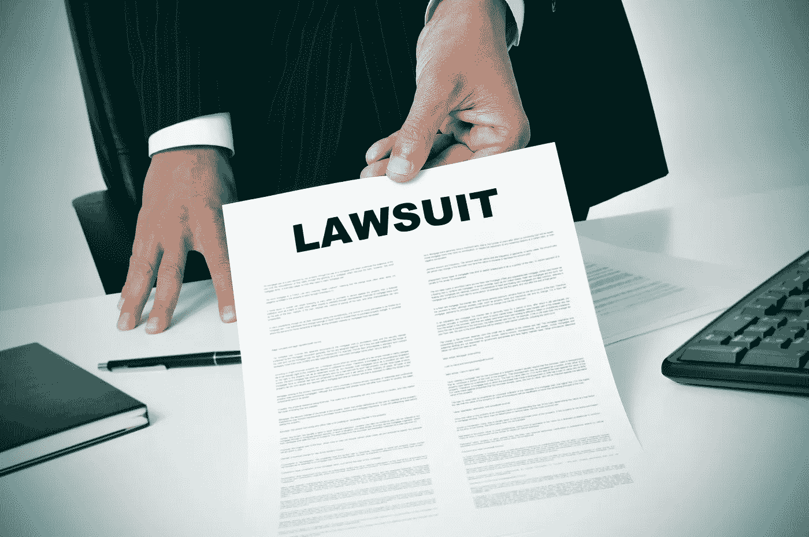

# 对安全主管的警告:不要让自己成为合法的目标

> 原文：<https://medium.com/nerd-for-tech/warning-to-cisos-dont-make-yourself-a-target-bb00776459f4?source=collection_archive---------0----------------------->

每个人都知道在激励的世界里“胡萝卜加大棒”意味着什么。前者带来快乐，后者带来痛苦。一个是奖励，另一个是惩罚。大多数人都同意，两者的恰当平衡最有可能产生任何目标——进步、成就和成功。

在网络安全领域，理论上这意味着像首席信息安全官(CISO)这样的高管会因为保护公司和客户资产免受恶意黑客攻击而获得丰厚的回报，但也会因为失败而受到严厉惩罚，特别是如果他或她没有实施最佳安全实践的话。

也许这些激励措施有点失去平衡，而偏向胡萝卜。因为激励等式的棍子一边似乎变得越来越频繁，越来越惩罚性，越来越个人化。

问问网络安全管理软件产品[的安全架构和 CISO 副总裁蒂姆·布朗就知道了，IT 供应商](https://krebsonsecurity.com/2021/01/solarwinds-what-hit-us-could-hit-others/)受到攻击，据称是由俄罗斯黑客在更新中插入恶意代码，然后发送给成千上万的客户。

这次攻击损害了 9 个联邦机构和大约 100 家私营公司。

今年早些时候，[股东蒂莫西·布雷默(Timothy Bremer)和其他人](https://www.scmagazine.com/news/breach/solarwinds-lawsuits-merge-as-stockholders-begin-documenting-financial-losses)，包括另一位投资者丹尼尔·阿兹普鲁亚(Daniel Azpurua)以及纽约市木匠退休基金地区委员会(New York City District Council of Carpenters Pension Fund)提起了[集体诉讼](https://www.scribd.com/document/489866282/Bremer-vs-Solarwinds)，不仅集体起诉了公司，还单独起诉了前首席执行官和布朗。

诉讼称，该公司缺乏安全保障，这相当于对投资者的有意或严重欺诈。很明显，这将需要一段时间才能通过法庭——网络安全管理软件产品在八月初提交了一份请求驳回的动议。

但到目前为止，首席信息安全官的回报依然丰厚——声望、影响力、高薪、多种福利。是的，负面影响也很大——CISO 或其他高管可能会被解雇。但是在一个失业率低于零的行业里，站稳脚跟或者带着金降落伞离开并不困难。

**快乐越少，痛苦越多**

证据之一可能是前 Equifax 首席执行官理查德·史密斯，他在 2018 年被国会传唤，因为这家信用报告巨头的违规行为暴露了超过 1.47 亿非自愿“客户”的个人和财务信息该漏洞是由 Equifax 未能在 Apache Struts 开源 web 应用程序框架中安装一个补丁导致的，该补丁已经发布了几个月。

当时的参议院司法委员会主席查克·格拉斯利(爱荷华州共和党人)宣称，为像 Equifax 这样的公司如何保护他们的数据制定联邦标准“早就该做了”。参议员伊丽莎白·沃伦(马萨诸塞州民主党人。)宣称“像你这样的高管应该承担个人责任。”

但在这一切之后，史密斯被允许带着 9000 万美元的薪水退休。据称愤怒的政府官员没有任何惩罚措施。

这种情况可能正在改变。针对安全高管寻求个人损害赔偿的诉讼警告已经有一段时间了。[六年前，彭博社法律的一篇文章](https://news.bloomberglaw.com/business-and-practice/do-cios-and-cisos-get-covered-in-cybersecurity-litigation)预测“在不久的将来，首席信息官和首席信息官将会被越来越多的人起诉。”

在新思科技的律师兼项目管理总监 Emile Monette 看来，这也许不是一件坏事。

“这对个人来说可能不太好，但在我看来，这对网络安全和软件保障来说是件好事，”他说。“这是为数不多的能够显著改变企业行为的事情之一。董事会和董事/高管密切关注那些会让他们被起诉的事情。”

换句话说，这是一种负激励。

Monette 补充说，直到最近,“司法标准的关注公司官员并不真正包括网络事件。这种情况正在改变，安全将会受益。许多人评论说，网络风险需要纳入董事会的信托责任范围，因为这将比其他任何事情都更好地推动企业行为，”他说。

除此之外，政府越来越明确什么是不良安全，这显然可以在法庭上被用来寻求忽视此类指令或建议的高管的损害赔偿。

*   就在上周，联邦网络安全和基础设施安全局(CISA)将远程访问的单因素身份认证(如仅使用密码)添加到其[“不良做法”列表中](https://www.cisa.gov/BadPractices)列表中的其他“异常高风险”项目是使用不受支持的或生命周期结束的软件；以及对关键基础设施使用固定或默认密码。
*   在过去的几个月里，拜登政府和包括 CISA 和国土安全部在内的联邦机构发布了一系列关于改善关键基础设施安全的具体方法的[指令和指南](https://armerding.medium.com/report-critical-infrastructure-vulnerabilities-at-record-levels-bf44f38ff100)。
*   Monette 指出，美国劳工部(DoL)在今年 2 月发布的[指南中，“明确指出，根据《雇员退休收入安全法》，雇主有受托责任确保适当降低退休计划违规的网络安全风险”，其中包括“审慎选择和监控计划记录人和其他服务提供商”的责任](https://www.venable.com/insights/publications/2021/05/dol-cybersecurity-guidance-steps-to-protect)

“DoL 对网络的新受托责任可能会说明这一责任延伸到董事会、董事和首席信息安全官的趋势，”Monette 说。“有趣的是，它将这一责任延伸到了雇主的供应链，而不仅仅是自己的企业。因此，你不能只外包一项服务，就撒手不管安全问题。”

这并不意味着 CISOs 或其他高管在面对潜在诉讼时毫无防备。没有办法阻止被起诉，但有多种方法使这些索赔难以或不可能被证明。

CISO 不一定要让一个组织刀枪不入——那是不可能的。就像不可能保证没有司机会在开车时受伤或死亡一样。但是安全带、安全气囊、防撞缓冲区、防抱死刹车、车道辅助和其他安全功能大大降低了这些风险。如果它们按设计运行，对制造商及其高管的诉讼几乎肯定会失败。

因此，在网络世界中，实施和维护最佳安全实践的首席信息安全官如果在遭到攻击后被起诉，将有一个可信的辩护理由。虽然这样做既困难又昂贵，但这并不神秘。本质上，它归结为遵循已经存在了几十年的安全标准，这些标准是由私有和公共实体制定的。这些最佳实践包括:

*   编制一份组织中最有价值的资产和信息的完整清单。正如安全会议上的口头禅所说，“你无法保护你不知道自己拥有的东西。”
*   确保你的供应链供应商和其他合作伙伴保持和你一样严格的安全级别。正如老话所说，“链条的强度取决于它最薄弱的一环。”这意味着如果你的一个供应商容易受到攻击，你也一样。
*   在您组织的软件中建立安全性，从而建立信任。它从[架构风险分析](https://www.synopsys.com/software-integrity/software-security-services/software-architecture-design/risk-analysis.html?cmp=pr-sig&utm_medium=referral)开始，以发现并修复设计缺陷，以及[威胁建模](https://www.synopsys.com/software-integrity/software-security-services/software-architecture-design/threat-modeling.html?cmp=pr-sig&utm_medium=referral)以识别恶意黑客可能攻击的方式。接下来，使用自动化工具进行[静态](https://www.synopsys.com/software-integrity/security-testing/static-analysis-sast.html?cmp=pr-sig&utm_medium=referral)、[动态](https://www.synopsys.com/software-integrity/application-security-testing-services/dynamic-analysis-dast.html?cmp=pr-sig&utm_medium=referral)和[交互](https://www.synopsys.com/software-integrity/security-testing/interactive-application-security-testing.html?cmp=pr-sig&utm_medium=referral)应用安全测试，以及[软件组成分析](https://www.synopsys.com/software-integrity/security-testing/software-composition-analysis.html?cmp=pr-sig&utm_medium=referral)，这将帮助开发者发现并修复开源软件组件中已知的漏洞和潜在的许可冲突。在开发的最后，[渗透测试](https://www.synopsys.com/software-integrity/application-security-testing-services/penetration-testing.html?cmp=pr-sig&utm_medium=referral)可以模仿黑客，在软件产品部署之前找到仍然存在的弱点。市场上还有更新的工具，如应用安全协调和关联( [ASOC](https://www.synopsys.com/glossary/what-is-application-security-orchestration-and-correlation.html?cmp=pr-sig&utm_medium=referral) )帮助安全测试跟上开发的速度。换句话说，更好的安全性不会减慢开发速度。
*   通过尽快安装补丁程序或在发现漏洞时为您自己的软件创建补丁程序，使您的软件保持最新。不要成为下一个 Equifax。
*   为如何应对攻击制定详细的计划。排练一下。
*   确保公司及其高管都投保了违约损失险。

Monette 说，企业界长期以来一直反对公司官员的个人责任，认为网络标准不明确，因为在技术上没有明确的协议来确定什么是合理的网络措施。

但这一论点在法庭上可能不再有说服力。“NIST CSF[国家标准和技术网络安全框架研究所]，OWASP[开放网络应用安全项目]，以及许多标准的存在，”他说。“与 10 年或 20 年前相比，今天对基础网络的理解要好得多。”

原告仍然必须证明该标准适用于诉讼的情况，Monette 说，这将“难以在某些背景之外证明，如受监管的行业或某些安全措施的合同要求。”

尽管如此，避免个人责任的最好方法是做好你的工作。

正如 XPAN Law Partners 的联合创始人兼管理合伙人 Rebecca Rakoski[对 secure world](https://www.secureworld.io/industry-news/ciso-lawsuit-solarwinds)所说的那样，“高管层成员对组织负有更大的责任。首席信息安全官需要在技术设备上花费更少的时间和金钱，而在培训、响应、供应商审计和创建保护组织的清晰、简洁的合同上花费更多的时间和精力。”