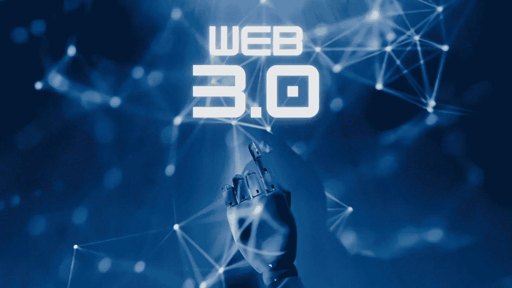
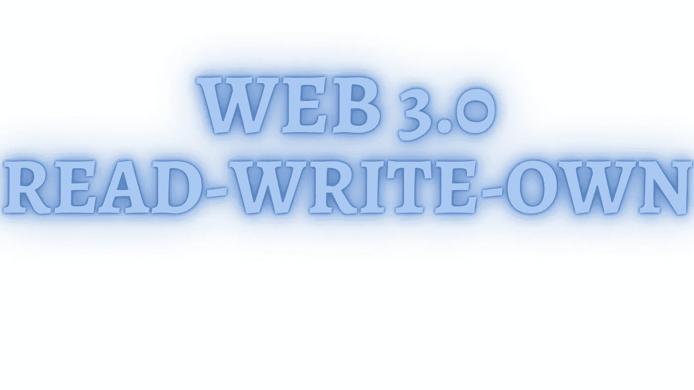

# WEB 3.0:你需要知道的一切！

> 原文：<https://medium.com/nerd-for-tech/web-3-0-all-you-need-to-know-b74c4113e2ce?source=collection_archive---------2----------------------->

每天都有数十亿人使用万维网来阅读、书写和分享信息。在过去的几年里，网络已经发生了变化，它现在的应用程序与早期相比已经面目全非。web 的发展通常分为三个阶段:Web 1.0、Web 2.0 和 Web 3.0。你一定听说过“区块链”技术或“比特币”这样的流行语。万维网已经为我们所知。Web 3.0 也称为 Web 3，是基于区块链技术的万维网(WWW)的一个新版本。在早期，只读 web 被开发出来，被认为是 Web 1。后来，互联网变得更加互动，具有一些读写功能和一个叫做社交媒体的重要功能。据说是 Web 2。而现在，这是 Web 3 时代。但是 Web 3 到底是什么？Web 3 有什么特点？而 Web 3 的优势是什么？在这篇文章中，我们将看到你需要知道的关于 Web 3 的一切。

1.  什么是 Web 3？
2.  Web 3 的特性
3.  Web 3 的优势
4.  有趣的事实
5.  关键要点

1.  什么是 Web 3.0？

继只读 web 1.0 和读写 Web 2.0 之后，Web 的新版本是 Web 3.0，它将是一个读写执行的 Web。在 Web 1.0 中，数据和内容是由静态文件系统而不是数据库提供的。在 Web 1.0 中，甚至连互动都很少。Web 2.0 是 Web 的最新版本，任何人都可以参与到创建过程中。参与创建过程的人不一定是开发人员。Web 3.0，也被称为语义 Web，是暗示 Web 未来的时代。Web 3.0 是基于区块链技术的新版 Web。区块链是一个以这样一种方式记录信息的系统，这种方式使得黑客攻击或更改信息变得非常困难或几乎不可能。它也被称为“分布式分类账”。在机器学习和人工智能的帮助下，计算机可以像人类一样分析数据。以前版本的主要关注点是标签和最终用户体验，但在 Web 3.0 中，主要关注点将是通过隐私和安全增强用户能力。以前版本中的驱动技术是 HTML5、CSS3、JavaScript 和 AJAX。Web 3.0 将基于人工智能、机器学习和区块链技术等技术。Web 3.0 也将利用 3D 图形。

2.Web 3.0 的特性

一.数据的分散化:

在一个分散的网络中，个人将能够控制他们的数据。数据网络的分散化使得数据生产者在不丧失所有权的情况下更容易出售或交换数据。

二。人工智能:人工智能有助于区分数据的真假。在人工智能的帮助下，分析数据和个性化结果变得更加容易。因此，网站可以过滤并向用户提供最佳结果，因为这有助于向用户提供更快和更相关的数据。

三。3D 图形:

Web 3.0 网站不仅在游戏中，而且在医疗保健领域、电子商务、地理环境、房地产市场和其他应用中有效地利用 3D 图形。

四。无处不在/元宇宙:

普遍性术语指的是同时出现在多个地方的概念。借助这一功能，任何人都可以随时随地访问互联网。

3.Web 3.0 的优势

1.  人类和企业可以共享更多隐私和安全的数据。最终用户将重新获得对其数据的完全所有权和控制权，并拥有加密的安全性。
2.  Web 3.0 的最大优势之一是任何人都可以从世界任何地方访问数据。它确保用户可以尽可能多地访问信息。
3.  因为没有单点故障，所以服务中断的可能性最小。数据将存储在分布式节点上，以确保冗余。此外，将有多个备份来防止服务器故障。
4.  没有人能控制他人的身份。像以太坊这样的可信平台是由区块链提供的。在这项技术中，数据是完全加密的，规则也是不可破解的。

虽然有一些好处，如有效的搜索和浏览，以及有效的互动；不得不面对一些缺点或挑战。最重要的是，实际开发 Web 3.0 相当复杂。不太先进的设备将无法处理 Web 3.0。而且对于新人来说会有点难以理解。此外，不一致的数据会导致逻辑矛盾和不可预测的分析。虽然人工智能将有助于过滤数据，但如果所有提供的数据都是误导性的，这可能会成为一个巨大的问题。

4.有趣的事实

Web 3.0 也被称为“语义网”。如果非要举一个 Web 3.0 的例子，苹果 Siri 就是最好的例子。创建 web3 应用程序而不涉及元宇宙是可能的——比特币就是一个例子。Web 3.0 的应用有很多比如 Sapien，比特币，EverLedger 等。

5.关键要点

1.  Web 3.0 是互联网的未来，也被称为“语义网”。
2.  Web 3.0 不仅提供读写功能，还提供信息交换功能。
3.  在 Web 3.0 的帮助下，搜索和浏览体验将得到改善。
4.  Web 3.0 将使用区块链技术、人工智能和机器学习。
5.  开发 Web 3.0 是一项复杂的工作，但它将改变当前的 Web 浏览体验。