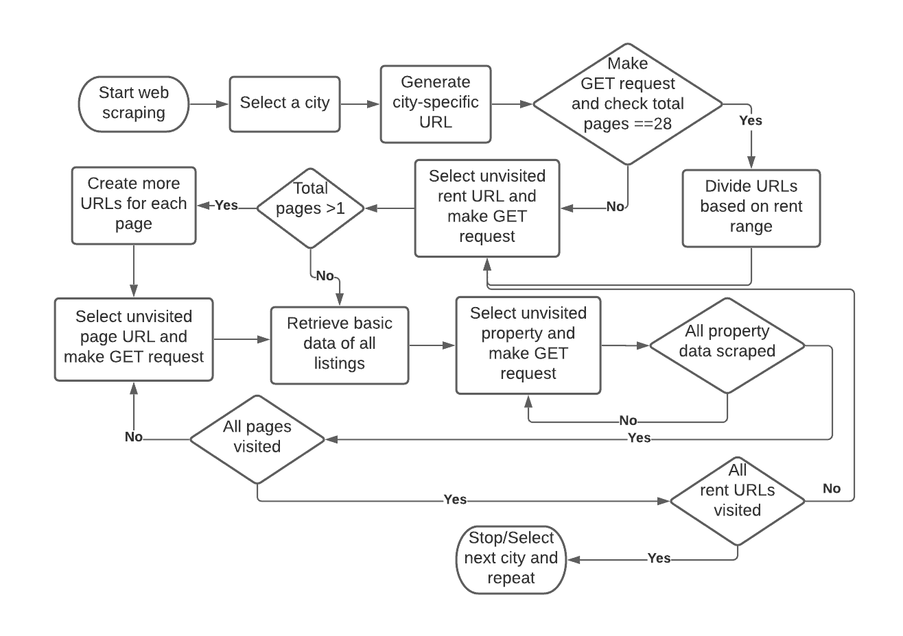
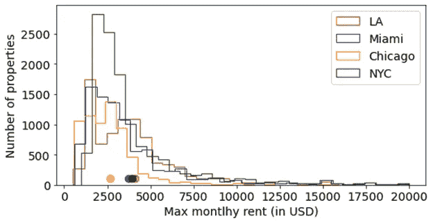

# Web 抓取和存储非结构化数据:抓取 Apartments.com 的一个例子

> 原文：<https://medium.com/nerd-for-tech/web-scraping-and-storing-unstructured-data-an-example-of-scraping-apartments-com-c786b4bfa881?source=collection_archive---------2----------------------->

## Python 中 web 抓取和文档数据库的结合为从网站收集和存储非结构化信息提供了一种便捷的解决方案。

图片作者: [Wonderlane](https://unsplash.com/@wonderlane) 在 [Unsplash](https://unsplash.com/photos/6jA6eVsRJ6Q)

互联网上的大量数据几乎是免费的，并且有可能被用来在各个领域产生有价值的见解。然而，这种数据通常以非结构化格式提供，下载和存储仍然是一项具有挑战性的任务。虽然从许多网站抓取网页并不困难，但是一个可靠的、自动化的网页抓取器必须能够快速地存储信息，而不会产生任何错误，以便可以在以后清理和处理数据。

以前，我只使用 SQL 数据库保存下载的数据，这意味着我必须将所有信息转换成具有已知列名的表格格式。当信息总是以表格的形式存在时，这种做法是可行的。然而，当我试图从(例如，Apartments.com)存储房产信息时，我无法抓取，因为脚本经常因数据格式不匹配而停止。将 SQL 数据库用于非表格细节需要持续的手动干预。然后有人建议使用非关系型数据库，这是为这个特定目的而设计的。

在这篇博客中，我将向您展示如何结合使用 web 抓取和 Python 中的文档数据库来检索大量的属性细节，这些细节可以在以后的模型构建练习中使用。整个步骤显示在流程图中，并在以下章节中进行解释。

来源:作者使用 https://lucid.app/[的图片](https://lucid.app/)

# 生成基本 URL

Apartments.com 显示各个城市的房产列表。每个城市都有一个唯一的 URL，其中包含城市的名称以及城市所在的州。例如，纽约市的所有租金都张贴在[https://www.apartments.com/new-york-ny/](https://www.apartments.com/new-york-ny/)上。还需要注意的是，URL[https://www.apartments.com/new 纽约/](https://www.apartments.com/new-york-ny/) 似乎也可以使用(空格代替破折号'-')。

通过添加城市和州的详细信息，可以为少数城市手动生成上述格式的 URL。然而，如果手动下载许多城市的房地产数据，可能会很痛苦。幸运的是，总有一种做事的方式。Python 有“uszipcode”包，其中提供了该国所有城市的城市和州名以及其他地理信息。下面的代码显示了我们如何获得获取数据所需的 URL 列表。

下面的块通过打印出形状和前五行来显示上述地理数据帧的形状和内容。虽然我们有美国所有城市的 URL，但是我们将把这个练习限制在探索纽约市(NYC)的租金。

# 在 URL 中添加租金范围

一个城市的基本 URL 每页最多只显示 25 个属性，总共 28 个页面，所以我们还需要遍历所有页面。如下图所示，修改 URL 以包含页码很容易:

然而，在不提及任何搜索标准的情况下，人们最多只能浏览 700 个属性(25*28)。对于有超过 700 个房源的城市，我们必须缩小搜索范围，以便收集尽可能多的房源信息。纽约市似乎有大约 15，000 处房产，但也应该注意到，一个广告可能有多个可用的子单元。这意味着实际可用列表的数量可能少于 15，000，但仍然远远高于 700。

我发现输入租金范围是实现这个目标的一个不错的方法(确保显示小于 700 的房产)。例如，可以进一步修改一个基本 URL，以查找小范围租金之间的房产(从 200 美元增加到 15，000 美元)。下面的代码片段展示了如何做到这一点:

上述代码的输出如下所示:

对于每个基本 URL，都必须完成上述练习。如果城市有 700 个或更多的属性(由等于 28 的页面数量的代理指示器检查)。在少于 28 页的情况下，可以跳过这一步。

虽然这并不完美，但它仍然允许我们收集尽可能多的列表。一个物业可能会在多个租金类别下显示，但是因为每个物业都有一个唯一的 id，所以我们只需检查是否已经收集了关于该物业的信息，避免重复，如下一节所述。

# 在 URL 中添加页码

一旦我们通过在所选城市(在本例中为纽约市)的基本 URL 中加入租金信息来缩小搜索范围，我们就可以开始查询了。让我们先来联系一下[https://www.apartments.com/new-york-ny/1300-to-1500/](https://www.apartments.com/new-york-ny/1300-to-1500/)。默认情况下，此链接会将我们导向第一页。

任何 URL 的第一页都显示了总页数(或页面范围)，这让我们可以知道在这个范围内我们需要访问多少个页面 URL。如下图所示，对于网址[、](https://www.apartments.com/new-york-ny/1300-to-1500/)有 12 个页面。我们可以使用这些信息，并为该价格范围创建特定于页面的 URL。

# 使用文档数据库

文档数据库不同于典型的关系数据库(例如 SQL)。一个文档数据库[有](https://www.mongodb.com/blog/post/getting-started-with-python-and-mongodb)多个集合(类似于 SQL 中的表)，每个集合可以有多个文档(类似于 SQL 中的行)，方案灵活。另一方面，关系数据库需要[规范化，](https://docs.microsoft.com/en-US/office/troubleshoot/access/database-normalization-description)，这意味着为了安全和存储效率，数据必须以预定义的结构来组织。

虽然关系数据库在一致性和直观性方面有许多优势，但当新数据没有键/值结构并以这样或那样的方式不断被修改时，这些优势就很糟糕了，这在 web 抓取期间是常见的情况。在这篇博客中，我使用了 [MongoDB](https://www.mongodb.com/blog/post/getting-started-with-python-and-mongodb) ，这是一个流行的文档数据库，用于存储属性细节。

# 正在检索属性信息

每个 URL(具有或不具有微调的搜索标准)仅提供关于每个租赁广告的基本信息，包括资产 URL。酒店 URL 是该酒店的个人网页，包含所有详细信息，如设施、租金、子单元的可用性、位置等。URL[https://www.apartments.com/new](https://www.apartments.com/new)York-ny/1300-to-1500/3/有 25 个房产列表，下面的代码块收集了每个房产的详细信息。

下面的代码片段首先抓取所有 25 个广告的基本信息，然后，仅当其细节尚未被抓取时，才遍历每个列表:

个人财产详细信息包括地址、租金、卧室/浴室数量、宠物政策、便利设施、特征、学校、学院、交通以及许多可用的此类详细信息。下面显示了一个示例:

数据具有键/值结构，但值可以是数字、字符串、字典或列表。想象一下，如果您以表格形式存储这些信息。由于数据中没有统一的模式或“结构”，将其转换成表格格式将是一场噩梦。由于数据和细节的“嵌套”分类的存在，SQL schema 或 dataframe 可能会由于列名或值的不匹配而不断产生各种错误(我试过，结果很糟糕)。文档数据库已经为存储这种信息提供了合适的模式。

# 住房成本

因为我们已经如此努力地达到这里，我们必须探索至少一些基本的细节作为我们的奖励。使用我刚刚描述的脚本，我已经下载了纽约市、洛杉矶、迈阿密和芝加哥的数据。每个城市大约有 10，000-12，000 处房产。最大租金分布如下所示，x 轴上的标记表示租金上限的简单平均值。芝加哥似乎是生活成本最低的地方，而洛杉矶仍然是四个城市中生活成本最高的。

来源:作者图片

# 计划脚本

虽然只下载一次数据有很大的好处，但是 Python 中的调度包允许您在每天的特定时间重复该任务。存储一个城市在一段时间内的属性详细信息可能用于趋势或时间序列分析。我没有在这里展示它是如何做到的，但是你可以阅读[文档](https://apscheduler.readthedocs.io/en/stable/userguide.html)来开始。

# 总结想法

获取数据只是建模和得出有意义见解的第一步。各种数据继续保持非结构化状态。这个博客展示了如何轻松下载非结构化的财产信息，并方便地将它们保存在文档数据库中。当建模需要时，可以从数据库中检索相关信息。在即将发表的博文中，我将使用几个大城市的数据，看看我们是否可以从房地产数据中找到有趣的见解。