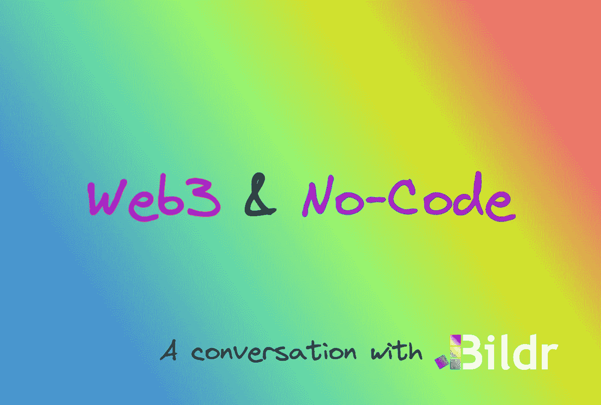
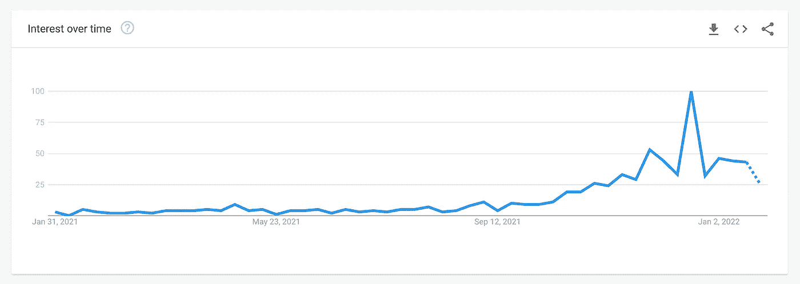
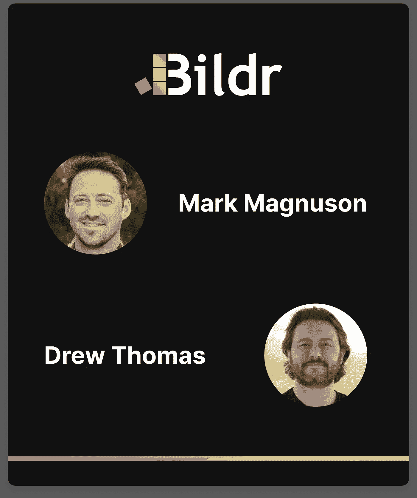
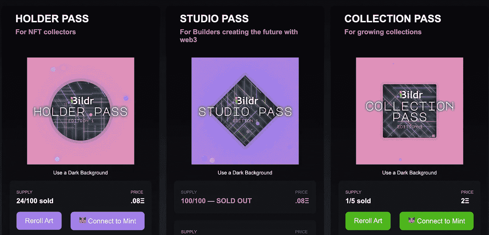

# Web3 和无代码

> 原文：<https://medium.com/nerd-for-tech/web3-no-code-1b5e346b2a98?source=collection_archive---------2----------------------->

## Bildr 如何结合科技的最大趋势来创造未来。

在 2021 年的大部分时间里，“无代码”和“创造者经济”是风险投资界的热门词汇。今天，它们已经被一个风靡全球的新流行语“web3”所取代。风险投资已经筹集了数十亿美元的资金。无聊的猿类是新的身份象征。杰克·多西和马克·安德森甚至在推特上为这个话题争吵不休！

谷歌在过去 12 个月中对 web3 的兴趣趋势

在这些喧嚣之下，有一群人真诚地相信 web3 是互联网的未来。但是如果你还没有冒险进入兔子洞，那到底是什么呢？web3 对 SaaS 公司有什么影响？它怎么会和无代码交叉呢？

我与马克·马格努森和《图片报》的德鲁·托马斯聊了聊，他们处于这些趋势的最前沿。Bildr 是一个可视化的 web 开发工具，让你不用写代码就能创建 web 应用程序。就在上个月，Bildr 成为第一家通过为用户推出一套 NFT 来整合 web3 的无代码公司之一。Mark 和 Drew 分享了他们对启动 Bildr、进入 web3 以及 web3 +无代码的未来的见解。

# ‍founding·比尔德

当像“无代码”这样的空间升温时，一些企业家会冲向市场，希望快速淘金。另一方面，Bildr 是在“无代码”这个术语进入集体意识之前很久就开始有机运作的。2006 年，马克·马格努森从大学辍学，创办了一家咨询机构。大多数机构向客户交付定制代码，但是 Mark 和他的团队采用了另一种方法。他们的机构使用一个自制的无代码工具来交付结果。每当客户提出他们的工具不支持的请求时，他们就升级工具。随着他们争夺更大的合同，他们收到了更多的定制请求，提升了平台。

> 我们不需要硬编码任何东西，我们只需要升级平台。我们差不多又这样做了十年。我们已经到了销售价值数百万美元的定制 ERP 套件之类的东西的地步。我们将从头开始构建它们，无需编写任何代码。

有趣的是，德鲁的职业生涯有一个相似的开始。上大学时，德鲁也创办了一家咨询机构。他也利用无代码工具来交付客户工作。虽然他没有创建一个平台，但德鲁作为美国为数不多的无代码机构之一，走在了一个主要趋势的前沿。最终，他决定通过创建[无代码列表](https://nocodelist.co/)来利用他的知识——一个共享和发现无代码工具的资源。没有代码列表获得了流行，给了德鲁一个前排座位，所有最新的工具在该空间推出。

经过 14 年的发展，他的内部工具，马克看到了一个机会。随着 Webflow 等平台开始起飞，他认识到他的系统可以让其他人创建自己的网络应用程序。2020 年，马克正式分拆出 Bildr，并投入时间将该工具产品化。大约在那个时候，他开始寻找一位设计师来领导 Bildr 团队。马克偶然发现了德鲁的咨询业务，于是决定伸出援手。在为德鲁演示比尔德时，我们一见钟情。

> 他们很随意地为我演示了 Bildr，这是一个完全的范式转变。我[用 Bildr]看到的，在其他任何无代码工具中都没有看到。这是最通用的工具。那是我突然想到的地方。

该领域的竞争最近加剧了，但 Bildr 正在将自己从群体中分离出来。由于产品的无主见性，他们激发了早期用户的热情。与其他无代码工具不同，Bildr 是代码之上的一层。它的学习曲线比大多数都要陡峭，但实际上对你能做什么没有限制。他们的早期采用者社区比大多数更具技术性，在他们最初进入 web3 的过程中发挥了重要作用。‍

# 定义网站 3

Web3 已经成为一个如此时髦的词，它被赋予了各种不同的含义。在进入 Bildr 的 web3 方法之前，我想准确地确定它的含义。虽然他们承认 web3 可能有点模糊，但 Mark 和 Drew 对 web3 的定义基本上是关于去中心化认证的。这是使用加密钱包进行身份验证的独特方式，无需中介即可转移资金，并利用去中心化。

在 web3 中，每个人都有一个钱包，可以通过像[比特币基地](https://www.coinbase.com/wallet)或[彩虹](https://rainbow.me/)这样的工具生成。这个钱包是独一无二的，可以用来存放 NFT，转账，或登录服务。从技术角度来看，这是 web3 的症结所在。分散认证的结果仍然未知，但 Bildr 认为它具有潜在的变革性。

在 web3 世界中，公司和用户之间的关系是“不信任的”作为一家 SaaS 公司，除了用户的钱包 ID，你不需要知道用户的任何信息。作为用户，你可以单点登录服务，不需要像谷歌或脸书这样的中介。这样，您就拥有了您的身份验证。马克将此比作开源动态的分散版本。

> 如果你从事开源项目，人们会去看你的排名，对吗？你对这些开源项目投入了多少？你可以在你的社区中获得影响力。你可以因此被雇用。你可以因此赚更多的钱。这是同样的事情。‍

# Bildr 通行证

虽然想象 web3 的未来很迷人，但马克和德鲁并不只是在谈论它。12 月，Bildr [为用户推出了 NFT 收藏](https://web3.bildr.com/)。与新闻中的大多数 NFT 不同，Bildr 通行证完全集中在公用事业上。除了其他社区福利外，工作室通行证的持有者还可以终身使用 Bildr 产品。

工作室通行证也激发了 Bildr 和客户之间的新关系。购买 NFT 时，用户可以选择通行证上的艺术品。这项功能让用户参与代币的创建，让许多人在社交媒体上分享他们的购买。马克和德鲁说，这已经直接转化为社区，因为用户感觉到更多的平台所有权。

> 你对你正在做的事情有一种责任感。真的很有意思。你不能用 Stripe 得到这些…结果是他们想要分享这些东西，因为他们参与了创建。

这个模型的有趣之处还在于，理论上用户的下行空间有限。NFT 终身通行证是可以转让的，所以你可以在公开市场上出售。如果工作室通行证的所有者决定离开 Bildr，他们可以通过出售收回资金。有风险因素，如 ETH 的价格，但从根本上说，这是一种购买 SaaS 的新方法。从 Bildr 的角度来看，他们看到了额外的好处，因为以前的客户在离开时会带来新的客户。

https://web3.bildr.com/

总而言之，马克和德鲁将此视为一项实验，尽管这可能会产生重大影响。在 NFT 通过之前，他们想知道这是否有用，甚至是否可行。在进行了第一次实验后，团队一致同意他们应该继续这样做。‍

# Web2.5

马克和德鲁对 web3 很乐观，但他们对时间表也很现实。这是 web3 的早期阶段，因为原语仍在构建中。他们设想的不是一夜之间的转变，而是 10 年以上的演变。

> 我认为人们也应该认识到，至少十年内我们不会真的搬到那里去。就像云一样。我们已经完全在云端了吗？我们还没到那一步。已经过去 20 年了，但传统公司仍然有本地服务器，而且还有空间。web3 也将如此。我们处于 web 2.5 时代。

在“web2.5”中，传统的 SaaS 公司将开始在他们的 web2 产品中加入 web3 组件。目前，用户和平台还没有达到采用的临界点，这有点先有鸡还是先有蛋的问题。随着越来越多的用户创建加密钱包，将去中心化的认证整合到 SaaS 应用中变得更有意义。‍

# Web3 和无代码

虽然强大的技术支撑着 web3 运动，但一种特定的文化也伴随着它。马克和德鲁描述了 web3 的独特气质，或者用他们开玩笑的话来说，就是“氛围”。他们把这种文化比作早期的互联网，那时每个人都在尝试，互相鼓励。

> 我[不敢相信]我大声说出了共鸣，但是当你置身其中，你就像…这就是共鸣。事实上就是这样。这就像无代码 Twitter 的早期一样疯狂。每个人都非常积极……它只是吸引你。你想成为它的一部分。

这个无形的组件就是 web3 和无代码冲突的地方(🤝).Web3 和无代码都有一个共同的目标，那就是拓宽世界的做事能力。这些运动都设想了一个更多人成为创造者的社会。被吸引到边疆的人，自然被两者所吸引。我们在不和谐群体和 Twitter 对话中反复看到这种情况。

> 很大一部分人会说，“嘿，我在无代码方面处于前沿，现在我将在 web3 方面处于前沿。”对于这个群体中的许多人来说，这是一个自然的过渡。我完全理解。

具有讽刺意味的是，尽管他们的兴趣重叠，今天的 web3 并不是特别的无代码友好。从事编程近二十年的 Drew 仍然觉得自己是智能合约的新手。幸运的是，这正是 Bildr 这样的工具可以帮助弥合差距的地方。马克和德鲁认为，用 Bildr 可以构建任何东西，包括 web3。