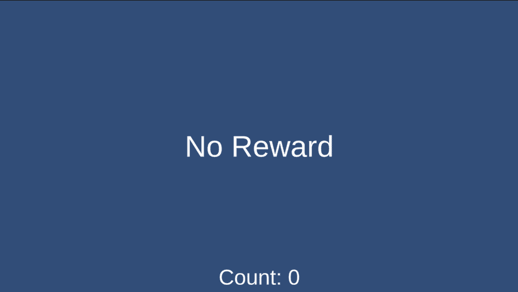
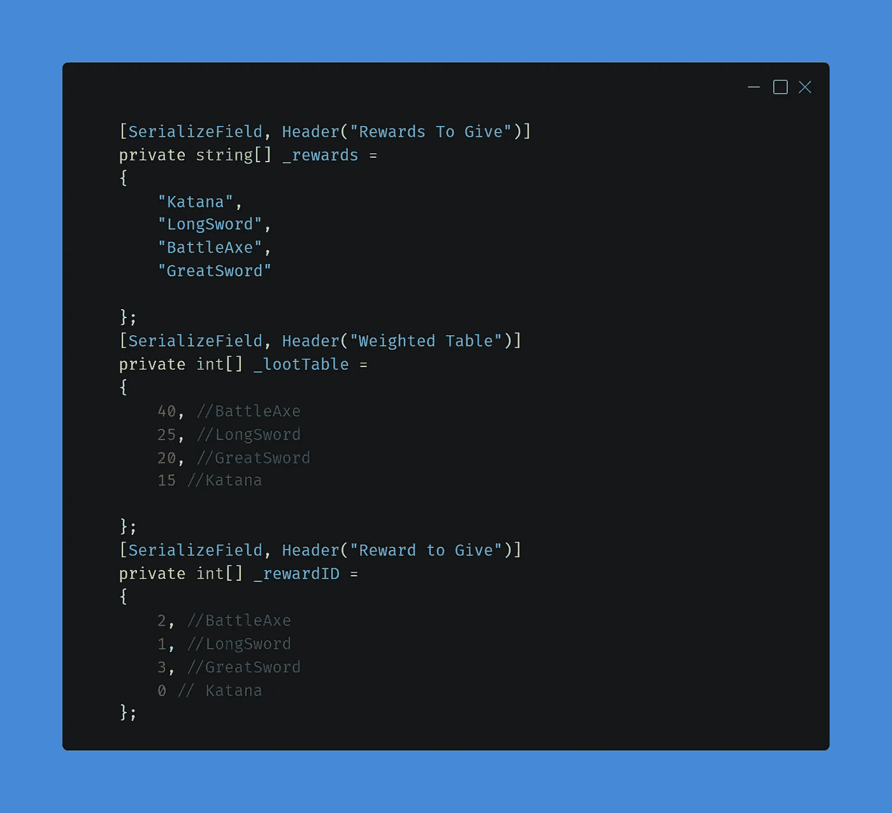
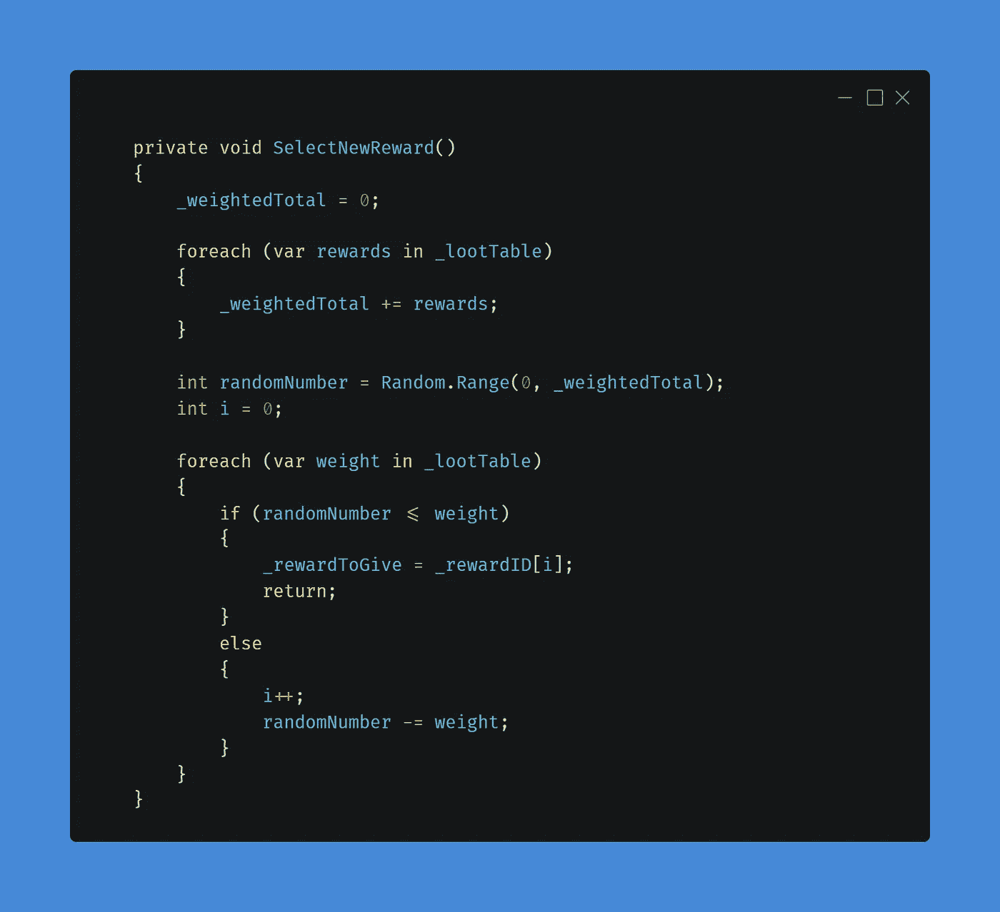
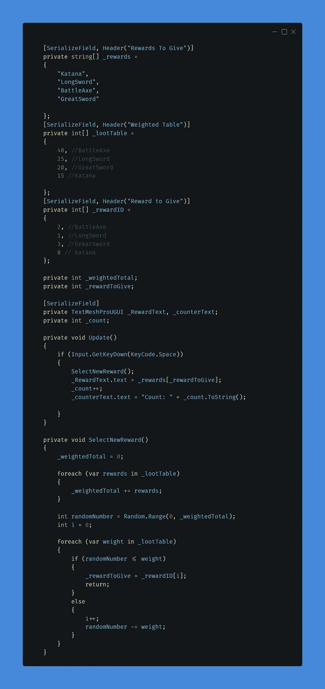

# 加权稀有度表

> 原文：<https://medium.com/nerd-for-tech/weighted-rarity-table-8fc69d6a491b?source=collection_archive---------6----------------------->

在这个挑战中，我必须创造一个系统，在这个系统中，一些敌人比其他人更容易繁殖，同样的，在这个系统中，像弹药这样的东西会繁殖得更快，而像三连击这样的东西繁殖得更慢。

> 在敌人和皮卡之间创造一个平衡的产卵系统。在弹药频繁的地方，像健康这样的拾取应该很少。

在本文中，我不会深入讨论我是如何完成这个挑战并在我的项目中实现它的。相反，讨论手头的挑战，解释我是如何找到解决方案的，并通过一个通用的演示来解释该解决方案，该演示可以以多种方式理解和应用。

我做了一些研究，经常出现的是加权系统。基本上它是如何工作的，如果你有三个对象，A，B，和 c。

a 的值为 60
B 的值为 30
C 的值为 10

A、B 和 C 的总和是 100。a 值最大，是“最重”，其中 C 值最小，是“最轻”。与较重的数字相比，较轻的数字更少。这可能没有任何意义，让我来解释一下。

所以我们的数字加起来总共是 100，然后你在 0 到 100 之间随机抽取一个数字。比方说数字 49，你接着检查 49 是否大于 60 (A)？不，49 不会大于 60，那么 A 就是你得到的对象。如果你抽一个新数字，但这次是 72。72 比 60 (A)大吗？是的，它是。然后你要做的是从 72 减去 60，得到 12。现在这个点上，A 已经不在图中了，12 比 30 (B)大吗？不，它不是，因此 B 是你的对象。最后，让我们画一个新的数字。这次我们得到 98 分。98 比 60(A)大吗？是的，但是让我们从 98 减去 60。我们的新值是 38。38 比 30 (B)大吗？是的，但还是要从 38 减去 30。我们的值是 8。8 比 10 ( C)大吗？不，不是最后，C 是我们的对象。

数学可能有点难懂，但这就是我们称量物品和定义稀有性的方式。理论上，数学很简单，我不得不自己计算这些数字。让我们用代码复制一下。

为了这篇文章，让我们想象我们在地牢里有一个箱子，当你打开它时，你可以得到四种武器中的一种。

*   战斧- 40
*   长剑- 25
*   伟大的剑- 20
*   武士刀- 15

我创建了一个名为 WeightedLootTable 的脚本，并将其加载到我选择的 IDE 中。接下来，我创建了指定要给出的对象、它们的重量和 ID 的表。对于本文，我有一个空场景，屏幕上有一个文本元素，显示赢得了什么项目。我还决定使用一个字符串数组，它包含要给出的对象的名称，但是如果你想给出实际的对象，你可以使用一个游戏对象数组。接下来，我创建了一个 int 数组来存储对象的权重，最后我创建了第二个 int 数组。这可能不是必要的，但如果你的对象在数组中没有排序，这是很方便的，这样你就可以按照你想要的方式存储它们，但仍然给出正确的奖励。

注意奖励的顺序，这需要匹配以给出正确的奖励。

记住两件重要的事情，首先，重量应该总是从最重到最轻，你不应该有两个相同重量的奖励。我已经测试过了，导致了一些不一致。

让我们计算一下重量，并给予奖励。理想情况下，脚本中应该有两个函数。一个给出奖励，一个计算奖励。负责给予奖励的函数将首先运行计算给予奖励的函数，然后给予奖励。但是我们将稍后讨论第一个函数，因为这不是我们这里的重点。

我们需要做的第一件事是创建一个全局 int 变量来存储计算出的总重量，我将其命名为 mine _weightedTotal。我们需要添加的下一个变量是另一个用于奖励的 int，我再次将它命名为 mine _rewardToGive。一会儿你就会明白为什么它们很重要。我创建了一个名为 SelectNewReward()的私有 void 函数，我们要做的第一件事是清除 _weightedTotal。这在你从数组中添加或删除奖励时很重要。然后我们需要在 foreach 循环中合计奖励的权重。完成后，我们创建一个名为 randomNumber 的局部变量，它等于 Random。Range(0，_weightedTotal)以获取一个介于 0 和 100 之间的数字。

接下来，我们创建另一个名为 I 的局部变量，并使其等于 0。一旦完成，就该比较我们随机得到的数字了。对我们的体重感到愤怒。为此，我们使用一个 foreach 循环，在该循环中，我们比较一个名为 weight in _lootTable 的局部变量。然后我们检查我们的随机数是否小于或等于重量。如果这是真的，我们将给予相应的奖励和回报。如果 If 语句不成立，那么我们将 I 加 1，并从 randomNumber 中减去权重，并继续再次检查 randomNumber 是否小于或等于权重。这样循环下去，直到我们找到奖励。

在这一点上，我们现在可以工作，我们的函数，将给予奖励。我在 Update()中创建了一个 if 语句来检查我们是否按了空格键，然后选择一个奖励并在屏幕上显示为文本。但是你可以随心所欲地使用它。

# 完整的剧本

# 结论

当我第一次开始我的平衡产卵挑战时，我可能花了一周的时间来弄清楚这个系统是如何工作的，以及为什么 rewardID 是混乱的，而不是像 1，2，3 这样的顺序。

我希望你明白我在解释什么。我在 Medium 和 Unity 论坛上找到了其他文章，但大多数都很模糊，没有完全理解 _rewardToGive = _rewardID[i]的来源，所以我做了大量的测试和重写来理解这个系统。但是一旦你明白了它是如何工作的，就没那么难了。