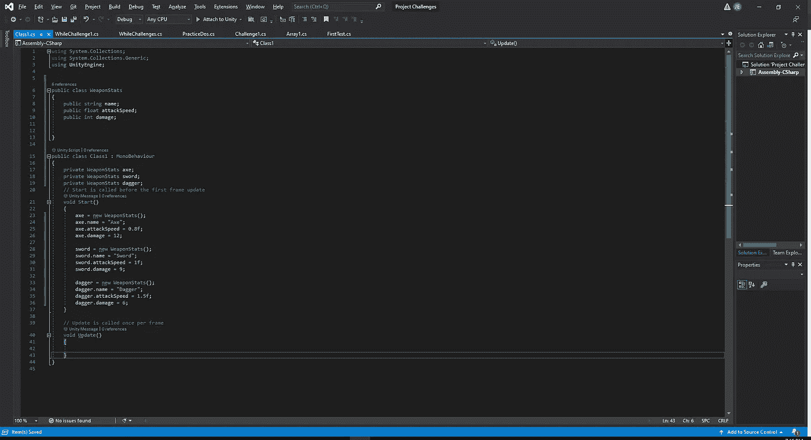
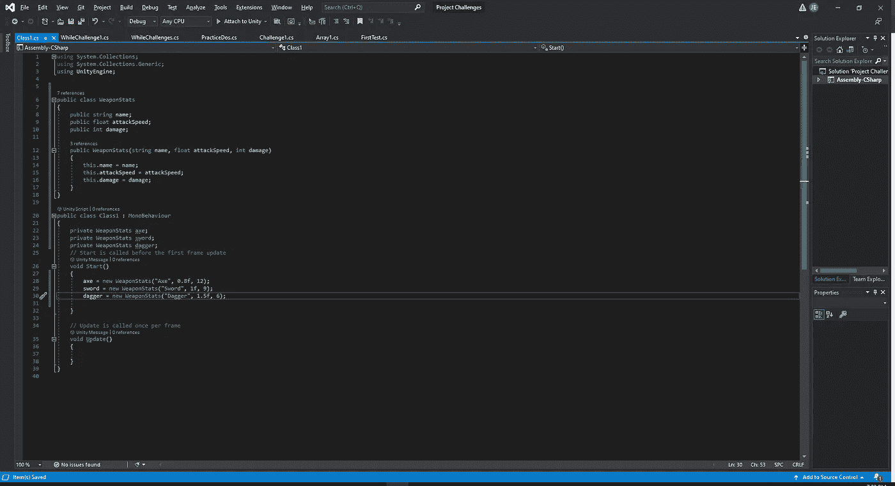
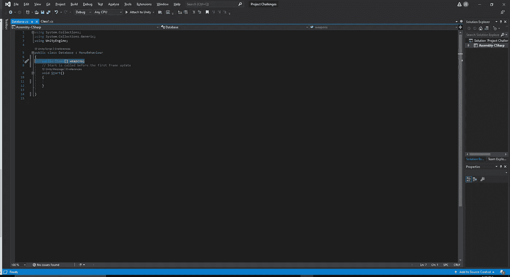
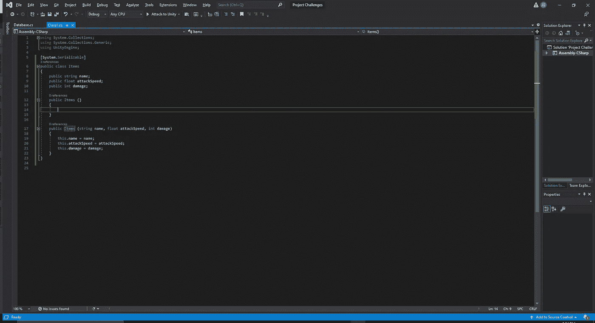
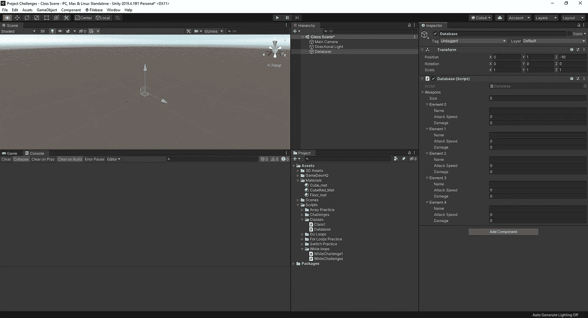
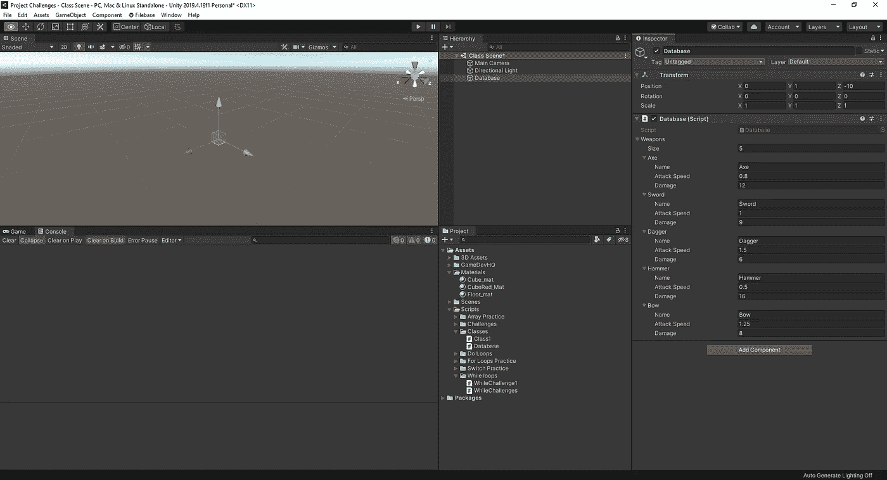
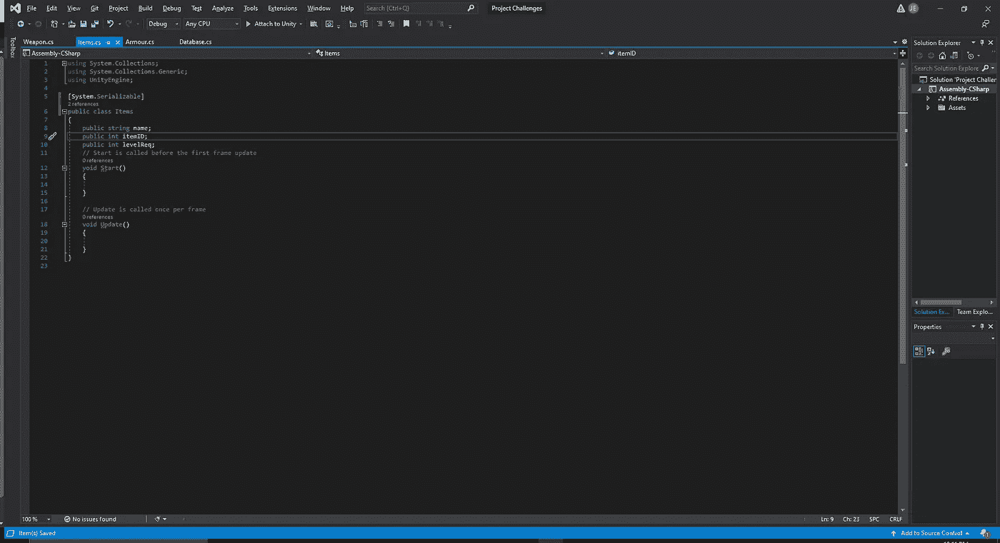
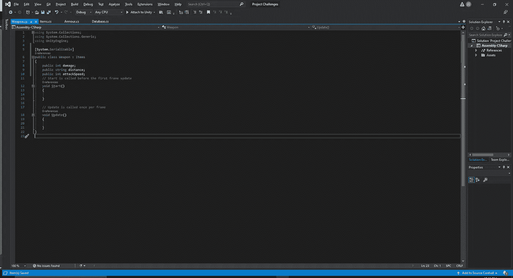
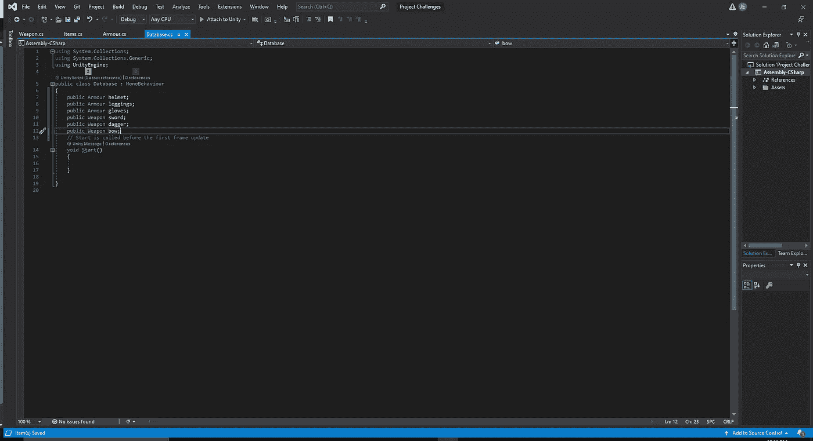
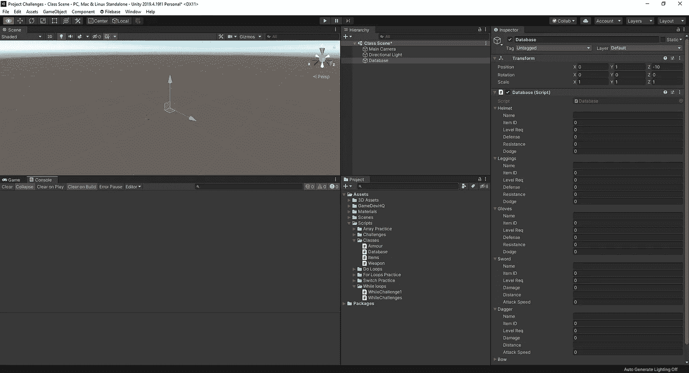

# 什么是 Unity 中的类

> 原文：<https://medium.com/nerd-for-tech/what-are-classes-in-unity-620e467fd4f?source=collection_archive---------8----------------------->

类是面向对象编程(OOP)的重要组成部分。前提是你能创建干净的，有组织的程序。它允许您将功能划分到单独的类中，并为每个单独的功能提供方法。我们使用它的原因是因为它更容易调试和维护。让我们快速地看一个例子，看看如何创建一些方法来创建代码，以及为什么通过一个更简化的类方法来创建更容易。首先，我们可以在 monobehavoiur 之上创建一个新的公共类:

正如我们所看到的，我们有我们的武器名称，攻击速度和伤害作为这些武器的变量。接下来，我们可以在我们的单行为中调用每个单独的武器，然后在我们的 void start 中输入所有信息。然而，如果我们想增加另外 10 种武器类型，这将是一个漫长而繁琐的过程，可以简化。其中一个方法是我们可以在新类中创建一个构造函数:

正如我们在上面的例子中所看到的，我们用了 4 行代码来定义每个武器的属性，而每一个单独的物品只用了 1 行代码。

在这里，我们有 3 种不同的方法来创建我们的新项目脚本和在我们的数据库中创建新项目的项目统计。现在，如果我们想创建一个数组，我们可以简单地这样做:

为了让我们能够在我们的 Unity 编辑器中查看这个，我们需要确保返回到我们的 Items 类并创建一个[System。Serializable]代码行来使它工作，并确保我们消除了类中的 Mono 行为:

从这里，我们可以进入我们的 Unity 编辑器，创建我们想要的项目并在那里进行调整，如果您只是在那里设置程序，那么游戏设计人员可以随时进行更改:

如果我们从这里开始填写，一旦我们在编辑器中进行调整，名称就会改变:

现在，让我们快速看一下如何通过类继承来构建一个项目系统。首先，让我们设置我们的项目脚本，以获得我们希望所有项目使用的一般信息:

接下来，让我们为盔甲和武器添加一个脚本，并根据他们的物品类型给他们一些我们希望他们拥有的职业特定属性:

最后，让我们进入我们的数据库脚本，添加一些盔甲和武器，并在我们输入它们时给它们分配适当的职业，同时确保所有 3 个先前的脚本都有[System。Serializable]以便我们可以在编辑器中看到属性:

最后，让我们来看看我们的编辑器，看看盔甲和武器如何共享相同的基础属性，但又有特定的职业属性:

正如我们所看到的，防具和武器类特定物品除了 3 个基本的共有属性外，还有它们各自的属性。现在我们已经对职业有了一个基本的了解，我们可以看看如何在未来的游戏中进一步实现它们。