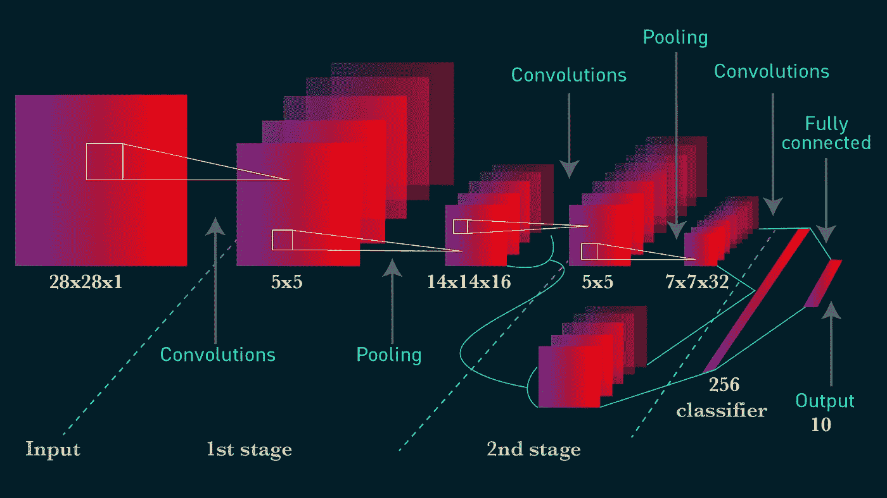

# 什么是卷积神经网络(CNN)？

> 原文：<https://medium.com/nerd-for-tech/what-are-convoluted-neural-networks-cnn-b207821fd665?source=collection_archive---------16----------------------->

我们经常分别听到深度学习和机器学习这两个术语。对机器学习和深度学习有着强烈的需求。我们已经看到了深度学习和机器学习的兴起，以及它在农业、医学和计算等不同部门的应用。我们每天都看到新的机器学习应用程序被创建，以及我们将如何分别为不同的应用程序使用深度学习。

图片来自[https://analyticsindiamag . com/卷积-神经网络-图像-分类-概述/](https://analyticsindiamag.com/convolutional-neural-network-image-classification-overview/)

当我们看图像识别任务时，我们看到人类很容易检测到图像。事实上，我们也可以注意到并认出几张我们以前见过的人脸。然而，如果我们考虑传统的编程实践，机器很难做到这一点。例如，我们必须在编程中使用 if-and-else 条件来判断一幅图像是否由一只猫组成。我们必须使用不同的条件来判断一幅图像中是否有一只猫，基于它是否有尾巴。可能还有其他动物也有尾巴，比如狗和马。因此，我们传统的编程实践会失败，因为我们必须提供许多条件来分别获得正确的输出。因此，这些实践不能用于检测图像和查看图像中是否存在物体。

然而，看看深度学习算法，我们只能用图像中带标签的猫的例子来训练模型，一旦模型学会对图像进行分类，它就能够预测未来的图像，并告诉我们它是否由猫组成。因此，没有必要给出条件，因为这是由机器本身完成的。因此，深度学习可以分别用于检测图像中的不同对象。

来自[的猫狗检测 https://data-flair . training/blogs/cats-dogs-class ification-deep-learning-project-初学者/](https://data-flair.training/blogs/cats-dogs-classification-deep-learning-project-beginners/)

从上图中我们可以看到，这里涉及到一组权重和偏差。我们将获取图像的像素值，乘以权重，将这些值与偏差线性相加，然后执行计算，修改这些权重和偏差，以获得预期的结果。我们将在机器学习工作流程的训练阶段修改权重和偏差。稍后，我们将给出训练好的模型，并测试该模型在看不见的数据上的表现，以便我们可以分别对该模型在真实世界数据中的表现有一个好的想法。

深度学习的工作方式是，当我们将值视为输入特征时，我们将分别给出这些值并将其返回给输入节点。我们将训练机器学习模型，并分别给出不同的机器学习模型进行预测。

当我们考虑错综复杂的神经网络时，我们看到有一组包含权重和偏差的层。一旦模型从权重和偏差中学习，它就会做出预测。稍后，我们将使用测试集来测试模型，以了解模型在未知数据上的表现。

## 复杂的神经网络工作流

来自[https://towards data science . com/a-comprehensive-guide-to-convolutionary-Neural-networks-the-Eli 5-way-3bd2b 1164 a53](https://towardsdatascience.com/a-comprehensive-guide-to-convolutional-neural-networks-the-eli5-way-3bd2b1164a53)的卷积神经网络

首先，深度学习模型会将图像转换为一组像素值，并分别给出特定像素的 R(红色)、B(蓝色)和 G(绿色)值。在馈送到深度学习模型之前，所有像素值都被视为数学向量。

第二，这些像素值被馈送到深度学习模型，与权重相乘，并线性添加到第一卷积神经网络层的偏差。

当我们向机器学习模型提供特征时，我们会将这些值划分为像素值，并将每个像素值作为特征提供给深度学习模型，这些值将分别被前馈到复杂的神经网络模型。一旦数据被输入，它就会被传递，然后会执行一系列计算，比如分别添加权重和偏差。通过使用 sigmoid 图层来修改这些值，以便分别更改这些值来获得预测。

一旦我们向前传递了方程和输入，我们就会进行反向传播。这是一个步骤，我们将采取最后一层，并执行微分，以减少误差。我们会将该结果传播回之前的层，直到到达起始层。我们将优化权重和偏差，以便它们分别适合训练输出。在我们的例子中，分别是猫的标签图像。

我们将继续优化权重和偏差，降低成本或误差，直到获得最佳结果。我们将多次迭代训练机器学习模型，直到模型分别与训练集很好地匹配。

在初始阶段，我们将数据分别分为训练集、交叉验证集和测试集。一旦我们完成了训练，我们将使用交叉验证数据来调整一些将分别影响模型的准确度、精确度和召回率的超参数。我们必须确保我们获得最佳的超参数，以便我们的深度学习模型分别在看不见的数据上表现良好。

一旦训练和交叉验证完成，我们将使用我们的测试集，看看模型在看不见的数据上表现如何。如果我们得到一个好的精度，我们可以得出结论，该模型不是过拟合或欠拟合。在某些情况下，深度学习模型在训练数据上具有非常好的准确性，但在测试集上，它的表现很差。这是一种称为过度拟合的情况，模型从训练数据中学习得太好，而无法对以前没有见过的数据进行归纳。因此，我们必须确保模型不会过拟合或欠拟合。

在完成训练和交叉验证之后，我们将分别测试模型在测试集上的表现。一旦我们得到预测，我们将使用各种度量标准，如均方误差或平均绝对误差，这取决于问题是回归任务还是分类任务。因此，我们将比较不同的复杂架构模型，并分别查看哪一个执行得最好并给出最好的结果。在此之后，我们将生产模型，并确保它运行良好的测试数据分别。

## 结论

我们已经看到了复杂的神经网络是如何工作的，以及在将图像交给深度学习模型进行预测之前，图像是如何以像素的形式进行转换的。我们发现将数据分为 3 部分非常重要，分别是训练、交叉验证和测试集。一旦模型从训练数据中学习，我们将使用交叉验证来调整超参数。在调优和调整 hyper 参数之后，我们将使用我们的测试集，看看模型在测试集中表现如何。这就是本文的全部内容。希望这对你有帮助。谢谢！