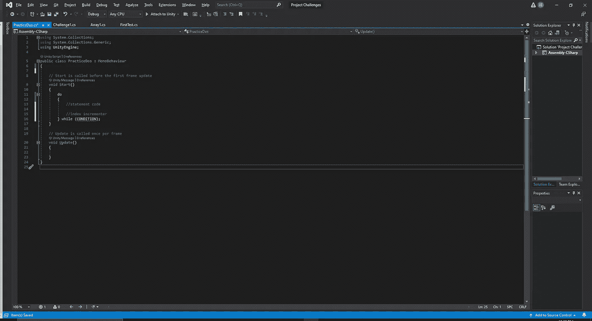
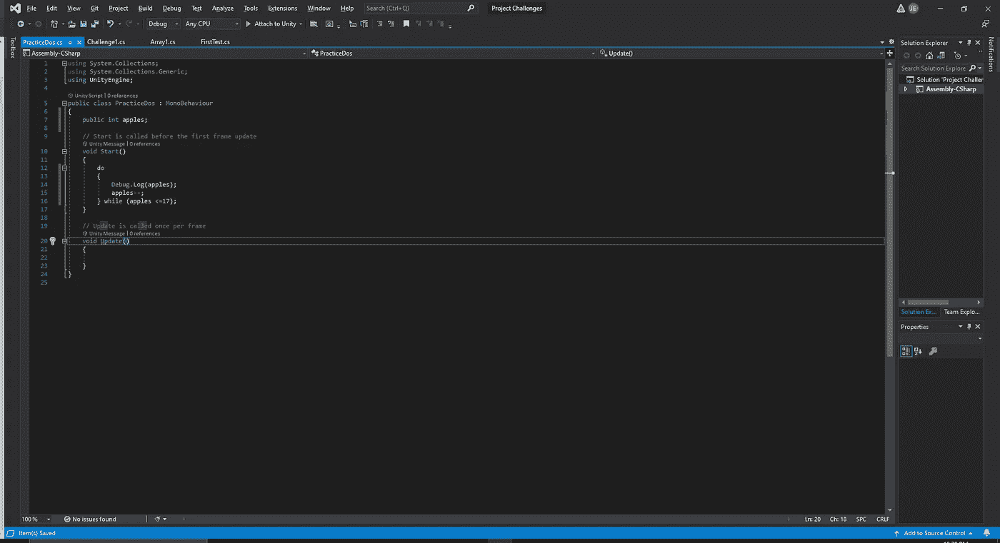

# 什么是 Do While 循环

> 原文：<https://medium.com/nerd-for-tech/what-are-do-while-loops-36592a4bf7dc?source=collection_archive---------27----------------------->

在大多数计算机编程中，do while 循环是一个至少执行一次代码的控制流语句，前提是我们没有对它设置限制。这些代码通常不在脚本中使用，但是如果您希望至少运行一次循环，尽管条件已经满足，这是您希望使用的代码类型。do while 循环的结构很简单，我们必须实现 incrementor 并将其索引到 do 循环部分，该循环部分将一直计数，直到达到我们的条件:

与在运行代码之前测试条件的 while 循环不同，do while 循环将运行条件，然后检查代码。这意味着，如果我们想要运行我们拥有的苹果数量的代码，并且如果我们从我们设置的限制值开始，那么它将在停止之前运行代码 1 次。

正如我们从上面看到的，尽管我们将苹果数设置为 6，但当我们运行程序时，我们的实际苹果数增加到 7，然后代码将停止。如果我们想说转到 17 个苹果，看看它是如何进行的，我们可以简单地为苹果的值输入一个 debug.log 代码，然后检查我们的控制台，看到它一直计数到 17:

在使用这个循环时，我们必须记住的一个关键点是，要有某种递增器，如果我们没有适当的东西来为我们的循环设定一个最终目标，它将无限运行，并使我们的程序崩溃。

会导致崩溃

从上面我们可以看到，我们一直在减去苹果，因此我们永远不会达到结束循环所需的条件。如果我们在 unity 编辑器中运行它，它会崩溃。