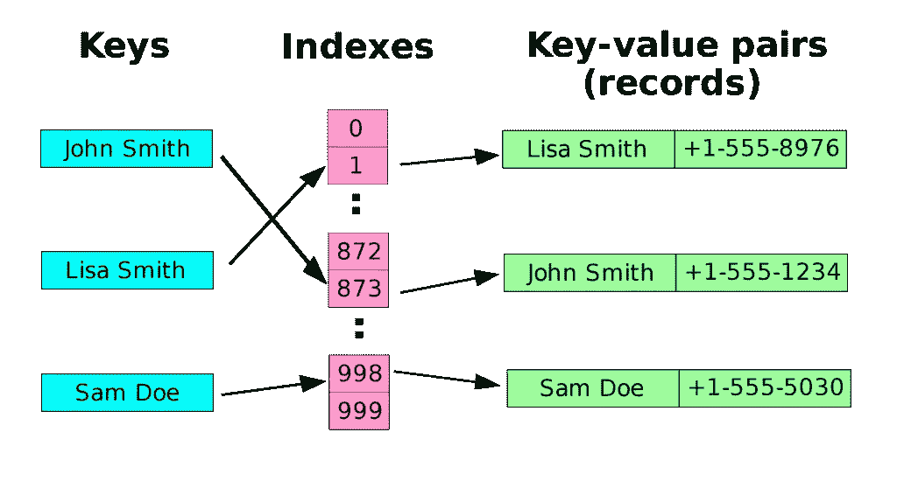

# 什么是哈希表，我们如何使用它们？

> 原文：<https://medium.com/nerd-for-tech/what-are-hash-tables-and-how-do-we-use-them-8c1ddb9bbb59?source=collection_archive---------18----------------------->

# 定义:

**幂等的** —表示集合中的一个元素，当它自身相乘或以其他方式运算时，其值不变

如果你熟悉 JavaScript，你很可能会把哈希表称为对象，在 ruby 中，它们被称为哈希，在 python 中，它们被称为字典。但是这是如何实现的呢？我们可以使用哈希函数创建如下所示的对象。

散列函数消化语法，用一个称为键的相关地址分配内存，并保存值。

当我们想要设置一个 key，比如 myObject.name，hash 函数会生成类似这个 18697449d 7 c 48 cf 32 cdd 4 f 14857 e 68 ee 的东西。没有办法撤销或以任何方式改变它。这一过程被称为**等幂**，这意味着相同的输入将有相同的输出。如果你愿意，你可以自己测试一下。转到[这里](https://www.miraclesalad.com/webtools/md5.php)并选择 md5 散列生成器并输入字符串的“名称”，我保证您会看到输出 18697449 D7 c 48 cf 32 cdd 4 f 14857 e 68 ee。散列生成器是有益的，因为与数组不同，我们不需要迭代任何东西来检索值。我们使用该值的相关键来访问我们想要的对象，这将给我们一个高速输出。

哈希表在编写算法时很方便，比如说我们必须与数组进行比较，我们想检查一个数组中的元素是否存在于另一个集合中。

我们可以最小化函数执行的操作数量。最重要的是 O(n ),因为随着数据的增加，完成函数执行的操作数量也会增加。如果没有 hashMap，我称之为 hashMap，我们将不得不创建一个嵌套的 *for-* 循环，根据每个输入的大小将操作的数量增加到 O(n*2)或 O(a*b)。

希望这有助于澄清您对什么是哈希表以及我们如何使用它们的理解。如果您正在努力学习数据结构，并想了解如何更好地使用它们。我强烈推荐你去看看 Andrei Neagoie 的关于掌握编码面试的课程。这是一个很好的资源，对我帮助很大。他对我博客中的大多数主题进行了更深入的研究，是我学习数据结构的主要来源之一。