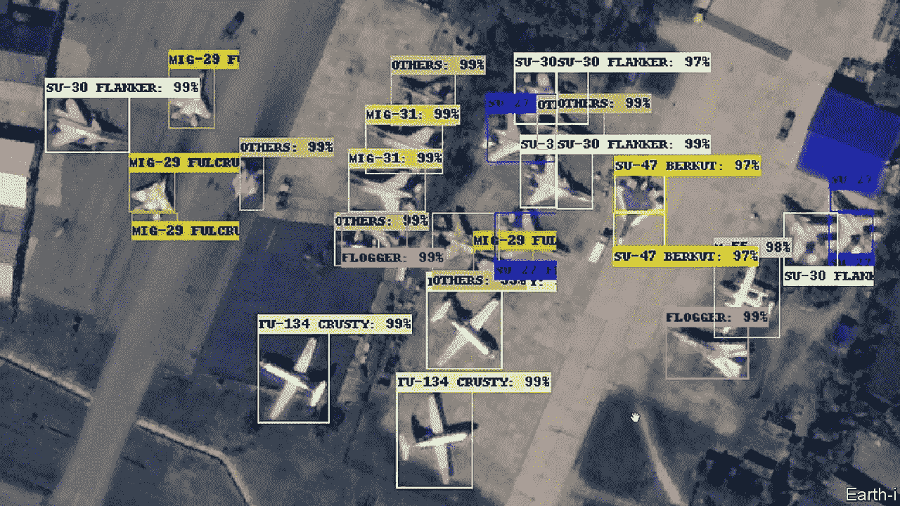
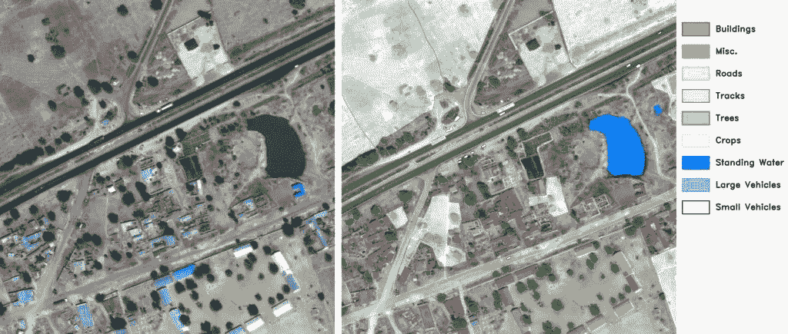

# 卫星影像在机器学习中有哪些 AI 应用？

> 原文：<https://medium.com/nerd-for-tech/what-are-the-ai-applications-for-satellite-imagery-in-machine-learning-3495b2abe514?source=collection_archive---------0----------------------->

卫星图像的人工智能应用扩展到机器学习训练的多个级别，以提取有用的信息来开发相同领域的人工智能模型。人工智能模型是通过机器学习或深度学习开发的。在通过卫星图像进行的空间监测中，需要训练数据来从这样的高度检测各种物体，以进行实地测绘或城市规划。

**人工智能在卫星图像中的应用**

实际上，在人造卫星或人造卫星中，人工智能有两种应用方式——一级“应用”和多级“应用”。因此，我们需要讨论人工智能在卫星图像中的应用。为了澄清这两个级别的应用，值得一提的是，从技术角度来看，这些应用需要复杂的机器学习管道来用于各种类型的项目。

**“一步到位”的卫星数据应用**

卫星数据的第一个应用是使计算机视觉可以探测到各种物体。建筑物、路段和城市区域边界等对象对于市政当局、政府机构、救援队、军队和其他民事机构来说非常重要。通过高分辨率相机拍摄的图像，这种事情可以很容易地从太空卫星上监测到。

在人工智能开发中，虽然使用卷积神经网络的许多集成即用管道已经实现了对象检测任务，但卫星图像存在一些问题，使这项任务更具挑战性。

**检测看起来很小的物体**

实际上，卫星图像中的第一个物体通常非常小，而输入图像非常巨大，并且训练数据相对匮乏。因此，上面提到的方法并没有被优化以检测大图像中的小物体，并且当应用于地球观测数据时通常表现不佳。

此外，第二个例子，人工智能的应用是卫星图像的变化检测，其中许多应用，如作物，土地利用，城市基础设施，如路段或环境(森林砍伐，水资源储备)和人道主义危机监测。

变化检测算法的主要目的是创建一个地图，在这个地图中，变化的区域与未变化的区域是分开的。可以进一步定义两种类型的变化检测:二进制变化检测和多类变化检测，此时可以明确地识别每个转变类型。

**“多层次”卫星数据应用**

如上所述，在多级应用中，从卫星图像中提取的信息(使用上述“一级”方法)只是更复杂的 ML 系统中的一系列特征。由于这个领域正在发生很多事情，我将提供各种有趣的用例以及对此类产品感兴趣的潜在垂直行业的简短描述。

从计算停车场的汽车数量、农作物产量和农业领域的地理传感，卫星图像可以为机器学习和人工智能模型提供有价值的输入。自动算法可以准确地检测出从太空中看到的地球上的各种东西。

**收集地理传感数据&土壤监测**

然而，从另一方面来看，很明显，产量相关的任务不能只通过植被指数来解决，因此应该包括更多的特征，如天气和土壤相关的数据。如果我们用价格和情绪分析来增强这些功能，就有可能创建一个在时间和准确性方面击败官方预测的模型。

**另阅:** [如何用图像标注服务提升 AI 安防摄像头性能？](https://www.anolytics.ai/blog/how-to-improve-ai-security-camera-with-image-annotation/)

除此之外，人工智能在卫星图像中还有许多其他应用，如船只数量和大小，机场，城市地区，水，道路等的飞机数量。用于鸟瞰监控和数据分析。

卫星图像用于城市管理或规划，也用于智能城市发展，使用 [**卫星图像数据集**](https://www.anolytics.ai/solutions/satellite-imagery/) 包含注释对象的有用信息。并且为了创建这样的卫星图像，用于监督机器学习图像注释服务的数据可从涉及图像、文本和视频注释的数据注释公司获得。

**Anolytics** 提供图像标注服务，为机器学习和人工智能项目标注卫星图像。它可以为不同类型的 AI 模型(如无人机等)提供通过各种图像标注技术(如包围盒标注、语义分割标注和多边形标注)创建的**卫星影像数据集。**