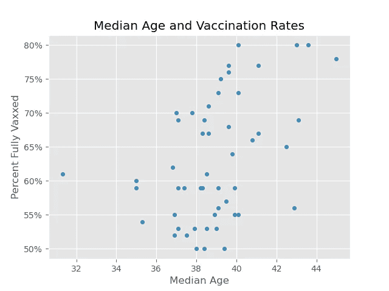
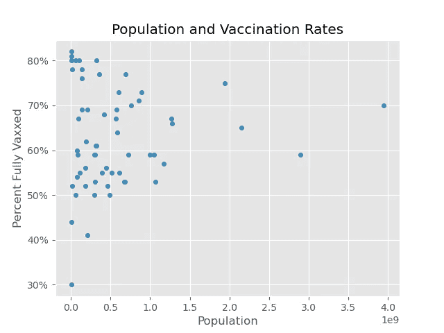
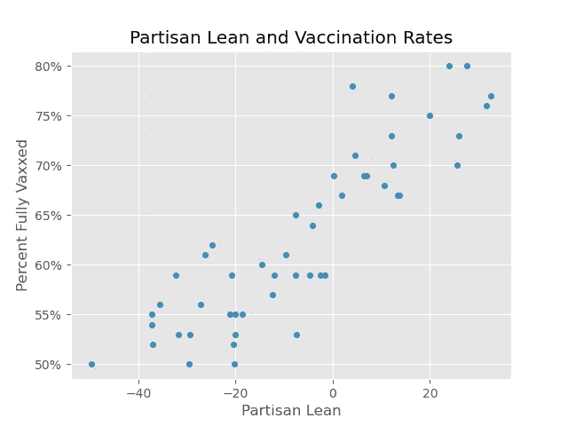
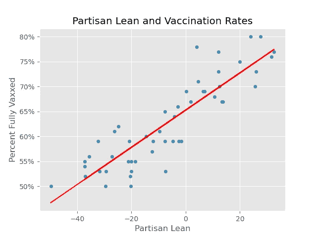

# 哪些因素与州疫苗接种率相关？

> 原文：<https://medium.com/nerd-for-tech/what-factors-are-correlated-with-vaccination-rates-339ad92cefde?source=collection_archive---------3----------------------->

由[马克斯·苏利克](https://unsplash.com/@maxsulik?utm_source=unsplash&utm_medium=referral&utm_content=creditCopyText)在 [Unsplash](https://unsplash.com/s/photos/states?utm_source=unsplash&utm_medium=referral&utm_content=creditCopyText) 拍摄的照片

我们即将迎来疫情的两周年纪念日。在发表时， [64%的美国人口完全接种了疫苗，其中 76%至少接种了一剂。不是每个人都有资格接种疫苗，但是在让人们相信疫苗的安全性、有效性和必要性方面显然存在一些问题。知道 COVID 疫苗接种率在美国各地差异很大，我很想回答这个问题:*哪些因素与州疫苗接种率有关？*](https://usafacts.org/visualizations/covid-vaccine-tracker-states/)

我选择了三个因素:平均年龄、人口和党派倾向。在这篇文章中，我将使用术语“已接种疫苗”和“接种率”来指两剂疫苗(或一剂，在 J&J 的情况下)。我在分析中使用了以下数据集:

*   五月三十八日的党派倾向
*   [来自 usafacts.org 的疫苗接种数据](https://usafacts.org/visualizations/covid-vaccine-tracker-states/)(由美国疾病预防控制中心编制)
*   [州年龄中位数](https://en.wikipedia.org/wiki/List_of_U.S._states_and_territories_by_median_age)

这个项目的 github repo 可以在这里找到[。](https://github.com/mpechter/vax)

**清理数据**

疫苗接种数据集定期更新，因此每个州都有许多条目。为了找到最新的版本，我使用了以下函数:

关键的逻辑在第 19 行。如果该州已经是`current_percent`字典的一部分，它会检查相关值是否高于更新前已存储的疫苗接种百分比。

**年龄中位数**

由于疫苗首先提供给美国老年人，而且因为老年人更有可能出现严重症状，我想探索一个州的中位年龄和疫苗接种率之间的关系。也许这些人更有可能接种疫苗，准确地感知自己处于更高的风险中。

一个州的平均年龄和疫苗接种率之间的关系很小。

有关系(Pearson 的 r = .44)，但不是很强。我想年龄是一个因素，但我可能会更仔细地分解它，以找到一个有意义的见解。

**人口**

为了确保万无一失，我想对人口规模做同样的分析。认为给更多的人接种疫苗需要更多的时间似乎是合理的。这是散点图:

一个州的人口和疫苗接种率之间没有明确的关系。

人口和疫苗接种率之间没有明显的关系，这让我感到惊讶。我将此解释为疫苗接种率低不是由分配或供应问题造成的。

**党派倾向**

在美国，一切似乎都受到党派偏见的影响，这个问题也不例外。但是数据说明了什么呢？

变量之间有明显的线性关系。

哇！我添加了回归线以使其更加清晰:

皮尔逊相关系数= 0.88

如果你想预测一个州的疫苗接种率，只要看看它的党派倾向就知道了。

**结论**

与党派意识紧密相连的是对机构的普遍信任感。几乎在所有情况下，自我认同的共和党选民倾向于[比自我认同的民主党选民](https://morningconsult.com/tracking-trust-in-institutions/)报告更低的信任度(对警察的信任是一个明显的例外)。

虽然这些数据可以帮助我们识别模式，但它本身无法帮助我们建立对专业知识和机构的信心。我的希望是继续为了公共利益探索数据。