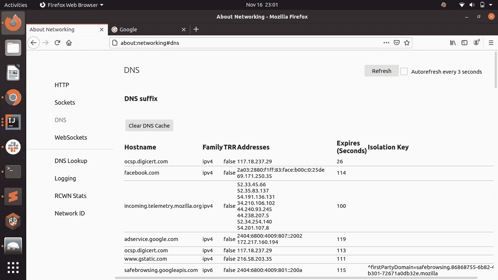
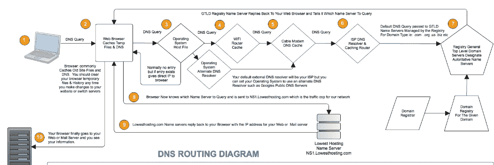

# 当你在浏览器中输入任何 URL 并按下回车键时会发生什么？

> 原文：<https://medium.com/nerd-for-tech/what-happens-when-you-type-any-url-in-the-browser-and-press-enter-f3f930c732bb?source=collection_archive---------1----------------------->

嗯，我们中的许多人一定很想知道“当我们在浏览器中键入任何 URL 并按 enter 键时会发生什么？”。事实上，这确实是一个非常大的问题，需要几个月甚至几年的时间来理解其中涉及的每个概念。本文向您介绍了如何处理请求和接收响应的基本概念。

假设我们正在访问“[http://www.google.com](https://www.google.com)”，下面是我们如何得到响应:

1.  在不同级别的缓存中查找网站的 IP 地址(URL)。
2.  创建与目标 Google 服务器的 TCP/UDP 连接。
3.  通过 TCP/UDP 向 google 服务器发送 GET|www.google.com 请求。
4.  Google server 处理收到的请求并发回响应。
5.  浏览器理解并显示响应。

# 1.查找网站的 IP 地址(URL)

总的来说，域名是人类可读的，也更容易记忆。但是我们需要目的地 IP 地址(这将有助于包转发)而不是人类可读的域名来处理请求。 [***DNS***](https://www.namecheap.com/dns/what-is-dns-domain-name-system-definition/) 为我们工作，即 [***DNS***](https://www.namecheap.com/dns/what-is-dns-domain-name-system-definition/) 通过存储每个域名及其关联的 IP 地址来帮助我们。在我们直接从 DNS 服务器获取 IP 地址之前，我们可以从多个地方(缓存级别)快速获取 IP 地址。这就是 IP 路由。

1.  首先，浏览器将检查自己的 DNS 缓存。大多数浏览器，如 Chrome、Firefox 等，都有自己的 DNS 缓存级别，这样可以提供更快的响应。我们可以使用这些命令检查浏览器 DNS 缓存:Firefox browser - *关于:联网#dns &* Chrome 浏览器-*Chrome://net-internals/# DNS。*

下图显示了 Firefox 浏览器存储的 DNS 缓存。

2.如果 IP 地址没有缓存在浏览器中，它继续到下一个级别，即检查操作系统缓存。如果操作系统缓存了返回的 IP 地址，浏览器将使用`getaddrinfo().`进行 [***系统调用***](https://en.wikipedia.org/wiki/System_call) ，否则将继续。

3.下一个级别是检查 WiFi 路由器缓存(WiFi 路由器确实有自己的内存缓存，但大小有限)。如果没有找到，请求继续。

4.下一步是检查电缆调制解调器缓存。如果没有找到，请求继续。

5.下一步是检查 ISP 的 DNS 缓存。如果直到这一级都没有找到 IP 地址，ISP 将执行 DNS 递归搜索，直到找到 IP 地址，如果没有找到则返回一个错误。如果一个域名有多个 IP 地址，DNS 循环算法会选择一个并返回。

DNS 路由的所有上述步骤的图示如下所示。

最后，我们得到了 www.google.com 的 IP 地址为 172.217.14.196

## 2.创建与目标 Google 服务器的 TCP/UDP 连接

一旦我们找到了 IP 地址，我们需要一个通信媒介将我们的请求数据传送到目的服务器。TCP/IP 的作用来了。客户端(浏览器)将与目的服务器执行 [**TCP 三次握手**](https://en.wikipedia.org/wiki/Handshaking#TCP_three-way_handshake) 以检查服务器是否准备好接受请求&以同意正在使用的协议等。一旦握手完成并且 TCP 通信通道打开，客户端或服务器就可以通过同一连接发送和接收应用程序数据，直到客户端或服务器关闭该连接。

## 3.通过 TCP 向 google 服务器发送 GET|www.google.com 请求。

一旦与目的服务器建立了 TCP 连接，我们需要发送实际的请求，即 GET |[http://www.google.com](http://www.google.com.)。

让我们假设你想给你的朋友写一封信。你要用一种你们都能理解的语言写这封信。你可以通过添加发件人和收件人地址来寄信给你的朋友。

同样的事情也会在客户端(浏览器) [***TCP 层***](https://en.wikipedia.org/wiki/Internet_protocol_suite) 完成。请求*GET |*[*http://www.google.com*](http://www.google.com.)需要被翻译成特定的格式，以便目的服务器能够读取并理解&的响应。TCP 协议 4 层，即应用层、传输层、网络层&数据链路层将通过在每层添加源和目的端口、地址、报头、mac 地址、请求数据类型、响应类型等，将请求转换为有意义的二进制数据。翻译后的二进制数据将被分成小单元，并作为数据包在网络上传输。

我们应该注意到，每个数据包都有源端口和目的端口、地址、报头、mac 地址、请求数据类型、响应类型等。这些细节将帮助接收者转换成原始请求。

简单地说，客户端将把*GET |***请求通过 TCP 通信通道作为网络数据包发送到目的服务器。**

## ****4。目标 Google 服务器接收、处理请求，并发回响应。****

**一旦服务器接收到数据包，服务器的 TCP 层会帮助重新组织这些数据包，并将其转换为客户端发送的实际请求。服务器处理请求，并以客户端请求的格式(即 HTML、JSON、XML 等)准备响应，并添加其他细节，如响应状态等。一旦服务器准备好响应，它将被发送回客户端。**

****5。浏览器理解&显示响应。****

**一旦客户端收到服务器的响应，浏览器检查 [***响应状态码***](https://en.wikipedia.org/wiki/List_of_HTTP_status_codes) 即 2xx(成功响应)、3xx(重定向请求)、4xx(客户端错误)5xx(服务器错误)等。**

**浏览器将根据收到的响应类型尝试翻译响应。在我们的例子中，它是 html，所以它将显示 HTML 页面。如果响应是可缓存的，它会将响应存储在浏览器缓存中。**