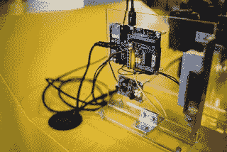

# 什么是微控制器？

> 原文：<https://medium.com/nerd-for-tech/what-is-a-microcontroller-547ae100b8e9?source=collection_archive---------8----------------------->

# 描述

微控制器是单个(MOS)金属氧化物半导体结合电路芯片上最小的计算机。微控制器包含一个或多个 CPU 以及存储器和可编程输入/输出外设。铁电 ram、OTP ROM 或 NOR flash 方法中的程序存储器也通常包括在芯片上，同时具有微小尺寸的 RAM。与个人电脑中使用的微处理器不同，微控制器是为嵌入式应用而设计的[。用现代语言来说，微控制器是一个片上系统，通常与类似于一个或多个协处理器、图形处理单元(GPU)和 Wi-Fi 模块的高级外设一起使用。](https://www.technologiesinindustry4.com/)微控制器作为物联网(IoT)环境中的边缘设备，是数据采集、传感和驱动物理世界的经济而普遍的收益。

# 微控制器用途

微控制器通常用于自动控制的产品和设备。这些器件用于汽车发动机控制系统、遥控器、办公机器、植入式医疗设备、电动工具、电器、玩具和其它嵌入式系统。特定的微控制器可以使用 4 位字，工作频率低至 4 kHz，以实现低功耗。微控制器可以帮助关键性能角色。随着更高的时钟速度和功耗，它们可以更像数字处理器(DSP)一样工作。

# 微控制器特性

*   架构(ARM，ESP32)
*   数据路径位宽(4–128 位)
*   每个注册表中的位数
*   确定准确性和数据吞吐量

**输入/输出引脚**

*   需要足够的引脚来支持应用

**表演**

*   时钟频率比台式机慢

**定时器**

*   实时应用所需要的

**模数转换器**

*   用于读取模拟传感器的输入

**低功率模式**

*   节能是关键

**通信协议支持**

*   与其他集成电路的接口
*   UART、I2C、SPI 等。

# 微控制器开发

*   第一个微控制器是加里·布恩和迈克尔·科克伦在 1971 年发明的。
*   第一个微控制器与只读存储器和读/写存储器共享。
*   日本在 20 世纪 70 年代早期到中期开始生产汽车微控制器。这些微控制器是用于车内娱乐、电子锁、自动雨刷和仪表板的 4 位 MCU，以及用于发动机控制的 8 位 MCU。
*   1977 年，英特尔公司开发了一种针对控制应用而优化的片上计算机系统。这是结合了 RAM 和 ROM 在同一个芯片上的微处理器。
*   1993 年，电可擦可编程只读存储器(EEPROM)存储器的出现使得微控制器可以快速电擦除，而不需要 EPROM 所必需的大量封装，同时允许快速原型制作和系统内编程。
*   如今，微控制器价格低廉，爱好者乐于购买，某些处理器的网上社区随处可见。

# 最小的计算机

密歇根大学于 2018 年 6 月 21 日公布了世界上最小的计算机。这是一款“0.04mm3 16nW 无线无电池传感器系统，结合了 Cortex-M0+处理器和光纤通信，用于蜂窝温度测量。该设备与区块链结合，有一百万个晶体管，因为它的制造成本不到 0.10 美元。该设备只有 IBM 之前宣称的世界纪录尺寸的 1/10。

# 嵌入式系统

微控制器可以作为具有处理器、存储器和外围设备的独立系统来测量。它可以作为一个嵌入式系统。今天，使用中的微控制器标准被嵌入到不同的其他设备中，例如，电话、汽车、电器和计算机系统的外围设备。尽管某些嵌入式系统非常精细，但许多系统对内存和程序长度的要求很低，软件复杂度低，并且没有操作系统。通常，输入和输出设备包括继电器、开关、螺线管、发光二极管、射频设备、小型或定制的液晶显示器以及用于诸如温度、湿度、亮度等数据的传感器。通常，嵌入式系统没有屏幕、键盘、打印机和磁盘。

# 微控制器程序及其编程环境

微控制器的程序必须适合可获得的片上存储器。与此同时，提供一个带有外部可扩展内存的系统将会非常昂贵。[使用编译器和汇编器将高级汇编语言代码转换成紧凑的机器代码，存储在微控制器的存储器中](https://www.technologiesinindustry4.com/)。

根据设备的不同，程序存储器可以是永久性的只读存储器。它只能在工厂编程，现场可变闪存或可擦除只读存储器。为了有利于电路板系统的硬件和软件开发，制造商们反复制造他们的微控制器的特殊版本，这些先前内置的 EPROM 版本。微控制器上的现场可编程设备例程可能允许固件的现场更新，或者允许对已经收集但尚未发货的产品进行后期工厂修订。可编程存储器同样减少了新产品部署所需的交付时间。

C、Python 和 JavaScript 等高级编程语言常用于强调微控制器和嵌入式系统。许多微控制器都有支持开发各种应用程序的环境。

微控制器零售商定期免费提供工具，以形成无压力地接受他们的硬件。此外，解释器固件可用于一些微控制器。模拟器对稀有的微控制器开放。这些允许开发者研究微控制器和他们的程序在使用特定器件时的行为。新的微控制器经常与片上调试主板相结合。当在线仿真器(ICE)通过 JTAG 访问时，它允许用调试器调试固件。实时 ICE 可以允许在运行时观察和操作内部状态。

更多详情请访问:[https://www . technologiesinindustry 4 . com/2020/11/what-is-micro controller . html](https://www.technologiesinindustry4.com/2020/11/what-is-microcontroller.html)