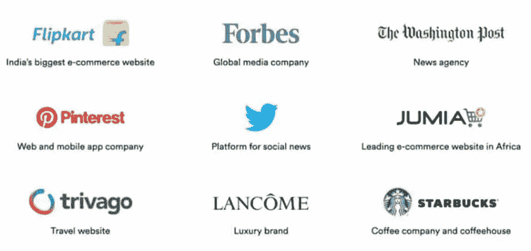

# 什么是 PWA？

> 原文：<https://medium.com/nerd-for-tech/what-is-a-pwa-b306e415f81c?source=collection_archive---------22----------------------->

在当今世界，我们对移动网站并不陌生。在过去的几年里，移动网络有了巨大的进步。今天的大多数网站都是设备友好的，或者我应该说是响应性的，因为有 Bootstrap、Material 或 Foundation 这样的框架。

一个**渐进式网络应用**也是一个移动网站，但本质上是渐进式的，或者简单地说，具有高级功能。我知道**渐进式网络应用**是一个很长的名字，但相信我，它不仅仅是三个花哨的单词加在一起。每个单词都有一定的含义。为了这篇文章，我将用它的首字母来称呼它，即 **PWA** 。在跳到 PWA 是什么和它的利弊之前，我们必须看看为什么我们可能需要使我们的网站成为 PWA，所以让我们开始吧。

# 移动应用与本地应用

大多数用户选择原生应用的原因如下。

*   **推送通知:**用户通过通知获得更新通知，从而提高用户对应用的参与度。
*   **主屏幕上的图标:**它总是触手可及。你只需点击应用程序图标，就可以随时使用它。
*   **访问设备功能:**这些应用程序可以访问本机设备功能，如摄像头、地理定位等。
*   **离线支持:**现在几乎所有的应用都可以离线使用。如果不是完整的，至少有一部分应用程序离线工作。

另一方面，有些移动网站只是普通桌面网站的移动版本。网络覆盖面更广。你可以在谷歌上搜索一些东西，嘣，你得到的结果。你可以点击它，然后进入网站，所以不需要从应用商店或 play store 下载任何应用。

所以，哪个更好并不重要。重要的是，我们需要一种两全其美的东西吗？

# 我们需要替代方案吗？

公司觉得有必要拥有移动应用的主要原因之一是，它提供了大量的用户参与。如果用户经常使用你的应用程序，那么他们可能会向其他用户推荐你的应用程序，并且可能会对探索应用程序的付费功能(如果有的话)感兴趣。

原生应用可能会占上风，但即使是原生应用也会有一些缺点。

1.  从客户的角度来看，如果我正在寻找一个“待办事项/提醒”应用程序，我可能会看到一些应用程序。每一个都有其优点和缺点，所以很难找到一个适合用户需求的应用程序。此外，一些应用程序可能会占用手机上的一些额外空间，这会使你的设备非常慢。
2.  从公司的角度来看，如果我想建立一个针对不同平台的应用程序，我需要了解不同语言和技术的开发人员，如 Swift 或 Objective C(iOS 设备)、Java(Android 设备)、C#(Windows)等。

在当今世界，开发人员和企业寻求更快的开发和经济高效的解决方案，这就是 PWA 作为一个好选择的原因。

让我们看看什么是 PWA，以及它能带来什么。

# 什么是渐进式网络应用？

*   PWA 是一个类似于安装在智能手机、笔记本电脑、平板电脑或台式机上的应用程序的网站
*   它建立在我们都知道的 web 技术之上，比如 HTML、CSS 和 JavaScript。一些框架也支持 PWA。

大多数现代浏览器都支持 PWA 提供的功能。其中一些是

*   推送通知
*   摄像头接入
*   共享内容
*   定位服务
*   后台同步
*   离线支持和更多…

你甚至可以在主屏幕上添加一个 PWA，给你一个原生的应用体验。此外，pwa 可以通过网络访问，不需要从应用商店下载。嗯，现在谷歌确实为你提供了支持，但如果你想节省一些钱，PWA 总是一个好的选择。

在当今快节奏的世界中，当我们开发一个网站时，我们主要寻找三样东西。

1.  可靠:它应该快速加载并提供离线功能(至少对某些部分)。
2.  **快速:**它应该快速响应用户的动作。
3.  **吸引人:**用户应该有一种在移动应用上操作的感觉。

你可以在 PWA 里找到所有这些东西。通过一些附加功能，你可以将几乎任何网站变成 PWA。这意味着你可以很快地建立一个 PWA，对于一个很难开发的本地应用来说。

根据研究，PWAs 比传统的移动应用程序和网站更简单、更快。它们可以通过一个 URL 共享，最重要的是，由于它们不针对任何特定的平台，所以它们是有成本效益的，并且花费较少的开发时间。

你在网上找到的许多网站实际上是一个进步的网络应用程序。这里有一些例子。

我们以 **Pinterest** 为例。在他们把自己的网站作为 PWA 推出后，他们观察到

*   用户访问量增加 40%，用户参与度增加 60%
*   收入增长 44%
*   数据存储比较:Pinterest PWA 大约需要。400 KB 的数据存储，远低于原生 Android (19.8 MB)和 iOS (161.1 MB)应用

同样在推特**推出其 *Lite* 版本后，他们观察到**

*   每次会话页面增加 65%
*   发送的推文增加了 75%
*   跳出率降低 20%
*   数据存储比较:500 KB，Twitter Lite 比相应的 Android 应用小得多

# 渐进式网络应用的优势

*   易于安装
*   普遍支持
*   脱机工作
*   在网络上容易被发现
*   针对多个平台的开发速度更快，成本效益更高
*   终端用户的原生应用体验

感到需要 PWA 的公司使用最新的网络技术，旨在向用户提供最令人惊奇的网络体验。通过提高性能、可访问性和用户参与度，进步的 web 应用程序开发人员确保这些应用程序快速、引人入胜且可靠。

# 使用 PWA 的缺点

1.  在 app store 中搜索应用程序可能会很困难。这对一些用户来说可能是个问题。你不能只去 app store 搜索应用程序。
2.  使用智能手机的操作系统有一些限制。pwa 越来越深入地接触到智能手机的操作系统，但原生应用还可以更深入。另外，PWA 的能力是有限的。例如，当您想要构建高性能游戏时，pwa 不是最佳选择。
3.  不同的 pwa 之间不能共享资源或数据，因为它们是高度隔离的。

现在我们知道了把你的网站变成 PWA 的好处和坏处，但是仍然有一个重要的问题需要回答。

# 我的观众需要这个吗？

从商业的角度来看，你必须了解你的目标受众。你必须弄清楚你的企业是否需要 PWA。

如果你有疑问，问自己这些问题，我想要这项技术做什么？

*   谁是我的最终用户？
*   他们会有良好的数据连接和坚实的设备硬件吗？
*   我的 PWA 将提供什么性质的内容？
*   这个应用程序能帮助他们更好地完成工作吗？

# 最后的想法

当然，有一些印象分，也有一些告诫。虽然浏览器已经很快采用了这项技术，但仍然有一些限制。iOS 现在支持 PWAs，但仍有一些限制，所以你可能会也可能不会在所有 IOS 设备上获得完全相同的体验。

总之，pwa 很棒，实施起来并不困难。但是简单并不意味着一定要做。但是，如果你真的实现了它，它肯定会给你的用户一个坚实的本地应用程序一样的体验。

感谢您阅读这篇文章。请在评论区告诉我你的想法。在下一篇文章中，我将更多地关注 PWA 的技术方面，以及是什么使它们如此先进，所以，请继续关注。

# 参考材料

*   奥列格·罗曼纽克的精彩文章[https://www . freecodecamp . org/news/practical-tips-on-progressive-web-app-development/](https://www.freecodecamp.org/news/practical-tips-on-progressive-web-app-development/)[https://keen ethics . com/blog/progressive-web-apps-vs-native-which-to-choose-and-when](https://keenethics.com/blog/progressive-web-apps-vs-native-which-to-choose-and-when)
*   马克西米连·施瓦兹缪勒的精彩解释【https://www.youtube.com/watch?v=dap6yIe1uK4 

*原载于 2021 年 3 月 22 日*[*https://dev . to*](https://dev.to/kpnigalye/progressive-web-apps-part-one-d01)*。*